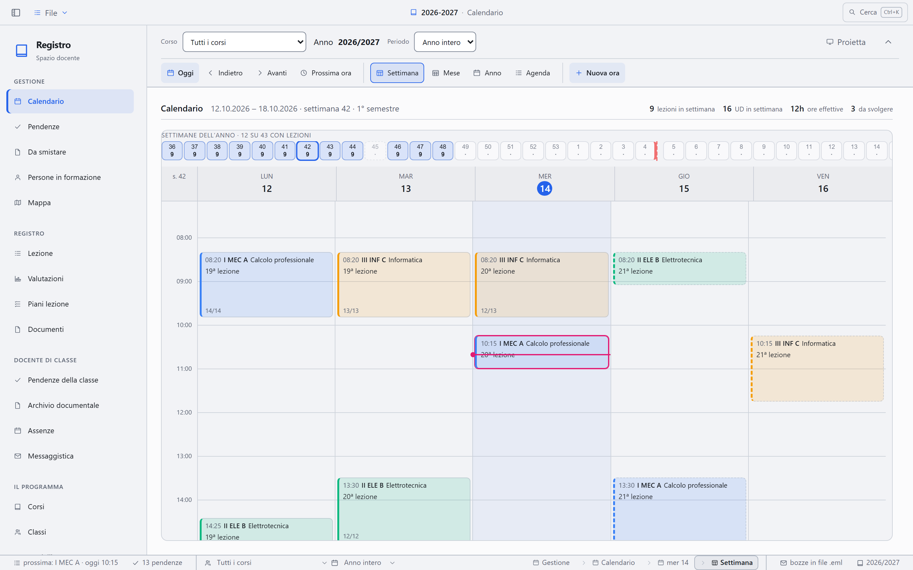
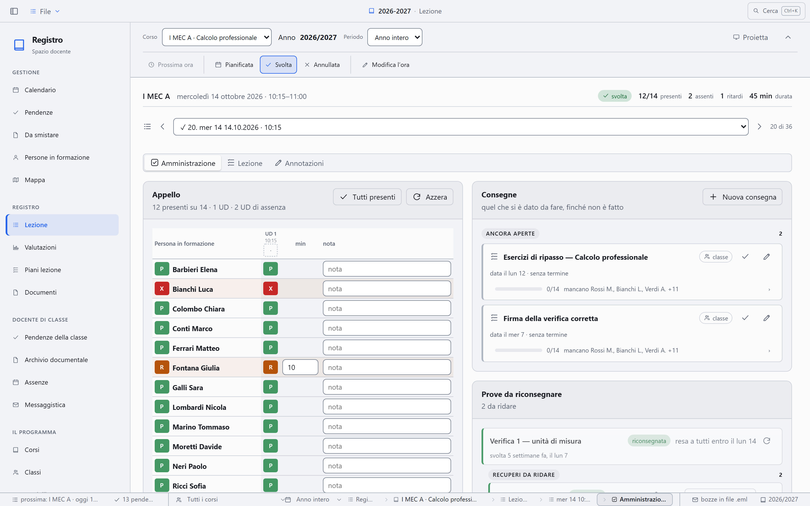
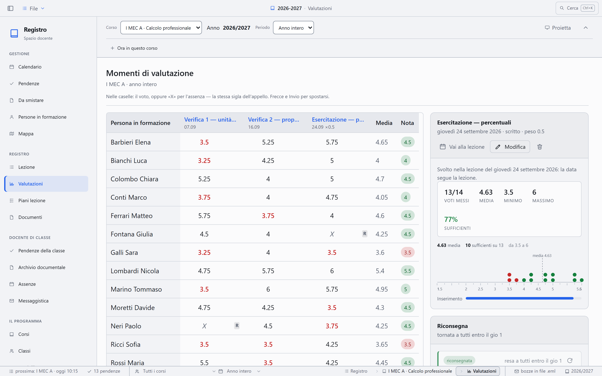
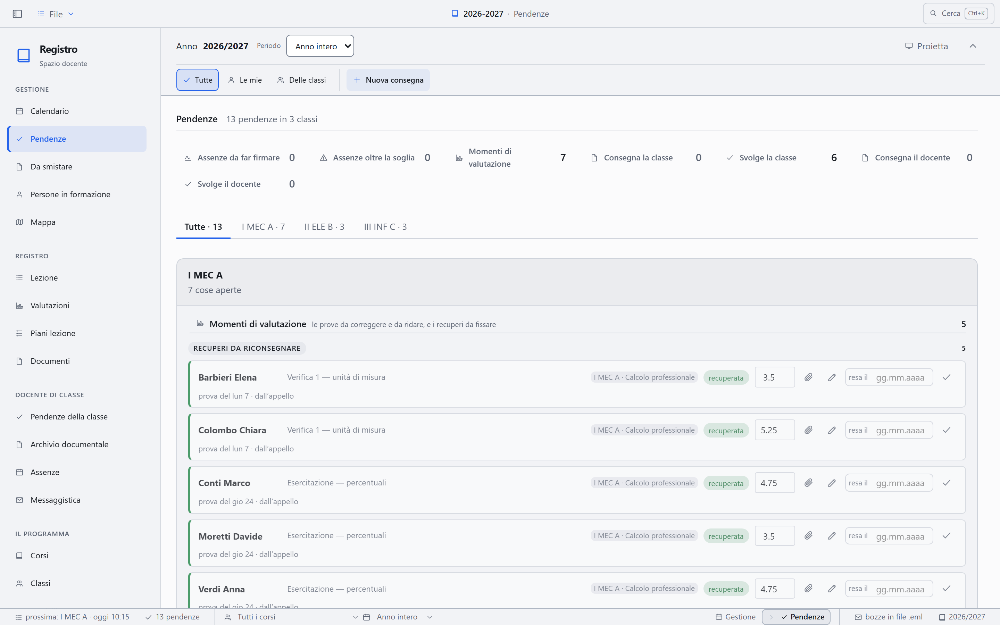
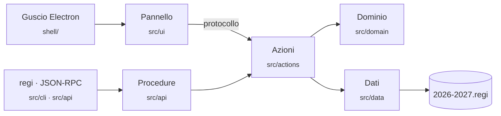

<div align="center">


# Regiclass

**Il registro di classe che vive sul tuo computer, non sul server di qualcun altro.**

Lezioni, appello, piani lezione, valutazioni e rapporti in PDF —
in un file per anno scolastico, accanto al resto del tuo materiale.

[](https://github.com/nabre/Registro/actions/workflows/verifica.yml)
[](https://github.com/nabre/Registro/releases/latest)
[](https://github.com/nabre/Registro/releases)
[](LICENSE)


[**Scarica**](https://github.com/nabre/Registro/releases/latest) ·
[Funzioni](#che-cosa-fa) ·
[Aggiornamenti](#aggiornamenti) ·
[Da Registro docenti a Regiclass](#da-registro-docenti-a-regiclass) ·
[Com'è fatto](docs/GUIDA.md) ·
[Sviluppo](#sviluppo) ·
[Documentazione](docs/INDICE.md) ·
[Code signing policy](#code-signing-policy)

</div>

<picture>
  <source media="(prefers-color-scheme: dark)" srcset="docs/immagini/calendario-scuro.png">
  
</picture>

<table>
  <tr>
    <td width="33%"></td>
    <td width="33%"></td>
    <td width="33%"></td>
  </tr>
  <tr>
    <td align="center"><sub><b>Lezione</b> · appello, consegne, riconsegne</sub></td>
    <td align="center"><sub><b>Valutazioni</b> · voti, medie, recuperi</sub></td>
    <td align="center"><sub><b>Pendenze</b> · quel che aspetta, classe per classe</sub></td>
  </tr>
</table>

<sub>Nomi e dati negli screenshot sono inventati.</sub>

---

## Perché

Su un registro ci sono nomi di minorenni, assenze, medie e a volte una
situazione di famiglia. **Regiclass** tiene tutto sulla tua macchina:

- **un documento per anno**: `2026-2027.regi` sta nella cartella di lavoro
  e si copia, si salva e si archivia come qualunque altro file;
- **nessun account e nessun cloud**: niente da configurare, niente che parta
  verso un server;
- **anche l'intelligenza artificiale gira in locale**: l'assistente e la
  lettura delle scansioni usano modelli `.gguf` eseguiti sul tuo computer con
  [llama.cpp](https://github.com/ggml-org/llama.cpp).

## Che cosa fa

| | |
| --- | --- |
| 📅 **Calendario e orario** | Dall'orario settimanale nascono le lezioni sul calendario, vacanze e semestri compresi, con la durata dell'unità didattica e le pause della tua scuola: le ore si fermano alla ricreazione e riprendono dopo. Ogni ora ha appello, osservazioni e consuntivo. |
| 👥 **Classi e persone in formazione** | Classi, materie e corsi. Assenze e ritardi si contano per semestre o per anno. |
| 🗂️ **Piani lezione** | Si organizzano per tappe, con attività e risorse, e si duplicano da un corso all'altro. |
| 📝 **Valutazioni** | Ogni momento di valutazione sta dentro la lezione in cui si svolge, con voti, recuperi e medie. La griglia si esporta in CSV. |
| 📄 **Rapporti in PDF** | Verbali, presenze, voti, schede e fascicoli sulla carta intestata della tua scuola: il registro li compila e li archivia nel documento dell'anno, con il nome giusto. |
| ✂️ **Smistamento dei PDF** | Un PDF di classe arrivato dalla segreteria si divide da solo, persona per persona. Le scansioni passano dall'OCR. |
| 🤖 **Assistente** | Risponde a domande in italiano leggendo i dati veri del registro, con un modello che scarichi o trascini nella finestra. Le domande si possono anche dire a voce, con [voicebox](https://github.com/jamiepine/voicebox) installato e aperto a parte: la voce resta sul tuo computer. |
| 📽️ **Proiezione** | Una seconda finestra per lo schermo della classe, che segue quel che apri nel registro. |
| ⌨️ **Riga di comando e API** | `regi` dal terminale e JSON-RPC su una pipe locale: 202 procedure, con permessi separati per lettura e scrittura. |
| 💾 **Portabile** | Una versione che gira da chiavetta senza installazione, per le macchine su cui non si hanno i diritti di amministratore. |

Come si usa ogni pagina lo dice la guida dentro il registro: **F1** da qualunque
pagina, o la pagina «Guida» nel gruppo «Il programma». Com'è fatto, dove
stanno i dati e che cosa esce dal computer è in [docs/GUIDA.md](docs/GUIDA.md).

## Installazione

Scarica l'ultima versione dalla pagina delle
[**release**](https://github.com/nabre/Registro/releases/latest):

| File | Per chi |
| --- | --- |
| `regiclass-x.y.z-installer.exe` | Installazione per utente, senza diritti di amministratore. |
| `regiclass-x.y.z-portabile.exe` | Nessuna installazione: i dati restano in una cartella accanto all'eseguibile. |

Al primo avvio il registro propone di creare un anno: lo si sceglie fra
quelli del calendario scolastico ufficiale, con vacanze e festivi già dentro,
e se ci sono altri registri si possono portare classi, corsi e impostazioni
da uno di loro. Classi e corsi nuovi si aggiungono poi dai loro moduli.

> [!NOTE]
> Gli eseguibili non sono ancora firmati: al primo avvio Windows SmartScreen
> può mostrare un avviso. Scegli **Ulteriori informazioni → Esegui comunque**.
> La firma gratuita di SignPath Foundation è in preparazione: vedi
> [Code signing policy](#code-signing-policy).

### Aggiornamenti

Il registro installato si aggiorna da sé. Mezzo minuto dopo l'avvio, e poi
ogni sei ore, chiede a GitHub qual è l'ultima versione; quando ce n'è una
nuova lo dice un filetto nella barra del titolo e nel benvenuto, la scarica e
la installa quando esci — una finestra mostra a che punto è, e alla fine lo
riapre. Se preferisci farlo tu, in **Impostazioni › Programma › Aggiornamenti**
ci sono i gesti a mano e le tre caselle che decidono che cosa fa da sé. Il
controllo non manda niente del registro: chiede soltanto il numero
dell'ultima versione.

La versione portabile non si aggiorna da sé: si scarica quella nuova dalle
release e la si mette al posto della vecchia, e i dati accanto all'eseguibile
restano dove sono.

Un anno scritto da una versione precedente del registro si apre lo stesso: il
registro lo porta al formato di oggi, e prima ne mette da parte una copia
com'era, in `versioni-precedenti/` nella cartella che ha il nome dell'anno,
accanto al file. Un anno scritto da una versione più recente invece non si
apre: la finestra che lo dice propone di scaricare la versione nuova.

### Da Registro docenti a Regiclass

Fino alla 1.8.0 il programma si chiamava **Registro docenti**. Il nome è
cambiato, i dati no. Aggiornando il registro installato:

- **resta una sola installazione**: l'aggiornamento arriva da sé come gli
  altri, e in «App installate» la voce è sempre una, con il nome nuovo;
- **la cartella dei dati si sposta da sé** al primo avvio, da
  `%APPDATA%\Registro docenti` a `%APPDATA%\Regiclass`: impostazioni, account
  della posta e modelli scaricati vengono con lei;
- **i documenti dell'anno hanno estensione `.regi`**;
- **il comando dal terminale è `regi`**, al posto di `regdoc`;
- **l'icona fissata sulla barra delle applicazioni** va tolta e fissata di
  nuovo: Windows la lega al nome di prima.

## Sviluppo

Serve **Node.js 24**. Per le prove dell'interfaccia servono anche Python e
Playwright.

```bash
git clone https://github.com/nabre/Registro.git
cd Registro
npm ci
npm run dev        # esbuild in ascolto, app avviata, ricarica a caldo
```

| Comando | Che cosa fa |
| --- | --- |
| `npm run dev` | Sviluppo: le pagine si ricaricano in un decimo di secondo, il main process si riavvia da sé |
| `npm start` | Compila e avvia, senza ascolto |
| `npm test` | Le prove con `node --test` |
| `npm run typecheck` · `npm run lint` | TypeScript e ESLint |
| `npm run layers` · `census` · `collections` · `forms` · `buttons` · `procedures` · `docs` | I controlli d'architettura scritti in casa |
| `npm run ui-tests` | Le prove dell'interfaccia su Chromium |
| `npm run ci` | I passi della CI, letti da `verifica.yml` ed eseguiti in locale |
| `npm run clean` | Butta i bundle e le cache, quando si sospetta qualcosa di vecchio |
| `npm run regi -- elenco` | La riga di comando dal repository, verso il registro acceso con il condotto aperto |
| `npm run calendario` | Il calendario scolastico ticinese, riletto dai PDF del DECS |
| `npm run tools` · `templates` · `sample` | Gli artefatti generati: il catalogo per l'assistente, i modelli dei fogli, i documenti campione |
| `npm run icons` | Le icone e le immagini dell'installatore, ricavate dal segno in `resources/` |
| `npm run package` | Calendario, poi installer e portabile in `pacchetti/` |

### Com'è fatto



Gli strati e i loro confini sono controllati a macchina a ogni push
(`npm run layers`). Da dove cominciare a leggere:

| Documento | Per |
| --- | --- |
| [GUIDA](docs/GUIDA.md) | dove stanno i dati, come si costruisce e si rilascia, che cosa esce dal computer |
| [ARCHITETTURA](docs/ARCHITETTURA.md) | com'è fatto, e che cosa succede quando |
| [MODELLO-DATI](docs/MODELLO-DATI.md) | la forma dei dati e le regole che li tengono in piedi |
| [CATALOGO](docs/CATALOGO.md) | azioni, comandi e impostazioni, voce per voce |
| [API](docs/API.md) | le procedure, il condotto e l'assistente |
| [DECISIONI](docs/DECISIONI.md) | perché è così, e che cosa non si può rompere |
| [CANTIERE](docs/CANTIERE.md) | che cosa sta cambiando adesso |

### Rilasci

La versione si scrive in un posto solo, `package.json`. Quando cambia su
`main`, [rilascio.yml](.github/workflows/rilascio.yml) rifà tutte le
verifiche, impacchetta, fa firmare gli eseguibili da SignPath, crea il tag
`vX.Y.Z` e pubblica la release con `latest.yml` per l'aggiornamento
automatico. Il giro della firma è raccontato nella
[GUIDA](docs/GUIDA.md#la-firma-del-codice).

## Code signing policy

Free code signing provided by [SignPath.io](https://signpath.io), certificate
by [SignPath Foundation](https://signpath.org).

Gli eseguibili per Windows — l'applicazione (`Regiclass.exe`), l'installer e
il portabile — li
costruisce GitHub Actions da questo repository pubblico, dal ramo `main`, e li
firma SignPath con il certificato di SignPath Foundation. Ogni firma va
approvata a mano. Un eseguibile che si presenta come Regiclass e non porta la
firma di **SignPath Foundation** non viene da qui. I componenti di altri
progetti open source dentro il pacchetto (Electron, llama.cpp) restano con la
firma dei loro autori, o senza: non li firmiamo noi.

| Ruolo | Chi |
| --- | --- |
| **Committers** — modificano il repository senza revisione | chi ha il permesso di scrittura su [nabre/Registro](https://github.com/nabre/Registro): oggi soltanto [Michel Brenna](https://github.com/nabre), proprietario del repository |
| **Reviewers** — rivedono le pull request di chi non è committer | [Michel Brenna](https://github.com/nabre); nessuna pull request esterna entra senza revisione |
| **Approvers** — approvano ogni richiesta di firma | [Michel Brenna](https://github.com/nabre) |

### Privacy

This program will not transfer any information to other networked systems
unless specifically requested by the user or the person installing or
operating it.

In italiano: il registro non trasferisce informazioni ad altri sistemi in rete
se chi lo usa, lo installa o lo gestisce non lo chiede espressamente. Non ha
server, account né telemetria. Fa eccezione soltanto il **controllo degli
aggiornamenti** del registro installato: acceso di serie, chiede a GitHub il
numero dell'ultima versione — senza nessun dato del registro — e si spegne in
**Impostazioni › Programma › Aggiornamenti**. Tutte le altre uscite partono da
un gesto di chi usa il registro: sono elencate, una per una, nella
[GUIDA](docs/GUIDA.md#che-cosa-esce-dal-computer).

Quando chi usa il registro lo chiede, questi servizi ricevono una richiesta, e
valgono le loro regole:

| Servizio | Per | Privacy |
| --- | --- | --- |
| GitHub | aggiornamenti; programma per leggere le scansioni | [GitHub Privacy Statement](https://docs.github.com/site-policy/privacy-policies/github-general-privacy-statement) |
| OpenStreetMap (Nominatim, tasselli della mappa) | indirizzi sulla mappa | [OSMF Privacy Policy](https://osmfoundation.org/wiki/Privacy_Policy) |
| Microsoft (accesso e posta Office 365) | spedire la posta dalla casella della scuola | [Microsoft Privacy Statement](https://www.microsoft.com/privacy/privacystatement) |
| Hugging Face | cercare e scaricare i modelli dell'assistente | [Hugging Face Privacy Policy](https://huggingface.co/privacy) |

<details>
<summary>In English</summary>

Windows binaries (the application — `Regiclass.exe` —, the installer and the
portable executable)
are built by GitHub Actions from the `main` branch of this public
repository and signed by SignPath with the SignPath Foundation certificate;
every signing request is approved manually. Third-party open source components
shipped inside the package (Electron, llama.cpp) are not signed by this
project.

- **Committers:** members with write access to
  [nabre/Registro](https://github.com/nabre/Registro) — currently only the
  owner, [Michel Brenna](https://github.com/nabre).
- **Reviewers:** [Michel Brenna](https://github.com/nabre); pull requests from
  non-committers are always reviewed before merging.
- **Approvers:** [Michel Brenna](https://github.com/nabre).

The only exception to the privacy statement above is the update check of the
installed version: enabled by default, it asks GitHub for the latest version
number, sends no user data, and can be turned off in *Impostazioni ›
Programma › Aggiornamenti*. Every other network connection starts from an
explicit user action; they are all listed in
[docs/GUIDA.md](docs/GUIDA.md#che-cosa-esce-dal-computer), and the privacy
policies of the services involved are linked in the table above.

</details>

## Contribuire

Segnalazioni e proposte sono benvenute: leggi [CONTRIBUTING](CONTRIBUTING.md)
prima di aprire una pull request.

> [!CAUTION]
> **Non allegare mai un file `.regi` vero** a una issue. Contiene dati di
> persone reali. Per le vulnerabilità vedi [SECURITY](SECURITY.md).

## Licenza

[MIT](LICENSE) © Michel Brenna

Alcune icone dell'interfaccia riprendono i tracciati di
[Lucide](https://lucide.dev) (licenza ISC, © Lucide Contributors); il
commento accanto a ognuna in `src/ui/components/icons.ts` dice quale.
