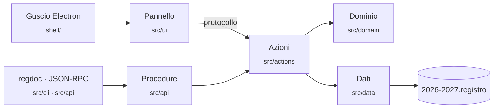

<div align="center">


# Registro docenti

**Il registro di classe che vive sul tuo computer, non sul server di qualcun altro.**

Lezioni, appello, piani lezione, valutazioni e rapporti in PDF —
in un file per anno scolastico, accanto al resto del tuo materiale.

[](https://github.com/nabre/Registro/actions/workflows/verifica.yml)
[](https://github.com/nabre/Registro/releases/latest)
[](https://github.com/nabre/Registro/releases)
[](LICENSE)


[**Scarica**](https://github.com/nabre/Registro/releases/latest) ·
[Funzioni](#che-cosa-fa) ·
[Guida](docs/GUIDA.md) ·
[Sviluppo](#sviluppo) ·
[Documentazione](docs/INDICE.md)

</div>

<!-- SCREENSHOT -->

---

## Perché

Su un registro ci sono nomi di minorenni, assenze, medie e a volte una
situazione di famiglia. **Registro docenti** tiene tutto sulla tua macchina:

- **un documento per anno**: `2026-2027.registro` sta nella cartella di lavoro
  e si copia, si salva e si archivia come qualunque altro file;
- **nessun account e nessun cloud**: niente da configurare, niente che parta
  verso un server;
- **anche l'intelligenza artificiale gira in locale**: l'assistente e la
  lettura delle scansioni usano modelli `.gguf` eseguiti sul tuo computer con
  [llama.cpp](https://github.com/ggml-org/llama.cpp).

## Che cosa fa

| | |
| --- | --- |
| 📅 **Calendario e orario** | Dall'orario settimanale nascono le lezioni sul calendario, vacanze e semestri compresi. Ogni ora ha appello, osservazioni e consuntivo. |
| 👥 **Classi e persone in formazione** | Classi, materie e corsi. Assenze e ritardi si contano per semestre o per anno. |
| 🗂️ **Piani lezione** | Si organizzano per tappe, con attività e risorse, e si duplicano da un corso all'altro. |
| 📝 **Valutazioni** | Ogni momento di valutazione sta dentro la lezione in cui si svolge, con voti, recuperi e medie. La griglia si esporta in CSV. |
| 📄 **Rapporti in PDF** | Modelli personalizzabili con segnaposto: il registro li compila e li mette nella cartella giusta con il nome giusto. |
| ✂️ **Smistamento dei PDF** | Un PDF di classe arrivato dalla segreteria si divide da solo, persona per persona. Le scansioni passano dall'OCR. |
| 🤖 **Assistente** | Risponde a domande in italiano leggendo i dati veri del registro, con un modello che scarichi o trascini nella finestra. Le domande si possono anche dire a voce: la dettatura usa whisper, sempre in locale. |
| 🖥️ **Agenda sul desktop** | Un riquadro agganciato al bordo dello schermo con tre schede: calendario, pendenze, lezione in corso. L'appello si fa anche da lì. |
| 📽️ **Proiezione** | Una seconda finestra per lo schermo della classe, che segue quel che apri nel registro. |
| ⌨️ **Riga di comando e API** | `regdoc` dal terminale e JSON-RPC su una pipe locale: 179 procedure, con permessi separati per lettura e scrittura. |
| 💾 **Portabile** | Una versione che gira da chiavetta senza installazione, per le macchine su cui non si hanno i diritti di amministratore. |

La [guida completa](docs/GUIDA.md) racconta ogni funzione e il perché di ogni scelta.

## Installazione

Scarica l'ultima versione dalla pagina delle
[**release**](https://github.com/nabre/Registro/releases/latest):

| File | Per chi |
| --- | --- |
| `registro-docenti-x.y.z-installer.exe` | Installazione per utente, senza diritti di amministratore. |
| `registro-docenti-x.y.z-portabile.exe` | Nessuna installazione: i dati restano in una cartella accanto all'eseguibile. |

Al primo avvio il registro chiede su quale cartella lavorare, poi l'**avvio
guidato** chiede anno, classe, materia e ore di lezione e da questi crea
tutto il resto, lezioni comprese.

> [!NOTE]
> Gli eseguibili non sono ancora firmati: al primo avvio Windows SmartScreen
> può mostrare un avviso. Scegli **Ulteriori informazioni → Esegui comunque**.

## Sviluppo

Serve **Node.js 24**. Per le prove dell'interfaccia servono anche Python e
Playwright.

```bash
git clone https://github.com/nabre/Registro.git
cd Registro
npm ci
npm run dev        # esbuild in ascolto, app avviata, ricarica a caldo
```

| Comando | Che cosa fa |
| --- | --- |
| `npm run dev` | Sviluppo: le pagine si ricaricano in un decimo di secondo, il main process si riavvia da sé |
| `npm start` | Compila e avvia, senza ascolto |
| `npm test` | Le prove con `node --test` |
| `npm run typecheck` · `npm run lint` | TypeScript e ESLint |
| `npm run layers` · `census` · `collections` · `forms` · `buttons` · `procedures` | I controlli d'architettura scritti in casa |
| `npm run ui-tests` | Le prove dell'interfaccia su Chromium |
| `npm run package` | Installer e portabile in `pacchetti/` |

### Com'è fatto



Gli strati e i loro confini sono controllati a macchina a ogni push
(`npm run layers`). Da dove cominciare a leggere:

| Documento | Per |
| --- | --- |
| [ARCHITETTURA](docs/ARCHITETTURA.md) | com'è fatto, e che cosa succede quando |
| [MODELLO-DATI](docs/MODELLO-DATI.md) | la forma dei dati e le regole che li tengono in piedi |
| [API](docs/API.md) | le procedure, il condotto e l'assistente |
| [DECISIONI](docs/DECISIONI.md) | perché è così, e che cosa non si può rompere |
| [CANTIERE](docs/CANTIERE.md) | che cosa sta cambiando adesso |

### Rilasci

La versione si scrive in un posto solo, `package.json`. Quando cambia su
`main`, [rilascio.yml](.github/workflows/rilascio.yml) rifà tutte le
verifiche, impacchetta, crea il tag `vX.Y.Z` e pubblica la release con
`latest.yml` per l'aggiornamento automatico.

## Contribuire

Segnalazioni e proposte sono benvenute: leggi [CONTRIBUTING](CONTRIBUTING.md)
prima di aprire una pull request.

> [!CAUTION]
> **Non allegare mai un file `.registro` vero** a una issue. Contiene dati di
> persone reali. Per le vulnerabilità vedi [SECURITY](SECURITY.md).

## Licenza

[MIT](LICENSE) © Michel Brenna
