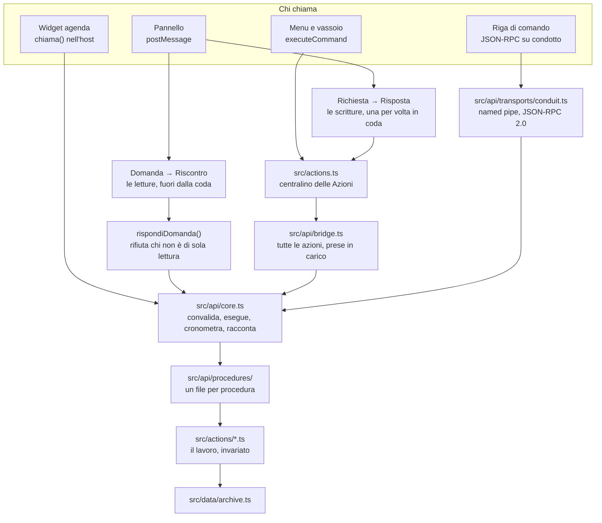

# L'interfaccia di programmazione

Questo documento è il contratto del registro: che cosa si può chiedergli, con
che forma, che cosa risponde e che garanzie dà. Vale per chi lo chiama da
dentro (il pannello, il widget dell'agenda, il menu nativo) e per chi lo chiama
da fuori (la riga di comando, uno script).

Per l'architettura in cui questo livello si innesta vedi
[ARCHITETTURA.md](ARCHITETTURA.md); per i tipi dei dati
[MODELLO-DATI.md](MODELLO-DATI.md); per tutto quel che l'applicazione sa fare,
voce per voce, [CATALOGO.md](CATALOGO.md).

---

## 1. Perché esiste

Il registro aveva già un contratto, e buono: `src/protocol.ts` dichiara le
azioni come un'unione discriminata, il pannello e l'host importano lo stesso
tipo, e una richiesta con un campo sbagliato non compila. Finché le due sponde
sono due bundle compilati insieme e spediti insieme, quel controllo basta.

Le sponde però sono diventate più di due. Il widget dell'agenda è un altro
webview — e `src/agenda.ts` ricontrollava gli stati dell'appello a mano
(`STATI.includes(stato)`) proprio perché il tipo lì non arriva. Il menu nativo
passa dal centralino. E una riga di comando non ha un compilatore che la
guardi insieme all'host: quel che manda è quel che ha battuto qualcuno.

Un tipo TypeScript sparisce quando il programma gira. Da lì le quattro lacune
che questo livello doveva chiudere — e che adesso sono chiuse, tutte e quattro,
per **tutte** le azioni del protocollo e non per un campione:

| Lacuna | Com'era | Com'è |
| --- | --- | --- |
| Convalida a runtime | solo gli aggregati interi passavano da `valida*`; le decine di azioni "a campo" si fidavano del tipo | ogni ingresso passa da uno schema prima che l'archivio venga toccato, per tutte le scritture, nessuna esclusa |
| Errori distinguibili | `errori: string[]` in italiano: `«Lezione non trovata.»` si legge ma non si distingue da `«Consegna non trovata.»` senza confrontare stringhe | un `codice` accanto alle frasi, che restano quelle di prima |
| Versione dichiarata | nessuna: uno scarto fra bundle diventava `azioneValida` falso, indistinguibile da un difetto | `api` nella busta, `versione` per procedura |
| Osservabilità | gli errori in `console.error`, del riuscito nessuna traccia | un giornale con nome, origine, durata ed esito di ogni chiamata |

### Che cosa è costato

Vale la pena scriverlo, perché è il prezzo che si paga anche la prossima volta
che si vuole mettere un contratto davanti a qualcosa che già funziona:

| Voce | Righe |
| --- | --- |
| `src/api/` — contratto, schemi, nucleo, ponte, indice, attrezzi, i trasporti e un file per procedura | 6.898 righe quando erano 17 file; oggi le stesse divise in 225 |
| `src/cli/registro.mjs` — la riga di comando | 517 |
| `tests/api/` — schemi, nucleo, ponte, procedure, copertura, attrezzi | 1.341 in 5 file, poi cresciute a 10 |
| I file che c'erano già e sono stati toccati | +403 / −163 su 14 file |

E soprattutto: **`src/actions/` non si è spostato**. Le sue 5.706 righe fanno
quel che facevano; le procedure gli mettono davanti il contratto e gli passano
la palla. L'unica eccezione è `src/actions/templates.ts`, dove la lettura di un
modello e la sua anteprima sono state *estratte* in due funzioni esportate —
`leggiModello`, `provaModello` — perché due procedure di lettura potessero
chiamarle senza copiarle. Estratte, non duplicate: il lavoro resta in un posto
solo, come prima.

In `src/actions.ts` la modifica è di sei righe: `...gestoriDelleProcedure()`
sparso per ultimo dentro `GESTORI`, così che le chiavi prese in carico vincano
su quelle di prima.

---

## 2. Come è fatto

Dal pannello escono **due** canali, e la differenza fra i due è il cuore di
questo livello: uno scrive e sta in coda, l'altro chiede e non ci sta.



Quattro cose da leggere in quel disegno:

1. **Il nucleo è l'unico punto di passaggio.** Il pannello, il widget e la riga
   di comando non si assomigliano in niente, ma da `chiama()` in poi diventano
   la stessa cosa: stessa convalida, stesso giornale, stessi codici.
2. **Il ponte è un innesto, non una riscrittura.** Una procedura che dichiara
   `azione: 'presenze.riga'` prende il posto di quel gestore dentro `GESTORI`.
   Per il pannello non cambia niente: manda la stessa `Azione`, riceve la
   stessa `Risposta`. Oggi l'innesto copre l'unione intera, azione per azione
   — ma il meccanismo è rimasto quello di quando ne copriva dieci, ed è il
   motivo per cui si è potuto arrivare in fondo un cilindro alla volta.
3. **Il canale delle domande salta il centralino e salta la coda**, e può
   farlo solo perché una guardia rifiuta le procedure che non sono di sola
   lettura. Vedi il § 6: è l'unico privilegio del sistema, e regge su un
   controllo solo.
4. **Il nucleo non spinge lo stato e non rigenera PDF.** Quelle due cose
   dipendono da chi ha chiamato — una riga di comando che corregge un voto non
   ha un webview da aggiornare — e restano dove stanno, nel pannello e nel
   centralino.

### I file

| File | Che cosa dichiara |
| --- | --- |
| [src/api/schemas.ts](../src/api/schemas.ts) | le forme di un ingresso: convalida, tipo TypeScript, JSON Schema |
| [src/api/contract.ts](../src/api/contract.ts) | `Procedura`, `ErroreApi`, i codici, la busta, il giornale |
| [src/api/core.ts](../src/api/core.ts) | `chiama()`, l'elenco, `daGestore()`, la traduzione da e verso `EsitoAzione` |
| [src/api/procedures/](../src/api/procedures/) | una procedura per file, sotto la cartella dei segmenti del suo nome |
| [src/api/tools.ts](../src/api/tools.ts) | il catalogo che un modello legge, costruito dalle procedure |
| [src/api/index.ts](../src/api/index.ts) | l'elenco delle aree, come `actions.ts` fa con i gestori |
| [src/api/bridge.ts](../src/api/bridge.ts) | l'innesto nel centralino |
| [src/api/transports/conduit.ts](../src/api/transports/conduit.ts) | il server JSON-RPC locale |
| [src/cli/registro.mjs](../src/cli/registro.mjs) | la riga di comando |
| [src/protocol.ts](../src/protocol.ts) | `Azione`/`Risposta` e, accanto, `Domanda`/`Riscontro` |
| [src/ui/bridge.ts](../src/ui/bridge.ts) | `invia`, `azione`, `chiedi`: le tre porte del webview |
| [src/panels/panel.ts](../src/panels/panel.ts) | la coda delle richieste e `rispondiDomanda()` |

---

## 3. Una procedura

```ts
const riga = definisci({
  nome: 'ore.appello.riga',          // area.cosa.verbo, in italiano
  versione: 1,                        // sale solo se questa forma cambia rompendo
  genere: 'scrittura',                // 'lettura' non tocca mai il registro
  titolo: 'Segna l’ora intera per una persona',
  azione: 'presenze.riga',            // l'azione che prende in carico, se c'è
  idempotente: true,                  // chiamarla due volte fa come una volta
  collezioni: ['lezioni'],            // che cosa si riscrive su disco
  ingresso: oggetto({
    lezioneId: identificatore(),
    allievoId: identificatore(),
    stato: scelta(STATI_APPELLO),
  }),
  uscita: SCRITTURA,
  esegui: (ambito, ingresso) => { /* controlla, poi passa la palla al gestore */ },
})
```

`definisci` esiste per l'inferenza: i tipi li deduce il compilatore dagli
schemi, e non vanno scritti a mano due volte — la seconda volta che si scrive
la stessa cosa è la volta in cui si sbaglia.

### La busta

Riuscita:

```json
{
  "ok": true,
  "api": 1,
  "procedura": "ore.appello.riga",
  "versione": 1,
  "tracciato": "api-m3k9x2-a7f1",
  "dati": { "revisione": 42 }
}
```

Fallita:

```json
{
  "ok": false,
  "api": 1,
  "procedura": "ore.appello.riga",
  "tracciato": "api-m3k9x2-a7f1",
  "codice": "ingresso-non-valido",
  "messaggi": ["stato: Serve uno fra: non-impostato, presente, assente, ritardo, esonerato."],
  "campo": "stato"
}
```

`chiama()` **non lancia mai**: quel che va storto torna nella busta. Il
`tracciato` è lo stesso che finisce nel giornale, ed è quel che si cita quando
si chiede «che cosa è successo alle 10:32».

Anche **l'uscita** si convalida, e non è simmetria per bellezza: una procedura
che rispondesse in una forma diversa da quella che dichiara è un difetto del
registro, non di chi ha chiamato, e torna `interno` invece di lasciar arrivare
a destinazione un oggetto storto che si manifesterà tre ridisegni più tardi.

### I codici

Sette, e uno in più si aggiunge quando qualcuno deve *reagire* in modo diverso,
non quando cambia il testo.

| Codice | Che cos'è | Ha senso ritentare? |
| --- | --- | --- |
| `ingresso-non-valido` | l'ingresso non ha la forma dichiarata | no, finché non si corregge la chiamata |
| `non-trovato` | l'id c'era, la voce no: tolta da un'altra finestra o da un file riletto | sì, dopo aver riletto |
| `rifiutato` | la forma è giusta, il contenuto no: un voto fuori scala | no |
| `conflitto` | qualcosa è cambiato sotto: il file su disco non è più quello letto | sì, dopo aver riletto |
| `non-disponibile` | serve qualcosa che adesso non c'è: nessun anno aperto, posta non collegata | sì, quando c'è |
| `procedura-sconosciuta` | il chiamante nomina una procedura che qui non esiste | no |
| `non-permesso` | la procedura c'e' e l'ingresso va bene: il condotto non concede quel genere | no, finche' non si accende l'impostazione |
| `interno` | il guasto non previsto | forse; intanto è nel giornale |

Le **frasi** restano in italiano e restano quelle che il pannello mostra già
oggi: nessun messaggio è stato riscritto passando di qui. Il codice si aggiunge
accanto, non al posto.

### L'accordo delle frasi

`errore.nonTrovato` prende un `Termine` del lessico, non una stringa. Con una
stringa la frase era cucita al femminile — «Lezione non trovata» giusto,
«Momento di valutazione non trovata» sbagliato — e l'accordo sarebbe toccato a
chi scrive ogni procedura. È esattamente il difetto che
[src/domain/lexicon.ts](../src/domain/lexicon.ts) esiste per non avere.

---

## 4. Gli schemi

`src/api/schemas.ts` dichiara una forma una volta sola e ne ricava tre cose: la
convalida a runtime, il tipo TypeScript per inferenza, e il JSON Schema per chi
chiama da fuori.

| Costruttore | Accetta |
| --- | --- |
| `testo({ minimo, massimo, modello, esempio })` | una stringa |
| `numero({ minimo, massimo, intero })` | un numero finito; `NaN` e `Infinity` no |
| `booleano()` | vero o falso |
| `scelta([...])` | uno fra quei valori, e nessun altro |
| `elenco(di, { minimo, massimo })` | un array, con il percorso dell'errore fino all'indice |
| `oggetto({ campi })` | un oggetto; i campi in più si scartano invece di far fallire |
| `vuoto()` | niente: le procedure che non chiedono nulla |
| `opzionale(di)` | la chiave può mancare |
| `nullabile(di)` | il valore può essere `null` |
| `identificatore()`, `iso()`, `ora()` | le forme del dominio; `iso` rifiuta il 30 febbraio |
| `entita({ cosa, valida })` | un'entità intera, convalidata dal dominio |
| `qualunque()` | niente controllo: due soli posti, elencati sotto |

**`opzionale` e `nullabile` non sono la stessa cosa**, e la differenza porta
peso: un `valore: null` è «non ancora messo», una chiave assente è «non sto
dicendo niente di questo campo». `ore.appello.campi` regge su questo — lasciare
fuori `minuti` non cancella i minuti che c'erano — e così
`valutazioni.recupero.imposta`.

E `nullabile` **marca la forma**, non la copia: mette `nullo: true` accanto al
genere di dentro, e `schemaJson` emette `"type": ["number", "null"]`. Era un
difetto vero finché la marcatura non c'era: il JSON Schema dichiarava
`"type": "number"` per un campo la cui descrizione diceva di mandare `null`, e
chi si fosse generato un client da quello schema avrebbe rifiutato da solo il
valore che il contratto gli chiedeva di mandare.

### `entita()`: un'entità non si riscrive

Tredici ingressi non sono campi sparsi ma **un oggetto intero del dominio**: una
`Lezione`, un `PianoLezione`, una `Consegna`, un `AnnoScolastico`. Per quelli lo
schema non ridice la forma: chiama il validatore che il dominio ha già.

```ts
ingresso: oggetto({
  lezione: entita<Lezione>({ cosa: 'Lezione', valida: validaLezione }),
})
```

Il motivo è che la forma di una `Lezione` è già scritta, una volta, in
`domain/validation.ts`, e lì dentro c'è che uno slot dura un multiplo esatto
di unità didattica, che i semestri devono essere contigui, che una consegna
senza destinatari non è completa. Riscriverla qui in forma di schema vorrebbe
dire **due verità da tenere allineate a mano**, e la seconda resterebbe
indietro al primo campo nuovo — silenziosamente, perché un campo che lo schema
non dichiara non fa fallire niente: `oggetto()` lo scarta e basta.

Quindi `entita` fa la sola cosa che il dominio non fa: si accerta che quel che è
arrivato sia **un oggetto con un id**, perché un validatore scritto per una
`Lezione` non è tenuto a sopravvivere a un numero o a `null`. Poi passa la
palla; e se il validatore lancia comunque, quel guasto diventa
`ingresso-non-valido` e non `interno`, perché l'errore è di chi ha chiamato e va
detto così.

Nel JSON Schema pubblicato un'entità è un **oggetto aperto**:
`additionalProperties: true`, con il solo `id` fra le `properties`. È l'unica
forma onesta — i campi veri ci sono, ma questa forma non li sa nominare — e
senza quella riga il contratto direbbe che una `Lezione` intera non è una
`Lezione`, facendo rifiutare il dato buono a chiunque convalidi il proprio
ingresso prima di mandarlo. Ovunque i campi dichiarati siano davvero tutti
quelli che contano, invece, `additionalProperties` resta `false`.

Senza `valida` resta il solo controllo di forma, e capita quattro volte su
tredici. Tre sono entità il cui validatore ha bisogno di sapere anche **che
cosa c'è già nel registro** — `validaMateria(materia, altre)`,
`validaCorso(corso, altri)`, `validaClasse(classe, altre)`: due nomi uguali non
possono convivere, e quel secondo argomento ce l'ha solo chi ha in mano il
registro. Resta dove sa le cose: dentro il gestore (`materie.salva`,
`corsi.salva`, `classi.salva`). La quarta è `ore.osservazione.salva`, dove un
validatore del dominio **non esiste**: la sola regola — il testo non è vuoto —
sta nel gestore e ci resta.

### `qualunque()`, e perché ormai serve a pochissimo

Prima di `entita` era la valvola di sfogo per ogni aggregato: «niente controllo,
tanto subito dopo c'è una `valida*` vera». Adesso, in tutte le procedure,
`qualunque()` compare **tre volte**. Due —
[impostazioni/salva.ts](../src/api/procedures/impostazioni/salva.ts) e
[programma/salva.ts](../src/api/procedures/programma/salva.ts) — per lo stesso
motivo: non per un aggregato, ma per un valore la cui forma *dipende da
un'altra chiave*. La terza, in
[assistente/stacca.ts](../src/api/procedures/assistente/stacca.ts), è un blocco
impaginato che la pagina ha già composto e che il registro si limita a
riportare:

| Dove | Perché |
| --- | --- |
| le liste delle tendine di `impostazioni.salva` | le chiavi **sono** il dato: `oggetto` sa descrivere campi fissi, non una mappa aperta, e scrivere qui l'elenco delle liste riconosciute vorrebbe dire rifiutare un salvataggio che oggi passa — `normalizzaListe` quel che non conosce lo lascia cadere |
| il `valore` di `programma.salva` | testo, numero o vero/falso: quale dei tre sia lo dice la voce del manifesto, e `valoreAccettabile(chiave, valore)` è la dogana vera. Uno schema che provasse a rifarla dovrebbe conoscere il tipo di ogni chiave, e lo conoscerebbe al momento in cui è stato scritto, non a quello in cui gira |

Un terzo caso che *sembra* `qualunque` e non lo è: `Impostazioni` è scritto per
esteso, campo per campo, perché `entita` pretende un `id` e le impostazioni non
ne hanno — sono l'unico oggetto del documento che esiste in copia sola. Scritto
per esteso ha anche un vantaggio: un campo aggiunto a `Impostazioni` fa fallire
*quella* compilazione invece di arrivare al gestore come `undefined`.

### Perché fatto in casa e non zod

Il contratto esposto è quello **Standard Schema** (`~standard`), lo stesso che
zod, valibot e arktype implementano: il nucleo non conosce `schemas.ts`, conosce
quell'interfaccia. Il giorno in cui servisse di più — tipi ricorsivi,
trasformazioni, unioni discriminate profonde — si sostituisce la libreria senza
toccare una riga di nucleo o di procedura.

Finché quel giorno non arriva, il registro non si porta dentro una dipendenza
per fare quel che cinquecento righe fanno: l'applicazione scrive già da sé lo
ZIP e il client SMTP, e un validatore di messaggi è meno impegnativo di tutti e
due. La porta per cambiare idea resta aperta, ed è il punto.

---

## 5. Le procedure di oggi

**Otto letture, e per il resto scritture.** Le scritture prendono in carico, una
per una, **tutte le azioni del protocollo**: non ne resta scoperta nessuna. Il
conto esatto non sta scritto qui apposta — lo stampa `npm run procedures`, e lo
verificano le prove. Non è un numero ricordato: `tests/api/coverage.test.mjs` legge l'unione dal sorgente,
la confronta con l'elenco delle procedure e fallisce se le due liste divergono.

Le azioni erano 143. Due — `modello.leggi` e `modello.prova` — sono state
**ritirate**: erano scritture che non scrivevano niente, e per poter rispondere
avevano fatto crescere la busta di *ogni* scrittura di tre campi (`testo`,
`nomi`, `pdf`) usati da loro sole. Sono diventate le letture `modelli.leggi` e
`modelli.prova`, e i tre campi sono spariti da `Risposta` e da `EsitoAzione`.
Il § 6 racconta il canale che lo ha reso possibile.

### L'albero: il percorso è l'indirizzo

Un file per procedura, sotto la cartella dei segmenti del suo nome.
`ore.appello.casella` sta in `src/api/procedures/ore/appello/casella.ts`, e in
nessun altro posto: si trova una procedura senza cercarla, si vede a colpo
d'occhio quante ne ha un'area e quanto è grande ciascuna, e si cancella senza
dimenticarne un pezzo.

```
src/api/procedures/
├── comuni/              le guardie che più aree si dividono, per file d'origine
│   ├── piani.ts         esigiPiano, esigiLezione
│   ├── rapporti.ts      i generi di rapporto
│   └── registro.ts      esigiAnno, esigiMateria, esigiCorso, esigiClasse
├── ore/
│   ├── comuni.ts        STATI_APPELLO, esigiLezione, esigiUd, esigiIscritto
│   ├── indice.ts        procedureOre — i file suoi e gli indici delle cartelle sotto
│   ├── salva.ts         ore.salva
│   ├── appello/
│   │   ├── indice.ts    procedureOreAppello
│   │   ├── casella.ts   ore.appello.casella
│   │   └── …
│   └── …
└── …
```

Ogni file esporta **una** procedura e la chiama sempre allo stesso modo —
`export const procedura` — così che gli indici e gli strumenti la possano
nominare senza sapere che cosa c'è dentro. Gli indici si tengono a mano: un glob
registrerebbe anche i file a metà, e toglierebbe il punto in cui ci si accorge
che manca qualcosa.

Prima erano undici file d'area da 150 a 765 righe, e i nomi non seguivano il
file: `consegne.firme.*` stava in `docenteClasse.ts` perché lì stava il gestore.
Trovare una procedura voleva dire cercarla nel testo. Adesso il nome *è* il
percorso, e la vicinanza al gestore la tiene l'import, che è il posto giusto per
tenerla.

Che l'albero stia in piedi lo dice `npm run procedures`: legge il testo e non
compila, quindi risponde anche quando `tsc` non passa — ed è proprio allora che
serve sapere se il file è al posto giusto. Controlla che il percorso sia il nome,
che ogni file sia nominato nel suo indice, che ogni cartella arrivi fino a
`src/api/index.ts`, che nessuna procedura dichiari un'azione inesistente, e che
`resources/tools.json` non sia rimasto indietro.

### Le trentadue aree

L'area è il primo segmento del nome. Non sono più le aree dei gestori: un'area
qui è un pezzo di lessico del registro, e quante procedure abbia non conta —
`mappa` ne ha una, `smistamento` diciannove.

| Area | Che cosa copre |
| --- | --- |
| `smistamento` | le scansioni in quarantena: caricarle, dividerle, attribuirle, leggerle, confermarle |
| `consegne` | le richieste di consegna, le spunte, i file raccolti, le firme di ritiro |
| `ore` | l'ora di lezione: l'appello in cinque tagli, la matrice del comportamento, stato, testi, osservazioni |
| `classe` | il mestiere del docente di classe: recapiti, comunicazioni, periodi di assenza e i loro fogli |
| `valutazioni` | i momenti, i voti, le riconsegne, i recuperi, gli allegati |
| `piani` · `risorse` · `avanzamento` | i piani di lezione, i file che portano con sé, a che punto sono |
| `modelli` | i modelli dei fogli in `templates/`: leggerli, salvarli, ripristinarli, provarli |
| `corsi` · `corso` | i corsi come anagrafica, e le presenze di uno |
| `anni` · `materie` · `classi` · `persone` · `orario` | l'ossatura che si tocca a settembre |
| `stato` · `documento` · `documenti` | lo stato del registro e i documenti d'anno |
| `rapporti` · `esportazioni` · `composizioni` · `esporta` | i fogli che escono, e che cosa se ne fa |
| `proiezione` | la finestra davanti alla classe |
| `posta` · `mappa` | quel che parla con una macchina che non è questa |
| `sistema` · `impostazioni` · `programma` · `manutenzione` | il contorno: la configurazione, le scorciatoie di sistema, le riparazioni |
| `registro` | le due domande sul registro intero: il riassunto e l'integrità |
| `assistente` | dove vive l'assistente: il riquadro, o la sua finestra |

L'elenco per nome lo stampa `registro elenco`, e non invecchia: lo chiede al
registro invece di tenerne una copia. `registro catalogo` lo stampa in JSON, con
la forma di ogni ingresso.

### Le ventisette letture

Nascono da quattro bisogni diversi, e il confine non è netto.

Le prime quattro — `registro.riassunto`, `corsi.elenco`, `corso.presenze`,
`ore.appello.leggi` — servono a **chi il registro non ce l'ha**: una riga di
comando, uno script. Dentro l'applicazione nessuno le chiama, perché chi sta
dentro il registro ce l'ha già.

Le quattro di mezzo rispondono a quel che **nel registro non c'è**: il sorgente di
un modello, un PDF composto per prova, che cosa sta scritto nella cartella, che
cosa non torna fra i riferimenti. `modelli.leggi` e `modelli.prova` le usa già
la pagina Modelli (§ 6); `documenti.inventario` e `registro.integrita` oggi le
chiama solo chi arriva da fuori — «esserci», per il registro, vuol dire comparire
nel documento d'anno, non stare sul disco, e da uno script non c'è altro modo di
saperlo.

| Procedura | Ingresso | Torna |
| --- | --- | --- |
| `registro.riassunto` | niente | versione dello schema, l'anno in corso (o `null`) con le sue date, e i conteggi: classi, corsi, lezioni, valutazioni, consegne, smistamenti con pagine ancora in quarantena |
| `corsi.elenco` | `annoId?` — senza, l'anno in uso; nominandone un altro è «non trovato», non un elenco vuoto | per ogni corso: id, titolo, classe, materia, quante persone frequentano, quante ore a calendario, quante fasce orarie fisse |
| `corso.presenze` | `corsoId`, `dal?`, `al?`, `semestreId?` | `udPreviste`, `udACalendario` e una riga per persona: presenze, assenze, ritardi, prove, media, nota — ciascuna **con il proprio denominatore accanto** — e le stesse cifre **semestre per semestre**, in `periodi` e in `righe[].periodi` |
| `ore.appello.leggi` | `lezioneId` | giorno, quante UD, e una riga per persona: gli stati unità per unità, i minuti di ritardo, la nota |
| `modelli.leggi` | `nome` — `_base`, `verbale-lezione`, `_firma.html` | `testo`, il sorgente del modello, e `nomi`: i dieci elenchi di quel che quel rapporto sa riempire (valori, elenchi, tabelle, grafici, gallerie, gruppi, blocchi, frasi, immagini, modelli) |
| `modelli.prova` | `nome`, `bozza?` — senza, quel che c'è su disco | `pdf`: il foglio composto su dati veri, in base64. **Non tocca il disco**: un foglio di prova fra le esportazioni sarebbe un documento in più da spiegare a chi apre quella cartella |
| `documenti.inventario` | niente | che cosa è scritto nel documento d'anno: esportazioni, archivio (quarantena compresa), composizioni, modelli. Nomi, misure e revisioni — **nessun contenuto** |
| `registro.integrita` | niente | `riferimentiRotti` (una frase per rottura) e `riparazioni` (che cosa succederebbe, quali raccolte toccherebbe). **Solo la diagnosi**: applicarle è l'azione `manutenzione.ripara` |
| `llm.modelli` | niente | la cartella dei modelli, i `.gguf` che ci stanno dentro con peso e natura (modello, proiettore, o `incompiuto` per uno scarico mai finito), la `sorgente` di quelli a metà — deposito e file da cui venivano, che è quel che serve a «Riprendi» — e per ciascuno dei due mestieri quale risponde, se è pronto e perché no |
| `llm.catalogo` | `cerca?` | i modelli consigliati — deposito, a che cosa servono, quanto pesano — e, con `cerca`, i depositi trovati su Hugging Face con i loro scarichi |
| `llm.file` | `deposito`, `taglio` | i `.gguf` che quel deposito pubblica davvero, quale conviene prendere e quale è il suo proiettore. Il sito che non risponde è un elenco vuoto con il `motivo` accanto, non un guasto |

Le undici che seguono sono il quarto bisogno, ed è quello dell'**assistente**.
Il contesto gli dice `classeId`, `allievoId`, `lezioneId`, `pianoId`,
`valutazioneId` a ogni domanda — sono gli id della pagina che si ha davanti — e
fino a ieri **non c'era un solo attrezzo che ne prendesse uno**: «quante persone
ci sono nella 4a», «chi è andato male all'ultima verifica», «che cosa devo
ancora fare» finivano tutte in «non lo so». Un contesto che promette id che
nessuno consuma è peggio di nessun contesto: il modello li passa a un attrezzo
che non li vuole, riceve un rifiuto e ricomincia da un elenco.

| Procedura | Ingresso | Torna |
| --- | --- | --- |
| `persone.cerca` | `cerca?` — pezzi di nome, classe o azienda; `ritirati?`, `archiviate?` | chi corrisponde, con l'id da passare a `persone.scheda`, **quante ce ne sono in tutto**, quante ne tengono fuori i due filtri accesi di suo (`esclusiRitirati`, `esclusiArchiviate`) e, quando serve, un `suggerimento` che dice quale chiamata rifare. Le parole che nominano la categoria — «allievo», «studenti», «persone» — non filtrano: si tolgono, e `ignorato` dice che sono state tolte. Ogni pezzo deve trovarsi: «rossi dic» è Rossi della DIC4a, non tutti i Rossi più tutta la DIC4a. Senza `cerca` tornano tutte |
| `classi.elenco` | `annoId?` — come sopra —, `archiviate?` | per ogni classe: quante persone la frequentano, quante si sono ritirate, quanti corsi, le materie, se se ne è docente di classe; e `escluse`, quante archiviate restano fuori |
| `classe.persone` | `classeId`, `ritirati?` | cognome, nome, azienda e le caselle a cui il registro scrive davvero, più `escluse`: quante ritirate restano fuori. **Non l'indirizzo di casa**: quello sta nella scheda, che si apre di proposito |
| `persone.scheda` | `allievoId`, `dal?`, `al?`, `semestreId?` | l'anagrafica e, corso per corso, come sta: UD perse, quota di assenza e di presenza con i loro denominatori, ritardi, prove, media — i totali **e le stesse cifre semestre per semestre**, in `corsi[].periodi`. I conti vengono da `matriceCorso`, non da una seconda formula |
| `persone.argomenti` | `allievoId`, `presenza?` — «perse» senza, poi «parziali», «seguite», «ignote», «tutte» —, `corsoId?`, `dal?`, `al?`, `cerca?`, `da?`, `quanti?` | che cosa si è fatto nelle ore di quella persona, un’ora per riga: argomento, corso, UD perse su quante ne durava l’ora, e come è andata. Accanto, i conti del **periodo** e non della pagina: ore perse, UD perse, e quante delle ore in elenco non dicono che cosa si è fatto |
| `ore.elenco` | `corsoId?`, `classeId?`, `materiaId?`, `stato?`, `dal?`, `al?`, `cerca?`, `da?`, `quanti?` | le ore a calendario nel periodo: giorno, orario, corso, quantesima, stato, UD, argomenti, se l'appello è stato fatto |
| `ore.prossima` | `corsoId?`, `classeId?`, `da?`, `dalleOre?`, `quante?` | la prossima ora che deve ancora cominciare — o quella in corso — con giorno, orario, corso, classe, aula e argomento. È l'unica lettura che **guarda l'orologio**: senza `da` e `dalleOre` vale adesso, e quel che ha usato lo rimanda nella busta, così una risposta si può rileggere. `aCalendario` distingue «non ce n'è più» da «il calendario è vuoto». Il conto viene da `prossimaLezione()` del dominio, la stessa che disegna la riga in cima alla pagina dei corsi |
| `ore.leggi` | `lezioneId` | l'altra metà di `ore.appello.leggi`: argomenti, materiali, consuntivo, piano assegnato e le annotazioni dell'ora, con il nome di chi riguardano |
| `valutazioni.elenco` | `corsoId?`, `classeId?`, `dal?`, `al?`, `cerca?`, `da?`, `quanti?` | i momenti di valutazione: titolo, genere, peso, quanti voti sono stati messi, la media, quanti fogli restano da riconsegnare, quanti recuperi |
| `valutazioni.voti` | `valutazioneId` | una riga per **persona della classe** e non per voto messo — «chi manca» è metà della domanda — con voto, assenza, sufficienza sulla scala di quel giorno, riconsegna e recupero |
| `piani.elenco` | `corsoId?`, `classeId?`, `tag?`, `cerca?`, `da?`, `quanti?` | i piani del corso con il nome che la pagina gli dà, a quale ora sono assegnati, quante tappe e quante UD |
| `piani.leggi` | `pianoId` | il piano intero: obiettivi, prerequisiti, le tappe nell'ordine con durata e materiali, le risorse |
| `persone.assenze` | `classeId?`, `corsoId?`, `allievoId?`, `stati?` — un **elenco** di caselle dell’appello, senza è «assente» —, `soglia?` **in cifra tonda, 20 è il venti per cento**, `conAssenze?`, `soloOltreSoglia?`, `ordina?`, `semestreId?`, più i filtri comuni | una riga **per persona e non per corso**: UD e ore nelle caselle contate, in quanti corsi, la quota sulle UD previste, se supera la soglia — e le stesse cifre **semestre per semestre** in `periodi`. Accanto: quante persone si sono guardate, quante ne hanno almeno una, quante superano, e quante ne hanno tolte i filtri |
| `persone.medie` | `classeId?`, `corsoId?`, `allievoId?`, `mediaAlmeno?`, `mediaAlPiu?`, `soloSotto?`, `conVoti?`, `ordina?`, `semestreId?`, più i filtri comuni | la media per persona, presa da `mediaAllievo()` del dominio — quella di pagelle e rapporti, che pesa ogni voto con il peso della sua prova — con le prove contate, la sufficienza della scala del registro, e la media **semestre per semestre** in `periodi` |
| `mappa.elenco` | `classeId?`, `allievoId?`, `genere?` (domicilio, lavoro, tutti), `comune?`, `cap?`, `entroKm?`, `attornoA?`, più i filtri comuni | dove abitano: via, NAP e comune **in campi separati**, lat e lon nullabili, se il punto è approssimato, la distanza da un punto. Chi non è collocato compare lo stesso con lat e lon nulli — se sparisse, «chi manca sulla mappa» sarebbe invisibile — tranne quando si chiede `entroKm`, che senza un punto non si può giudicare: allora resta fuori e la busta conta quanti |
| `consegne.elenco` | `corsoId?`, `classeId?`, `stato?`, `complete?`, `giorno?`, `arretrateDaAlmeno?`, `scadeEntro?`, `cerca?`, `da?`, `quanti?` | le pendenze: che cosa, per quando, a che punto sono e **chi manca, per nome**. Chi ha già fatto non esce: venticinque righe che dicono «ha fatto» non rispondono a niente |

**Un filtro si deve poter togliere, e un elenco vuoto non è un registro vuoto.**
Dal transcript di una conversazione vera: a «elencami le persone in formazione»
il modello ha cercato la **parola** «allievo» — `cerca` era obbligatorio — ha
avuto zero risultati e ha concluso «ci sono 0 persone in questo registro». Falso,
e detto con sicurezza. Due correzioni: i filtri delle letture sono opzionali
(senza `cerca` tornano tutte), e la busta porta accanto al risultato **quante ce
ne sono in tutto** — «zero corrispondono» e «zero ce ne sono» sono due fatti
diversi, e senza il secondo il primo si legge come l'altro. La terza è nelle
istruzioni: prima di dire «non ce n'è nessuno», rifare la domanda senza filtri.

**L'anno è uno solo, e chiederne un altro non è un filtro.** `archivio.leggiTutto`
mette in `anni` il documento aperto e nient'altro: `annoId` in `classi.elenco` e
`corsi.elenco` può dunque valere soltanto l'anno in uso. Fin qui un id diverso
tornava zero classi — lo stesso difetto di sopra, visto da un'altra parte: «quel
documento non è aperto» detto come «quell'anno è vuoto». Adesso le due letture
passano da `esigiAnno`, e il rimedio nomina `registro.riassunto`, che l'anno
aperto lo dice.

**La ricerca si adatta a chi scrive.** Maiuscole, accenti e apostrofi non
nascondono più una persona: «muller» trova «Müller», «MÜLLER» trova
«Muller», «dellacqua» trova «Dell’Acqua» comunque sia scritto l'apostrofo —
dritto, curvo o dimenticato. Il confronto passa da `pezziDiRicerca` e
`corrispondeAlla` in `domain/text.ts`, le stesse due funzioni che usa la
pagina Persone: due normalizzazioni diverse ai due capi del muro sarebbero due
ricerche che trovano persone diverse a parità di parola scritta. Cercare è un
gesto di fretta per definizione — lo si fa per **non** dover ricordare come si
scriveva — e pretendere l'ortografia esatta serve solo a chi già sa dov'è quel
che cerca.

**Una regola nel prompt è un consiglio; nel codice è una regola.** Le
istruzioni dicono da sempre «non cercare a parole quel che si chiede senza:
per avere tutte le persone chiama «persone_cerca» **senza** «cerca»». Il
giornale mostra che un modello locale lo fa lo stesso, a metà conversazione: a
«mi dai l'elenco degli allievi» chiama `persone.cerca` con `cerca: 'allievo'`,
riceve zero e risponde che non ce ne sono. Adesso la procedura toglie dal filtro
le parole che **nominano la categoria** — allievo, allieva, studente, alunno,
persona, iscritto, al singolare e al plurale — perché nessuna di quelle è il
nome di qualcuno: cercarle vuol dire sempre e soltanto «tutte». Non in
silenzio: `cerca` torna il filtro applicato davvero, `ignorato` le parole tolte,
e `suggerimento` lo scrive in una frase. «rossi allievo» resta Rossi — si toglie
la parola di categoria, non il resto del filtro. Restano fuori dall'elenco le
parole che potrebbero essere il nome di una persona o di una classe:
«meccanico», «prima». Il confine è quello, non «quanto è generica».

**`suggerimento` è il rimedio dove non c'è un rifiuto.** `errore.nonTrovato`
porta già la frase che dice come si trova quel che manca, ma vale solo quando la
chiamata fallisce. Una busta vuota e **valida** — zero righe, nessun errore — è
l'altro punto in cui chi legge si ferma, e fin qui non portava niente. Adesso
porta una riga: che cosa è stato tolto dal filtro, quante persone ci sono
davvero, quale chiamata rifare. Vuota quando non c'è niente da fare — un
consiglio dato sempre non si legge più quando serve.

### I filtri che le letture si dividono

Ogni lettura nasceva con i suoi. `ore.elenco` aveva `dal` e `al`,
`persone.cerca` aveva `cerca`, `corso.presenze` aveva un periodo scritto in
un altro modo, e nessuna aveva una pagina. Tre difetti con la stessa radice: un
filtro scritto ogni volta è un filtro che ogni volta si comporta un po'
diversamente — e chi impara a restringere un elenco non sa restringere il
successivo.

Adesso stanno in [`common/filters.ts`](../src/api/procedures/common/filters.ts), e
una lettura li prende a pezzi: `...periodo()`, `...ricerca(…)`,
`...pagina()`. **Modulari**: si compongono, e nessuna lettura li riscrive.

| Pezzo | Ingresso | Uscita | Chi lo prende |
| --- | --- | --- | --- |
| periodo | `dal?`, `al?` | `dal`, `al` sempre pieni | `ore.elenco`, `valutazioni.elenco`, `persone.argomenti` |
| periodi | `dal?`, `al?`, `semestreId?` | `dal`, `al`, l'elenco `periodi` dei semestri guardati, e le stesse cifre dentro ogni riga | `persone.assenze`, `persone.medie`, `corso.presenze`, `persone.scheda` |
| ricerca | `cerca?` | `cerca`, il filtro applicato davvero | `ore.elenco`, `valutazioni.elenco`, `piani.elenco`, `consegne.elenco`, `classi.elenco`, `corsi.elenco`, `persone.argomenti`, `persone.cerca` |
| pagina | `da?`, `quanti?` | `quante`, `da`, `ancora`, `troncato` | le stesse, meno `classi.elenco` e `corsi.elenco` — un anno ha dieci classi, non mille |

Tre regole, e sono le stesse di prima messe in un posto solo:

- **Un filtro si deve poter togliere.** Tutti opzionali, sempre. Senza niente si
  risponde su tutto l'anno in uso, che è l'elenco da cui si parte per
  restringere.
- **La busta dice su che cosa ha risposto.** `dal` e `al` tornano pieni anche
  quando non li si è passati, e `cerca` torna il filtro **applicato**, che non
  è sempre quello chiesto — `persone.cerca` toglie le parole che nominano la
  categoria, e lo scrive.
- **Un elenco tagliato si può ripescare.** Prima le letture tagliavano a un
  numero fisso e dicevano `troncato: true`: onesto, e senza nessuna strada per
  avere la duecentunesima ora. Adesso `da` e `quanti` la strada ce l'hanno, e
  `ancora` dice quante ne restano. Il tetto è 500 righe per busta, e chiederne
  di più è un ingresso non valido invece di una risposta che nessuno legge.


Ai tre pezzi se ne sono aggiunti altri tre, per le domande che l'API non sapeva
leggere.

| Pezzo | Ingresso | Che domanda apre |
| --- | --- | --- |
| presenza di un valore | `ha?`, `senza?` — due elenchi di nomi di campo | «chi non ha l'e-mail», «le ore senza argomento», «le prove ancora da correggere» |
| zona | `comune?`, `cap?` | «chi abita a Lugano», «chi sta nel 69…» |
| soglie | due estremi per grandezza, `…Almeno` e `…AlPiu` | «chi è sotto il quattro», «le pendenze scadute da più di dieci giorni» |

Tre regole che valgono per tutti e tre:

- **`ha` e `senza` si compongono, e ogni campo elencato deve valere.** «Ha il
  telefono del rappresentante ma non l'e-mail» è una domanda vera, e con un
  solo campo booleano sarebbero due chiamate e un'intersezione fatta a mano.
  Che cosa conti come vuoto lo dice `pieno()` in un posto solo: una stringa di
  spazi è vuota, un elenco senza voci è vuoto, un `false` è vuoto — «l'appello
  non è stato fatto» è la ragione per cui si cerca — e uno **zero non lo è**,
  perché zero assenze è un fatto e non un dato che manca.
- **Gli estremi sono compresi, e `null` non passa nessuna soglia.** Una media
  che non c'è non è uno zero: metterla fra chi sta sotto vorrebbe dire
  segnalare qualcuno per un dato che manca. Chi vuole quelle righe le chiede
  con `senza`, che è il filtro fatto apposta.
- **Il comune si confronta intero, il NAP per prefisso.** «Lugano» non deve
  prendere «Luganello» — un confronto a pezzi su un nome di comune
  trasformerebbe un filtro in una ricerca — mentre «69» vuol dire il Luganese,
  ed è il modo in cui i NAP dicono «la zona».

**L'indirizzo esce in campi.** `persone.scheda` e `classe.persone` tornavano
l'indirizzo come **una riga già composta**, buona per una busta e per
nient'altro: il comune dentro una frase non si conta e non si raggruppa. Adesso
accanto alla riga composta — che resta, perché è quella che si stampa — ci sono
`via`, `cap` e `localita` separati, ed è da lì che «chi viene da dove»
diventa una domanda con una risposta.

La ricerca passa da `pezziDiRicerca` e `corrispondeAlla` del dominio, cioè
dalle stesse due funzioni della pagina Persone: maiuscole, accenti e apostrofi
non contano, e **ogni pezzo deve trovarsi** — «rossi dic» è Rossi della DIC4a e
non tutti i Rossi più tutta la DIC4a.

**Il totale accanto al risultato non può stare dentro il filtro.** La busta di
`persone.cerca` portava `inRegistro` per distinguere «zero corrispondono» da
«zero ce ne sono» — ma lo contava **fra le candidate**, cioè dopo i due filtri
che sono accesi da soli: chi si è ritirato e le classi archiviate. In un
registro vero quei due filtri sono esattamente quel che svuota la busta — le
classi di un anno finito si archiviano — e la risposta diventava «0 trovate, 0
nel registro»: il numero che doveva impedire la deduzione sbagliata la
confermava. Adesso `inRegistro` conta tutte le persone di tutte le classi, e
accanto ci sono `esclusiRitirati` ed `esclusiArchiviate`, che dicono **quante**
ne tiene fuori ciascun interruttore e quindi quale riaccendere. Lo stesso
numero, con il nome `escluse`, l'hanno preso `classe.persone` (le ritirate) e
`classi.elenco` (le archiviate), che cadevano nella stessa buca. Le istruzioni
del modello — in `api/transports/assistant.ts` e in `api/tools.ts` — dicono
adesso di guardarli e di richiamare l'attrezzo con i due interruttori a vero.

**Un «non trovato» dice dove si cerca.** `errore.nonTrovato` prende un secondo
argomento — il rimedio — e le guardie condivise lo passano: «Le persone si
cercano con “persone.cerca”», «Le ore le elenca “ore.elenco”». Non è un
abbellimento: il giornale ha registrato **dieci `persone.scheda` di fila**,
tutte `non-trovato`, tutte con un id inventato da capo. Il modello non insisteva
per testardaggine — riceveva «non trovata, forse è sparita», e da lì l'unica
strada era riprovare. La seconda rete sta nel trasporto: quando la stessa coppia
attrezzo–codice torna, la busta glielo ricorda, e dal quarto tentativo gli dice
di smettere e di chiedere di chi si parla. Si conta per attrezzo e codice e non
per argomenti, perché dieci id diversi sono lo stesso sbaglio dieci volte.

Le date delle pendenze passano dal dominio (`dataConsegna`, `scadenzaConsegna`):
una consegna appesa a una lezione si sposta con lei, e leggerne il campo grezzo
direbbe il giorno in cui quella lezione stava prima di essere spostata.

Le ultime tre sono **la pagina «Modelli linguistici»**: dicono che cosa c'è sul
disco e che cosa si può avere. Sono letture e non domande dirette al filesystem
perché il webview il disco non ce l'ha, e perché il nome di un modello è un dato
del registro come un altro — passa da uno schema, e torna in una forma
dichiarata.

Due note che valgono per tutte e undici.

**Le letture tornano il conto già fatto dal dominio, mai i dati grezzi da
ricontare.** Una riga di comando che volesse sapere quante ore ha perso una
persona, ricevendo il registro intero, rifarebbe in un altro linguaggio i conti
che `dominio/` fa già — e li rifarebbe diversi.

**E tornano una forma piatta e dichiarata, non i tipi interni.** `RigaCorso`
può cambiare quando serve al registro; la risposta di `corso.presenze` no,
perché è un contratto con chi la legge.

Da qui la forma di `corso.presenze`, che è il punto in cui questo contratto
lavora di più:

```json
{
  "udPreviste": 10,
  "udACalendario": 6,
  "righe": [{
    "udConAppello": 4,
    "udPresenza": 2,
    "udAssenza": 2,
    "assenza": 0.2,
    "presenza": 0.5,
    "frequenza": 0.8
  }]
}
```

`assenza` e `presenza` **hanno denominatori diversi** e non sono l'una il
complemento dell'altra: la prima sta sulle unità che l'orario prevedeva — è la
cifra dei rapporti da controfirmare — la seconda su quelle in cui l'appello è
stato fatto davvero, e dice quanto la prima è affidabile. Viaggiano insieme ai
loro denominatori proprio perché nessuno possa ricavarne una terza. Vedi
[MODELLO-DATI.md](MODELLO-DATI.md), § i tre denominatori.

---

## 6. Il canale delle domande

Il pannello quasi tutto ce l'ha già: l'host gli spinge il `Registro` intero
dopo ogni scrittura, e per quel che sta nei dati continua a leggerselo da sé,
che è più svelto di qualunque andata e ritorno. Questo canale serve a quel che
nel registro **non c'è**.

### I due tipi

```ts
// dal webview all'host
interface Domanda {
  id: number
  procedura: string      // il nome di una procedura di lettura
  ingresso?: unknown
}

// dall'host al webview
interface Riscontro {
  tipo: 'riscontro'
  id: number
  ok: boolean
  dati?: unknown         // quel che la procedura ha risposto, nella forma che dichiara
  errori?: string[]      // le frasi, già in italiano
  codice?: string        // `non-trovato`, `rifiutato`, `ingresso-non-valido`…
}
```

Stanno in [src/protocol.ts](../src/protocol.ts) accanto a
`Richiesta`/`Risposta`, e `Riscontro` entra in `MessaggioVersoWebview` come
ogni altro messaggio spinto.

### Le tre funzioni

| Dove | Che cosa fa |
| --- | --- |
| `chiedi<T>(procedura, ingresso?)` in [src/ui/bridge.ts](../src/ui/bridge.ts) | manda la domanda e torna un `Esito<T>`: `{ ok, dati, errori, codice }` |
| `rispondiDomanda()` in [src/panels/panel.ts](../src/panels/panel.ts) | la guardia, poi `chiama()`, poi il riscontro |
| `chiama()` in [src/api/core.ts](../src/api/core.ts) | lo stesso di sempre: convalida, esegue, cronometra, racconta |

Il tipo `T` lo dichiara chi chiama, ed è un atto di fiducia — lo stesso che il
pannello ripone già nel `Registro` che riceve. La differenza è che dall'altra
parte c'è uno schema d'uscita convalidato: se la procedura rispondesse in una
forma diversa da quella che dichiara, il nucleo se ne accorge e risponde un
guasto, invece di lasciar arrivare quassù un oggetto storto.

A differenza di `azione()`, **`chiedi` non mostra niente da sé**: una lettura
che non riesce quasi sempre si disegna — «non è stato possibile leggere il
modello» dentro il riquadro — e non si annuncia con una notifica che passa.

### Fuori dalla coda, e perché si può

Le richieste di scrittura del pannello si accodano una dopo l'altra: due
arrivate vicine — un doppio clic, un salvataggio e una spunta nello stesso
istante — non si devono intrecciare sullo stesso registro. Quella coda è la
garanzia più forte che il sistema abbia.

**Le domande non ci entrano.** Una lettura è sincrona sul registro in memoria,
e metterla in fila dietro la generazione di venti PDF vorrebbe dire una pagina
ferma dieci secondi a disegnare qualcosa che è già lì.

Ma saltare quella coda è un privilegio, e il privilegio regge su un controllo
solo: **l'host rifiuta una procedura che non sia dichiarata `genere: 'lettura'`**.

```ts
const dichiarata = procedura(domanda.procedura)
if (dichiarata && dichiarata.genere !== 'lettura') { /* riscontro: rifiutato */ }
```

Senza quella riga basterebbe il nome giusto dentro una `Domanda` per scrivere
nel registro saltando la serializzazione. Le due cose — «le domande stanno fuori
dalla coda» e «una domanda non può scrivere» — non sono due scelte indipendenti:
la prima è sicura **solo perché** c'è la seconda. Chi tocca l'una deve guardare
l'altra.

Un nome che nessuna procedura porta non viene intercettato dalla guardia: passa
al nucleo, che risponde `procedura-sconosciuta`. È lo stesso codice che
darebbe il condotto, e va bene così — non c'è niente da eseguire.

È anche il motivo per cui le quattro procedure della proiezione
(`proiezione.apri`, `.chiudi`, `.mira`, `.impostazioni`) restano
`genere: 'scrittura'` pur non toccando nessuna collezione: comandano una
finestra, e comandare non è leggere. Il canale di sola lettura non è il posto da
cui si accende un proiettore.

### L'esempio vero: la pagina Modelli

[src/ui/views/templates.ts](../src/ui/views/templates.ts) è la
prima pagina a usarlo, e usa tutte e due le letture nate qui:

```ts
const esito = await chiedi<{ testo: string, nomi: NomiModello }>('modelli.leggi', { nome })
```

```ts
const esito = await chiedi<{ pdf: string }>('modelli.prova', { nome, bozza: bozzaDi(nome) })
```

Prima erano due azioni. `modello.leggi` rispondeva in `Risposta.testo` e
`Risposta.nomi`, `modello.prova` in `Risposta.pdf`: tre campi facoltativi
appesi alla busta di tutte le scritture del registro — un voto salvato, una
spunta, una riga d'appello — per servire due chiamate che scrittura non erano.

Adesso quei tre campi non esistono più, né in `Risposta` (`src/protocol.ts`)
né in `EsitoAzione` (`src/actions/context.ts`). È la misura di che cosa ha
comprato questo canale: non una funzione in più, **un campo in meno in ogni
risposta del registro**.

### Il widget dell'agenda, che scrive ma non chiede

`src/agenda.ts` è l'altro chiamante nato da questo giro, e sta dall'altra parte:
per le sue quattro scritture — `ore.appello.riga`, `ore.appello.tutti`,
`ore.testi`, `ore.stato` — chiama il nucleo direttamente,
`chiama(archivio, procedura, ingresso, { origine: 'agenda' })`, senza passare
dal centralino.

Ci ha guadagnato tre cose che gli mancavano tutte e tre. La **convalida**: il
widget è un webview a sé, il tipo che tiene insieme pannello e host non arriva
fin lì, ed è per questo che c'era un elenco degli stati dell'appello
ricontrollato a mano — quel controllo adesso lo fa lo schema, una volta, per
tutti quelli che chiamano, e l'elenco scritto a mano se n'è andato con lui. Il
**rifiuto che si vede**: prima l'esito si buttava via, e una scrittura respinta
perché l'ora non c'era più lasciava la striscia a mostrare quel che credeva. E
il **giornale**: `origine: 'agenda'` distingue quel che ha scritto la striscia
da quel che ha scritto il pannello, che è la prima domanda che si fa quando un
dato risulta cambiato e nessuno se lo ricorda.

Per le **letture**, invece, l'agenda resta spinta. Vedi il § 12: è una scelta,
non un debito.

---

## 7. Il condotto

Un server **JSON-RPC 2.0** su una *named pipe* (Windows) o su un socket unix
(altrove), una riga di JSON per messaggio, UTF-8, righe oltre 1 MiB rifiutate
chiudendo la connessione.

Nessuna porta di rete, e non ce ne saranno: un registro di classe che ascolta
su TCP è un registro di classe che, la prima volta che qualcuno sbaglia una
regola del firewall, ascolta la rete della scuola.

### Sicurezza

> **Il condotto è spento.** Lo accende `registroDocenti.api.condotto`,
> predefinita `false`, e spenta non apre niente: nessun file, nessun nome
> riservato, nessun processo in ascolto.
>
> **Che cosa si possa fare, acceso, lo dicono altre due voci.**
> `registroDocenti.api.lettura`, predefinita `true`, e
> `registroDocenti.api.scrittura`, predefinita `false`: sotto un interruttore
> generale spento non si leggono nemmeno. Il confine passa sul `genere`
> dichiarato da ogni procedura, e non c'è un secondo elenco da tenere
> allineato: una procedura di scrittura chiamata senza quel permesso torna
> `non-permesso` e non tocca niente — né il registro né il giornale, perché il
> rifiuto viene prima della convalida. Il limite è del condotto: i pannelli del
> registro passano da `chiama` senza guardare queste impostazioni.
>
> **Su Windows una named pipe con ACL predefinita è raggiungibile da qualunque
> processo che gira nella stessa sessione utente.** Non c'è modo di dirlo più
> piano: acceso il condotto, ogni programma lanciato da quell'utente — uno
> script, una macro, l'aggiornamento di qualcos'altro — può chiamare le
> procedure del registro, e con la scrittura concessa *scrivere* nel registro. Rispetto al modello
> dell'applicazione non è una porta nuova: quello stesso processo potrebbe già
> oggi aprire il file `.registro` e riscriverlo, perché sta sul disco
> dell'utente e non è cifrato. Ma è una porta più comoda, e chi accende
> quell'impostazione deve sapere che cosa sta concedendo: la possibilità, per
> ogni programma che gira come lui, di segnare presenze e voti senza che
> nessuno glielo chieda.
>
> Fuori da Windows il socket nasce con `chmod 0600` subito dopo `listen`: là il
> permesso del file *è* il controllo d'accesso.
>
> **Il nome del condotto è un'impronta, non un nome utente.** Dodici caratteri
> esadecimali di uno sha256 di nome utente più cartella dei dati: due docenti
> sullo stesso computer non si incrociano, e chi legge l'elenco delle pipe di
> Windows non ci trova scritto chi è al lavoro. Su Windows, dove `\\.\pipe\` è
> uno solo per tutta la macchina, al nome si aggiunge un segreto casuale scritto
> in `condotto.segreto` nella cartella dei dati dell'utente: l'impronta si
> indovina, il segreto no, e un altro utente dello stesso computer non può
> occupare quel nome per primo. Fuori da Windows il socket sta sotto
> `XDG_RUNTIME_DIR` quando c'è, e altrimenti nasce `0600` in `tmpdir()`.
>
> **Il condotto non allarga sé stesso.** Anche con la scrittura concessa,
> `programma.salva` e `programma.azzera` rifiutano con `non-permesso` le chiavi
> `registroDocenti.api.*` — altrimenti chi ha la sola scrittura si scriverebbe
> la lettura — e i percorsi dei programmi che il registro fa partire:
> `ocr.programma`, `ocr.cartella`, `dettatura.programma`, `dettatura.cartella`,
> `recapiti.outlook`. Si cambiano dalle impostazioni, a mano.
>
> **Quel che esce di qui non nomina nessuno.** I messaggi d'errore del
> trasporto non contengono percorsi della cartella del docente, nomi di persone
> né segreti; un guasto interno esce come «Guasto interno del registro» più il
> tracciato, e il racconto per intero resta nella console dell'applicazione.

Questo testo sta anche in testa a
[src/api/transports/conduit.ts](../src/api/transports/conduit.ts), e i due
vanno tenuti uguali.

### Metodi

I quattro riservati hanno il prefisso `$`; ogni altro `method` è il nome di una
procedura e `params` è il suo ingresso.

| Metodo | Torna |
| --- | --- |
| `$versione` | `{ api, applicazione, documento, permessi }` — `documento` è il nome dell'anno, mai il percorso; `permessi` è quel che il condotto concede **adesso** |
| `$elenco` | il ritratto di ogni procedura: nome, versione, genere, titolo, idempotenza, l'azione presa in carico e le collezioni |
| `$schema` | lo stesso ritratto — `versione`, `azione` e `collezioni` compresi — più i due JSON Schema, di ingresso e di uscita |
| `$attrezzi` | il catalogo intero come lo legge un modello, più come l'assistente è collegato — è quel che stampa `registro catalogo`. `params.comando` è facoltativo, al più 64 caratteri di `[A-Za-z0-9._-]` |

`$versione` non chiede nessun permesso: serve a capire perché una chiamata è
stata rifiutata, e negarlo vorrebbe dire negare la diagnosi. Gli altri tre
chiedono **`registroDocenti.api.lettura`**, perché raccontare il registro è un
modo di leggerlo: `$elenco` e `$schema` consegnano l'inventario di quel che si
può fare, `$attrezzi` ci aggiunge il nome dell'anno aperto e la configurazione
dell'assistente locale.

```jsonc
// →
{"jsonrpc":"2.0","id":1,"method":"ore.appello.riga",
 "params":{"lezioneId":"lez-m3k9x2-a7f1","allievoId":"alv-m1a2b3-c4d5","stato":"assente"}}
// ←
{"jsonrpc":"2.0","id":1,
 "result":{"ok":true,"api":1,"procedura":"ore.appello.riga","versione":1,
           "tracciato":"api-m3k9x2","dati":{"revisione":42}}}
```

Le due forme di `result` non sono la stessa: i quattro metodi `$` ci mettono il
valore nudo, una procedura ci mette **la busta intera**, e quel che si cerca sta
sotto `dati`. La busta porta anche `tracciato` e `versione`, che servono a
ritrovare la chiamata nel giornale e a sapere se la forma è quella che si
aspettava.

Una richiesta **priva** del membro `id` è una notifica: si esegue e non
risponde. `"id": null` e `"id": 0` non lo sono — JSON-RPC li ammette entrambi e
il registro risponde. Un `id` che non sia stringa, numero o `null` è rifiutato
con `-32600`.

Le righe di una stessa connessione si eseguono in ordine, una dopo l'altra —
**per connessione**, non in assoluto: due connessioni distinte non si aspettano.

`params` vuole un oggetto. I parametri posizionali che JSON-RPC ammette qui non
si usano, e chi li manda riceve un `-32602` che lo dice.

### I limiti del trasporto

Sono tutti rifiuti parlanti, mai una connessione che cade senza spiegazione.

| Limite | Che cosa succede oltre |
| --- | --- |
| 1 MiB per riga, **in ingresso e in uscita** | `-32600` con il limite scritto, poi la connessione si chiude. È il limite che si incontra passando un PDF grosso in base64 a `smistamento.pdf.deposita` |
| 32 connessioni insieme | la 33ª riceve `non-disponibile` e si chiude |
| 5 minuti senza scrivere niente | la connessione si chiude |
| durante lo spegnimento del registro | `non-disponibile`, «Il condotto si sta chiudendo»: le chiamate già in volo si lasciano finire |

Dopo un `-32700` la connessione si chiude, perché a quel punto non si sa più
dove finisse la riga; la busta d'errore esce comunque, prima della chiusura.

### Dodici procedure si fermano ad aspettare una persona

Questa è la cosa che sorprende chi scrive il primo script, ed è meglio saperla
prima: **alcune procedure aprono una finestra del sistema**, e chiamate dal
condotto restano lì finché qualcuno non clicca. Non c'è un tetto di tempo né
nel condotto né nella riga di comando: aspettano.

| Procedura | Che cosa aspetta | Da uno script |
| --- | --- | --- |
| `smistamento.pdf.carica` | i PDF da smistare | usare `smistamento.pdf.deposita`: porta i byte in base64 |
| `anni.crea` | dove salvare il documento nuovo | — |
| `documento.apri` **senza** `percorso` | quale documento aprire | passare `percorso` |
| `consegne.raccogli` | i file da raccogliere | — |
| `consegne.documento.allega` | il documento da allegare | — |
| `consegne.firme.aggiungi` | il foglio firme | — |
| `classe.assenze.foglio.aggiungi` | il foglio di assenze | — |
| `classe.assenze.importa` | i fogli da importare | — |
| `risorse.aggiungi` | il file della risorsa | — |
| `valutazioni.allegato.aggiungi` | l'allegato della prova | — |
| `persone.foto.imposta` | la foto | — |
| `modelli.immagine` | l'immagine da portare in `templates/` | — |

`smistamento.pdf.deposita` è l'unica controparte che oggi esiste, e mostra la
forma che avrebbero le altre: stesso lavoro, ma i byte arrivano nell'ingresso
(`nome` + `contenuto` in base64) invece che da un dialogo. Le altre dieci, da
uno script, non si chiamano.

Si riconoscono anche senza questa tabella: `$elenco` le dà `idempotente: false`
con un ingresso vuoto o quasi — due chiamate uguali possono portare dentro due
file diversi, perché il file non sta nell'ingresso.

### Gli errori sul filo

| Situazione | `error.code` | `error.data.codice` |
| --- | --- | --- |
| riga non leggibile come JSON | −32700 | `ingresso-non-valido` |
| busta non oggetto, o `method` mancante | −32600 | `ingresso-non-valido` |
| ingresso non valido | −32602 | `ingresso-non-valido` |
| procedura sconosciuta | −32601 | `procedura-sconosciuta` |
| guasto interno | −32603 | `interno` |
| `non-trovato`, `rifiutato`, `conflitto`, `non-disponibile`, `non-permesso` | −32000 | il codice del registro |

`data` porta **sempre** il `codice` del registro, anche quando accanto c'è un
codice JSON-RPC standard: è quello su cui si decide, l'altro è per gli
strumenti generici.

---

## 8. La riga di comando

```
npm run registro -- <comando>        oppure    node src/cli/registro.mjs <comando>
```

| Comando | Che cosa fa |
| --- | --- |
| `registro elenco` | le procedure che il registro espone |
| `registro schema <procedura>` | i campi dell'ingresso; con `--json` lo schema intero |
| `registro chiama <procedura> [--campo valore]…` | chiama |
| `registro stato` | dice se il condotto risponde, e con quali permessi **adesso** |
| `registro catalogo` | le procedure in JSON, con la forma di ogni ingresso |

```console
$ registro chiama ore.appello.riga --lezioneId lez-m3k9x2-a7f1 \
    --allievoId alv-m1a2b3-c4d5 --stato assente
```

Non ha una copia dell'elenco, e per questo non invecchia: `$elenco` per
l'indice, `$schema` per la forma di un ingresso, `$attrezzi` per il catalogo. Una procedura aggiunta
stamattina si chiama da qui senza toccare una riga di questo file.

I valori dei `--campo` **si convertono guardando lo schema della procedura**,
mai indovinando dal testo: un campo dichiarato numero riceve un numero, uno
booleano riceve vero o falso. Per questo `chiama` fa due giri — prima lo
schema, poi la chiamata. Solo un campo che ammette più di due tipi — il
`qualunque()` di `programma.salva`, per esempio — si deduce dal testo: le parole
di vero e falso, poi un numero, poi JSON se comincia con `{` o `[`, altrimenti il
testo com'è. Un numero vuoto (`--voto ""`) si rifiuta, non diventa zero. Dove il contratto ammette `null` — cioè dove il `type`
pubblicato è un elenco che contiene `"null"` — scrivere `--campo null` manda il
`null`; su un campo di testo che `null` non ammette, «null» resta la parola.
`--json '{…}'` passa l'ingresso intero e vince sui `--campo`: è il modo di
mandare un elenco di oggetti o una struttura annidata, che da riga di comando
non si scrivono.

I dati vanno su stdout e gli errori su stderr, così `registro chiama … --json |
jq` funziona. Le uscite: **0** fatto, **1** rifiutato, **2** il condotto non
risponde.

`REGISTRO_CONDOTTO` scavalca l'indirizzo, per un'installazione portatile che
tiene `userData` altrove. Senza, la riga di comando lo calcola con le regole
del condotto: fuori da Windows il socket in `XDG_RUNTIME_DIR` quando c'è,
altrimenti in `tmpdir()`; su Windows il nome della pipe con il segreto che il
condotto scrive in `condotto.segreto`, nella cartella dei dati. Le due copie
della regola le confronta `tests/cli/commandLine.test.mjs`.

### Il catalogo

```console
$ registro catalogo > attrezzi.json
```

`catalogo` stampa tutte le procedure in JSON, con il loro schema d'ingresso e le
istruzioni per un modello: è quel che si dà in pasto a un programma che non è
questo. Lo chiede al condotto con `$attrezzi`, quindi è sempre il catalogo del
registro che sta rispondendo. La stessa cosa, generata e messa nel
versionamento, sta in [resources/tools.json](../resources/tools.json) — vedi
il § 9.

**`registro chiedi` non c'è più.** Mandava la domanda a Ollama, cioè a un
servizio con un indirizzo HTTP; da quando il modello è un file `.gguf` caricato
dentro il registro, un indirizzo a cui mandarla da fuori non c'è, e il comando
usciva con «Failed to parse URL from undefined/api/chat». Rifarlo vorrebbe dire
far girare la conversazione dentro il registro attraverso il condotto — una
procedura nuova, che dovrebbe essere una scrittura o girare con le sole letture,
perché gli attrezzi dell'assistente comprendono `vista.apri`. Finché quella
procedura non c'è, `registro chiedi` dice dove si fa la domanda — il riquadro
«Assistente» della finestra — ed esce con 1.

---

## 9. L'assistente

Una domanda scritta in italiano — «quante ore ha perso la 4a in matematica?» —
e un modello che gira sulla macchina di chi insegna — un file `.gguf` caricato
dentro il main process — che per risponderle **chiama le procedure di lettura**. Si apre dal pulsante accanto a
«Proietta» e vive in un riquadro a destra, non in una pagina: una domanda
sull'ora che si sta preparando si fa *mentre* la si prepara, e una pagina
avrebbe costretto a lasciare proprio quel che si voleva chiedere.

### Staccato

Ventitré rem bastano per una domanda corta e non per una risposta lunga:
«Stacca» porta la conversazione in una finestra sua, con il suo bundle
(`dist/assistente.js`). Tre cose la distinguono dal riquadro, e sono tutte e tre
deliberate:

- **Non riceve il `Registro`.** Di tutto il documento d'anno sa due fatti — se
  l'assistente è acceso e quale modello risponde — e li riceve in un messaggio
  di sei righe. Una finestra dell'assistente lasciata aperta su una scrivania
  non ha addosso i voti e le assenze di nessuno: quel che passa di lì è quel che
  si è chiesto e quel che è stato risposto.
- **La conversazione viaggia con lei.** Chi stacca lo fa quasi sempre a metà di
  una domanda, e un riquadro che si svuota spostandosi è un riquadro che non si
  sposta. L'host la tiene per l'istante fra una finestra e l'altra
  (`storiaInVolo`) e poi la lascia: dentro ci sono i nomi delle persone in
  formazione, e un main process che se la tenesse per tutta la sessione sarebbe
  una copia che nessuno ha chiesto e che nessuna delle due finestre può
  cancellare.
- **E viaggia anche la domanda che non ha ancora risposta.** Il filo con il
  modello vive nel main process, non nella pagina: chiudere una finestra non lo
  ferma, ma fin qui quel che tornava non trovava più nessuno — e siccome si
  stacca *proprio* quando la risposta tarda, il giro perduto era sempre il più
  lungo. Adesso chi consegna dice quanti eventi ha già ricevuto, il giro si mette
  da parte (`sospendiGiroInCorso`) e la finestra che arriva lo riprende da lì
  (`riprendiGiro`): la rotella continua a girare, gli attrezzi continuano a
  passare, e la risposta arriva dove adesso c'è qualcuno a leggerla. Un giro che
  nessuno viene a riprendere si butta dopo un minuto, per la stessa ragione per
  cui non resta la conversazione.
- **Il rientro non è un'azione, ed è asimmetrico apposta.** A staccare è il
  riquadro, che la conversazione ce l'ha in mano; a riattaccare è la finestra,
  per la stessa ragione. Un «riportalo qui» premuto dal pannello dovrebbe prima
  farsi dare la conversazione da una finestra che sta per chiudersi: un giro in
  più, e un modo in più di perderla.

Il filo dei turni sta in `ui/assistant/chat.ts`, che **non conosce
né il riquadro né la finestra**: non importa `stato.ts` e non chiama
`aggiorna()`. Chi lo ospita gli passa le due cose che gli servono e gli dice
come ci si ridisegna — la stessa inversione per cui `proiezione.ts` sta in piedi
senza il codice del registro. Il lavoro del main process sta in
`pannelli/conversazione.ts`, una volta per tutte e due. È un trasporto come il condotto,
e sta accanto a lui: `src/api/transports/assistant.ts`.

```
riquadro a destra (interfaccia/assistente.ts)
   ← o →  si stacca: finestra sua, dist/assistente.js
   ↓  postMessage, busta `Conversazione`
main process (pannelli/{pannello,assistente}.ts → conversazione.ts)
   ├→ dati/llm.ts → motore (dati/llamaCpp.ts) → il .gguf in processo
   ←  il modello chiama un attrezzo
   ├→ whitelist, convalida, chiama()
   └→ il risultato torna al modello → risposta finale
```

### Il livello LLM sta sotto, ed è di tutti

L'assistente **non parla a un servizio**: parla a `data/llm.ts`, che è lo stesso
livello da cui passa la lettura delle scansioni. Sono due usi dello stesso
impianto, e la separazione corre su due assi.

*Chi chiede* — l'uso — porta le proprie chiavi, con lo stesso nome e lo stesso
prefisso: `registroDocenti.<uso>.{attivo,modello,attesaMassimaSecondi}`, più
`proiettore` e `programma` per chi guarda le immagini. `ocr` e `assistente` si
accendono, si scelgono il modello e si temporizzano **ognuno per conto suo**:
chi legge le scansioni con un modello che vede e conversa con uno che ragiona
non deve scegliere fra i due, e spegnerne uno non spegne l'altro. Un terzo uso è
una riga nell'unione `Uso`, una in `PREDEFINITI` e tre chiavi nel manifesto.

*Chi risponde* — il motore — è l'interfaccia `Motore`: dire perché adesso non
può lavorare, rispondere a una domanda secca, portare avanti un giro. Le
implementazioni sono **due**, e sono due per una ragione di fatto e non di
architettura:

| motore | dove | chi lo usa | perché |
| --- | --- | --- | --- |
| `data/llamaCpp.ts` | dentro il processo, via `node-llama-cpp` | l'assistente | niente da installare, niente porta, niente servizio da accendere. **Non accetta immagini**: quella libreria non ha un modo di passarle |
| `data/mtmd.ts` | `llama-mtmd-cli`, un eseguibile sul disco | la lettura delle scansioni | è l'unico modo di dare un PNG a un modello locale senza un servizio in mezzo. Stessa forma di whisper.cpp per la dettatura, compreso il corredo: se l'eseguibile non c'è, alla prima pagina se lo scarica il registro (`data/visionKit.ts`), e un percorso scritto nelle impostazioni vince comunque |

**Il confine si riconosce da una regola sola: se cambiando libreria la riga
cambierebbe, sta nel motore; se resterebbe uguale, sta in `llm.ts`.**

Quale dei due risponde **non è un'impostazione**, e non deve esserlo: lo decide
che cosa l'uso manda. Una tendina qui offrirebbe il modo di accoppiare l'OCR a
un motore cieco e poi chiedersi perché ogni pagina torna vuota.

### Il modello è un file, non un nome

Prima di qui c'era Ollama: un servizio da installare, un indirizzo HTTP, e un
modello che il registro poteva soltanto nominare sperando che qualcuno l'avesse
scaricato da un terminale. Adesso quel che il registro usa è un `.gguf` nella
cartella che governa `data/gguf.ts`, e la pagina «Modelli linguistici» lo
scarica, lo accoglie se lo si trascina dentro, lo sceglie e lo butta.

Tre conseguenze, e la seconda è quella che conta per la sicurezza:

1. **Niente secondo programma** per l'assistente: la libreria viaggia dentro il
   registro. Per le scansioni il programma serve ancora, perché serve un motore
   che guardi.
2. **Non c'è più un indirizzo, e quindi non c'è più il modo di sbagliarlo.** La
   difesa più delicata di `llm.ts` era controllare che l'URL scritto in un JSON
   riscrivibile non mandasse altrove nomi di minorenni, medie e assenze. Adesso
   non c'è una `fetch` da dirottare. Al suo posto c'è una guardia diversa e più
   vicina: quel che le impostazioni dicono è **un nome di file**, e
   `modelloNellaCartella()` lo risolve solo dentro la cartella dei modelli — un
   percorso assoluto o una risalita non diventano un file che il registro apre.
3. **Quel che manca si rimedia da dentro**: «il modello non c'è» è una pagina
   con un pulsante, non una riga da battere altrove.

L'unica cosa che parla con la rete è lo scarico, in `data/huggingFace.ts` e
`data/gguf.ts`: porta dentro dei pesi, non porta fuori un dato del registro.

### Solo le letture, e il controllo sta al ritorno

Il modello riceve gli attrezzi costruiti dalle procedure con
`genere: 'lettura'` — oggi undici — più quelle che dichiarano
`assistente: true`, e `usaAttrezzo()` **ricontrolla prima di chiamare**. Il giro di attrezzi lo tiene il motore, che sa in quale
forma un modello vuole sentirsi rispondere; la funzione che li **esegue** gliela
passa `conversa()`, ed è là dentro che vive il controllo: la libreria chiama
quel che le è stato dato, e non lo può allargare. I due controlli non sono lo stesso controllo: il primo
toglie la tentazione, il secondo toglie il danno. Un modello che si inventa un
nome, o che ne indovina uno vero fra le scritture, riceve un errore da leggere e
non una scrittura — e `tests/api/assistant.test.mjs` lo verifica **su tutte e
tutte**, non per campione.

Non c'è nessuna impostazione per allargare questo confine, e non è una
dimenticanza: una scrittura decisa da un modello è una scrittura che nessuno ha
chiesto, e nel registro di una classe non si disfa.

### La sola deroga: cambiare pagina

`vista.apri` è una `scrittura` — il genere non dice se il file cambia, dice se
chi chiama da fuori può farlo senza il permesso di scrivere — e dichiara
`assistente: true`. È l'unica, e si concede per tre proprietà che si leggono
tutte accanto alla dichiarazione:

- **non tocca l'archivio**: `collezioni` è vuoto, e la prova lo verifica;
- **si disfa con un clic**: portare il registro su una pagina non lascia niente
  scritto da nessuna parte;
- **lo dichiara la procedura, non un elenco a parte**. Un secondo elenco
  resterebbe indietro alla prima procedura nuova, e resterebbe indietro *nella
  direzione pericolosa*. Dichiarato così, il valore assente vale `false`: quel
  che nasce, nasce fuori.

Quel che la procedura **non** prende sono `nuovo` e `avvio` di
`MessaggioNavigazione`: aprono un modulo di creazione, e un modulo aperto da un
modello è il primo passo verso una scrittura che nessuno ha chiesto. Si apre la
pagina; a creare è chi insegna.

Che l'elenco delle deroghe non cresca di nascosto lo tiene fermo
`tests/api/assistant.test.mjs`, che lo conta a mano — come i conti di
`coverage.test.mjs`, e per la stessa ragione: se cambia, è cambiato un
confine, e va visto da una persona.

### Di che cosa si sta parlando

Prima della domanda, al modello si dice **dove si sta guardando**: la pagina, la
scheda aperta, le tendine, i filtri accesi, gli id già risolti e — dove la
pagina ha un elenco — che cosa c'è a schermo, filtrato com'è.

Senza, «quante ore ha perso la 4a» partiva senza la 4a: il modello chiamava
`corsi.elenco`, ne sceglieva una riga plausibile e rispondeva su quella. In un
registro una risposta sicura sul corso sbagliato è indistinguibile da una giusta
finché non la si controlla — ed è il modo peggiore di sbagliare che ci sia,
perché si trascrive.

Il giro è quello della mira della proiezione, per un altro schermo:

```text
pannello → interfaccia/veduta.ts        compone la veduta, solo quando cambia
   ↓  azione `assistente.contesto`
azioni/assistente.ts                    l'host tiene l'ultima, e basta
   ↓
api/trasporti/assistente.ts             `descriviContesto()` la scrive in una
                                        battuta di sistema sua, prima della chat
```

Quattro cose sono volute:

| Scelta | Perché |
| --- | --- |
| **La veduta la tiene l'host, non la busta della domanda** | la conversazione parte da due finestre, e quella staccata il registro non ce l'ha: non saprebbe comporla. Passando di qui la compone chi ce l'ha, una volta sola, e tutte e due la usano |
| **Una battuta di sistema sua, non in coda alle regole** | le istruzioni non cambiano mai e il contesto cambia a ogni clic; tenerli insieme vorrebbe dire rimandare tutto da capo a ogni giro, con le regole che scorrono via per prime quando la finestra si riempie |
| **I nomi *e* gli id** | «DIC4a · Matematica» è la parola con cui chi chiede ne parla, `cor-0003` è quel che l'attrezzo vuole. Mandando solo il primo il modello avrebbe dovuto ritrovare l'id con un elenco — cioè indovinare di nuovo proprio quel che gli si sta dicendo |
| **Le tendine con dentro le alternative** | ogni voce porta anche le altre voci di quella tendina, con i loro id. Senza, «e la terza?» costringeva il modello a chiamare un elenco e a scegliere la riga che gli sembrava — cioè a indovinare di nuovo quel che la barra ha già scritto. Le linguette della pagina viaggiano allo stesso modo, e le dà `porzioniDellaVista()`: la stessa tabella da cui le prende la vista |
| **Il periodo in date, non per nome** | nessun attrezzo accetta un id di semestre — `corso.presenze` vuole `dal` e `al` — e «rispondi sul periodo che si vede» detto senza le date è un ordine che il modello non ha modo di eseguire: gli restano l'anno intero o due date inventate. La veduta manda `periodo: { etichetta, dal, al }`, e sono gli stessi estremi con cui la pagina conta le medie |

**Ogni parte si accende e si spegne per conto suo.** Nella testata del riquadro
l’imbuto dei filtri apre un menu con una riga per parte: la pagina che guardo, le
scelte della barra, le altre voci delle tendine, i filtri accesi, il periodo dei
conti, gli identificatori, la ricerca battuta, l'elenco a schermo. Sotto ogni
riga c'è **quel che quella parte contiene adesso** — «Corso: I MEC A —
Matematica», «25 persone in formazione», «2° semestre · 01.02.2027 –
30.06.2027», «niente qui» — perché un interruttore che dice soltanto «filtri»
obbliga a spegnerlo per scoprire che cosa toglieva. Il visto sta su quel che
entra davvero nella busta: spenta la prima riga non entra più niente, e le
altre lo perdono anche se restano scelte.

Sotto, **una riga per ogni tendina** che la barra sta mostrando in quel
momento — «Corso», «Periodo», «Scheda aperta nella pagina», «Corso in agenda» —
con accanto quel che dice. Le tendine non si somigliano: il periodo restringe i
conti, il corso dice su che cosa si lavora, e chi chiede «e negli altri corsi?»
vuole togliere il corso **senza** togliere il semestre che sta guardando. Le due
righe di gruppo restano come gesto rapido: il gruppo spento se le porta via
tutte, e una tendina spenta non torna accesa perché il gruppo lo è.

Le tendine sono quelle della barra **e quelle della pagina**: nel registro
dell'ora c'è anche «Lezione del corso», e il contesto la scrive come la scrive
la sua tendina — «✓ 12. gio 14.11 · 08:20 · Frazioni» — invece che con il solo
`lezioneId`, che è l'unico modo di nominare un'ora che chi chiede non ha mai
visto. Le etichette vengono da `oreDelCorso()` in `views/lesson.ts`, cioè dalla
stessa funzione che riempie la tendina: scritte due volte, la pagina e il
contesto comincerebbero a chiamare la stessa ora in due modi diversi.

Le alternative si tagliano **attorno a quella scelta** e non dall'inizio: un
corso ha quaranta ore, la trentaduesima è quella aperta, e le prime dodici non
la contengono — un elenco in cui l'ora di cui si parla non compare rende «quella
prima» e «la successiva» due domande senza risposta. Quel che resta fuori si
dice: «… e altre 28 non elencate».

Dodici e non venti, ed è un budget e non un gusto: cinque o sei tendine per
dodici alternative ciascuna sono già un paio di migliaia di caratteri **prima**
della domanda, su una finestra di contesto che il catalogo degli attrezzi occupa
per metà. Il segnaposto «e altre N» non conta come alternativa nel numero che il
menu mostra accanto al nome della tendina: contarlo faceva leggere «Corso (21)»
per venti corsi, e quel numero serve a decidere che cosa si sta togliendo.

Una tendina spenta si porta via **anche il suo id**. Per un pezzo non era così:
il menu toglieva la riga leggibile e `corsoId` partiva lo stesso, cioè il
contrario di quel che il menu prometteva («l'assistente non sa niente di
«Corso»») e di quel che l'utente credeva di aver fatto. Adesso gli id si
costruiscono **dalle voci rimaste**, non da un elenco parallelo: la riga che si
legge e l'id che si manda sono la stessa cosa detta due volte, e non possono
divergere. Gli unici tre che non hanno una tendina — `allievoId`, `pianoId`,
`valutazioneId` — passano da una tabella `nome → chiave` tenuta accanto.

E un id parte solo dove la pagina quella cosa la mostra davvero: nelle viste che
non lavorano su un corso non c'è nessuna tendina «Corso», quindi non c'è niente
da spegnere, quindi **`corsoId` non viaggia**. Prima viaggiava, perché «il corso
aperto» ripiegava sul primo dell'anno anche quando nessuno l'aveva scelto — ed è
così che «elenco degli allievi con assenze», chiesto dalla pagina delle persone,
tornava «non sono state trovate assenze in questa classe e in questo corso».

Le spente si ricordano per **nome della tendina**, non per una chiave del
codice: è quel che il menu mostra e quel che il contesto scrive. Cambiando nome
a una tendina quella torna accesa, spuntata nel menu, e chi l'aveva spenta la
rispegne — il guasto opposto, restare spenta appesa a un nome che non esiste
più, sarebbe un filtro che non si vede da nessuna parte. Il menu resta aperto mentre si cambia idea — le parti si
guardano l'una con l'altra, «senza gli id che cosa resta?» — e la riga sotto il
nome dice che cosa il modello sta per sapere: niente quando è tutto acceso,
«contesto ridotto (3)» quando non lo è, «senza contesto» quando la prima è
spenta.

Un interruttore solo non bastava perché le ragioni per togliere qualcosa non si
chiudono nello stesso gesto: «come si calcola la quota di assenza» non vuole i
filtri della pagina, «e negli altri corsi?» non vuole il corso scelto, e una
domanda fatta con la classe davanti allo schermo non vuole i nomi in elenco.

«Dove sono» è il padrone: spenta quella, la busta viaggia con `contesto: null` e
l'host **butta via** quella che teneva. Non tenerla è il punto — una veduta di un
minuto fa è il modo più sicuro di rispondere con precisione sulla classe
sbagliata, proprio dopo che chi chiede ha dichiarato di non voler dire quale.

La regola di che cosa resta nella busta sta in
[src/ui/assistant/parts.ts](../src/ui/assistant/parts.ts),
che non tocca né lo stato né il DOM proprio per poter essere provato: è la riga
che decide se il nome di una persona in formazione esce dal registro dopo che
qualcuno ha detto di no, e un difetto lì non si vedrebbe guardando lo schermo.
Gli id, per esempio, stanno in **tre** posti — i riferimenti, le voci delle
tendine, le loro alternative — più gli id dell'elenco a schermo: toglierne tre
su quattro è peggio che non toglierne nessuno, perché chi ha premuto crede di
averli tolti. Lo prova `tests/ui/contextParts.test.mjs`.

Le scelte si ricordano, come la sidebar: chi le spegne le spegne per come lavora.

L'elenco a schermo viaggia con `troncato` e con quanti sono in tutto: un elenco
tagliato senza dirlo diventa una risposta sicura su una parte, e una risposta
sicura e parziale è peggio di un «non lo so».

Quel che si manda è **quel che si vede davvero**, e la differenza non è
accademica: il calendario manda le ore della finestra che sta mostrando — la
settimana, la griglia del mese, l'anno, l'agenda da oggi in avanti — e non le
trecento dell'anno; l'elenco delle classi comprende le archiviate, che la pagina
mostra spente ma mostra; l'elenco delle persone lo restringono la casella di
ricerca di quella pagina e le classi chiuse a fantasmino, e la ricerca di quella
pagina non passa dallo stato — gliela chiede la veduta alla vista, che è l'unica
a saperla. Un elenco *vicino* a quello vero è più pericoloso di nessun elenco: si
risponde su quello con la stessa sicurezza, e nessuno va a controllare quali
righe mancassero.

Dove una pagina ha due livelli — oggi le impostazioni — viaggiano tutti e due:
`scheda` dice di quale metà si tratta («Il programma»), `sezione` quale delle sue
otto si sta leggendo («Assistente»). In fondo allo schermo la seconda si legge
già nel titolo della colonna, e per questo il percorso non la ripete; al modello
non la legge nessuno, e «Il programma» come risposta a «dove sono» copre otto
pagine diverse.

### Quel che una lettura rimanda

Due regole, e valgono per tutte le letture che il modello può chiamare.

**Il nome accanto all'id.** `ore.appello.leggi` tornava `allievoId` e basta, e
non era un'economia: chi legge di lì è un modello a cui è vietato inventare un
nome e che non ha un secondo attrezzo per risolvere un id di persona. «Chi era
assente?» riceveva `all-0004`, e la risposta onesta diventava «non lo so».
Adesso ogni riga porta cognome e nome, e la busta dice anche di quale ora si
tratta: corso, classe, materia, l'orario, com'è andata. Lo stesso vale per
`corso.presenze`, che scrive classe e materia accanto al `titolo` — un campo che
chi apre un corso può lasciare vuoto.

**I parametri risolti tornano indietro.** `corso.presenze` lo faceva già con
`dal` e `al`; adesso lo fanno tutte: `corsi.elenco` dice di quale anno ha
risposto anche quando non gliel'hanno chiesto, `llm.file` ripete il deposito e
il taglio, `llm.catalogo` la parola cercata — senza, un elenco vuoto perché non
si è cercato niente e uno vuoto perché la ricerca non ha trovato niente sono la
stessa busta — e `modelli.leggi` e `modelli.prova` dicono di quale modello sono
il testo e il PDF. La regola: **se un campo dell'ingresso si può omettere o
viene normalizzato, l'uscita dichiara quello che ha usato.**

### I dati non passano dal modello

La prima versione chiedeva al modello di **ricopiare** i dati in una tabella di
markdown, e il riquadro la disegnava. Funzionava, e aveva un difetto che in un
registro di classe non si può tenere: venticinque righe ribattute da chi ha il
vizio di inventare, con ogni cifra da ricontrollare a mano.

Adesso la busta della lettura arriva alla pagina **intera e già divisa in
colonne**, e al modello resta la frase:

```text
usaAttrezzo()                    chiama la procedura
   ├→ al modello   JSON          è con quello che ragiona
   └→ alla pagina  impagina()    titolo, valori, colonne, allineamenti
          ↓  evento `risultato`, appena letto — non alla fine
   riquadro: risultato.ts        lo disegna sotto la frase
```

**La forma la dichiara la procedura**, accanto al proprio schema d'uscita:

```ts
presentazione: {
  titolo: 'Presenze del corso',
  blocchi: [
    { tipo: 'valori', campi: [{ campo: 'classe', etichetta: 'Classe' }, …] },
    { tipo: 'tabella', da: 'righe', colonne: [
      { campo: 'cognome', testo: 'Cognome' },
      { campo: 'assenza', testo: 'Assenza (su previste)', formato: 'quota' },
    ] },
  ],
}
```

Sta lì e non in un elenco a parte per la ragione di sempre: un secondo elenco
resterebbe indietro al primo campo rinominato, e resterebbe indietro *in
silenzio* — la colonna sparirebbe dalla pagina e nessuno saprebbe dire da
quando. Dichiarata accanto all'uscita, `Colonna.campo` è una chiave del tipo di
uscita e il campo che non c'è più lo nomina `tsc`.

`api/presentazione.ts` legge i valori e li scrive come si leggono: una quota
diventa «12.5%», un byte «4.1 GB», un `Iso` «04.09.2026», quel che manca «—».
**Non calcola niente di nuovo**: la quota per cento è lo stesso numero che il
dominio ha già diviso per il suo denominatore, non un secondo conto. I tre
denominatori di `corso.presenze` restano tre colonne, perché ridurli a una
rimetterebbe chi legge nella condizione di ricavarsi la terza.

Quel che non dichiara niente non si impagina — `modelli.prova` torna un PDF in
base64, e meglio niente che una griglia di duemila caratteri — e una busta vuota
non produce una tabella senza righe: lo dice la frase del modello, mentre una
griglia vuota farebbe credere che il registro stia nascondendo qualcosa. Che
ogni lettura con dei dati dentro sappia mostrarsi lo tiene fermo
`tests/api/presentation.test.mjs`, che le conta.

**Al modello si chiede il contrario di prima**: non ricopiare, introdurre. Che
cosa ha guardato, quel che se ne ricava — chi è il caso estremo, se la soglia è
passata, che cosa manca — e i nomi per esteso, mai un id. Le tabelle non le
scrive più.

I risultati stanno **sotto** la bolla della risposta e non dentro: non sono cose
che il modello ha scritto, e mostrarle nella stessa cornice darebbe alle sue
parole l'autorità di un dato. Restano anche quando la risposta non arriva — un
giro fermato, un modello che si perde — perché quel che si è letto si è letto.
Una tabella tagliata lo dice, come `ElencoVisibile` nel contesto.

### La prosa, e quel che resta del markdown

Il modello scrive ancora del testo, e il testo si legge:
`interfaccia/assistente/formato.ts` lo divide in blocchi — paragrafi, elenchi,
titoletti, e le tabelle che ogni tanto scrive lo stesso — e `risposta.ts` li
costruisce. Il parser sta in un file suo, senza una riga di DOM, perché è la
metà che può sbagliare in silenzio: lo prova
`tests/ui/answerFormat.test.mjs`.

**Non si interpreta HTML**, né nelle risposte né nei risultati: un `<script>`
resta le parole che sono, e ogni cella è un nodo di testo dentro nodi che decide
il registro.

`presentazione` viaggia comunque nel catalogo — è il file che si guarda in
revisione, e una colonna sparita ci si vede.

### Il catalogo su disco

Gli attrezzi non sono scritti a mano da nessuna parte: escono dalle procedure —
il `titolo` diventa la descrizione, lo `Schema` diventa `parameters` via
`schemaJson()`. Una copia scritta a mano sarebbe una seconda verità, e la
seconda verità è quella che resta indietro.

Una copia però c'è, e sta nel versionamento:
[resources/tools.json](../resources/tools.json), che
[src/api/tools.ts](../src/api/tools.ts) costruisce e `npm run tools`
rigenera. Serve a due cose:

- **chi sta fuori dal registro**, che non può importare TypeScript e a cui il
  catalogo va consegnato già fatto (`registro catalogo` stampa invece quello
  vivo, che chiede al condotto con `$attrezzi`: è il solo che non possa essere
  rimasto indietro di una modifica);
- **la revisione**: una procedura aggiunta, tolta o con un campo in meno compare
  lì come una differenza leggibile. È il posto in cui si vede che un ingresso ha
  perso un campo — cosa che, altrimenti, non romperebbe niente di visibile.

È deterministico apposta — nessuna data, nessun contatore — perché
`tests/api/tools.test.mjs` lo ricostruisce e lo confronta **byte per byte**.
Se quella prova fallisce non c'è niente da aggiustare nel JSON: si dà `npm run
attrezzi` e si legge la differenza, che è esattamente quel che si voleva vedere.

### La busta è sua, e non è un'azione né una domanda

`Conversazione` è la terza busta che parte dal pannello. Non è un'`Azione`
perché un'azione è una scrittura — la stessa ragione per cui `modello.leggi`
smise di esserlo — e non è una `Domanda` perché una domanda nomina la procedura
e i suoi argomenti: qui è proprio quello che il pannello non decide.

Sta **fuori dalla coda delle scritture**, come le domande e per una ragione in
più: un giro dura decine di secondi, e in fila terrebbe fermo il registro per
tutto quel tempo. Quel che torna indietro sono `MessaggioAssistente`, parecchi
per ogni domanda: un `attrezzo` per ogni procedura aperta, e un `fine` con il
testo.

### Che cosa si vede mentre si aspetta

Gli attrezzi, con il loro nome vero, mentre passano. Non è diagnostica: è
**l'unico modo che chi legge ha di distinguere una risposta letta dal registro
da una risposta immaginata**. Una risposta senza nessun attrezzo sotto è una
risposta di cui non fidarsi, e il riquadro lo lascia riconoscere a colpo
d'occhio.

### Le scelte che non sono ovvie

| Scelta | Perché |
| --- | --- |
| **Gli attrezzi si generano da `schemaJson()`** | una procedura dichiara già il proprio ingresso; un blocco `tools` scritto a mano sarebbe una seconda verità, e la seconda verità è quella che resta indietro |
| **`corso.presenze` → `corso_presenze`** | una parte dei modelli legge il punto come accesso a un campo e risponde `corso` con dentro `presenze`. Il punto si rimette al ritorno, in un posto solo |
| **`stream: false`** | con gli attrezzi in tavola i `tool_calls` arrivano spezzati fra i pezzi, e rimetterli insieme vuol dire un parser che indovina — cioè il punto in cui un modello piccolo fa più danno. Quel che si mostra mentre si aspetta sono gli attrezzi, non le parole |
| **Cinque giri al massimo** | un modello che non trova quel che cerca riprova con gli stessi argomenti all'infinito. Esauriti i giri si chiede la risposta *senza* attrezzi, così deve concludere con quel che ha |
| **Risultati tagliati a 6000 caratteri** | `corso.presenze` di una classe da venticinque riempie la finestra di un modello da 8B, e la conversazione perde il proprio inizio: le istruzioni |
| **Un errore torna al modello, non solleva** | un modello a cui si dice che cosa ha sbagliato quasi sempre riprova giusto; a uno a cui si chiude la conversazione in faccia non resta niente |
| **La conversazione vive nel riquadro** | dentro ci sono nomi di persone in formazione: in un file di preferenze sarebbe una copia dei dati della classe fuori dal documento d'anno, fuori dal salvataggio e fuori da ogni cancellazione |

### Il modello, e che cosa serve

Serve il *tool calling*, e non tutti i modelli locali lo reggono. Da 7 miliardi
di parametri in su `qwen2.5` e `llama3.1` sono i più affidabili; sotto, la
capacità degenera e il modello comincia a inventarsi i nomi delle procedure
invece di aprirle — che il cancello ferma, ma che rende l'assistente inutile.
`prontezza()` lo dice prima, e uguale per tutti gli usi: che il servizio
risponda, e che il modello scelto sia fra quelli scaricati — con dentro il
comando per scaricarlo. Si paga solo dopo un guasto, non prima di ogni giro:
lo tira fuori `conMotivo`, che traduce un `fetch failed` in una frase con una
cosa da fare dentro.

### Sicurezza

Le voci `registroDocenti.assistente.*`, spente di serie. Quel che va detto
per intero:

- **I dati non escono dalla macchina.** Domande e risultati contengono nomi,
  medie e assenze di persone minorenni, e non passano da nessun `fetch`: il
  modello è un file `.gguf` caricato nel processo del registro
  (`data/llamaCpp.ts`), e non c'è un indirizzo da configurare male né una
  richiesta da dirottare. Per questo `registro chiedi`, che parlava a un
  servizio con un `url`, non c'è più — vedi il § 8.
- **L'origine `'assistente'` sta nel giornale.** È l'unica riga che dica «questa
  chiamata non l'ha chiesta una persona», e tutte le chiamate di un giro portano
  lo stesso tracciato.
- **Le risposte non si interpretano.** Quel che torna dal modello si mostra come
  testo, mai come HTML e nemmeno come markdown reso: una risposta che potesse
  disegnare nella pagina del registro sarebbe una pagina che un modello scrive.
- **Il modello può sbagliare la risposta anche leggendo bene.** Le istruzioni
  gli vietano di inventare cifre e di rifare i conti — le quote di assenza e di
  presenza hanno denominatori diversi e non si sommano — ma sono istruzioni, non
  garanzie: l'unica garanzia è che non può scrivere.
- **La lingua è detta due volte, in testa e in coda alle istruzioni.** I modelli
  che girano qui sono piccoli e addestrati per la maggior parte in inglese, e
  tornano all'inglese da soli — non sulla prima risposta, ma dopo un giro di
  attrezzi, quando fra la domanda e la frase da scrivere si sono infilate delle
  buste di dati con dentro dei nomi di campo. Una regola detta una volta sola,
  in mezzo a sessanta righe, è la prima che scorre via: la ripetizione costa
  venti parole e `tests/api/assistant.test.mjs` tiene ferme tutte e due le
  volte, perché riordinando il prompt è esattamente quel che si perde senza
  accorgersene.

---

## 10. Le garanzie, dette per intero

Un contratto che non dichiara i propri limiti è peggio di nessun contratto.

| Garanzia | Stato |
| --- | --- |
| **Si valida prima di scrivere** | sì, per ogni scrittura, e provato: un ingresso malformato lascia `archivio.revisione` intatta |
| **Nessuno schema perde per strada un campo** | sì, e provato campo per campo: `tests/api/coverage.test.mjs` legge l'unione `Azione` dal sorgente e confronta ogni variante con i campi che lo schema dichiara. Serve perché `oggetto()` scarta le chiavi che non dichiara — è la tolleranza che fa parlare un pannello nuovo con un host vecchio — e uno schema incompleto non romperebbe niente di visibile: l'azione risponderebbe «fatto» e quel campo smetterebbe di arrivare. Una nota che non si salva. Una scadenza che sparisce |
| **Una lettura non tocca il registro** | dichiarato per tutte e otto e controllato in due modi. Per costruzione, `coverage.test.mjs` verifica che nessuna lettura dichiari `collezioni` né prenda in carico un'azione di scrittura; a macchina, `procedures.test.mjs` verifica che `archivio.revisione` non si muova — ma su quattro delle otto, non su tutte. Vedi il § 12 |
| **Una domanda non può scrivere** | sì: `rispondiDomanda()` rifiuta una procedura che non sia `genere: 'lettura'` prima ancora di chiamare il nucleo. È quel che rende sicuro tenere le domande fuori dalla coda |
| **Anche l'uscita rispetta il contratto** | sì: una procedura che risponde in una forma diversa da quella dichiarata torna `interno`, e non lascia passare la busta |
| **Una chiamata per volta** | per trasporto, non in assoluto. Il pannello accoda le proprie richieste; il condotto accoda le righe di ogni connessione. Fra trasporti diversi non c'è una coda sola: quel che li tiene insieme è il turno unico di JavaScript e la coda dell'archivio verso il disco |
| **La risposta implica la persistenza** | **no.** `ok: true` arriva *prima* che il dato sia su disco: la scrittura è differita di 350 ms (tetto 2 s). Lo spegnimento aspetta l'ultimo salvataggio, ma un crash in quella finestra perde la scrittura senza che nessuno lo sappia |
| **Idempotenza** | dichiarata da ogni procedura, e verificata dalle prove dove conta; non c'è una chiave di idempotenza generale |
| **Transazioni su più procedure** | no: ogni chiamata è a sé. Chi deve fare cinque cambiamenti collegati fa cinque andate e ritorni |
| **Autorizzazione** | nessuna, per costruzione: un docente, il suo computer, il suo file. Il perimetro è il file, non l'API |
| **Concorrenza fra macchine** | solo la serratura cooperativa accanto al documento: avvisa, non impedisce. Chi salva per ultimo copre l'altro |
| **L'assistente non può scrivere** | sì, e provato su ogni scrittura: `usaAttrezzo()` rifiuta quel che non è `genere: 'lettura'` prima di chiamare il nucleo, e la prova verifica che `archivio.revisione` non si muova |
| **Giornale** | il nucleo racconta nome, origine, durata, esito e numero di modifiche di ogni chiamata; **mai l'ingresso**, che contiene nomi di persone. La presa è `osserva()`, e oggi la usano solo le prove: vedi il § 12 |

---

## 11. Aggiungere, cambiare, togliere una procedura

Adesso che l'unione `Azione` è coperta per intero, «aggiungere una procedura»
vuol dire quasi sempre una di due cose: un'azione nuova nel protocollo, oppure
una lettura.

C'è una skill che tiene questo capitolo in forma operativa, con gli script che
fanno la parte meccanica: [.claude/skills/procedure-api/](../.claude/skills/procedure-api/).

### Aggiungerne una

```sh
node .claude/skills/procedure-api/scripts/nuova.mjs area.cosa.verbo \
  --genere scrittura --titolo "Che cosa fa, in una riga" \
  --azione protocollo.tipo --collezioni lezioni
```

Fa le cartelle, il file al posto giusto — il percorso è il nome — e tutti gli
indici fino a `src/api/index.ts`. Lascia dei `DA SCRIVERE` che non compilano,
apposta: una procedura mezza scritta che compila è una procedura che qualcuno
dimentica mezza scritta. Poi:

1. **Lo schema dell'ingresso**, con un `aiuto:` su ogni campo: è l'unica frase
   che riceverà chi chiama da fuori, e finisce nel JSON Schema, nella tabella di
   `registro schema` e nella descrizione dell'attrezzo che il modello legge.
2. **Dichiara ogni campo che l'azione ha.** `oggetto()` scarta quel che non
   dichiari, e un campo dimenticato non fa rumore: `coverage.test.mjs` è lì
   apposta, e fallirà — ma solo se l'azione sta nell'unione.
3. **Per un'entità intera** usa `entita({ cosa, valida })` con il validatore del
   dominio, non una forma riscritta a mano.
4. **Controlla che la voce esista *prima* di delegare**, e lancia
   `errore.nonTrovato` con il termine del lessico: è la differenza fra
   `non-trovato` e `rifiutato`, e quella differenza è tutto quel che ha chi deve
   decidere se ritentare.
5. **Passa la palla al gestore** con `daGestore`: **non copiare la sua logica**,
   o le due copie divergeranno. Se il lavoro sta dentro un gestore e ti serve
   solo un pezzo, *estrailo* in una funzione esportata — come `leggiModello` in
   `actions/templates.ts` — e chiama quella da tutte e due le parti.
6. **La prova**, in `tests/api/writes.test.mjs` o `reads.test.mjs`. Se hai
   dichiarato `idempotente: true`, **provalo**: la dichiarazione da sola non è
   una garanzia. Se è una lettura, prova che `archivio.revisione` non si muove.
7. **I conti**, se hai aggiunto un'azione: `tests/api/coverage.test.mjs` e
   `tests/api/bridge.test.mjs` li tengono scritti a mano apposta — se cambiano, è
   cambiato il protocollo, e va visto.

### Cambiarne una

Il pericolo qui non è rompere: è **non rompere niente di visibile**. Togliere o
rinominare un campo dello schema vuol dire che quel campo non arriva più al
gestore e che la scrittura risponde «fatto» lo stesso. `versione` sale solo
quando la forma di *questa* procedura cambia rompendo; `VERSIONE_API` solo
quando cambia la busta. `idempotente` va riletto ogni volta che cambia `esegui`.

Rinominare vuol dire spostare il file — il percorso è l'indirizzo — e sapere che
il nome è pubblico: sta nel catalogo, nel giornale e nei comandi che qualcuno ha
già scritto nei propri script.

### Toglierne una

```sh
node .claude/skills/procedure-api/scripts/togli.mjs area.cosa.verbo --prova
node .claude/skills/procedure-api/scripts/togli.mjs area.cosa.verbo
```

Toglie il file, la riga nell'indice, le cartelle rimaste vuote, l'area da
`src/api/index.ts`, e poi **elenca dove il nome compare ancora**. Quelle non le
tocca: una prova che cita una procedura tolta di solito prova anche altro.

### I cancelli

```sh
npm run procedures          # l'albero: ogni file al suo posto, nel suo indice, registrato
npm run tools           # il catalogo, che altrimenti racconta un registro di ieri
npm run typecheck && npm run lint && npm test
```

`npm run procedures` sta per primo perché legge il testo e non compila: risponde
anche quando `tsc` non passa, ed è proprio allora che serve.

Se la procedura chiude una lacuna di convalida — cioè se prima accettava un
valore che non avrebbe dovuto — aggiungi la prova che quel valore ora viene
respinto *e* che l'archivio non è stato toccato. È quella la cosa che si sta
comprando.

**Una lettura che apre una strada nuova va guardata due volte**, perché il
canale delle domande la rende raggiungibile da ogni webview senza passare dalla
coda, e perché il modello locale la vedrà. `genere: 'lettura'` è una
dichiarazione: se dentro `esegui` c'è qualcosa che scrive, nessuno la ferma.

---

## 12. Che cosa manca ancora

Dichiarato qui perché non venga scoperto per caso. La voce che c'era prima —
«133 azioni su 143 non sono ancora sotto contratto» — non c'è più: sono tutte
passate. Quel che resta è di un altro genere.

- **Nessun contratto indipendente dal linguaggio oltre al JSON Schema
  generato.** `$schema` dà ingresso e uscita di una procedura, ma non c'è un
  documento unico — un OpenAPI, uno `.proto` — che descriva il servizio
  intero. Finché i chiamanti si contano sulle dita non serve; il giorno in cui
  qualcuno generasse un client, lo vorrebbe.
- **Nessuna sottoscrizione parziale.** Il pannello riceve l'intero `Registro`
  a ogni scrittura. Il canale delle domande ha tolto *una* ragione per farlo —
  quel che non sta nei dati adesso si chiede — ma non ha toccato la spinta: chi
  segna una casella d'appello riceve indietro anche le consegne, le valutazioni
  e gli smistamenti. Va bene per un anno scolastico e non è un modello che
  regge oltre.
- **Le letture che non elencano non hanno paginazione.** Quelle che elencano
  adesso ce l’hanno — `da`, `quanti`, `ancora`, dal § dei filtri — mentre
  `corso.presenze` torna tutta la classe, `valutazioni.voti` tutte le righe di
  una prova e `documenti.inventario` tutta la cartella. Sono le dimensioni
  giuste per una classe e per un anno, e diventerebbero sbagliate per
  qualunque cosa di più: il giorno in cui lo diventassero, i tre pezzi da
  aggiungere sono già scritti.
- **La versione di protocollo è dichiarata e non negoziata.** Un chiamante che
  legge `api: 2` sa che è cambiato qualcosa, non che cosa, e non ha modo di
  chiedere di essere servito come prima.
- **Nessuna transazione su più procedure.** Ogni chiamata è a sé: chi deve fare
  cinque cambiamenti collegati fa cinque andate e ritorni, e se il terzo
  fallisce i primi due restano fatti. Nessuno ne ha ancora avuto bisogno, e
  finché è così non si aggiunge — una transazione è una cosa che poi va tolta
  con le pinze.
- **Il giornale ha una presa e nessun ascoltatore.** `osserva()` in
  `src/api/core.ts` funziona e le prove la usano, ma nell'applicazione in
  esecuzione **nessuno si iscrive**: ogni chiamata viene raccontata a una
  stanza vuota. L'osservabilità del § 1 oggi è la possibilità di guardare, non
  il guardare. Manca il consumatore — un file che ruota nella cartella dei
  dati, o una vista in Impostazioni.
- **Quattro letture su otto non hanno la prova a macchina che non scrivono.**
  `procedures.test.mjs` verifica che `archivio.revisione` non si muova per
  `registro.riassunto`, `corsi.elenco`, `corso.presenze` e `ore.appello.leggi`.
  Per `modelli.leggi`, `modelli.prova`, `documenti.inventario` e
  `registro.integrita` resta il controllo per costruzione di
  `coverage.test.mjs` — niente `collezioni`, nessuna azione presa in carico —
  che è una garanzia più debole: dice che non *dichiarano* di scrivere. E sono
  proprio le quattro che guardano fuori dal registro — `templates/`, le
  cartelle dei documenti, il compositore dei PDF — cioè quelle in cui una
  scrittura di sbieco non si farebbe vedere da `archivio.revisione` comunque.
  La prova da scrivere è un'altra: che non compaia un file nuovo.
- **Dieci procedure che aprono un dialogo non hanno una controparte da
  script.** La tabella del § 7 le elenca; `smistamento.pdf.deposita` mostra che
  forma avrebbe la soluzione. Si aggiungono quando servono davvero: una
  controparte in più è un'altra superficie da convalidare.

### Quel che *non* manca, benché lo sembri

**Il widget dell'agenda legge ancora per spinta e non per domanda**, e non è un
debito: è la stessa scelta, fatta due volte, in due direzioni diverse.

Per le **scritture** l'agenda aveva bisogno del contratto — chi preme scrive
adesso, una volta, e quella volta deve essere convalidata — e infatti chiama il
nucleo.

Per le **letture** no. La striscia non è mossa da un gesto ma da un battito
d'orologio: ogni trenta secondi ricalcola la settimana, il mese, le pendenze.
Chi è mosso da un orologio non ha nessuno a cui fare una domanda, e una scheda
ricalcolata trenta volte al minuto **si manda, non si aspetta**. Comporre la
scheda nell'host — dove il registro è già in memoria e i moduli di `dominio/`
sono già lì — costa una chiamata di funzione; chiederla dal webview costerebbe
un'andata e un ritorno per un dato che il mittente ha già sottomano.

C'è anche una ragione di riservatezza: la striscia riceve schede **già
composte** e non il registro. Se un giorno chiedesse, dovrebbe poter chiedere —
e il canale delle domande è aperto a tutto quel che è dichiarato lettura.
Ricevere poco è una posizione migliore di poter chiedere tutto.
