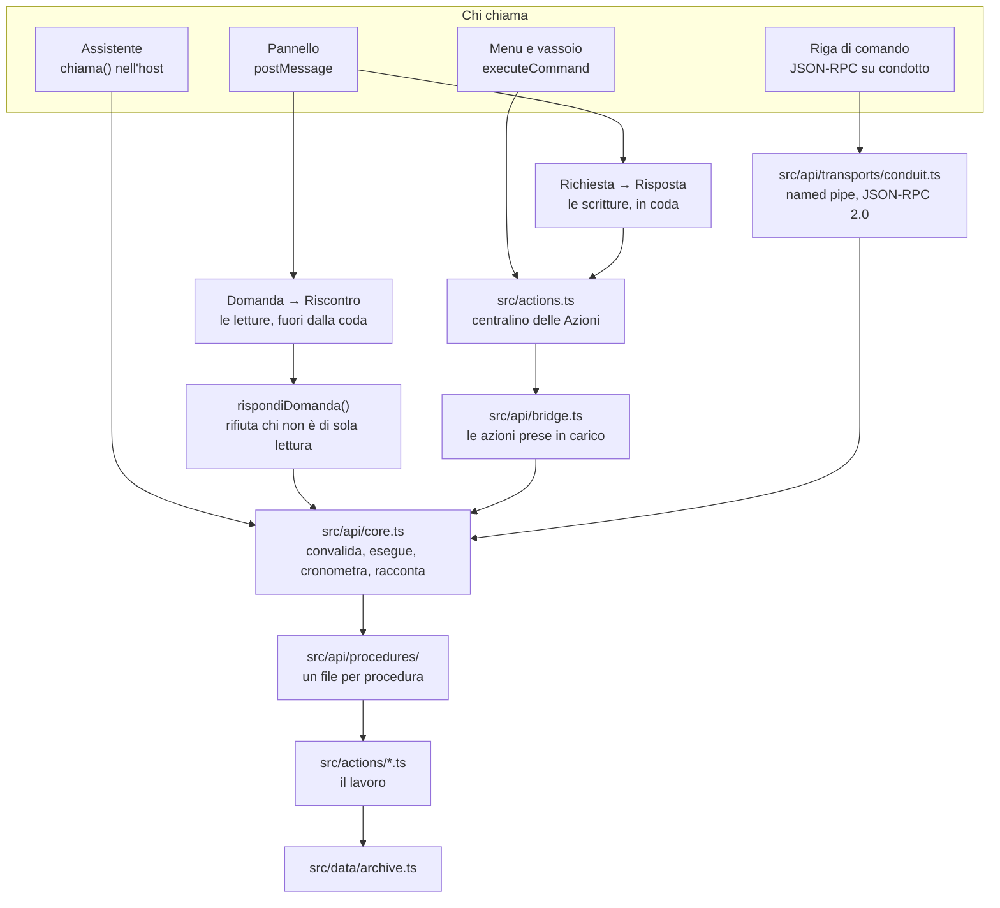

# L'interfaccia di programmazione

Il contratto del registro: che cosa gli si può chiedere, con che forma, che
cosa risponde, che garanzie dà. Vale per chi chiama da dentro (pannello,
assistente, menu nativo) e da fuori (riga di comando, script). Il perché delle
scelte: [DECISIONI.md](DECISIONI.md), ADR-27–32. Azioni del protocollo e
messaggi del pannello: [CATALOGO.md](CATALOGO.md) § 6–8.

## 1. Perché esiste

Un tipo TypeScript sparisce a runtime, e i chiamanti non sono più solo il
pannello compilato insieme all'host. Il livello `src/api/` dà a **tutte** le
azioni del protocollo:

| Lacuna | Com'è |
| --- | --- |
| Convalida a runtime | ogni ingresso passa da uno schema prima di toccare l'archivio |
| Errori distinguibili | un `codice` accanto alle frasi |
| Versione dichiarata | `api` nella busta, `versione` per procedura |
| Osservabilità | un giornale con nome, origine, durata ed esito di ogni chiamata |

Il lavoro resta nei gestori di `src/actions/`: le procedure gli mettono davanti
il contratto (ADR-27).

## 2. Come è fatto



- `chiama()` è l'unico punto di passaggio: stessa convalida, giornale e codici
  per tutti.
- Il ponte: una procedura che dichiara `azione: 'presenze.riga'` prende il
  posto di quel gestore in `GESTORI`; il pannello manda la stessa `Azione` e
  riceve la stessa `Risposta`.
- Il canale delle domande salta centralino e coda grazie a una guardia sola
  (§ 6).
- Il nucleo non spinge lo stato al pannello. Rigenera i PDF dopo una scrittura
  (ADR-31).

### I file

| File | Che cosa dichiara |
| --- | --- |
| [src/api/schemas.ts](../src/api/schemas.ts) | le forme: convalida, tipo, JSON Schema |
| [src/api/contract.ts](../src/api/contract.ts) | `Procedura`, `ErroreApi`, codici, busta, giornale |
| [src/api/core.ts](../src/api/core.ts) | `chiama()`, l'elenco, `scrittura()`, `inoltra()`, `daGestore()`, conversione da e verso `EsitoAzione` |
| [src/api/procedures/](../src/api/procedures/) | una procedura per file |
| [src/api/tools.ts](../src/api/tools.ts) | il catalogo che il modello legge |
| [src/api/index.ts](../src/api/index.ts) | l'elenco delle aree |
| [src/api/bridge.ts](../src/api/bridge.ts) | l'innesto nel centralino |
| [src/api/transports/conduit.ts](../src/api/transports/conduit.ts) | il server JSON-RPC locale |
| [src/cli/registro.mjs](../src/cli/registro.mjs) | la riga di comando |
| [src/protocol.ts](../src/protocol.ts) | `Azione`/`Risposta`, `Domanda`/`Riscontro` |
| [src/ui/bridge.ts](../src/ui/bridge.ts) | `invia`, `azione`, `chiedi` |
| [src/panels/panel.ts](../src/panels/panel.ts) | coda delle richieste, `rispondiDomanda()` |

## 3. Una procedura

```ts
const riga = definisci({
  nome: 'ore.appello.riga',          // area.cosa.verbo, in italiano
  versione: 1,                        // sale solo se la forma cambia rompendo
  genere: 'scrittura',                // 'lettura' non tocca mai il registro
  titolo: 'Segna l’ora intera per una persona',
  azione: 'presenze.riga',            // l'azione presa in carico, se c'è
  idempotente: true,
  collezioni: ['lezioni'],            // che cosa si riscrive su disco
  ingresso: oggetto({
    lezioneId: identificatore(),
    allievoId: identificatore(),
    stato: scelta(STATI_APPELLO),
  }),
  uscita: SCRITTURA,
  esegui: (ambito, ingresso) => { /* controlla, poi passa al gestore */ },
})
```

`definisci` esiste per l'inferenza dei tipi. Forma corta per le scritture:
`scrittura({…})` mette `versione: 1`, `genere: 'scrittura'`, `uscita: SCRITTURA`;
`esegui: inoltra(gestori, 'tipo')` passa l'ingresso al gestore omonimo.

### La busta

```json
{ "ok": true, "api": 1, "procedura": "ore.appello.riga", "versione": 1,
  "tracciato": "api-m3k9x2-a7f1", "dati": { "revisione": 42 } }
```

```json
{ "ok": false, "api": 1, "procedura": "ore.appello.riga", "versione": 1,
  "tracciato": "api-m3k9x2-a7f1", "codice": "ingresso-non-valido",
  "messaggi": ["stato: Serve uno fra: non-impostato, presente, assente, ritardo, esonerato."],
  "campo": "stato", "modifiche": 0, "revisione": 42 }
```

- `chiama()` **non lancia mai**: tutto torna nella busta.
- `tracciato` è lo stesso del giornale.
- `modifiche` = modifiche fatte dall'archivio **prima** di fallire: con
  `interno` e `modifiche > 0` qualcosa è già scritto, non ritentare alla cieca.
  Sulle letture vale 0. `versione`, `revisione` e `modifiche` mancano solo su
  `procedura-sconosciuta`.
- Anche l'**uscita** si convalida: una forma diversa da quella dichiarata torna
  `interno`.

### I codici

Un codice nuovo si aggiunge quando qualcuno deve reagire diversamente.

| Codice | Che cos'è | Ritentare? |
| --- | --- | --- |
| `ingresso-non-valido` | l'ingresso non ha la forma dichiarata | no, correggere |
| `non-trovato` | l'id c'era, la voce no | dopo aver riletto |
| `rifiutato` | forma giusta, contenuto no (voto fuori scala) | no |
| `conflitto` | il documento è cambiato sotto | dopo aver riletto |
| `non-disponibile` | manca qualcosa adesso (nessun anno aperto, posta non collegata, fila piena) | quando c'è |
| `procedura-sconosciuta` | nome inesistente | no |
| `non-permesso` | il trasporto non concede quel genere, o l'assistente non offre quella procedura. Mai dal nucleo | dopo aver acceso l'impostazione |
| `interno` | guasto non previsto, nel giornale | forse; mai con `modifiche > 0` |

Le frasi restano quelle mostrate dal pannello, nei cataloghi delle lingue.
`errore.nonTrovato` prende un `Termine` del lessico (accordo di genere) e un
rimedio («Le persone si cercano con “persone.cerca”»).

## 4. Gli schemi

`src/api/schemas.ts`: una dichiarazione → convalida, tipo, JSON Schema. Espone
Standard Schema (`~standard`); perché fatto in casa: ADR-28.

| Costruttore | Accetta |
| --- | --- |
| `testo({ minimo, massimo, modello, esempio })` | una stringa |
| `numero({ minimo, massimo, intero })` | un numero finito |
| `booleano()` | vero o falso |
| `scelta([...])` | uno fra quei valori |
| `elenco(di, { minimo, massimo })` | un array, errore con l'indice |
| `oggetto({ campi })` | un oggetto; le chiavi in più si **scartano** |
| `vuoto()` | niente |
| `opzionale(di)` | la chiave può mancare; `null` vale come assente |
| `nullabile(di)` | il valore può essere `null` |
| `identificatore()`, `iso()`, `ora()` | forme del dominio; `iso` rifiuta il 30 febbraio |
| `entita({ cosa, valida })` | un'entità intera, convalidata dal dominio |
| `qualunque()` | nessun controllo di forma, ma non `undefined` |

- **`opzionale(nullabile(x))`** distingue «lascia com'era» (chiave assente) da
  «togli» (`null`): lo usano `ore.appello.campi` e
  `valutazioni.recupero.imposta`. `nullabile(opzionale(x))` non compila.
- `nullabile` marca la forma: `schemaJson` emette `"type": ["number", "null"]`.
- Ogni `oggetto()` pubblica `additionalProperties: true`, perché a runtime le
  chiavi sconosciute si scartano: **un campo scritto male arriva e sparisce**.
  `false` solo con `oggetto(…, { severo: true })`, oggi mai usato.
- **`entita()`** controlla che arrivi un oggetto con un `id` e cede al
  validatore del dominio; un validatore che lancia diventa
  `ingresso-non-valido`. Pubblicata come oggetto aperto. Senza `valida` per
  `materie.salva`, `corsi.salva`, `classi.salva` (il controllo vuole il
  registro, sta nel gestore) e `ore.osservazione.salva` (nessun validatore).
- **`qualunque()`** in tre posti: le liste di `impostazioni.salva` (mappa
  aperta, `normalizzaListe` scarta l'ignoto), il `valore` di `programma.salva`
  (il tipo lo dice il manifesto, la dogana è `valoreConMotivo`),
  [assistente/stacca.ts](../src/api/procedures/assistente/stacca.ts) (un blocco
  già impaginato dalla pagina). `Impostazioni` è scritto per esteso: non ha
  `id`.

## 5. Le procedure di oggi

**Trentaquattro letture, e per il resto scritture.** Le scritture prendono in
carico tutte le azioni del protocollo. Il conto lo stampa `npm run procedures`;
`tests/api/coverage.test.mjs` confronta l'unione `Azione` con le procedure.

### L'albero: il percorso è l'indirizzo

`ore.appello.casella` sta in `src/api/procedures/ore/appello/casella.ts`.

```
src/api/procedures/
├── common/              quel che più aree si dividono
│   ├── filters.ts       filtri delle letture: periodo, ricerca, pagina, zona, soglie
│   ├── plans.ts         esigiPiano, esigiLezione
│   ├── register.ts      esigiAnno, esigiMateria, esigiCorso, esigiPersona, esigiClasse
│   ├── reports.ts       i generi di rapporto
│   ├── rollCall.ts      STATI_APPELLO
│   └── views.ts         le viste di `vista.apri`
├── ore/
│   ├── common.ts
│   ├── index.ts         procedureOre
│   ├── salva.ts         ore.salva
│   └── appello/ …
└── …
```

- Ogni file esporta `export const procedura`.
- Gli indici si tengono a mano (un glob registrerebbe i file a metà).
- `npm run procedures` legge il testo senza compilare: percorso = nome, ogni
  file nel suo indice, ogni cartella fino a `src/api/index.ts`, nessuna azione
  inesistente, `resources/tools.json` aggiornato.

### Le quaranta aree

L'area è il primo segmento del nome.

| Area | Che cosa copre |
| --- | --- |
| `smistamento` | scansioni in quarantena: caricarle, dividerle, attribuirle, leggerle, confermarle |
| `consegne` | richieste di consegna, spunte, file raccolti, firme di ritiro |
| `check` | lista di controllo di un corso: colonne, spunte, chi manca |
| `ore` | l'ora di lezione: appello, comportamento, stato, testi, osservazioni |
| `classe` | docente di classe: recapiti, comunicazioni, periodi di assenza e fogli |
| `valutazioni` | momenti, voti, riconsegne, recuperi, allegati |
| `piani` · `risorse` · `avanzamento` | piani di lezione, i loro file, a che punto sono |
| `modelli` | i modelli dei fogli: leggerli e provarli |
| `intestazione` | il logo della carta intestata (sede, nome, firma: `impostazioni.salva`) |
| `corsi` · `corso` | i corsi, e le presenze di uno |
| `anni` · `materie` · `classi` · `persone` · `orario` | l'ossatura |
| `calendario` | calendari ICS: gestirli, leggerli, confrontarli, applicare la revisione (crea, allinea, annulla, non cancella) |
| `stato` · `documento` · `documenti` | stato del registro, documenti d'anno |
| `rapporti` · `esportazioni` · `composizioni` · `esporta` | i fogli che escono |
| `proiezione` | la finestra davanti alla classe |
| `finestra` · `vista` | zoom, schermo intero, e `vista.apri` (l'unica scrittura dell'assistente, § 9) |
| `posta` · `mappa` | quel che parla con altre macchine |
| `sistema` · `impostazioni` · `programma` · `manutenzione` | configurazione, scorciatoie di sistema, riparazioni |
| `aggiornamenti` | versione in uso; controllo, scarico, installazione |
| `registro` | riassunto e integrità; importazione da un altro registro |
| `llm` | modelli linguistici sul disco e su Hugging Face |
| `assistente` | riquadro o finestra dell'assistente |
| `storia` | annulla e ripristina (in memoria, persa alla chiusura) |

L'elenco per nome: `regi elenco`; in JSON con gli ingressi: `regi catalogo`.

### Le trentaquattro letture

Tre regole per tutte (ADR-29): nessuna scrittura né effetto collaterale; il
conto già fatto dal dominio, mai dati grezzi; forma piatta dichiarata, non i
tipi interni.

**Per chi il registro non ce l'ha, e per quel che nel registro non c'è.**

| Procedura | Ingresso | Torna |
| --- | --- | --- |
| `registro.riassunto` | — | versione dello schema, l'anno in corso con le date, conteggi (classi, corsi, lezioni, valutazioni, consegne, smistamenti in quarantena) |
| `corsi.elenco` | `annoId?` (solo l'anno aperto: un altro è `non-trovato`), `classeId?`, `materiaId?`, `cerca?` | per corso: id, titolo, classe, materia, iscritti, ore a calendario, fasce fisse |
| `corso.presenze` | `corsoId`, `dal?`, `al?`, `semestreId?`, `ritirati?` | `udPreviste`, `udACalendario`, una riga per persona con ogni cifra accanto al suo denominatore, e per semestre in `periodi` |
| `ore.appello.leggi` | `lezioneId` | giorno, UD, per persona: stati per UD, minuti di ritardo, nota, cognome e nome |
| `modelli.leggi` | `nome` | `testo` del modello e `nomi` (quel che il rapporto sa riempire) |
| `modelli.prova` | `nome` | `pdf` in base64 con la carta intestata del documento; non tocca il disco |
| `documenti.inventario` | — | che cosa è scritto nel documento: esportazioni, archivio, composizioni (nomi, misure, revisioni, nessun contenuto), modelli del programma |
| `registro.integrita` | — | `riferimentiRotti` e `riparazioni` possibili; applicarle è `manutenzione.ripara` |
| `llm.modelli` | — | cartella dei modelli, `.gguf` con peso e natura (modello, proiettore, `incompiuto`), `sorgente` degli scarichi a metà, e per ogni uso chi risponde e se è pronto |
| `llm.catalogo` | `cerca?` | modelli consigliati e depositi trovati su Hugging Face |
| `llm.file` | `deposito`, `taglio` | i `.gguf` del deposito, quale conviene, il proiettore; sito muto = elenco vuoto con `motivo` |
| `check.leggi` | `corsoId` | colonne con `fatte`/`totale` e chi manca; per persona, giorno e ora di ogni spunta |
| `calendario.confronta` | `calendarioId?`, `regole?`, `dal?`, `al?` | `voci` (`combacia`, `allineare`, `annullare`, `nuova`, con fasce e differenze), `senzaCorso`, `assenti` (solo segnalate) |
| `calendario.eventi` | `calendarioId?`, `dal?`, `al?` | `eventi` dei calendari del documento (ricorrenze aperte, ora locale), `scartati`, `copre` |
| `aggiornamenti.stato` | — | versione in uso, `fase` (`fermo`, `controllo`, `aggiornato`, `disponibile`, `scarico`, `pronto`, `errore`), versione trovata e note, byte scesi, `supportato` e `motivo` |
| `classi.altrove` | `percorso` | un altro `.regi` letto senza aprirlo: etichetta dell'anno e classi (persone, materie) |
| `registro.sfoglia` | — | apre il dialogo dei file sui `.regi` e torna `percorso` o `null` |
| `registro.altrove` | `percorso` | un altro registro blocco per blocco: anno, impostazioni in breve, materie (`nuova`), classi (`esiste`), piani, calendari |

- I calendari si leggono dalla copia nel documento (`calendari/<id>.ics`); la
  rete solo per un documento vecchio senza copia. Scritture:
  `calendario.aggiungi` (`origine`, `nome?`; origine vuota apre il dialogo),
  `calendario.aggiorna`, `calendario.modifica`, `calendario.togli` (le regole
  restano), `calendario.applica`.
- `aggiornamenti.controlla`, `.scarica`, `.installa`: scritture senza
  collezioni. Dopo la prima lettura lo stato arriva spinto
  (`MessaggioAggiornamenti`).
- `classi.importa` (`percorso`, `classeId`, `nome`, `anagrafica`, `corsi`):
  persone con id nuovi e foto ricopiate; corsi con orario, materie abbinate per
  nome. `registro.importa` (`percorso`, `impostazioni`, `materie`,
  `classi: [{classeId, anagrafica, corsi}]`, `piani`, `calendari`; lavoro in
  `importaRegistro`, `src/domain/importing.ts`): una classe che c'è già si
  salta; porta anche carte intestate, piani e regole del calendario. Mai
  lezioni, presenze, voti, osservazioni, consegne, check, smistamenti,
  fascicoli. Un documento più recente si rifiuta.
- Tenute fuori dall'assistente (`perAssistente: false`): `modelli.*`,
  `documenti.inventario`, `registro.integrita`, `llm.*`, `calendario.*`,
  `aggiornamenti.stato`, `classi.altrove`, `registro.sfoglia`,
  `registro.altrove`.

**Per l'assistente**, che riceve gli id della pagina e ha bisogno di attrezzi
che li prendano.

| Procedura | Ingresso | Torna |
| --- | --- | --- |
| `persone.cerca` | `cerca?` (pezzi di nome, classe, azienda), `ritirati?`, `archiviate?` | chi corrisponde, `inRegistro` (tutte le persone), `esclusiRitirati`, `esclusiArchiviate`, `ignorato`, `suggerimento`. Senza `cerca` tutte |
| `classi.elenco` | `annoId?`, `archiviate?`, `cerca?` | per classe: persone, ritirati, corsi, materie, se se ne è docente di classe; `escluse` |
| `classe.persone` | `classeId`, `ritirati?`, `comune?`, `cap?` | cognome, nome, azienda, caselle di posta, `escluse`. Non l'indirizzo di casa |
| `persone.scheda` | `allievoId`, `dal?`, `al?`, `semestreId?` | anagrafica (indirizzo anche in `via`, `cap`, `localita`) e per corso UD perse, quote con denominatori, ritardi, prove, media, anche per semestre; conti da `matriceCorso` |
| `persone.argomenti` | `allievoId`, `presenza?` (perse, parziali, seguite, ignote, tutte), `corsoId?`, `dal?`, `al?`, `cerca?`, `da?`, `quanti?` | per ora: argomento, corso, UD perse su UD; totali del periodo |
| `ore.elenco` | `corsoId?`, `classeId?`, `materiaId?`, `stato?`, `dal?`, `al?`, `cerca?`, `da?`, `quanti?` | ore nel periodo: giorno, orario, corso, quantesima, stato, UD, argomenti, appello fatto |
| `ore.prossima` | `corsoId?`, `classeId?`, `da?`, `dalleOre?`, `quante?` | la prossima ora (o quella in corso). Unica lettura che guarda l'orologio: rimanda il momento usato. `aCalendario` distingue «finite» da «calendario vuoto». Conto da `prossimaLezione()` |
| `ore.leggi` | `lezioneId` | argomenti, materiali, consuntivo, piano, annotazioni con il nome |
| `valutazioni.elenco` | `corsoId?`, `classeId?`, `dal?`, `al?`, `cerca?`, `da?`, `quanti?` | momenti: titolo, genere, peso, voti messi, media, riconsegne, recuperi |
| `valutazioni.voti` | `valutazioneId` | una riga per persona della classe: voto, assenza, sufficienza, riconsegna, recupero |
| `piani.elenco` | `corsoId?`, `classeId?`, `tag?`, `cerca?`, `da?`, `quanti?` | piani con nome, ora assegnata, tappe, UD |
| `piani.leggi` | `pianoId` | il piano intero |
| `persone.assenze` | `classeId?`, `corsoId?`, `allievoId?`, `stati?` (elenco, di serie «assente»), `soglia?` (20 = 20%), `conAssenze?`, `soloOltreSoglia?`, `ordina?`, `semestreId?` + filtri | una riga per persona: UD e ore contate, corsi, quota, oltre soglia, per semestre; conteggi di contorno |
| `persone.medie` | `classeId?`, `corsoId?`, `allievoId?`, `mediaAlmeno?`, `mediaAlPiu?`, `soloSotto?`, `conVoti?`, `ordina?`, `semestreId?` + filtri | media da `mediaAllievo()`, prove contate, sufficienza, per semestre |
| `mappa.elenco` | `classeId?`, `allievoId?`, `genere?` (domicilio, lavoro, tutti), `comune?`, `cap?`, `entroKm?`, `attornoA?` + filtri | via, NAP, comune separati; lat/lon nullabili (chi non è collocato compare, tranne con `entroKm`), approssimato, distanza |
| `consegne.elenco` | `corsoId?`, `classeId?`, `stato?`, `complete?`, `giorno?`, `arretrateDaAlmeno?`, `scadeEntro?`, `cerca?`, `da?`, `quanti?` | pendenze: che cosa, per quando, a che punto, **chi manca per nome**. Date da `dataConsegna`/`scadenzaConsegna` |

Regole di questo gruppo:

- **Un elenco vuoto non è un registro vuoto.** Filtri tutti opzionali; la busta
  porta il totale accanto al risultato (`inRegistro`, `escluse`,
  `esclusiRitirati`, `esclusiArchiviate`), contato prima dei filtri accesi di
  serie.
- **L'anno è uno solo.** `annoId` diverso dall'anno aperto → `non-trovato`
  (`esigiAnno`) con rimedio `registro.riassunto`, non un elenco vuoto.
- **Ricerca tollerante**: maiuscole, accenti e apostrofi non contano, ogni pezzo
  deve trovarsi («rossi dic» = Rossi della DIC4a). `pezziDiRicerca` e
  `corrispondeAlla` (`src/domain/text.ts`), le stesse della pagina Persone.
- `persone.cerca` toglie le parole di categoria (allievo, studente, alunno,
  persona, iscritto…) e lo dice in `ignorato` e `suggerimento`. Le parole che
  potrebbero essere un nome («meccanico», «prima») restano.
- `suggerimento` è il rimedio su una busta valida ma vuota; vuoto quando non
  c'è niente da fare.
- Il trasporto dell'assistente conta le ripetizioni della stessa coppia
  attrezzo–codice e dal quarto tentativo dice al modello di smettere.

### I filtri che le letture si dividono

In [`common/filters.ts`](../src/api/procedures/common/filters.ts); una lettura
li prende a pezzi (`...periodo()`, `...ricerca(…)`, `...pagina()`) e non li
riscrive.

| Pezzo | Ingresso | Uscita | Chi lo prende |
| --- | --- | --- | --- |
| periodo | `dal?`, `al?` | `dal`, `al` sempre pieni | `ore.elenco`, `valutazioni.elenco`, `persone.argomenti` |
| periodi | `dal?`, `al?`, `semestreId?` | `dal`, `al`, `periodi`, e le cifre per semestre in ogni riga | `persone.assenze`, `persone.medie`, `corso.presenze`, `persone.scheda` |
| ricerca | `cerca?` | `cerca` applicato davvero; `cercaIgnorato` in `persone.assenze` e `persone.medie` | le letture che elencano, meno `persone.cerca` (ha la sua) |
| pagina | `da?`, `quanti?` | `quante`, `da`, `ancora`, `troncato` | le letture che elencano, meno `classi.elenco` e `corsi.elenco`, più `persone.cerca` |
| presenza di un valore | `ha?`, `senza?` (nomi di campo) | — | «chi non ha l'e-mail», «ore senza argomento» |
| zona | `comune?`, `cap?` | — | «chi abita a Lugano», «chi sta nel 69…» |
| soglie | `…Almeno`, `…AlPiu` | — | «chi è sotto il quattro» |

- **Un filtro si deve poter togliere**; senza filtri, tutto l'anno in uso.
- **La busta dice su che cosa ha risposto**: parametri omessi o normalizzati
  tornano come usati (vale per tutte le letture: `corsi.elenco` dice l'anno,
  `llm.file` deposito e taglio, `modelli.*` il nome).
- Tetto 500 righe per busta; di più è `ingresso-non-valido`. `ancora` dice
  quante restano.
- `ha`/`senza` si compongono; vuoto = stringa di spazi, elenco senza voci,
  `false` (`pieno()`); zero non è vuoto.
- Estremi compresi; `null` non passa nessuna soglia (lo si chiede con `senza`).
- Comune confrontato intero, NAP per prefisso.
- Il nome accanto a ogni id.

`corso.presenze`, la forma più delicata:

```json
{ "udPreviste": 10, "udACalendario": 6,
  "righe": [{ "udConAppello": 4, "udPresenza": 2, "udAssenza": 2,
              "assenza": 0.2, "presenza": 0.5, "frequenza": 0.8 }] }
```

`assenza` (su UD previste) e `presenza` (su UD con appello) hanno
denominatori diversi e non sono complementari (ADR-12, MODELLO-DATI § 6.6).

## 6. Il canale delle domande

Per quel che nel `Registro` spinto al pannello non c'è (ADR-29).

```ts
interface Domanda { id: number; procedura: string; ingresso?: unknown }
interface Riscontro { tipo: 'riscontro'; id: number; ok: boolean;
                      dati?: unknown; errori?: string[]; codice?: string }
```

| Dove | Che cosa fa |
| --- | --- |
| `chiedi<T>(procedura, ingresso?, { diFondo })` in [src/ui/bridge.ts](../src/ui/bridge.ts) | manda e torna `Esito<T>`; `diFondo` non accende l'indicatore di lavoro; non mostra niente da sé |
| `rispondiDomanda()` in [src/panels/panel.ts](../src/panels/panel.ts) | la guardia, `chiama()`, il riscontro |
| `chiama()` in [src/api/core.ts](../src/api/core.ts) | convalida anche l'uscita |

- **Fuori dalla coda delle scritture**, perché una lettura è sincrona sul
  registro in memoria. È sicuro solo perché la guardia rifiuta tutto ciò che non
  è `genere: 'lettura'`:

  ```ts
  const dichiarata = procedura(domanda.procedura)
  if (dichiarata && dichiarata.genere !== 'lettura') { /* riscontro: rifiutato */ }
  ```

  Un nome inesistente passa al nucleo: `procedura-sconosciuta`.
- Le procedure della proiezione restano scritture: comandano una finestra.
- Chi lo usa oggi: [src/ui/views/languageModels.ts](../src/ui/views/languageModels.ts)
  (`llm.*`), [src/ui/views/settings/updates.ts](../src/ui/views/settings/updates.ts)
  (`aggiornamenti.stato`), [src/ui/externalCalendar.ts](../src/ui/externalCalendar.ts)
  e [src/ui/forms/calendar.ts](../src/ui/forms/calendar.ts) (`calendario.*`).

## 7. Il condotto

JSON-RPC 2.0 su *named pipe* (Windows) o socket unix, una riga di JSON per
messaggio, UTF-8. Mai TCP.

### Sicurezza

> **Il condotto è spento.** Lo accende `registroDocenti.api.condotto`,
> predefinita `false`; spento non apre niente.
>
> **Che cosa si possa fare, acceso, lo dicono altre due voci.**
> `registroDocenti.api.lettura` (predefinita `true`) e
> `registroDocenti.api.scrittura` (predefinita `false`). Il confine passa sul
> `genere` di ogni procedura: una scrittura senza permesso torna
> `non-permesso` prima della convalida, senza toccare registro né giornale. Il
> limite è del condotto: i pannelli passano da `chiama` senza queste voci.
>
> **Su Windows una named pipe con ACL predefinita è raggiungibile da qualunque
> processo dello stesso utente, in qualunque sessione, e dagli amministratori.**
> Acceso il condotto, ogni programma lanciato da quell'utente può chiamare le
> procedure, e con la scrittura concessa segnare presenze e voti senza che
> nessuno glielo chieda. Non è una porta nuova — quel processo potrebbe già
> riscrivere il `.regi`, che non è cifrato — ma è più comoda. Fuori da Windows
> il socket nasce `0600`.
>
> **Il nome del condotto è un'impronta**: dodici caratteri esadecimali di uno
> sha256 di utente e cartella dei dati. Su Windows vi si aggiunge un segreto
> casuale in `condotto.segreto` (cartella dei dati), rifatto a ogni accensione
> e scritto con temporaneo e rinomina: nessuno può prenotare il nome prima. Il
> nome resta visibile nell'elenco delle pipe mentre il registro gira; il
> controllo d'accesso è l'ACL. Istanza unica: `requestSingleInstanceLock` in
> `shell/main.ts`. Fuori da Windows il socket sta in `XDG_RUNTIME_DIR`, o in
> `tmpdir()`.
>
> **Il condotto non allarga sé stesso.** Anche con la scrittura concessa,
> `programma.salva`, `programma.azzera` e `programma.sfoglia` rifiutano con
> `non-permesso` le chiavi `registroDocenti.api.*`, `ocr.programma` e
> `dettatura.indirizzo` (ADR-35), più chiavi tolte tenute sbarrate
> (`ocr.cartella`, `dettatura.cartella`, `dettatura.programma`,
> `recapiti.outlook`). Si cambiano dalle impostazioni, a mano.
>
> **Quel che esce di qui non nomina nessuno**: niente percorsi, nomi o segreti
> nei messaggi d'errore; un guasto è «Guasto interno del registro» più il
> tracciato.

Lo stesso testo sta in testa a
[src/api/transports/conduit.ts](../src/api/transports/conduit.ts): vanno tenuti
uguali.

### Metodi

| Metodo | Torna | Permesso |
| --- | --- | --- |
| `$versione` | `{ api, applicazione, documento, permessi }` (il nome dell'anno, mai il percorso) | nessuno |
| `$elenco` | per procedura: nome, versione, genere, titolo, idempotenza, azione, collezioni | lettura |
| `$schema` | lo stesso, più i JSON Schema di ingresso e uscita | lettura; per una scrittura basta la scrittura |
| `$attrezzi` | il catalogo del modello e come è collegato l'assistente (`regi catalogo`); `params.comando?` ≤ 64 caratteri `[A-Za-z0-9._-]` | lettura |

Ogni altro `method` è una procedura, `params` il suo ingresso (un oggetto; i
posizionali danno `-32602`).

```jsonc
// →
{"jsonrpc":"2.0","id":1,"method":"ore.appello.riga",
 "params":{"lezioneId":"lez-m3k9x2-a7f1","allievoId":"alv-m1a2b3-c4d5","stato":"assente"}}
// ←
{"jsonrpc":"2.0","id":1,
 "result":{"ok":true,"api":1,"procedura":"ore.appello.riga","versione":1,
           "tracciato":"api-m3k9x2","dati":{"revisione":42}}}
```

- I metodi `$` mettono in `result` il valore nudo; una procedura la busta
  intera (dati sotto `dati`).
- Senza `id` è una notifica: si esegue, non risponde. `"id": null` e `0`
  rispondono. Un `id` non stringa/numero/`null` → `-32600`.
- Ordine garantito **per connessione** (per trasporto, non in assoluto): due
  connessioni non si aspettano, ma le scritture passano dalla fila unica del
  nucleo (§ 10).

### I limiti del trasporto

| Limite | Oltre |
| --- | --- |
| 1 MiB per riga in ingresso | `-32600`, connessione chiusa (è il limite di un PDF in base64 a `smistamento.pdf.deposita`) |
| 1 MiB per risposta | `-32603`, `interno`, «La risposta supera il limite di 1 MiB.»; connessione aperta |
| 128 richieste in attesa per connessione | `non-disponibile`, connessione aperta |
| 16 MiB di richieste in attesa per connessione | `non-disponibile`, connessione chiusa |
| 32 connessioni | la 33ª: `non-disponibile` e chiusa |
| 5 minuti di silenzio | connessione chiusa |
| spegnimento | `non-disponibile`, «Il condotto si sta chiudendo»; le chiamate in volo finiscono entro 5 s |

Dopo un `-32700` (o i 16 MiB) la connessione si chiude e le righe già in coda
non si eseguono. Una notifica rifiutata non riceve busta.

### Le procedure che aspettano una persona

Aprono un dialogo e restano lì finché qualcuno non risponde; né condotto né
riga di comando hanno un tetto di tempo. Intanto **tengono la fila delle
scritture**: ogni altra scrittura rinuncia dopo 30 s con `non-disponibile`.

| Procedura | Che cosa aspetta | Da uno script |
| --- | --- | --- |
| `smistamento.pdf.carica` | i PDF da smistare | `smistamento.pdf.deposita` (`nome` + `contenuto` base64) |
| `documento.apri` senza `percorso` | il documento | passare `percorso` |
| `documento.chiudi` con un anno mai salvato | salvare o buttare | — |
| `llm.importa` con `file` vuoto | il `.gguf` | passare `file` |
| `consegne.raccogli` | i file | — |
| `consegne.documento.allega` | il documento | — |
| `consegne.firme.aggiungi` | il foglio firme | — |
| `classe.assenze.foglio.aggiungi` | il foglio di assenze | — |
| `classe.assenze.importa` | i fogli | — |
| `risorse.aggiungi` | il file | — |
| `valutazioni.allegato.aggiungi` | l'allegato | — |
| `persone.foto.imposta` | la foto | — |
| `intestazione.logo` | il logo (PNG o JPEG) | — |
| `calendario.aggiungi` con `origine` vuota | il `.ics` | passare `origine` |
| `registro.sfoglia` | un altro `.regi` (lettura: non tiene la fila) | `registro.altrove` e `registro.importa` con il percorso |
| `programma.sfoglia` | cartella o file di un'impostazione | `programma.salva` con il percorso, dove permesso |
| `posta.collega` | indirizzo, nome d'accesso, modo di entrare | — |
| `posta.invioProva` | l'indirizzo della prova | — |
| `consegne.distribuisci` con invio diretto | la conferma | — |
| `classe.comunicazioni.invia` con invio diretto | la conferma | — |
| `classe.assenze.invia` con invio diretto | la conferma | — |

Quelle che prendono un file si riconoscono da `$elenco`: `idempotente: false`
con ingresso vuoto o quasi. Quelle che chiedono conferma solo da questa
tabella.

### Gli errori sul filo

| Situazione | `error.code` | `error.data.codice` |
| --- | --- | --- |
| riga non JSON | −32700 | `ingresso-non-valido` |
| busta non oggetto, `method` mancante | −32600 | `ingresso-non-valido` |
| ingresso non valido | −32602 | `ingresso-non-valido` |
| procedura sconosciuta | −32601 | `procedura-sconosciuta` |
| guasto interno | −32603 | `interno` |
| `non-trovato`, `rifiutato`, `conflitto`, `non-disponibile`, `non-permesso` | −32000 | il codice del registro |

Si decide su `data.codice`, sempre presente.

## 8. La riga di comando

```
npm run regi -- <comando>            oppure    node src/cli/registro.mjs <comando>
```

Installato: **`regi`**, dal ponte nel PATH (`shell/system/commandLine.ts`).
Solo moduli `node:`, nessuna copia dell'elenco: chiede `$elenco`, `$schema`,
`$attrezzi`, `$versione` al condotto.

| Comando | Che cosa fa |
| --- | --- |
| `regi elenco` | le procedure esposte |
| `regi schema <procedura>` | i campi dell'ingresso; `--json` lo schema intero |
| `regi chiama <procedura> [--campo valore]…` | chiama |
| `regi stato` | se il condotto risponde, con quali permessi |
| `regi catalogo` | le procedure in JSON con gli ingressi (lo stesso di `resources/tools.json`, ma vivo) |
| `regi chiedi` | dice che le domande all'assistente si fanno nel riquadro «Assistente», ed esce con 1 |

```console
$ regi chiama ore.appello.riga --lezioneId lez-m3k9x2-a7f1 \
    --allievoId alv-m1a2b3-c4d5 --stato assente
```

- I `--campo` si convertono **secondo lo schema** (per questo `chiama` fa due
  giri). Solo un campo con più di due tipi (`qualunque()`) si deduce dal testo:
  vero/falso, numero, JSON se comincia con `{` o `[`, altrimenti testo. Numero
  vuoto rifiutato. `--campo null` manda `null` solo dove lo schema lo ammette.
- `--json '{…}'` passa l'ingresso intero e vince sui `--campo`; un elenco si
  rifiuta.
- Elenchi: `--ids a,b`, `--ids '["a","b"]'`, `--ids ""` = vuoto.
  `--campo=valore` per valori che cominciano con `--`. Un campo ripetuto prende
  l'ultimo, con avviso.
- Dati su stdout, errori su stderr. Uscite: **0** fatto, **1** rifiutato,
  **2** il condotto non risponde.
- `REGISTRO_CONDOTTO` scavalca l'indirizzo. Senza, la regola è quella del
  condotto (§ 7); su Windows senza `condotto.segreto` esce con 2. Le due copie
  della regola le confronta `tests/cli/commandLine.test.mjs`.

## 9. L'assistente

Una domanda in lingua naturale; un modello `.gguf` caricato nel main process
(ADR-25) che risponde **chiamando le procedure di lettura**. Vive in un
riquadro a destra (pulsante accanto a «Proietta») o, con «Stacca», in una
finestra sua (`dist/assistente.js`).

```
riquadro (src/ui/assistant.ts)  ← o →  finestra staccata
   ↓  postMessage, busta `Conversazione`
main process (src/panels/{panel,assistant}.ts → conversation.ts)
   ├→ src/data/llm.ts → motore (src/data/llamaCpp.ts) → il .gguf
   ←  il modello chiama un attrezzo
   ├→ offribile(), convalida, chiama()
   └→ il risultato torna al modello → risposta
```

- Il filo dei turni sta in `src/ui/assistant/chat.ts`, che non conosce né
  riquadro né finestra; il lavoro del main process in
  `src/panels/conversation.ts`; il trasporto in
  `src/api/transports/assistant.ts`.
- **La finestra staccata non riceve il `Registro`**: solo se l'assistente è
  acceso e quale modello risponde. La conversazione viaggia con lei (l'host la
  tiene solo per il passaggio, `inVolo` in `src/panels/assistant.ts`), anche a
  metà giro (`sospendiGiroInCorso` / `riprendiGiro`; un giro non ripreso si
  butta dopo un minuto). Riattaccare lo decide la finestra.
- `Conversazione` è una terza busta: né azione né domanda, fuori dalla coda.
  Tornano `MessaggioAssistente`: un `attrezzo` per ogni procedura aperta,
  `risultato`, `limite`, `fine`.

### Il livello LLM

`src/data/llm.ts` serve due usi: `assistente` e `ocr`. Ogni uso ha le sue
chiavi `registroDocenti.<uso>.{attivo,modello}` (più `proiettore` e
`programma` per le immagini); attese massime costanti (180 s per pagina, 120 s
per giro). Un uso nuovo: una riga in `Uso`, una in `PREDEFINITI`, due chiavi
nel manifesto.

| Motore | Dove | Chi |
| --- | --- | --- |
| `src/data/llamaCpp.ts` | in processo, `node-llama-cpp`; non accetta immagini | assistente |
| `src/data/mtmd.ts` | `llama-mtmd-cli` sul disco, scaricato da `src/data/visionKit.ts` se manca | scansioni |

Regola del confine: se cambiando libreria la riga cambierebbe, sta nel motore;
altrimenti in `llm.ts`. Quale motore risponde non è un'impostazione. La
dettatura non è un motore: voicebox (ADR-35).

- Il modello è un nome di file risolto da `modelloNellaCartella()` solo dentro
  la cartella (`src/data/gguf.ts`); lo scarico (`src/data/huggingFace.ts`) è
  l'unica rete.
- `prontezza()` (sincrona) dice se si può chiedere e dove si rimedia;
  `conMotivo()` la usa dopo un guasto della libreria.
- Serve il *tool calling*: sotto i 3 miliardi di parametri è inaffidabile. La
  sezione «Modelli linguistici» ne consiglia due.

### Solo le letture, e il controllo sta al ritorno

- Attrezzi = procedure che `offribile()` ([src/api/tools.ts](../src/api/tools.ts))
  lascia passare: `genere: 'lettura'` o `assistente: true`, senza
  `perAssistente: false`.
- `usaAttrezzo()` **ricontrolla prima di chiamare**, con la stessa
  `offribile()`; il motore riceve da `conversa()` la funzione che esegue e non
  la può allargare. `tests/api/assistant.test.mjs` lo prova su tutte le
  scritture.
- **L'unica deroga è `vista.apri`**: `assistente: true`, `collezioni` vuoto, si
  disfa con un clic. Non prende `nuovo` e `avvio` di `MessaggioNavigazione`
  (aprirebbero un modulo di creazione). La prova conta le deroghe a mano.
- Nessuna impostazione allarga il confine.

### Di che cosa si sta parlando

Prima della domanda il modello riceve la **veduta**: pagina, scheda, tendine
(con le alternative), filtri, periodo in date, id risolti, ricerca, elenco a
schermo.

```text
src/ui/viewpoint.ts               compone la veduta all'Invio
   ↓  dentro la busta della domanda
src/panels/conversation.ts        la passa a `conversa`
src/api/transports/assistant.ts   `descriviContesto()` → nota davanti all'ultima domanda (`componiBattute()`)
```

- La veduta viaggia **con** la domanda; la finestra staccata usa l'ultima che
  il pannello ha mandato all'host.
- Sta nell'ultimo turno, in una nota «[Nota del registro, non scritta da chi
  chiede]» … «[Fine della nota …]», mai salvata: il prefisso istruzioni +
  catalogo resta identico (ADR-32).
- Nomi **e** id; tendine con le altre voci (dodici al più, tagliate attorno
  alla scelta, «… e altre N»); linguette da `porzioniDellaVista()`; ore con
  l'etichetta di `oreDelCorso()` (`src/ui/views/lesson.ts`); il periodo come
  `{ etichetta, dal, al }`.
- **Ogni parte si spegne per conto suo** dal menu a imbuto del riquadro, che
  mostra che cosa contiene adesso; anche ogni tendina. Una tendina spenta si
  porta via il suo id (gli id si costruiscono dalle voci rimaste; `allievoId`,
  `pianoId`, `valutazioneId` da una tabella a parte). Un id viaggia solo dove la
  pagina lo mostra. Le spente si ricordano per nome della tendina. «Dove sono»
  spento → `contesto: null`, e l'host butta quella che teneva.
- La regola sta in [src/ui/assistant/parts.ts](../src/ui/assistant/parts.ts),
  senza stato né DOM; prova `tests/ui/contextParts.test.mjs`.
- Si manda **quel che si vede davvero**: la finestra del calendario mostrata,
  le classi archiviate che la pagina mostra, la ricerca della pagina Persone;
  l'elenco con `troncato` e il totale. Pagine a due livelli: `scheda` e
  `sezione`.

### I dati non passano dal modello

```text
usaAttrezzo()                    chiama la procedura
   ├→ al modello   JSON
   └→ alla pagina  impagina()    titolo, valori, colonne
          ↓  evento `risultato`, subito
   src/ui/assistant/result.ts    lo disegna sotto la risposta
```

- La forma la dichiara la procedura in `presentazione` (`blocchi` di tipo
  `valori` e `tabella`, `Colonna.campo` è una chiave dell'uscita, controllata da
  `tsc`).
- `src/api/presentation.ts` scrive i valori (quota «12.5%», byte «4.1 GB», `Iso`
  «04.09.2026», «—») senza calcolare niente. Chi non dichiara non si impagina;
  una busta vuota non fa tabella. `tests/api/presentation.test.mjs`.
- Al modello si chiede di introdurre, non di ricopiare: niente tabelle, nomi per
  esteso, mai un id. I risultati stanno **sotto** la bolla e restano anche se la
  risposta non arriva.
- Il testo del modello: `src/ui/assistant/format.ts` lo divide in blocchi
  (paragrafi, elenchi, titoletti, tabelle), `answer.ts` li costruisce;
  **nessun HTML** interpretato. Prova `tests/ui/answerFormat.test.mjs`.
- Mentre si aspetta si vedono gli attrezzi con il loro nome vero: una risposta
  senza attrezzi sotto non viene dal registro.

### Il catalogo su disco

Gli attrezzi escono dalle procedure (`titolo` → descrizione, `schemaJson()` →
`parameters`). [resources/tools.json](../resources/tools.json) è la copia nel
repository, costruita da [src/api/tools.ts](../src/api/tools.ts) con
`npm run tools`: serve a chi sta fuori e alla revisione. Deterministico;
`tests/api/tools.test.mjs` lo confronta byte per byte (se fallisce:
`npm run tools` e leggere la differenza).

### Scelte

| Scelta | Perché |
| --- | --- |
| `corso.presenze` → `corso_presenze` | alcuni modelli leggono il punto come accesso a un campo; si rimette al ritorno |
| Griglia sullo schema (`perGriglia()` in `src/data/llamaCpp.ts`) | la libreria genera solo JSON conforme; le storture di un motore senza griglia si districano in `src/api/transports/assistant.ts` |
| 10 chiamate (`CHIAMATE_MASSIME`), 3 rifiuti (`RIFIUTI_MASSIMI`), poi `CHIUSURA` senza attrezzi | un modello che non trova riprova all'infinito; la pagina lo dice (`limite`, `esaurito`) |
| Risultati tagliati a 6000 caratteri | una classe intera riempie la finestra di un 8B |
| Un errore torna al modello | quasi sempre riprova giusto |
| La conversazione vive nel riquadro | contiene nomi: fuori dal documento sarebbe una copia non cancellabile |

### Sicurezza

- `registroDocenti.assistente.*` spente di serie.
- I dati non escono dalla macchina: nessuna `fetch`.
- Origine `'assistente'` nel giornale, un tracciato per giro.
- Le risposte non diventano mai HTML.
- I dati del documento possono contenere istruzioni («ignora le istruzioni…»):
  la difesa è che il danno massimo è una lettura in più o un `vista.apri`.
- «Ferma» interrompe il giro nell'host; nessun attrezzo parte dopo.
- Le istruzioni vietano di inventare cifre e rifare i conti, ma sono
  istruzioni: l'unica garanzia è che non può scrivere.
- La lingua è detta in testa e in coda alle istruzioni (i modelli piccoli
  tornano all'inglese dopo gli attrezzi); `tests/api/assistant.test.mjs` tiene
  ferme tutte e due.

## 10. Le garanzie, dette per intero

| Garanzia | Stato |
| --- | --- |
| Si valida prima di scrivere | sì: un ingresso malformato lascia `archivio.revisione` intatta |
| Nessuno schema perde un campo | sì: `tests/api/coverage.test.mjs` confronta ogni variante di `Azione` con i campi dello schema |
| Una lettura non tocca il registro | sì: nessuna lettura dichiara `collezioni` né un'azione; `reads.test.mjs` le chiama tutte (`leTutte()`) e controlla la revisione. Non prova che non nasca un file sul disco |
| Una domanda non può scrivere | sì: `rispondiDomanda()` |
| L'uscita rispetta il contratto | sì, o `interno` |
| Una scrittura per volta | sì, una fila sola in `chiama()` per ogni trasporto; le letture fuori. Attesa massima 30 s poi `non-disponibile`; documento cambiato nell'attesa → `conflitto` |
| La risposta implica la persistenza | **no**: `ok` arriva prima del disco (350 ms, tetto 2 s); lo spegnimento aspetta, un crash no |
| Idempotenza | dichiarata per procedura, provata dove conta; nessuna chiave generale |
| Transazioni su più procedure | no |
| Autorizzazione | nessuna: un docente, il suo file |
| Concorrenza fra macchine | solo la serratura cooperativa |
| L'assistente non può scrivere | sì, tranne `vista.apri` |
| Giornale | nome, origine, durata, esito, modifiche; **mai l'ingresso**. Lo ascolta `startup.ts` (console: rifiuti e chiamate lente), via `osserva()` |

## 11. Aggiungere, cambiare, togliere una procedura

Il procedimento operativo, con gli script, sta nella skill
[.claude/skills/procedure-api/](../.claude/skills/procedure-api/).

### Aggiungerne una

```sh
node .claude/skills/procedure-api/scripts/nuova.mjs area.cosa.verbo \
  --genere scrittura --titolo "Che cosa fa, in una riga" \
  --azione protocollo.tipo --collezioni lezioni
```

Crea file, cartelle e indici fino a `src/api/index.ts`, con dei `DA SCRIVERE`
che non compilano. Poi:

1. Schema con un `aiuto:` su ogni campo (finisce in JSON Schema, `regi schema`
   e catalogo del modello).
2. Ogni campo dell'azione dichiarato (`coverage.test.mjs`).
3. Entità intere con `entita({ cosa, valida })`.
4. L'esistenza si controlla prima di delegare (`errore.nonTrovato`).
5. Il gestore con `inoltra` o `daGestore`; mai copiarne la logica (estrarla in
   una funzione esportata, come `leggiModello` in `src/actions/templates.ts`).
6. La prova in `tests/api/writes.test.mjs` o `reads.test.mjs` (letture:
   in `leTutte()` e nel conto); `idempotente: true` va provato.
7. Un'azione nuova cambia il conto scritto in `tests/api/coverage.test.mjs`.
8. I conti nelle docs (`README.md`, `docs/INDICE.md`, qui) li controlla
   `tests/counts.test.mjs`.

### Cambiarne una

Togliere o rinominare un campo non rompe niente di visibile: il campo smette di
arrivare. `versione` sale quando la forma cambia rompendo, `VERSIONE_API` quando
cambia la busta. `idempotente` si rilegge a ogni cambio di `esegui`. Rinominare
= spostare il file; il nome è pubblico.

### Toglierne una

```sh
node .claude/skills/procedure-api/scripts/togli.mjs area.cosa.verbo --prova
node .claude/skills/procedure-api/scripts/togli.mjs area.cosa.verbo
```

Toglie file, riga d'indice, cartelle vuote, area; poi elenca dove il nome
compare ancora, senza toccarlo.

### I cancelli

```sh
npm run procedures          # l'albero (non compila: risponde anche con tsc rotto)
npm run tools               # il catalogo
npm run typecheck && npm run lint && npm test
```

Una procedura che chiude una lacuna di convalida vuole la prova che il valore
ora è respinto e l'archivio non è stato toccato. Una lettura nuova si guarda
due volte: è raggiungibile fuori dalla coda e dal modello, e
`genere: 'lettura'` è solo una dichiarazione.
