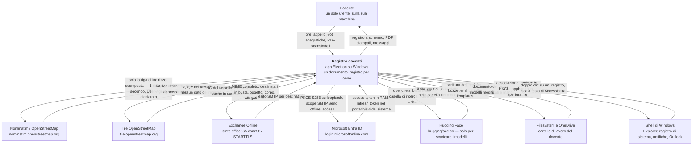
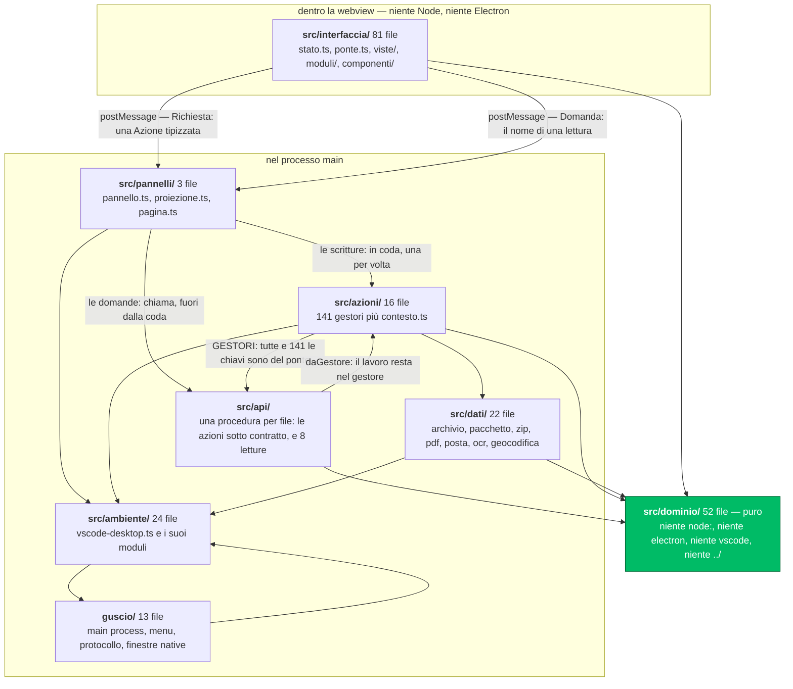
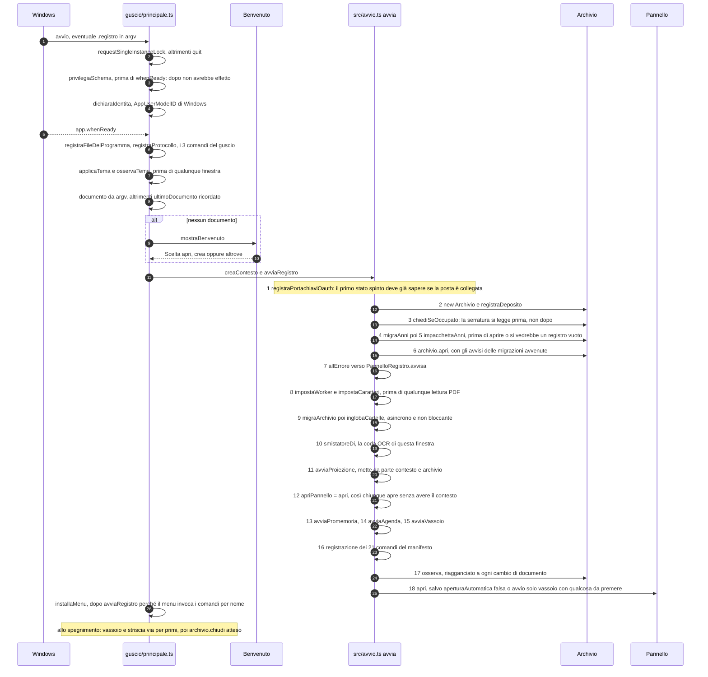
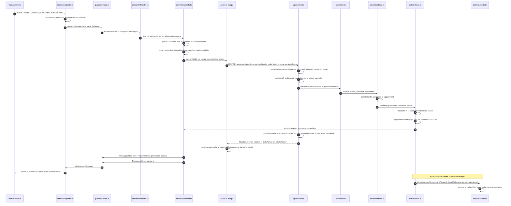
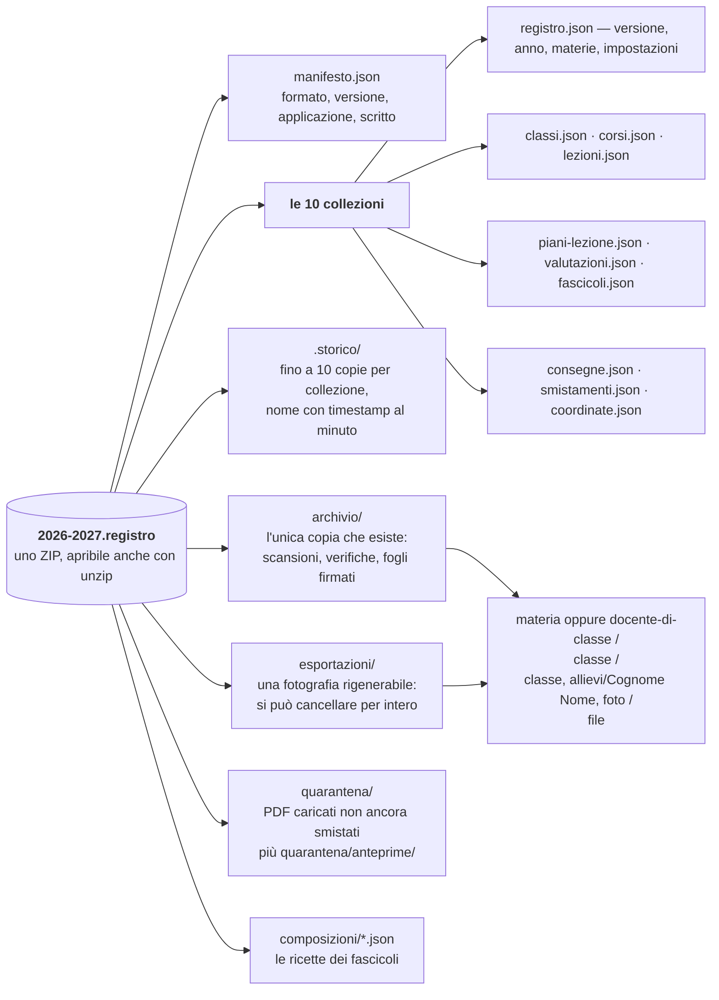

# Architettura del Registro docenti

Documento di riferimento per chi sviluppa sul progetto — persone e agenti.
Dice *perché* le cose stanno dove stanno; il *come si usa* è nel
[README](../README.md) e nella guida in-app, il *cosa manca* non è più nel
repository (vedi § 11).

---

## 1. In una pagina

Il Registro docenti è un'applicazione Electron desktop, scritta in TypeScript
con nomi e commenti in italiano, che tiene il registro di un insegnante: ore,
appello, piani di lezione, valutazioni, consegne, documenti di classe, rapporti
in PDF. Gira su Windows, per una persona sola, sul suo computer.

Tre vincoli tengono insieme tutto il resto.

**Un documento `.registro` per anno scolastico.** Non c'è un database, non c'è
un server: un anno è un file — uno ZIP scritto a mano con dentro dieci JSON e
tutti i documenti caricati e stampati. Il file si copia su una chiavetta, si
apre con `unzip` se l'applicazione non parte, si sincronizza con OneDrive.
Ne consegue quasi ogni scelta di persistenza: nessuna transazione, uno
storico dentro il file stesso, una serratura solo informativa perché su una
cartella sincronizzata un lock vero non esiste.

**Single-user, locale.** Nessuna autenticazione, nessun ruolo, nessun
permesso: chi apre il file vede tutto. Il perimetro di sicurezza *è* il file.
Non è una dimenticanza, è il modello — e va tenuto presente prima di
immaginare una seconda superficie.

**Il dominio è puro.** `src/dominio/` non importa `node:*`, non importa
`electron`, non importa `vscode`, non risale con `../`. È una regola vera,
imposta da `no-restricted-imports` in [eslint.config.mjs](../eslint.config.mjs)
(§ 4), ed è la ragione per cui 54 file di prove del dominio girano in due
secondi senza aprire una finestra.

A questi se ne aggiunge un quarto, meno evidente e più pervasivo: **il codice
sotto `src/` è scritto come un'estensione VS Code e gira su uno shim**
([src/ambiente/vscode-desktop.ts](../src/ambiente/vscode-desktop.ts)). Vedi § 5.

### I numeri

| Perimetro | File | Righe | Export |
|---|---:|---:|---:|
| `src/dominio/` — regole della scuola, pure | 52 | 23 175 | 780 |
| `src/interfaccia/` — il pannello, DOM senza framework | 81 | 39 312 | 404 |
| `src/dati/` — file, ZIP, PDF, posta, OCR, geocodifica | 22 | 11 734 | 155 |
| `src/api/` — il contratto davanti ai gestori | 17 | 6 916 | 72 |
| `src/ambiente/` — lo shim `vscode` su Electron | 24 | 5 025 | 144 |
| `src/azioni/` — i gestori dei comandi | 16 | 5 706 | 42 |
| `src/pannelli/` — le finestre webview dell'app | 3 | 752 | 11 |
| `src/` file diretti — protocollo, manifesto, avvio, widget | 7 | 3 320 | 39 |
| `guscio/` — main process Electron, pagine native | 13 | 4 137 | 15 |
| `prove/` — 86 file `*.test.mjs` più gli aiuti | 95 | 22 711 | — |
| `strumenti/` — script di analisi e build | 10 | 1 532 | — |
| `templates/` — modelli di stampa di serie | 13 | 645 | — |

In totale **1662 export su 230 file** `.ts`. Il conteggio degli export non è un
vezzo: `npm run censimento` lo usa per trovare quelli che nessuno consuma.

Lo strato `src/api/` è il più recente, e va letto sapendo che cosa *non* è: non
è una riscrittura dei gestori. Le procedure **prendono in carico una per una
tutte le azioni del protocollo** — il contratto davanti, il
lavoro nel gestore di sempre — e 8 sono letture, che azione non hanno perché non
scrivono. Vedi § 4 e ADR-27.

Le prove sono **oltre 1380** — 1382 in 312 suite quando questa riga è stata
scritta, e `npm test` dice sempre il numero vero. Erano 1337 prima del livello
API.

---

## 2. Vista di contesto — C4 livello 1

Chi parla con chi, e che cosa passa davvero. Tutto quel che esce dalla
macchina esce da qui: la tabella onesta delle uscite è al § 8.



Due cose da notare subito. La prima: **il pannello non parla mai con la rete**
— la sua CSP è `default-src 'none'` e ogni freccia che esce dal riquadro parte
dal processo main. La seconda: l'OCR è una freccia verso `127.0.0.1`, cioè non
esce affatto; è una scelta esplicita perché le pagine scansionate contengono
nomi di minorenni.

---

## 3. Vista dei contenitori — C4 livello 2

Un solo processo Electron main, sette finestre, un documento, una cartella
`userData`. I canali sono tre e si contano sulle dita: un IPC asincrono
multiplexato, un IPC sincrono per lo stato locale delle pagine, e un protocollo
custom `registro://` con quattro autorità.

Sul primo viaggiano due buste diverse in salita, e la differenza non è di forma:
le **scritture** (`Richiesta`, con dentro un'`Azione`) entrano in una coda
seriale, le **domande** (`Domanda`, con dentro il nome di una procedura di sola
lettura) no.

```mermaid
flowchart TB
  subgraph main["Processo main Electron — uno solo"]
    guscio["<b>guscio/</b><br/>principale.ts, menu.ts, lettore.ts,<br/>benvenuto.ts, protocolloFile.ts, tasselli.ts<br/>l'unico che sa di Electron, con src/ambiente/"]
    app["<b>src/</b> — avvio.ts, azioni.ts, azioni/,<br/>dati/, dominio/, pannelli/<br/>crede di essere un'estensione VS Code"]
    ambiente["<b>src/ambiente/</b><br/>shim vscode verso Electron"]
    guscio --- app
    app --- ambiente
    ambiente --- guscio
  end

  pannello["<b>Pannello</b> — la finestra del registro<br/>dist/pannello.js — CSP default-src 'none'"]
  proiezione["<b>Proiezione</b> — schermo per la classe<br/>dist/proiezione.js — sola lettura"]
  assistente["<b>Assistente</b> — staccato dal riquadro<br/>dist/assistente.js — niente Registro"]
  benvenuto["<b>Benvenuto</b><br/>dist/benvenuto.html"]
  impostazioni["<b>Impostazioni</b><br/>dist/impostazioni.html"]
  lettore["<b>Lettore PDF</b><br/>lettore di Chromium — nessun preload"]
  agenda["<b>Agenda</b> — striscia sul desktop<br/>dist/agenda.html"]
  dialogo["<b>Dialogo</b> — input ed elenco<br/>dist/dialogo.html — parametri in query string"]

  documento[("<b>anno.registro</b><br/>ZIP: 10 JSON, .storico/, archivio/,<br/>esportazioni/, quarantena/, composizioni/")]
  userdata[("<b>userData</b><br/>impostazioni.json, segreti.json,<br/>finestre.json, documenti.json,<br/>interfaccia/, materializzati/, tasselli/")]

  main <-->|"registro:messaggio — Richiesta/Risposta: le scritture, in coda"| pannello
  main <-->|"registro:messaggio — Domanda/Riscontro: le letture, fuori dalla coda"| pannello
  main <-->|"registro:messaggio"| proiezione
  main <-->|"registro:messaggio, discriminante benvenuto"| benvenuto
  main <-->|"registro:messaggio, discriminante impostazioni"| impostazioni
  main <-->|"registro:messaggio, discriminante agenda"| agenda
  main <-->|"registro:messaggio, discriminante dialogo"| dialogo

  pannello -->|"registro:interfaccia — sendSync, leggi e scrivi lo stato UI"| main
  proiezione -->|"registro:interfaccia"| main

  main -->|"registro://pagina/id — HTML in memoria"| pannello
  main -->|"registro://app/dist/... — bundle e pagine native"| benvenuto
  main -->|"registro://dati/... — file del documento, materializzati"| pannello
  main -->|"registro://mappa/z/x/y.png — tasselli in cache"| pannello
  main -->|"percorso di un PDF materializzato"| lettore

  main <-->|"lettura e scrittura per collezione, write-behind"| documento
  main <-->|"impostazioni macchina, segreti, posizioni finestre"| userdata
```



### Le sette finestre

| Finestra | Nasce in | preload | sandbox | Canale | Perché è a sé |
|---|---|---|---|---|---|
| Pannello | [src/pannelli/pannello.ts](../src/pannelli/pannello.ts) via `createWebviewPanel` | sì | false | `registro:messaggio` più `registro:interfaccia` | è l'applicazione |
| Proiezione | [src/pannelli/proiezione.ts](../src/pannelli/proiezione.ts) | sì | false | idem | bundle separato: alla classe non servono le viste del registro |
| Benvenuto | [guscio/benvenuto.ts](../guscio/benvenuto.ts) | sì | false | `registro:messaggio` | elenco di anni noti al posto di un dialogo a tre pulsanti |
| Impostazioni | [guscio/menu.ts](../guscio/menu.ts) | sì | false | `registro:messaggio` | serve anche quando non c'è un anno aperto, cioè senza pannello |
| Lettore PDF | [guscio/lettore.ts](../guscio/lettore.ts) | **no** | **true** | nessuno | è muta: `plugins:true` accende il lettore di Chromium e basta |
| Agenda | [src/ambiente/agenda.ts](../src/ambiente/agenda.ts) | sì | false | `registro:messaggio` | `frame:false`, si ancora alla shell come vera appbar |
| Dialogo | [src/ambiente/dialoghi.ts](../src/ambiente/dialoghi.ts) | sì | false | `registro:messaggio` | riceve i parametri nella query string: ha i suoi dati al primo render |

Tutte, tranne il lettore, condividono lo stesso preload
([guscio/preload.ts](../guscio/preload.ts), 29 righe) e la stessa
`chiudiLeVieDiFuga()` che blocca `will-navigate` e i popup.

### I canali, per esteso

- **`registro:messaggio`** — un canale IPC solo, bidirezionale, condiviso da
  cinque protocolli diversi che si distinguono per una stringa nel payload
  (`benvenuto`, `impostazioni`, `dialogo`, `agenda`, e la busta
  `Richiesta`/`Risposta` del pannello). Filtrato per `evento.sender.id`,
  altrimenti pannello e proiezione eseguirebbero anche le richieste dell'altro.
  È comodo e ha un costo: vedi § 11, voce 1.
- **`Domanda` / `Riscontro`** — non un canale in più: la stessa
  `registro:messaggio`, con una busta diversa. Il pannello manda
  `{ id, procedura, ingresso }` con `chiedi()`
  ([interfaccia/ponte.ts](../src/interfaccia/ponte.ts)), l'host risponde
  `{ tipo: 'riscontro', id, ok, dati?, errori?, codice? }` da
  `rispondiDomanda()` ([pannelli/pannello.ts](../src/pannelli/pannello.ts)).
  `gestisci()` le riconosce perché `typeof busta.procedura === 'string'`, e le
  serve **subito**, senza metterle nella coda delle scritture: una lettura è
  sincrona sul registro in memoria, e metterla in fila dietro la generazione di
  venti PDF vorrebbe dire una pagina ferma per secondi a disegnare qualcosa che
  è già lì.

  Che una domanda non possa scrivere non lo garantisce il nome: lo garantisce
  `rispondiDomanda`, che **rifiuta ogni procedura non dichiarata
  `genere: 'lettura'`**. Senza quel controllo basterebbe il nome giusto dentro
  una `Domanda` per scrivere nel registro saltando la serializzazione, cioè la
  garanzia più forte che il sistema abbia. Vedi ADR-29.
- **`registro:interfaccia`** — `sendSync`, una volta al boot di ogni pagina:
  è l'equivalente di `vscode.getState()`/`setState()`, e serve a ritrovare
  vista, filtri e schede dopo una ricostruzione della pagina. **Non fa parte
  del protocollo applicativo**: confonderlo con lo stato del registro è
  l'errore tipico di chi arriva qui.
- **`registro://`** — quattro autorità, uno `switch` su stringa in
  [guscio/protocolloFile.ts](../guscio/protocolloFile.ts):

  | Autorità | Esempio | Serve | Difese |
  |---|---|---|---|
  | `pagina` | `registro://pagina/<id>` | l'HTML in memoria di una `VistaWeb` | nessun file toccato |
  | `app` | `registro://app/dist/pannello.js` | i bundle e le pagine native | `concesso()` dentro `radiciConcesse()` |
  | `dati` | `registro://dati/D:/.../foto.png` | i file del documento | `concesso()` più materializzazione su richiesta |
  | `mappa` | `registro://mappa/<z>/<x>/<y>.png` | i tasselli OSM in cache | `leggiCoordinate` con bound-check, zoom massimo 19 |

  Segmenti `.` e `..` rifiutati **dopo** `decodeURIComponent` — per bloccare
  `%2e%2e` — `Access-Control-Allow-Origin` rimandato solo a origini
  `registro://` e mai `*`, streaming con `net.fetch` per non tenere file
  interi in memoria. È il motivo per cui le pagine native del guscio vengono
  copiate in `dist/` e non servite da `guscio/`: il protocollo concede una
  cartella sola.

---

## 4. Vista dei componenti — C4 livello 3

Gli strati non sono una convenzione scritta in un documento: sono una regola
ESLint. In [eslint.config.mjs](../eslint.config.mjs) ci sono tre blocchi
`no-restricted-imports`, ciascuno con la sua motivazione dentro il messaggio
d'errore.



### Le regole reali, riportate

| Cartella | Vietato importare | Motivazione nel messaggio ESLint |
|---|---|---|
| `src/dominio/**` | `node:*`, `electron`, `vscode`, `../*` | «non importa niente da fuori di sé: è quel che permette di provarlo con `node --test` in due secondi, senza Electron e senza un disco. Quel che serve dal mondo si riceve come argomento — lo passa `src/azioni/` o `src/dati/`» |
| `src/interfaccia/**` | `node:*`, `electron` | «gira dentro una webview: Node di là non c'è. Il bundle si costruisce lo stesso e la pagina resta bianca all'apertura. Quel che serve dal main process passa dal ponte — `src/interfaccia/ponte.ts`» |
| `src/dati/**`, `src/azioni/**`, `src/pannelli/**` | `electron` | «Electron si nomina solo in `src/ambiente/` e `guscio/`: è il confine su cui le prove sostituiscono un finto Electron al vero» |

Unica eccezione motivata:
[src/ambiente/ancoraggio.ts](../src/ambiente/ancoraggio.ts), dove le regole
`no-unsafe-*` sono spente perché koffi dichiara le funzioni Win32 a runtime
leggendo una stringa C, e quindi è `any` per costruzione. L'`any` è
circoscritto dentro `carica()` e ne esce una sola interfaccia scritta a mano,
`Win32`, con le cinque funzioni che servono.

### Strato per strato

**`guscio/`** — processo main di Electron. Single-instance lock, `open-file` e
`second-instance` per il doppio clic su un `.registro`, menu applicativo
costruito da `COMANDI` di [src/manifesto.ts](../src/manifesto.ts), vassoio,
protocollo `registro://`, cache dei tasselli, associazione file in
`HKCU\Software\Classes` via PowerShell `-EncodedCommand` con il percorso
passato per variabile d'ambiente e mai interpolato. *Può* importare `electron`
e `src/ambiente/*`; *non* importa `src/dominio/` né `src/azioni/` — quando gli
serve un'azione la chiede per nome, con `executeCommand`.

**`src/ambiente/`** — lo shim. Implementa su Electron il contratto `vscode`
che tutto il resto di `src/` crede di usare: `workspace.fs`,
`window.createWebviewPanel`, `commands`, `SecretStorage`, `Uri`,
`EventEmitter`, `FileSystemWatcher`. Espone anche una manciata di funzioni che
in VS Code non esistono e servono solo qui — `scriviDa`, la scrittura a offset
che rende possibile l'accodamento ZIP, più `htmlDellaPagina`,
`radiciConcesse`, `percorsoWorkerPdf`, `preferenzeComuni`. È l'unico posto,
con `guscio/`, dove `electron` si nomina, ed è per questo che le prove possono
sostituirlo con [prove/aiuti/finto-electron.mjs](../prove/aiuti/finto-electron.mjs).

**`src/dati/`** — tutto quel che tocca il mondo: il documento ZIP
([pacchetto.ts](../src/dati/pacchetto.ts), [zip.ts](../src/dati/zip.ts)),
l'orchestratore dello stato in memoria
([archivio.ts](../src/dati/archivio.ts)), la materializzazione dei binari
([deposito.ts](../src/dati/deposito.ts)), i PDF
([pdf.ts](../src/dati/pdf.ts) e [rapportiPdf.ts](../src/dati/rapportiPdf.ts),
57 KB, il file più grande del progetto), la posta
([posta.ts](../src/dati/posta.ts), [exchange.ts](../src/dati/exchange.ts),
[oauth.ts](../src/dati/oauth.ts)), l'OCR ([ocr.ts](../src/dati/ocr.ts)) e la
geocodifica ([geocodifica.ts](../src/dati/geocodifica.ts)). Passa sempre da
`vscode.*`, mai da `electron`.

**`src/dominio/`** — le regole della scuola, pure. Il modello dati e le sue
dieci collezioni ([modelli.ts](../src/dominio/modelli.ts)), calendario e unità
didattiche ([date.ts](../src/dominio/date.ts),
[calcoli.ts](../src/dominio/calcoli.ts)), validazione e normalizzazione
([validazione.ts](../src/dominio/validazione.ts), 2456 righe), eliminazioni a
cascata ([eliminazioni.ts](../src/dominio/eliminazioni.ts)), riparazioni,
lessico ([lessico.ts](../src/dominio/lessico.ts): genere, plurale e
preposizioni italiane, perché «persona in formazione» e «allievo» devono
potersi scambiare in una riga sola). Il pattern ricorrente è **calcolo puro
più `applica` mutante**: `eliminazione(registro, bersaglio)` descrive che cosa
sparirebbe — è la stessa funzione che disegna la conferma — e restituisce una
closure che muta il registro solo se qualcuno la chiama. Le funzioni impure
sono nove in tutto, tutte deliberate.

**`src/azioni/`** — 141 gestori, uno per ogni `Azione['tipo']`. Ogni file
esporta un oggetto `satisfies Parte`, e il compilatore garantisce che la somma
delle parti copra l'intera union: un'azione dichiarata nel protocollo e senza
gestore non compila. `Contesto`
([contesto.ts](../src/azioni/contesto.ts)) è l'unica porta verso lo stato:
`modifica(op, collezioni)`, `suVoce(collezione, id, op)` — che timbra da sé
`aggiornatoIl`/`aggiornataIl` — `nelFascicolo`, `elimina`.

**`src/api/`** — il contratto davanti al lavoro. Non sostituisce il centralino:
lo dichiara. Una `Procedura`
([contratto.ts](../src/api/contratto.ts)) è un'azione con, in più, le tre cose
che a un'azione mancavano per poter essere chiamata da fuori dal pannello: una
**forma dell'ingresso controllata quando il programma gira** e non solo quando
compila, un **errore con un codice** oltre alla frase italiana, e una
**versione dichiarata**. `chiama()` in [nucleo.ts](../src/api/nucleo.ts) è
l'unico punto che convalida, esegue, cronometra e scrive nel giornale — e per
questo è l'unico punto che tutti i trasporti condividono: pannello, widget
dell'agenda, riga di comando, condotto JSON-RPC.

Le procedure stanno in [procedure/](../src/api/procedure/), **un file per
procedura**, sotto la cartella dei segmenti del suo nome:
`ore.appello.casella` sta in `procedure/ore/appello/casella.ts`, e il percorso
è l'indirizzo. Quasi tutte dichiarano `azione: '…'`: `gestoriDelleProcedure()`
([ponte.ts](../src/api/ponte.ts)) si sparge *dopo* gli altri in
[src/azioni.ts](../src/azioni.ts), e quelle chiavi vincono su quelle di prima.
È l'unica riga di quel file che è cambiata, e oggi le chiavi sono tutte: non
c'è più un'azione che arrivi al gestore senza passare di qui. **Il lavoro non
si è spostato di un metro**: `daGestore` passa la palla al gestore di sempre,
quindi nessuna prova esistente ha cambiato significato. Le altre 8 procedure
sono letture, non hanno un'azione dietro, e si raggiungono solo dal canale
delle domande (§ 3). Vedi ADR-27, ADR-28, ADR-29.

Gli schemi di [schemi.ts](../src/api/schemi.ts) sono scritti in casa e non
importati: espongono il contratto *Standard Schema* (`~standard`), quello che
zod, valibot e arktype implementano, così che il nucleo conosca l'interfaccia e
non il file. Fra i costruttori, `entita()` è quello su cui si regge il resto —
**un'entità intera si convalida con il validatore del dominio**, non con una
forma riscritta accanto a quella vera.

**`src/pannelli/`** — le due finestre webview dell'app. `pannello.ts` accoda
le richieste in serie, `pagina.ts` compone l'HTML con la CSP,
`proiezione.ts` spinge alla classe **solo i blocchi accesi**, mai il
`Registro` intero.

**`src/interfaccia/`** — il pannello. Nessun framework: `h()` in
[dom.ts](../src/interfaccia/dom.ts) costruisce DOM vero e ogni cambiamento
ricostruisce l'intero albero sotto `#radice`, salvando e ripristinando fuoco,
cursore e scorrimenti per chiave (`data-fuoco`, `data-scorrimento`). Le
modali e la palette vivono fuori dal ciclo di ridisegno, appese al `body`,
così un nuovo stato che arriva mentre si compila un modulo non lo smonta.
`stato.registro` è **sola lettura**: ogni scrittura è un'`Azione` verso l'host,
e il registro nuovo torna dall'host per intero.

---

## 5. Il fatto architetturale centrale

Il codice sotto `src/` è scritto come un'estensione VS Code. Importa
`vscode` ovunque — `ExtensionContext`, `WebviewPanel`,
`workspace.getConfiguration`, `SecretStorage`, `commands.registerCommand` —
ma `package.json` non dipende da `vscode`: dipende da `electron`. La
spiegazione è in due righe di configurazione.

```jsonc
// tsconfig.json
"paths": { "vscode": ["./src/ambiente/vscode-desktop.ts"] }
```

```js
// esbuild.mjs — configurazione di guscio/principale.ts
alias: { vscode: './src/ambiente/vscode-desktop.ts' }
```

L'alias vale **sia per esbuild sia per `tsc`**, ed è deliberato: prima il
type-check verificava contro l'API dell'editor mentre esbuild compilava contro
lo shim, e le due potevano divergere in silenzio.

Sopra lo shim vive un secondo strato, genuinamente Electron-aware e tenuto
separato apposta: `guscio/`. Il confine si dice in una riga:
**`guscio/` sa di Electron, `src/` no.**

### Che cosa ci si guadagna

- **Un confine di test che esiste davvero.** L'`electron` finto si inietta in
  un punto solo, e 14 prove di `prove/ambiente/` verificano lo shim stesso.
- **Il dominio resta puro senza sforzo.** Non c'è niente a cui resistere: non
  c'è un `app.getPath` a portata di import.
- **Un protocollo host↔pannello già disciplinato.** `postMessage` con una
  busta, correlazione per id, push dello stato: non è stato progettato, è
  stato ereditato — e la forma ereditata è buona.
- **La strada di ritorno resta aperta.** Riportare il progetto dentro VS Code
  costa, in teoria, togliere l'alias.

### Che cosa costa

- **Un livello di indirezione che non insegna niente a chi arriva.** Per
  sapere che cosa fa `vscode.window.showQuickPick` bisogna leggere
  `src/ambiente/dialoghi.ts`, non la documentazione di VS Code — e l'API dello
  shim è un *sottoinsieme* che non è scritto da nessuna parte se non nel
  codice.
- **Funzioni `async` che non hanno niente da attendere.** `require-await` è
  spento apposta: lo shim reimplementa un'API asincrona anche dove
  l'implementazione desktop è sincrona.
- **Nomi fuorvianti che restano.** `ExtensionContext`, `globalStorageUri`,
  `workspace.getConfiguration` in un'app che non ha né estensioni né workspace.
- **Un'API intera da mantenere per un consumatore solo.** 25 export in
  `vscode-desktop.ts`, e ogni pezzo nuovo di Electron che serve va prima
  vestito da VS Code.

Il giudizio pratico: il costo è quasi tutto in leggibilità, il guadagno quasi
tutto in testabilità, e il guadagno è quello che ha permesso a 79 file di
prove di esistere. Non è una scelta da disfare per fastidio estetico.

---

## 6. Flussi

### (a) Avvio completo

Prima il guscio, poi `avvia()`. L'ordine non è arbitrario: quasi ogni passo ha
un passo dopo che lo richiede.



### (b) Una mutazione end-to-end — `presenze.riga`

Dal clic su una casella dell'appello alla scrittura nello ZIP. I nomi sono
quelli veri.



Due punti da capire, e da non dimenticare leggendo questo codice.

**La `Risposta ok:true` parte prima che il dato sia su disco.** Vedi § 9.

**I passi di `api/nucleo.ts` non sono l'eccezione di un'azione sola.** Da
quando il livello API è completo, tutte e 141 le azioni del protocollo
attraversano quel tratto prima di arrivare al gestore: qui si vede su
`presenze.riga`, ma è identico per `voto.imposta`, per `assenze.salva` e per le
altre centotrentotto. Quel che il nucleo **non** fa, ed è voluto: non spinge lo
stato al pannello e non rigenera i PDF. Quelle due cose restano del pannello e
del centralino, perché dipendono da chi ha chiamato — una riga di comando che
corregge un voto non ha un webview da aggiornare.

### (c) Un PDF che si rifà da sé

```mermaid
sequenceDiagram
  autonumber
  participant AZ as azioni.ts esegui
  participant AU as dominio/automazione.ts
  participant R as azioni/rapporti.ts
  participant D as dominio/datiRapporti.ts
  participant M as dati/modelli.ts
  participant PDF as dati/rapportiPdf.ts
  participant DOC as esportazioni nel .registro

  AZ->>AZ: azione riuscita e archivio.revisione cambiata
  AZ->>AU: corsiDaRifare con i riferimenti dell'azione: corsoId, lezioneId, classeId, allievoId
  AU-->>AZ: i corsi toccati, mai tutti per un fallback sbagliato
  AZ->>AU: giornoDaRifare, la data della lezione o del momento, altrimenti null
  AZ->>R: programmaRigenerazione con corsi e giorno
  R->>R: debounce di 8 s dall'ultima modifica, tetto 60 s dalla prima
  Note over R: con pdfAutomatici mai non si fa niente; con chiusura si aspetta lezione.stato svolta
  R->>D: dati del rapporto: presenze, valutazioni, schede, verbale
  R->>M: modello risolto, catena estende fino a 3 livelli
  M-->>R: testa, stile, testi e blocchi
  R->>PDF: componiPdf con modello e dati
  PDF->>DOC: scrittura in serie, mai in parallelo: OneDrive non gradisce
  Note over R,DOC: un rapporto rifatto sovrascrive, non si accumula
  Note over AZ,R: lezione.stato svolta chiama invece aggiornaDopoChiusura, subito e senza debounce
```

### (d) Smistamento di un PDF scansionato

Il flusso in cui la regola «nessuna archiviazione senza un gesto umano» è
scritta nel codice e non solo nelle intenzioni.

```mermaid
sequenceDiagram
  autonumber
  participant U as Docente
  participant V as viste/smistamento.ts
  participant AZ as azioni/smistamento.ts
  participant S as dati/smistatore.ts
  participant O as dati/ocr.ts
  participant DOM as dominio/smistamento.ts
  participant Q as quarantena nel documento
  participant ARC as archivio nel documento

  U->>V: trascina o sceglie dei PDF
  V->>AZ: smistamento.carica oppure .deposita, byte in base64 perché la webview non conosce i percorsi
  AZ->>S: smistaFile
  S->>Q: il PDF entra com'è arrivato
  S->>S: testoConPosizioni con pdfjs, lettura del testo vero e di dove sta
  alt pagine mute e OCR acceso
    S->>S: accodaLettura, coda FIFO, una pagina alla volta
    S->>O: leggiImmagine, PNG verso 127.0.0.1:11434
    O-->>S: testo, oppure stringa vuota: leggiImmagine non solleva mai
    S-->>V: MessaggioLavoro con corrente, fatte, totale e coda
  end
  S->>DOM: indiceNomi degli allievi attivi, poi riconosci per pagina
  DOM-->>S: candidato e fiducia, ambiguo se lo stacco è sotto 0.2
  S->>DOM: bozzaSmistamento, divisione per nomi, per passo o a mano
  DOM-->>S: assegnazioni proposte e blocchi in quarantena, con il motivo
  Note over DOM: quarantena obbligatoria se manca la consegna, se nessun nome, se ambiguo, se la fiducia è sotto 0.7, se l'allievo non è fra i destinatari attesi, se ha già consegnato
  S-->>V: lo stato torna al pannello, niente è stato archiviato
  U->>V: conferma, una per blocco oppure Conferma tutto sulle proposte con nome
  V->>AZ: smistamento.assegnaPagine, .confermaTutto, .assegnaFirme o .assegnaAssenze
  AZ->>S: estraiElenco dal PDF originale
  S->>ARC: archivia il ritaglio, aggancia la consegna o il blocco assenze, spunta
  S->>Q: toglie le pagine da letture; blocchi vuoti vuol dire finito
  Note over AZ,ARC: smistamento.riprendiPagine è l'unico rollback del sistema: cestina il file archiviato e rimette le pagine in letture
```

---

## 7. Persistenza

### Il documento `.registro`

Uno ZIP vero, letto e scritto a mano in [src/dati/zip.ts](../src/dati/zip.ts)
sopra `node:zlib` — nessun `adm-zip`, nessun `jszip`, nessun `yazl`. Il
manifesto dichiara `formato: 'registro-docenti/anno'` e
`VERSIONE_PACCHETTO = 1`; un documento con versione superiore viene
**rifiutato** in apertura invece che sovrascritto. Niente ZIP64: il limite
teorico resta ~4 GB e 65 535 voci.



Le radici sono **due**, non una: `archivio/` è quel che si è caricato e
cancellarlo lo perde; `esportazioni/` è quel che il registro ha stampato e si
rifà premendo un pulsante. La divisione vale la sua complicazione perché dice
senza pensarci che cosa si può escludere dalla sincronizzazione
([collocazioni.ts](../src/dominio/collocazioni.ts)).

Il nome delle dieci collezioni sta in `NOMI`, in
[src/dati/percorsi.ts](../src/dati/percorsi.ts). `coordinate.json` è separato
perché ha chiave «indirizzo» e si riscrive solo su azione esplicita; ogni
salvataggio **dichiara quali collezioni ha toccato** e riscrive solo quelle —
un voto non fa riscrivere le classi. È anche l'invariante che
`npm run collezioni` verifica, perché dimenticare una collezione nell'array
produce il bug peggiore che questo progetto conosca: la UI è giusta, il
salvataggio no.

### Write-behind

Le modifiche si accumulano in memoria e si scrivono **dopo 350 ms di
inattività** (`RITARDO_SALVATAGGIO_MS`), con un tetto di **2000 ms** dalla
prima modifica non salvata (`ATTESA_MASSIMA_MS`) —
[archivio.ts](../src/dati/archivio.ts). Altre costanti dello stesso file:
`RITARDO_RICARICA_MS = 300` per il file-watcher, `FINESTRA_ECO_MS = 2500` per
non ricaricare a causa della propria scrittura, `COPIE_STORICO = 10`.

### Accodamento contro riscrittura

`Pacchetto.salva()` sceglie fra due strade, e la scelta è la parte più
interessante del formato.

- **Accodamento** (`accoda`, il caso normale): comprime solo le voci
  cambiate, le scrive **in coda al file esistente** con `vscode.scriviDa`, poi
  con una **seconda chiamata separata** riscrive indice e coda ZIP. Due
  chiamate e non una apposta: `scriviDa` chiude con un `sync`, quindi finché la
  coda nuova non è scritta per intero il file resta leggibile con la coda
  vecchia. È atomico per costruzione, senza rename.
- **Riscrittura** (`rifai`): quando il file non esiste ancora, quando lo
  spazio morto supera 256 KB **e** un terzo del file, o quando accodare
  costerebbe più di metà del documento. Scrive `<file>.tmp` e poi
  `fs.rename(tmp, file, {overwrite:true})`.

Attenzione a non semplificare: **non è vero che ogni salvataggio passa da
temporaneo più rinomina.** Il caso normale è l'accodamento.

### Storico e corruzione

Prima di riscrivere una collezione, `Pacchetto.conserva(nome, 10)` copia la
voce corrente in `.storico/<radice>.<timestamp>.json` **dentro lo stesso ZIP**,
riusando il blocco già compresso: lo storico viaggia col file, e non serve un
servizio esterno. Oltre le dieci copie si pota.

Un JSON illeggibile non viene mai sovrascritto in silenzio: resta com'è,
marcato in `Archivio.illeggibili`, finché non arriva una modifica esplicita —
a quel punto viene rinominato `<nome>.rotto-<istante>.json`, non perso.

### Serratura cooperativa

Accanto al documento c'è `.{nome}.serratura`, un JSON
`{macchina, utente, processo, aperto}`, scritto da `Pacchetto.prendi()` e
cancellato da `Pacchetto.lascia()`. Non impedisce niente — su una cartella
OneDrive un lock vero non è possibile. Se il documento risulta aperto altrove,
`avvia()` fa comparire un dialogo modale prima di procedere, col testo che dice
la verità: «chi salva per ultimo copre il lavoro dell'altro — non lo fonde: lo
copre».

### Migrazioni

Due versioni **indipendenti**: `VERSIONE_DATI = 3` (lo schema JSON, in
[modelli.ts](../src/dominio/modelli.ts)) e `VERSIONE_PACCHETTO = 1` (il
contenitore).

Lo schema **non ha una catena di funzioni di migrazione**: ha un
normalizzatore unico e idempotente, `normalizzaRegistro()`, che gira a ogni
caricamento e tappa i buchi senza mai lanciare — un JSON di una versione
precedente, o corretto a mano, deve continuare ad aprirsi degradando invece di
morire. `Archivio.collezioniMigrate()` si accorge se la normalizzazione ha
cambiato qualcosa e forza la riscrittura.

Il *layout*, invece, migra per passi, tutti idempotenti e resilienti a
un'interruzione — il nuovo si scrive prima, il vecchio si cancella dopo:

| Passo | Dove | Da → a |
|---|---|---|
| `migraAnni` | [dati/anni.ts](../src/dati/anni.ts) | JSON piatti multi-anno → una cartella per anno |
| `impacchettaAnni` | dati/anni.ts | `<anno>/dati/*.json` → `<anno>.registro` |
| `inglobaCartelle` | dati/anni.ts | cartelle documentali residue → dentro il pacchetto |
| `migraArchivio` | [dati/archiviazione.ts](../src/dati/archiviazione.ts) | cartelle piatte e la vecchia cartella unica `documentazione/` → `archivio/` più `esportazioni/`, riscrivendo i percorsi salvati nelle collezioni |

---

## 8. Mappa delle uscite di dati dalla macchina

| Destinazione | Che cosa esce | Quando | Dove | Difese |
|---|---|---|---|---|
| `nominatim.openstreetmap.org/search` | la sola riga di indirizzo, scomposta in via, civico, NAP, paese — senza nomi | solo premendo «Trova gli indirizzi» | [dati/geocodifica.ts](../src/dati/geocodifica.ts) | 1 richiesta ogni 1100 ms, User-Agent dichiarato, paesi limitati a `ch,it,de,fr,at`, tetto di 60 indirizzi per invocazione, risultato messo in cache per indirizzo e non per persona |
| `smtp.office365.com:587` | **il messaggio intero**: destinatari, oggetto, corpo, allegati PDF — cioè nomi, indirizzi e documenti di persone | inviando una comunicazione, una consegna o un rapporto di assenze | [dati/exchange.ts](../src/dati/exchange.ts) | STARTTLS obbligatorio, `AUTH XOAUTH2`, indirizzi solo nella busta `RCPT TO` e mai in un header `Bcc:` |
| `login.microsoftonline.com` | nessun dato del registro: solo il flusso OAuth | collegando la casella | [dati/oauth.ts](../src/dati/oauth.ts) | Authorization Code più PKCE S256 su loopback, `state` verificato, scope minimo `SMTP.Send offline_access` — Graph scartato apposta perché il permesso era troppo ampio |
| nessuna destinazione — il modello gira **dentro il processo** | il PNG di una pagina scansionata e la domanda dell'assistente con quel che le letture rispondono: nomi, medie, assenze | leggendo le scansioni o conversando, se accesi | [dati/ocr.ts](../src/dati/ocr.ts) e [api/trasporti/assistente.ts](../src/api/trasporti/assistente.ts) → [dati/llm.ts](../src/dati/llm.ts) | **non escono dalla macchina**, e non perché sia configurato così: il modello è un file `.gguf` caricato in memoria, e non c'è nessuna richiesta di rete da dirottare (ADR-25) |
| `huggingface.co` | solo le parole battute nella casella di ricerca dei modelli — mai un dato del registro | scaricando un modello dalla pagina «Modelli linguistici» | [dati/huggingFace.ts](../src/dati/huggingFace.ts) → [dati/gguf.ts](../src/dati/gguf.ts) | traffico in entrata: porta dentro dei pesi. Nessuna chiave, nessun conto; i depositi che chiedono di accettare condizioni non si scaricano |
| nessuna rete — `whisper-cli.exe` sulla macchina | la voce di chi detta, in un WAV temporaneo: dentro ci sono i nomi che ha appena pronunciato | dettando una domanda all'assistente, se la dettatura è accesa: **un processo per ogni pausa**, perché la dettatura è in tempo reale e la voce si taglia alle pause ([interfaccia/assistente/voce.ts](../src/interfaccia/assistente/voce.ts)) | [dati/dettatura.ts](../src/dati/dettatura.ts) → [dati/whisper.ts](../src/dati/whisper.ts) | nessun socket: è un processo figlio, con gli argomenti come vettore e `shell: false`; il percorso dev'essere un `.exe` assoluto ed esistente, mai uno script `.bat`; il WAV vive in una cartella temporanea cancellata nel `finally`, anche quando il programma fallisce, e i campioni si azzerano nello stesso `finally` — su tutti e due i lati del ponte, perché adesso di vettori ne passa uno per pausa |
| `huggingface.co` e `github.com` | **niente**: nessun dato del registro, nemmeno una parola battuta. Indirizzi fissi, scritti per intero nel sorgente | la **prima** dettatura e la **prima** pagina scansionata di una macchina su cui quei programmi non ci sono ancora, e solo se `dettatura.scaricoAutomatico` / `ocr.scaricoAutomatico` sono accesi | [dati/corredo.ts](../src/dati/corredo.ts), con i pacchi in [corredoVoce.ts](../src/dati/corredoVoce.ts) e [corredoVista.ts](../src/dati/corredoVista.ts) | traffico in entrata, ed è quello che porta dentro **un eseguibile che verrà fatto partire**: versione di whisper.cpp fissata (`v1.9.2`, mai «l'ultima»), SHA-256 dell'intero file confrontato prima che prenda il nome definitivo, estrazione limitata a `whisper-cli.exe` e alle sue `.dll` con i nomi passati per `basename`. Quel che scende sta in una cartella dell'applicazione: niente installato, niente PATH, niente che sopravviva alla disinstallazione |
| `tile.openstreetmap.org` | z, x, y del tassello — nessun dato del registro, ma la zona guardata è deducibile | aprendo la mappa | [guscio/tasselli.ts](../guscio/tasselli.ts) | richiesta fatta dal processo main, mai dalla pagina; cache in `userData/tasselli/`, non nella cartella del docente |

Oltre a queste, `openExternal` è ristretto agli schemi `http`, `https`,
`mailto`, `tel` ([ambiente/comandi.ts](../src/ambiente/comandi.ts)), e i file
locali si aprono passando il percorso come argomento separato, mai come URL.

**Correzione al README.** Il README afferma, alla riga 85, che «la mappa è
l'unico posto da cui un dato dell'anagrafica esce dalla macchina». Presa alla
lettera dell'anagrafica *geocodificata* la frase è vera; come descrizione
generale non lo è: l'invio di posta manda a `smtp.office365.com` nomi,
indirizzi e allegati, che sono dati personali quanto un indirizzo di casa. La
frase da tenere è quella davvero strutturale, ed è un'altra: **il pannello non
parla mai direttamente con la rete** — la sua CSP è `default-src 'none'` e ogni
uscita passa dal processo main, dove è visibile, contata e limitata.

---

## 9. Concorrenza, atomicità, garanzie reali

**Le richieste sono seriali.** `PannelloRegistro.gestisci()` accoda:
`this.coda = this.coda.then(() => this.eseguiRichiesta(richiesta))`. Due
azioni non girano mai in parallelo sullo stesso `Archivio`, e un errore in una
non blocca le successive. È la garanzia più forte del sistema, ed è anche
l'unica che regge da sola.

**La risposta arriva prima del disco.** L'ordine reale è: mutazione in memoria
→ `MessaggioStato` con il `Registro` intero → `Risposta {ok:true}` →
*poi*, allo scadere del debounce, la scrittura nello ZIP. Il push dello stato
prima della risposta è voluto: quando la `Promise` del pannello si risolve, il
registro nuovo è già arrivato. La durabilità, invece, è ottimistica — fra
`ok:true` e il disco passano 350 ms–2 s, e in quella finestra un crash perde la
scrittura senza che il pannello lo sappia mai. Lo spegnimento attende
esplicitamente l'ultimo salvataggio (`spegni()` → `archivio.chiudi()`, atteso
dal guscio che ferma l'uscita del processo), quindi l'uscita normale è sicura;
un'interruzione di corrente no.

**Il batch multi-collezione non è transazionale.** `scriviPendenti()` scrive
una collezione per volta, con chiamate separate. Ogni singola scrittura ZIP è
atomica per costruzione, l'insieme no: un crash a metà lascia `lezioni.json`
aggiornato e `consegne.json` indietro. Nessuna azione, oggi, dipende
dall'atomicità fra collezioni per restare corretta — ma `materia.unisci`, che
tocca sei collezioni in un colpo, è quella che ci va più vicino.

**Il lock è cooperativo.** Vedi § 7: avvisa, non impedisce. Non esiste merge,
esiste «chi salva per ultimo copre». L'unica difesa esplicita contro due
finestre che si pestano i piedi è in
[azioni/docenteClasse.ts](../src/azioni/docenteClasse.ts), in `assenze.salva`:
se il blocco esiste già, **si tengono le righe del server e si ignorano quelle
del client**, per non perdere fogli caricati o mail spedite nel frattempo. È un
buon modello da copiare, non una regola generale del sistema.

**Nessun timeout, nessuna idempotenza generale.** `invia()` in
[ponte.ts](../src/interfaccia/ponte.ts) non ha watchdog: una richiesta senza
risposta resta appesa per sempre. L'idempotenza è dichiarata caso per caso
(`corso.crea`, `valutazione.daAttivita`, `orario.genera`) e per il resto è
affidata al singolo gestore: un doppio clic non disabilitato è una questione di
disciplina del gestore, non del protocollo.

---

## 10. Build, test, qualità

### esbuild

Un solo file, [esbuild.mjs](../esbuild.mjs), che esporta due array:
`applicazione` (i bundle veri) e `prove` (14 configurazioni per `node --test`,
in `dist-prove/`). Flag: `--produzione` (minify, niente sourcemap), `--watch`,
`--test`.

| Entry point | Uscita | Formato | Note |
|---|---|---|---|
| `guscio/principale.ts` | `dist/principale.cjs` | cjs, node18 | alias `vscode` verso lo shim; `external: electron, koffi` |
| `guscio/preload.ts` | `dist/preload.cjs` | cjs, node18 | `external: electron` |
| `src/interfaccia/principale.ts` | `dist/pannello.js` più `.css` | iife, browser | l'app vera |
| `src/interfaccia/proiezione.ts` | `dist/proiezione.js` più `.css` | iife, browser | bundle separato: alla classe non servono le viste del registro |
| `src/interfaccia/assistenteFinestra.ts` | `dist/assistente.js` più `.css` | iife, browser | l'assistente staccato: stesso motivo, e non riceve il `Registro` — di tutto il documento sa due fatti |
| `guscio/*.html` | `dist/*.html` | loader `copy` | devono stare in `dist/`: il protocollo concede una cartella sola |
| `guscio/stile.css` | `dist/guscio.css` | css | `@import` verso il tema del pannello: una tavolozza per tutte le finestre |
| `pdfjs-dist/.../pdf.worker.mjs` | `dist/pdf.worker.mjs` | esm | resta ESM per come pdfjs se lo aspetta |

A build-time `verificaIdentita()` confronta l'`appId` di
[electron-builder.json](../electron-builder.json) con la costante `IDENTITA`
di [src/ambiente/notifiche.ts](../src/ambiente/notifiche.ts) e **fa fallire la
build** se divergono: l'AppUserModelID di Windows è scritto in due posti, e
questo è il modo di non accorgersene troppo tardi.

`strumenti/sviluppo.mjs` mette tutto in watch, **aspetta che ogni bundle abbia
finito il primo giro** prima di lanciare Electron — altrimenti si
ricaricherebbe a raffica — e su rebuild o riavvia il processo (main, preload,
worker) o lascia che le pagine si ricarichino da sole via
[src/ambiente/sviluppo.ts](../src/ambiente/sviluppo.ts).

### TypeScript ed ESLint

`tsconfig.json`: `ES2022`, `Node16`, `strict: true`, più
`noImplicitOverride`, `noUnusedLocals`, `noUnusedParameters`,
`noFallthroughCasesInSwitch`; `exactOptionalPropertyTypes` esplicitamente
spento; `noEmit` — `tsc` serve solo a controllare i tipi
(`npm run controllo-tipi`). `include` comprende anche `prove/`, perché due
helper lì sono TypeScript e sarebbero altrimenti l'unico codice non
controllato dal compilatore.

ESLint è organizzato in tre mestieri dichiarati nei commenti — **forma**
(`@stylistic`: niente punto e virgola, virgolette singole, indent 2,
`max-len: 100` come *warning*, debito vecchio da smaltire quando le righe si
toccano comunque), **sostanza** (`no-floating-promises`, `no-misused-promises`,
`await-thenable` tutte a `error`: «una promessa lasciata cadere è il guasto
tipico di questo programma»), **strati** (§ 4).

### electron-builder

`appId: ch.edu.ti.cptt.registro-docenti`. `node_modules` è escluso in blocco
perché esbuild impacchetta tutto — **tranne koffi**, incluso esplicitamente con
il suo binario per piattaforma e messo in `asarUnpack` insieme a
`pdf.worker.mjs`. Target Windows: `nsis` per-utente senza admin, e `portable`
per chi non può installare. `fileAssociations` per `.registro`, con l'icona
dell'eseguibile e un MIME proprio (`application/x-registro-docenti`): con
`application/zip` su Linux il registro si proponeva per ogni archivio. **Nessuna firma del codice.**

### Gli strumenti di `strumenti/`

Non sono linter generici: codificano invarianti che né `tsc` né ESLint possono
vedere, lavorando a regex sul sorgente e dicendo «da guardare a mano» quando
non sanno interpretare un caso, invece di tacere.

| Comando | Che cosa trova | Perché conta |
|---|---|---|
| `npm run censimento` | export che nessuno consuma fuori dal proprio file | distingue «morto» da «non doveva essere export»; `noUnusedLocals` vede solo dentro-file |
| `npm run collezioni` | `modifica(op, [...])` che non dichiara una collezione toccata | il bug peggiore del progetto: la UI è giusta, il salvataggio no. Esce con codice 1 |
| `npm run pulsanti` | `pulsante`, `campo`, `controlloData` disegnati senza `al:` | un comando muto sembra funzionante |
| `npm run moduli` | campi di un modulo il cui valore non viene letto in `alSalva` | un dato compilato e perso |
| `npm run modelli` | rigenera `src/dati/modelliPredefiniti.ts` da `templates/` | i modelli di serie devono esserci prima che esista la cartella dell'utente |
| `npm run campione` | rigenera `prove/campioni/2026-2027.registro` | l'unica prova che guarda indietro: la compatibilità di formato |
| `npm run ripulisci` | cache e cartelle di sviluppo, per nome esatto | non tocca mai `impostazioni.json`, `segreti.json`, `documenti.json` |
| `npm run icons` | rigenera `icons/icon.ico` e `icon.png` da `resources/registro.svg` | l'`.ico` è composto a mano, header binario compreso |

### Prove

`node:test` nativo, nessun Jest, nessun Vitest. `npm test` è
`node --test "prove/**/*.test.mjs"`, con `pretest` che ricostruisce
`dist-prove/`. **79 file** di prove: 54 in `prove/dominio/`, 14 in
`prove/ambiente/`, 10 in `prove/dati/`, 1 in `prove/interfaccia/`.

L'Electron finto ([prove/aiuti/finto-electron.mjs](../prove/aiuti/finto-electron.mjs))
si inietta per alias esbuild e implementa `app`, `shell`, `dialog`,
`BrowserWindow` con eventi veri, `ipcMain` con `simulaDallaPagina()`, `screen`
con due schermi finti per provare la proiezione, `safeStorage`, `nativeTheme`.
Lo stato sta su `globalThis.__bancoElectron` perché lo shim, dentro il bundle,
e la prova, che importa il file, sono due istanze del modulo.

Fuori da `npm test`: due script **Playwright in Python**
(`prove/interfaccia/navigazione.py` e `sfoglio.py`) che provano DOM vero,
fuoco, drag&drop, dark mode e rendering pdfjs su Chromium headless,
ricostruendo il bundle al volo e iniettando un finto `acquireVsCodeApi()`.
Non sono dichiarati in `package.json` e vanno lanciati a mano.

---

## 11. Debiti e disallineamenti noti

Cose vere, ciascuna con il file e la conseguenza. Nessuna è un guasto aperto:
sono attriti noti, che chi tocca quel codice deve conoscere prima.

Due voci di questo elenco sono state **pagate**, e restano scritte al passato
invece di sparire: un debito cancellato dall'elenco è un debito che nessuno sa
più perché c'era, e la prossima volta si rifà. Sono la voce 2 e la voce 14.

1. **Un canale IPC solo, multiplexato per stringa, senza schema.**
   `registro:messaggio` ([guscio/preload.ts](../guscio/preload.ts)) porta
   cinque protocolli diversi, distinti da un discriminante nel payload. Ogni
   file reimplementa a mano il proprio type guard (`eRichiesta`, `eComando`,
   `eRisposta`) e il filtro per `sender.id`. *Conseguenza*: un refuso nel
   discriminante — `'inpostazioni'` — non produce né errore né log: il
   messaggio viene scartato in silenzio.

   **Questo debito è rimasto intero.** Il livello `src/api/` ha coperto le
   azioni del pannello (voce 2), non i cinque protocolli del guscio: benvenuto,
   impostazioni, dialogo e agenda parlano ancora per stringhe sullo stesso
   canale, con i loro type guard scritti a mano. L'agenda è il caso di confine:
   il *comando* che manda resta una busta senza schema, ma quel che poi scrive
   passa da una procedura (voce 2), e l'elenco degli stati dell'appello che
   `src/agenda.ts` ricontrollava a mano non c'è più.

2. **~~Nessuna validazione di schema sulla busta delle azioni.~~ Pagato.**
   *Era così*: [src/pannelli/pannello.ts](../src/pannelli/pannello.ts)
   controllava solo `typeof richiesta.id === 'number' && richiesta.azione`, e
   oltre a quello la sola rete era `tipo in GESTORI`. Gli aggregati grandi
   passavano da `validaX()` di dominio, le mutazioni a campo si fidavano del
   tipo TypeScript. [src/agenda.ts](../src/agenda.ts) ricontrollava gli enum a
   mano proprio perché non si fidava del widget; i gestori di
   [src/azioni/ore.ts](../src/azioni/ore.ts) no. La sicurezza dei payload era
   compile-time, e valeva finché i due lati erano compilati insieme — cosa che
   per il widget dell'agenda e per la riga di comando non è mai stata vera.

   *Com'è stato pagato*: con [src/api/](../src/api/), e senza riscrivere un
   gestore. Ogni azione ha davanti una procedura che ne dichiara la forma
   dell'ingresso, e `chiama()` convalida **prima** di toccare l'archivio,
   perché la regola del registro — si valida prima, e se non passa non si
   scrive niente — deve valere anche per chi arriva da fuori dal pannello.
   Convalida anche l'*uscita*: una procedura che rispondesse in una forma
   diversa da quella che dichiara produce un `interno`, non un oggetto storto
   che si manifesta tre ridisegni più tardi. L'elenco delle azioni con schema è
   completo — 141 su 141 — e non è una formalità: `oggetto()` scarta le chiavi
   che non dichiara, quindi uno schema a cui manca un campo non romperebbe
   niente di visibile. L'azione risponderebbe «fatto» e quel campo smetterebbe
   semplicemente di arrivare. Per questo
   [prove/api/copertura.test.mjs](../prove/api/copertura.test.mjs) legge
   l'unione `Azione` dal sorgente e confronta **campo per campo** invece di
   contare le procedure. L'elenco degli stati dell'appello copiato in
   `src/agenda.ts` se n'è andato con il controllo che ora fa lo schema.

   *Che cosa resta*: la voce 1. Il canale IPC unico multiplexato per stringa dei
   cinque protocolli del guscio è com'era — le azioni del pannello sono coperte,
   benvenuto, impostazioni, dialogo e agenda no.

3. **Le 4 autorità `registro://` non hanno un tipo condiviso.** Lo `switch` in
   [guscio/protocolloFile.ts](../guscio/protocolloFile.ts) e chi compone gli
   URL (`asWebviewUri` in `finestre.ts`, `indirizzo()` in `dialoghi.ts`, le
   stringhe letterali nelle pagine HTML) non condividono niente.
   *Conseguenza*: un refuso nell'autorità o nel percorso si scopre solo a
   runtime, come un 403 o un 404 generico.

4. **`GRUPPI` di [guscio/menu.ts](../guscio/menu.ts) si aggancia per etichetta
   stringa.** `menu.label === 'Registro'`, righe 226 e 241. *Conseguenza*:
   rinominando il gruppo nel manifesto, le voci «Apri…», «Recenti» e
   «Impostazioni…» spariscono senza un errore. `GRUPPI` duplica inoltre a mano
   l'elenco degli id-comando: un comando dimenticato finisce sotto «Altro» —
   non si perde, ma va mantenuto in parallelo a
   [src/manifesto.ts](../src/manifesto.ts).

5. **Due canali di scrittura sullo stesso `Registro`.** La maggioranza dei
   gestori passa da `contesto.modifica`/`suVoce`/`nelFascicolo`, che timbrano e
   dichiarano le collezioni; alcuni chiamano `contesto.archivio.modifica`
   **direttamente** — `materia.salva` in
   [azioni/registro.ts](../src/azioni/registro.ts), più `segnaInvio`,
   `segnaComunicazione`, `comunicazione.spunta` e `assenze.spunta` in
   [azioni/docenteClasse.ts](../src/azioni/docenteClasse.ts). *Conseguenza*:
   timbri e convenzioni non uniformi, e un punto in meno su cui
   `npm run collezioni` può ragionare.

6. **`useTrash:false` in [dati/archiviazione.ts](../src/dati/archiviazione.ts)
   riga 1115, contro `useTrash:true` altrove.** La migrazione cancella le
   cartelle sorgente **definitivamente**, mentre
   [dati/anni.ts](../src/dati/anni.ts) e `contesto.elimina` passano dal
   cestino. Attenuante reale: in entrambi i casi si cancellano solo cartelle
   verificate vuote da `togliSeVuota`. *Conseguenza*: se la verifica
   sbagliasse, non ci sarebbe un cestino da cui recuperare — asimmetria da
   sanare o almeno da motivare nel codice.

7. **`LACUNE.md` è stato cancellato nel commit HEAD `9470241` ma il README lo
   cita ancora due volte** come documento vivo: riga 124 («`LACUNE.md` dice
   dove il registro finisce») e riga 260, con un rimando puntuale («vedi
   `LACUNE.md`, voce 6»). *Conseguenza*: due riferimenti rotti, e 57 lacune
   note — assenze giustificate, note delle altre materie, azienda come entità,
   condivisione fra docenti — che non sono più scritte da nessuna parte.
   Recuperabili con `git show 9470241^:LACUNE.md`.

8. **`templates/LEGGIMI.md` e il README si contraddicono sulle cartelle dei
   documenti, e ha ragione LEGGIMI.** Il README (righe 1302-1303 e 1549)
   dichiara `archivio/` ed `esportazioni/` unificate in `documentazione/`; il
   codice fa l'opposto: [collocazioni.ts](../src/dominio/collocazioni.ts)
   esporta `ARCHIVIO = 'archivio'` ed `ESPORTAZIONI = 'esportazioni'` come «le
   due radici della documentazione», e in
   [archiviazione.ts](../src/dati/archiviazione.ts)
   `VECCHIA_UNICA = 'documentazione'` è il **nome vecchio** che la migrazione
   ridivide nelle due radici. *Conseguenza*: chi segue il README costruisce
   percorsi che non esistono. Anche il messaggio all'utente in
   [src/avvio.ts](../src/avvio.ts) dice ancora «rimessi in ordine sotto
   `documentazione/`».

9. **Nessuna CI.** Non esiste `.github/workflows`, non ci sono hook
   pre-commit. `controllo-tipi`, `controllo-stile`, `test` e i quattro
   strumenti di analisi sono comandi da lanciare a mano. *Conseguenza*:
   l'efficacia degli strumenti dipende interamente dalla disciplina di chi
   sviluppa.

10. **Il type-check è fuori da `npm test`.** `pretest` esegue solo
    `esbuild.mjs --test`, ed esbuild **scarta** i tipi senza controllarli.
    *Conseguenza*: le prove possono passare mentre `npm run controllo-tipi`
    fallisce. Lo stesso vale per ESLint, che non è legato a nessun altro
    comando.

11. **Nessuna prova end-to-end del canale IPC reale.** `ipcMain` e
    `webContents.send` sono provati solo contro il finto Electron: si verifica
    che il main chiami le API giuste, non che il giro
    pagina → preload → main → disco funzioni davvero.

12. **Quattro timeout di sicurezza identici da 1000 ms**, copiati in
    `benvenuto.ts`, `menu.ts`, `lettore.ts` e `dialoghi.ts`, per forzare
    `show()` se `ready-to-show` non arriva. Un helper solo li sostituirebbe.

13. **Il client ID OAuth è quello pubblico di Microsoft «Graph Command Line
    Tools»**, letterale in [dati/oauth.ts](../src/dati/oauth.ts). Funziona —
    client pubblico più PKCE non richiede segreto — ma lega la posta a un id di
    terze parti che Microsoft può deprecare senza avvisare il progetto.

14. **Errori come stringhe libere. Pagato a metà.**
    *Era così, e in parte lo è ancora*: `EsitoAzione.errori` è `string[]` in
    italiano, pensato per essere mostrato in testa a un modulo, e la
    `Risposta` che arriva al pannello porta ancora quello e basta. Per la UI
    attuale va benissimo; per qualunque secondo consumatore è pattern-matching
    su prosa.

    *Che cosa è cambiato*: sotto, adesso, un codice c'è.
    [src/api/contratto.ts](../src/api/contratto.ts) dichiara otto `Codice` —
    `ingresso-non-valido`, `non-trovato`, `rifiutato`, `conflitto`,
    `non-disponibile`, `procedura-sconosciuta`, `non-permesso`, `interno` —
    otto e non venti: uno in più si aggiunge quando qualcuno deve *reagire* in
    modo diverso, non quando il testo cambia. L'ottavo è arrivato così:
    `non-permesso` non è un `rifiutato` perché davanti non c'è niente da
    correggere nella chiamata, c'è un'impostazione da accendere. Le frasi restano quelle di prima, in italiano,
    accanto al codice e non al posto suo: nessun messaggio è stato riscritto
    passando di qui. Il codice arriva intero a chi chiama dal condotto, dalla
    riga di comando e dal canale delle domande (`Riscontro.codice`), e finisce
    nel giornale di ogni chiamata.

    *Che cosa resta*: la `Risposta` verso il pannello. `aEsitoAzione()` in
    [src/api/nucleo.ts](../src/api/nucleo.ts) appiattisce il `Risultato` in
    `{ ok: false, errori }` e il codice si perde lì, per una ragione buona —
    non rompere la busta che il pannello legge già — e che smetterà di essere
    buona il giorno in cui una vista dovrà distinguere «non c'è più» da «non si
    può» senza confrontare stringhe.

15. **Il push dello stato è tutto o niente.** Ogni `MessaggioStato` porta il
    `Registro` intero. Regge perché un anno sta in pochi megabyte — è scritto
    nei commenti di `archivio.ts` — ma non c'è sottoscrizione parziale.

---

## 12. Dove guardare

| File | Responsabilità |
|---|---|
| [guscio/principale.ts](../guscio/principale.ts) | entry point del processo main: lock, `open-file`, orchestrazione dell'avvio, `before-quit` |
| [guscio/preload.ts](../guscio/preload.ts) | il ponte: `acquireVsCodeApi()` e i due canali IPC. 29 righe che spiegano metà dell'architettura |
| [guscio/protocolloFile.ts](../guscio/protocolloFile.ts) | `registro://` e le sue quattro autorità, con le difese contro il path traversal |
| [guscio/menu.ts](../guscio/menu.ts) | menu nativo costruito da `COMANDI`, finestra Impostazioni di ripiego |
| [src/ambiente/vscode-desktop.ts](../src/ambiente/vscode-desktop.ts) | lo shim: il contratto che tutto `src/` crede di usare |
| [src/ambiente/finestre.ts](../src/ambiente/finestre.ts) | `createWebviewPanel` verso `BrowserWindow`, il `CANALE` e il filtro per `sender.id` |
| [src/avvio.ts](../src/avvio.ts) | `avvia()`, `spegni()`, `creaPrimoAnno`, `chiudiDocumentoAperto` |
| [src/manifesto.ts](../src/manifesto.ts) | 21 comandi e 26 impostazioni macchina: l'unica fonte di verità per chiavi, default e UI |
| [src/protocollo.ts](../src/protocollo.ts) | il contratto host↔pannello: `Azione`, `Richiesta`, `Risposta`, i messaggi push, `Vista` |
| [src/azioni.ts](../src/azioni.ts) | `GESTORI`, `azioneValida`, `esegui`, e l'aggancio alla rigenerazione dei PDF. Una riga sola sparge le 141 chiavi del ponte, e vince sulle altre |
| [src/api/contratto.ts](../src/api/contratto.ts) | che cos'è una `Procedura`: `genere`, `idempotente`, `collezioni`, `azione`; i sette `Codice`; `Risultato`, `EsitoScrittura`, `VoceGiornale` |
| [src/api/nucleo.ts](../src/api/nucleo.ts) | `chiama()`: convalida, esegue, cronometra, scrive nel giornale. Non lancia mai. `daGestore`, `aEsitoAzione` |
| [src/api/schemi.ts](../src/api/schemi.ts) | gli schemi fatti in casa sul contratto `~standard`, più `entita()`: un'entità si convalida col validatore del dominio |
| [src/api/ponte.ts](../src/api/ponte.ts) | `gestoriDelleProcedure()`: come una procedura prende il posto di un gestore senza che il pannello se ne accorga |
| [src/azioni/contesto.ts](../src/azioni/contesto.ts) | `modifica`, `suVoce`, `nelFascicolo`, `elimina`: l'unica porta verso lo stato |
| [src/pannelli/pannello.ts](../src/pannelli/pannello.ts) | coda seriale delle richieste, push dello stato, `avvisa` |
| [src/pannelli/pagina.ts](../src/pannelli/pagina.ts) | l'HTML del webview e la sua CSP `default-src 'none'` |
| [src/dati/archivio.ts](../src/dati/archivio.ts) | stato in memoria, write-behind, watcher, serratura, migrazioni |
| [src/dati/pacchetto.ts](../src/dati/pacchetto.ts) | il documento `.registro`: accodamento, riscrittura, storico, serratura |
| [src/dati/zip.ts](../src/dati/zip.ts) | lo ZIP scritto a mano su `node:zlib` |
| [src/dati/deposito.ts](../src/dati/deposito.ts) | materializzazione dei binari fuori dal documento, con cache CRC32 |
| [src/dominio/modelli.ts](../src/dominio/modelli.ts) | il modello dati e le sue convenzioni: `Iso`, `Ora`, `Istante`, annidare/riferire/copiare/derivare |
| [src/dominio/validazione.ts](../src/dominio/validazione.ts) | `valida*` per i moduli, `normalizza*` che non lancia mai |
| [src/dominio/calcoli.ts](../src/dominio/calcoli.ts) | unità didattiche, `contaComeAssenza`, medie, note di fine semestre |
| [src/dominio/eliminazioni.ts](../src/dominio/eliminazioni.ts) | la cascata: calcolo puro più `applica` mutante |
| [src/dominio/lessico.ts](../src/dominio/lessico.ts) | i termini della scuola con genere, plurale e preposizioni |
| [src/interfaccia/stato.ts](../src/interfaccia/stato.ts) | l'unico stato del pannello e i suoi ~50 selettori |
| [src/interfaccia/ponte.ts](../src/interfaccia/ponte.ts) | `invia`/`azione`: il solo punto in cui l'interfaccia attraversa il confine |
| [src/interfaccia/comandi.ts](../src/interfaccia/comandi.ts) | `COMANDI_UI`: la superficie funzionale dell'app, 89 voci |
| [eslint.config.mjs](../eslint.config.mjs) | gli strati, con la motivazione dentro il messaggio d'errore |
| [esbuild.mjs](../esbuild.mjs) | i bundle, l'alias `vscode`, le verifiche a build-time |

### Documenti accanto a questo

- [docs/MODELLO-DATI.md](MODELLO-DATI.md) — le dieci collezioni, entità per
  entità, con invarianti e migrazioni.
- [docs/CATALOGO.md](CATALOGO.md) — il censimento di che cosa esiste: viste,
  comandi, pagine, rapporti.
- [docs/API.md](API.md) — il protocollo host↔pannello, azione per azione.
- [docs/DECISIONI.md](DECISIONI.md) — le decisioni architetturali in forma di
  ADR, con il contesto che le ha prodotte.
