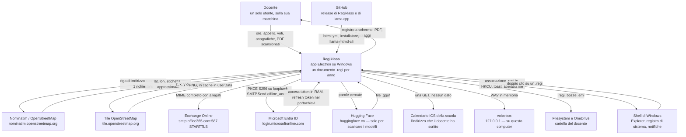
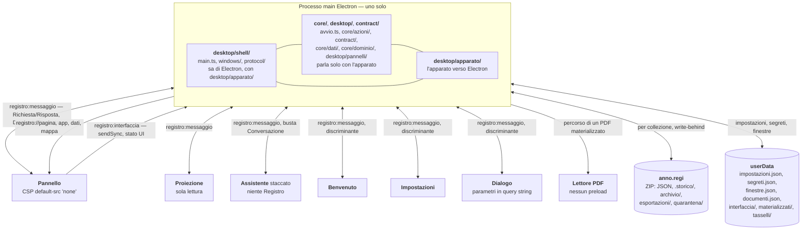
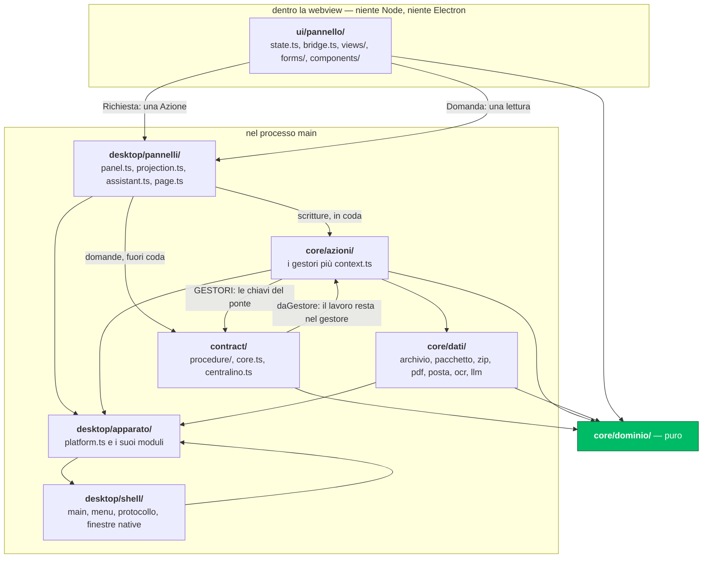
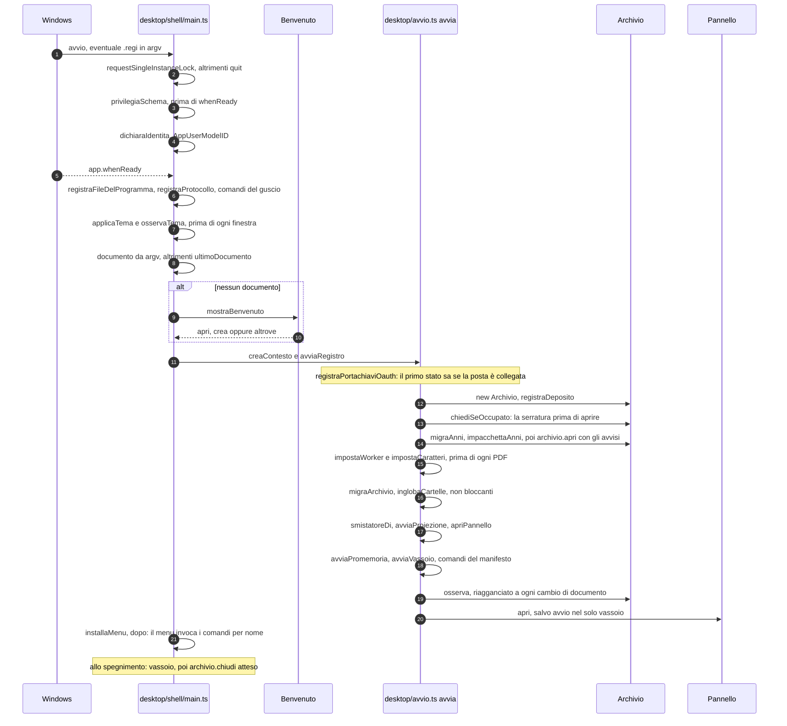

# Architettura di Regiklass

Com'è fatto e che cosa succede quando. Dove stanno i dati e come si costruisce:
[GUIDA](GUIDA.md). Il perché: [DECISIONI](DECISIONI.md). Il lavoro aperto:
[CANTIERE](CANTIERE.md).

## 1. In una pagina

Applicazione Electron desktop in TypeScript (nomi e commenti in italiano) per il
registro di un insegnante: ore, appello, piani, valutazioni, consegne, documenti
di classe, rapporti PDF. Windows, un utente, il suo computer.

Vincoli che tengono insieme il resto:

- **Un documento `.regi` per anno.** Nessun database né server: uno ZIP con i
  JSON e tutti i file. Da qui: nessuna transazione, storico dentro il file,
  serratura solo informativa (ADR-17, 18, 19).
- **Single-user, locale.** Nessuna autenticazione né ruolo: il perimetro di
  sicurezza è il file.
- **Il dominio è puro.** `core/dominio/` non importa `node:*`, `electron`,
  `apparato`, né risale con `../` (ESLint, § 4): le sue prove girano in pochi
  secondi senza finestre.
- **`core/` non nomina Electron**: parla con l'apparato
  ([desktop/apparato/platform.ts](../desktop/apparato/platform.ts)), § 5.

I conteggi verificati (azioni, procedure, viste, impostazioni, entità) stanno in
[INDICE](INDICE.md).

## 2. Vista di contesto — C4 livello 1


```mermaid
flowchart TB
  docente["Docente<br/>un solo utente, sulla sua macchina"]

  registro["<b>Regiklass</b><br/>app Electron su Windows<br/>un documento .regi per anno"]

  nominatim["Nominatim / OpenStreetMap<br/>nominatim.openstreetmap.org"]
  tiles["Tile OpenStreetMap<br/>tile.openstreetmap.org"]
  exchange["Exchange Online<br/>smtp.office365.com:587 STARTTLS"]
  entra["Microsoft Entra ID<br/>login.microsoftonline.com"]
  hugging["Hugging Face<br/>huggingface.co — solo per scaricare i modelli"]
  github["GitHub<br/>release di Regiklass e di llama.cpp"]
  ics["Calendario ICS della scuola<br/>l'indirizzo che il docente ha scritto"]
  voicebox["voicebox<br/>127.0.0.1 — su questo computer"]
  disco["Filesystem e OneDrive<br/>cartella del docente"]
  shell["Shell di Windows<br/>Explorer, registro di sistema, notifiche"]

  docente -->|"ore, appello, voti, anagrafiche, PDF scansionati"| registro
  registro -->|"registro a schermo, PDF, messaggi"| docente
  registro -->|"riga di indirizzo scomposta, 1 richiesta/s"| nominatim
  nominatim -->|"lat, lon, etichetta, approssimato"| registro
  registro -->|"z, x, y del tassello"| tiles
  tiles -->|"PNG, in cache in userData"| registro
  registro -->|"MIME completo con allegati"| exchange
  registro -->|"PKCE S256 su loopback, SMTP.Send offline_access"| entra
  entra -->|"access token in RAM, refresh token nel portachiavi"| registro
  registro -->|"parole cercate"| hugging
  hugging -->|"file .gguf"| registro
  github -->|"latest.yml, installatore, llama-mtmd-cli"| registro
  registro -->|"una GET, nessun dato"| ics
  registro -->|"WAV in memoria"| voicebox
  registro -->|".regi, bozze .eml"| disco
  registro -->|"associazione .regi in HKCU, toast, apertura file"| shell
  shell -->|"doppio clic su un .regi"| registro
```

Il pannello non parla mai con la rete (CSP `default-src 'none'`): ogni freccia
parte dal processo main. Il modello gira dentro il processo: niente rete. Il
dettaglio di ogni uscita: § 8.

## 3. Vista dei contenitori — C4 livello 2

Un processo main, sei finestre, un documento, `userData`. Canali: un IPC
asincrono multiplexato (`registro:messaggio`), un IPC sincrono per lo stato
locale delle pagine (`registro:interfaccia`), una lettura sincrona della lingua
(`registro:lingua`), il protocollo `registro://` con quattro autorità. Sul
primo, due buste in salita: **scritture** (`Richiesta`/`Azione`, in coda
seriale) e **domande** (`Domanda`, fuori coda, API § 6). Elenco completo di
messaggi e canali: [CATALOGO](CATALOGO.md) § 7–8.


```mermaid
flowchart TB
  subgraph main["Processo main Electron — uno solo"]
    guscio["<b>desktop/shell/</b><br/>main.ts, windows/, protocol/<br/>sa di Electron, con desktop/apparato/"]
    app["<b>core/</b>, <b>desktop/</b>, <b>contract/</b><br/>avvio.ts, core/azioni/, contract/,<br/>core/dati/, core/dominio/, desktop/pannelli/<br/>parla solo con l'apparato"]
    ambiente["<b>desktop/apparato/</b><br/>l'apparato verso Electron"]
    guscio --- app
    app --- ambiente
    ambiente --- guscio
  end

  pannello["<b>Pannello</b><br/>CSP default-src 'none'"]
  proiezione["<b>Proiezione</b><br/>sola lettura"]
  assistente["<b>Assistente</b> staccato<br/>niente Registro"]
  benvenuto["<b>Benvenuto</b>"]
  impostazioni["<b>Impostazioni</b>"]
  lettore["<b>Lettore PDF</b><br/>nessun preload"]
  dialogo["<b>Dialogo</b><br/>parametri in query string"]

  documento[("<b>anno.regi</b><br/>ZIP: JSON, .storico/, archivio/,<br/>esportazioni/, quarantena/")]
  userdata[("<b>userData</b><br/>impostazioni.json, segreti.json,<br/>finestre.json, documenti.json,<br/>interfaccia/, materializzati/, tasselli/")]

  main <-->|"registro:messaggio — Richiesta/Risposta, Domanda/Riscontro"| pannello
  main <-->|"registro:messaggio"| proiezione
  main <-->|"registro:messaggio, busta Conversazione"| assistente
  main <-->|"registro:messaggio, discriminante"| benvenuto
  main <-->|"registro:messaggio, discriminante"| impostazioni
  main <-->|"registro:messaggio, discriminante"| dialogo
  pannello -->|"registro:interfaccia — sendSync, stato UI"| main
  main -->|"registro://pagina, app, dati, mappa"| pannello
  main -->|"percorso di un PDF materializzato"| lettore
  main <-->|"per collezione, write-behind"| documento
  main <-->|"impostazioni, segreti, finestre"| userdata
```

| Finestra | Nasce in | preload | sandbox | Perché è a sé |
|---|---|---|---|---|
| Pannello | [desktop/pannelli/panel.ts](../desktop/pannelli/panel.ts) | sì | false | è l'applicazione |
| Proiezione | [desktop/pannelli/projection.ts](../desktop/pannelli/projection.ts) | sì | false | bundle separato, riceve solo i blocchi accesi |
| Assistente | [desktop/pannelli/assistant.ts](../desktop/pannelli/assistant.ts) | sì | false | non riceve il `Registro` (API § 9) |
| Benvenuto | [desktop/shell/windows/welcome.ts](../desktop/shell/windows/welcome.ts) | sì | false | elenco degli anni noti |
| Impostazioni | [desktop/shell/windows/menu.ts](../desktop/shell/windows/menu.ts) | sì | false | la scialuppa senza anno aperto: Utente › Posta e Programma; pagina in bundle esbuild ([settings.ts](../desktop/shell/pages/settings/settings.ts)) |
| Lettore PDF | [desktop/shell/windows/reader.ts](../desktop/shell/windows/reader.ts) | **no** | **true** | muto: lettore di Chromium |
| Dialogo | [desktop/apparato/dialogs.ts](../desktop/apparato/dialogs.ts) | sì | false | parametri nella query string |

- Stesso preload per tutte tranne il lettore
  ([desktop/shell/preload.ts](../desktop/shell/preload.ts)), stessa `chiudiLeVieDiFuga()`
  contro `will-navigate` e popup.
- `registro:messaggio` è filtrato per `evento.sender.id`.
- `registro:interfaccia` è il `getState()`/`setState()` di
  `acquireVsCodeApi()`: stato della pagina, **non** del registro.
- `registro://` ([desktop/shell/protocol/fileProtocol.ts](../desktop/shell/protocol/fileProtocol.ts)):
  `pagina` (HTML in memoria), `app` (bundle, entro `radiciConcesse()`), `dati`
  (file del documento, materializzati), `mappa` (tasselli, zoom ≤ 19).
  Segmenti `.`/`..` rifiutati dopo `decodeURIComponent`; CORS solo verso
  `registro://`; streaming con `net.fetch`. Le pagine native stanno in `dist/`
  perché il protocollo concede una cartella sola.
- Lingue (ADR-38): una per processo (`core/i18n/state.ts`); il main la sceglie
  in `desktop/apparato/language.ts`, le pagine la leggono da `registro:lingua` in
  `core/i18n/page.ts`; al cambio menu e icona si ridisegnano e le finestre si
  ricaricano.

## 4. Vista dei componenti — C4 livello 3


```mermaid
flowchart TB
  subgraph W["dentro la webview — niente Node, niente Electron"]
    interfaccia["<b>ui/pannello/</b><br/>state.ts, bridge.ts, views/, forms/, components/"]
  end

  subgraph H["nel processo main"]
    pannelli["<b>desktop/pannelli/</b><br/>panel.ts, projection.ts, assistant.ts, page.ts"]
    contratto["<b>contract/</b><br/>procedure/, core.ts, centralino.ts"]
    azioni["<b>core/azioni/</b><br/>i gestori più context.ts"]
    dati["<b>core/dati/</b><br/>archivio, pacchetto, zip, pdf, posta, ocr, llm"]
    ambiente["<b>desktop/apparato/</b><br/>platform.ts e i suoi moduli"]
    guscio["<b>desktop/shell/</b><br/>main, menu, protocollo, finestre native"]
  end

  dominio["<b>core/dominio/</b> — puro"]

  interfaccia -->|"Richiesta: una Azione"| pannelli
  interfaccia -->|"Domanda: una lettura"| pannelli
  pannelli -->|"scritture, in coda"| azioni
  pannelli -->|"domande, fuori coda"| contratto
  azioni -->|"GESTORI: le chiavi del ponte"| contratto
  contratto -->|"daGestore: il lavoro resta nel gestore"| azioni
  contratto --> dominio
  azioni --> dati
  azioni --> dominio
  dati --> dominio
  interfaccia --> dominio
  pannelli --> ambiente
  azioni --> ambiente
  dati --> ambiente
  ambiente --> guscio
  guscio --> ambiente

  classDef puro fill:#0b6,stroke:#063,color:#fff
  class dominio puro
```

Regole ESLint `no-restricted-imports` ([eslint.config.mjs](../eslint.config.mjs)),
con il perché nel messaggio d'errore; in più `npm run layers`, che applica le
regole di `.dependency-cruiser.cjs` — fra queste `dominio-puro`: `core/dominio/`
non importa niente da fuori di sé tranne `core/i18n/`.

| Cartella | Vietato importare |
|---|---|
| `ui/**` | `node:*`, `electron` (quel che serve passa da `ui/pannello/bridge.ts`) |
| `core/dati/**`, `core/azioni/**`, `desktop/pannelli/**` | `electron` |
| `core/controlli/**` | `node:*`, `electron`, `apparato`; da fuori della cartella tutto tranne `core/i18n/`, le parole di tutti (`core/dominio/words.testi.ts`) e i tipi di `contract/` (ADR-52) |
| `desktop/shell/pages/**` | `node:*`, `electron`; da fuori di `shell/pages/` tutto tranne i tipi, `core/i18n/`, `core/controlli/` e le parole di tutti |

**Strato per strato:**

- **`desktop/shell/`** — main process: istanza unica, `open-file` e `second-instance`
  per il doppio clic, menu dai `COMANDI` di [contract/manifesto.ts](../contract/manifesto.ts),
  vassoio, `registro://`, cache dei tasselli, associazione file in
  `HKCU\Software\Classes` via PowerShell `-EncodedCommand` (percorso in una
  variabile d'ambiente, mai interpolato). Non importa dominio né azioni: chiede
  i comandi per nome.
- **`desktop/apparato/`** — l'apparato su Electron: `file`, `finestre`,
  `dialoghi`, `comandi`, `impostazioni`, segreti, `Uri`, `EventEmitter`,
  `osserva`, più `accodaSe` (accodamento ZIP a file invariato, un handle solo),
  `htmlDellaPagina`, `radiciConcesse`, `percorsoWorkerPdf`. Nelle prove:
  [tests/helpers/fake-electron.mjs](../tests/helpers/fake-electron.mjs).
- **`core/dati/`** — il mondo: documento ([package.ts](../core/dati/package.ts),
  [zip.ts](../core/dati/zip.ts)), stato in memoria
  ([archive.ts](../core/dati/archive.ts)), materializzazione
  ([store.ts](../core/dati/store.ts)), PDF ([pdf.ts](../core/dati/pdf.ts),
  [reportsPdf.ts](../core/dati/reportsPdf.ts)), posta
  ([mail.ts](../core/dati/mail.ts), [exchange.ts](../core/dati/exchange.ts),
  [oauth.ts](../core/dati/oauth.ts)), OneDrive ([oneDriveLocale.ts](../core/dati/oneDriveLocale.ts),
  [microsoft.ts](../core/dati/microsoft.ts), [onedrive.ts](../core/dati/onedrive.ts)), OCR ([ocr.ts](../core/dati/ocr.ts)),
  geocodifica ([geocoding.ts](../core/dati/geocoding.ts)), modelli, dettatura.
- **`core/dominio/`** — le regole della scuola: modello
  ([models.ts](../core/dominio/models.ts)), date e UD
  ([dates.ts](../core/dominio/dates.ts), [calculations.ts](../core/dominio/calculations.ts)),
  validazione e normalizzazione ([validation.ts](../core/dominio/validation.ts)),
  cascate ([deletions.ts](../core/dominio/deletions.ts)), lessico. Schema
  ricorrente: **calcolo puro + `applica` mutante** (ADR-24).
- **`core/azioni/`** — un gestore per `Azione['tipo']`; ogni file esporta un
  oggetto `satisfies Parte`, e un'azione senza gestore non compila. `Contesto`
  ([context.ts](../core/azioni/context.ts)) è la porta verso lo stato:
  `modifica(op, collezioni)`, `suVoce` (timbra `aggiornatoIl`), `nelFascicolo`,
  `elimina`. Oggi `op` cambia lo stato vivo dopo `ricordaPrima`; `Archivio.modifica`
  invece passa `op` su una bozza immer e ricava le collezioni dalle patch (ADR-50).
- **`contract/`** — il contratto davanti ai gestori: protocollo, schemi e procedure
  (ADR-27–29, [API](API.md)).
- **`desktop/pannelli/`** — `panel.ts` accoda le richieste, `page.ts` compone l'HTML
  con la CSP, `projection.ts` spinge solo i blocchi accesi, `assistant.ts` e
  `conversation.ts` servono l'assistente.
- **`ui/pannello/`** — il pannello, senza framework: `h()` in
  [dom.ts](../ui/pannello/dom.ts), ridisegno completo sotto `#radice` con fuoco,
  cursore e scorrimenti ripristinati per chiave (`data-fuoco`,
  `data-scorrimento`); modali e palette fuori dal ciclo. `stato.registro` è
  sola lettura: ogni scrittura è un'`Azione`, il registro nuovo torna intero.
  Dove si guarda è un `Posto` e ci si sposta con `vai` (ADR-47); il posto si
  ricorda per documento (`memoria.ts`). Ogni aggiornamento resta nel suo
  riquadro (ADR-48): i nodi `data-telaio` restano fra due disegni, le letture
  rifanno solo la loro isola (`isole.ts`, `risorse.ts`), i nodi pesanti
  `data-tieni` non si ricreano, l'orologio muove solo la riga di adesso.
- **`core/controlli/`** — i controlli delle impostazioni del programma, disegnati
  una volta per il pannello e per la finestra nativa (ADR-52):
  [controllo.ts](../core/controlli/controllo.ts) sceglie dalla `VoceProgramma`
  figura, segmentato, tendina, interruttore, numero con unità, cursore,
  percorso; [campo.ts](../core/controlli/campo.ts) gli stessi disegni per i
  campi dell'anno; [aree.ts](../core/controlli/aree.ts) le quattro aree, le
  sezioni con chiavi (`DIVISIONI`, `divisioneDi`) e i loro nomi, comuni al
  pannello e alla finestra nativa. DOM passato come argomento, niente ponte: il
  valore esce da `quandoCambia`. Lo importano `ui/` e `desktop/shell/pages/`.
- **`cli/`** — la riga di comando autonoma: `regi`, disinstallazione, esportazioni
  senza interfaccia grafica.

## 5. Il fatto architetturale centrale

Il registro è nato come estensione di VS Code e ne conserva la forma: importa
ovunque un modulo che `package.json` non elenca, `apparato`, risolto per alias
sia da `tsc` sia da esbuild:

```jsonc
// tsconfig.json
"paths": { "apparato": ["./core/apparato/platform.ts"] }
```

```js
// esbuild.mjs
const aliasApparato = { apparato: './desktop/apparato/platform.ts' }
```

**`desktop/shell/` sa di Electron, `core/` no** (ADR-02).

| Guadagno | Costo |
| --- | --- |
| un confine di prova vero: l'Electron finto si inietta in un punto | un'indirezione: l'API dell'apparato è scritta solo nel codice |
| dominio puro senza sforzo | funzioni `async` senza niente da attendere (`require-await` spento) |
| protocollo host↔pannello già disciplinato (busta, id, push) | nomi d'editor rimasti: `globalStorageUri`, `acquireVsCodeApi()` |
| ospite sostituibile in un file | un'API da mantenere per un consumatore solo |

## 6. Flussi

### (a) Avvio completo


```mermaid
sequenceDiagram
  autonumber
  participant OS as Windows
  participant P as desktop/shell/main.ts
  participant B as Benvenuto
  participant A as desktop/avvio.ts avvia
  participant AR as Archivio
  participant PN as Pannello

  OS->>P: avvio, eventuale .regi in argv
  P->>P: requestSingleInstanceLock, altrimenti quit
  P->>P: privilegiaSchema, prima di whenReady
  P->>P: dichiaraIdentita, AppUserModelID
  OS-->>P: app.whenReady
  P->>P: registraFileDelProgramma, registraProtocollo, comandi del guscio
  P->>P: applicaTema e osservaTema, prima di ogni finestra
  P->>P: documento da argv, altrimenti ultimoDocumento
  alt nessun documento
    P->>B: mostraBenvenuto
    B-->>P: apri, crea oppure altrove
  end
  P->>A: creaContesto e avviaRegistro
  Note over A: registraPortachiaviOauth: il primo stato sa se la posta è collegata
  A->>AR: new Archivio, registraDeposito
  A->>AR: chiediSeOccupato: la serratura prima di aprire
  A->>AR: migraAnni, impacchettaAnni, poi archivio.apri con gli avvisi
  A->>A: impostaWorker e impostaCaratteri, prima di ogni PDF
  A->>A: migraArchivio, inglobaCartelle, non bloccanti
  A->>A: smistatoreDi, avviaProiezione, apriPannello
  A->>A: avviaPromemoria, avviaVassoio, comandi del manifesto
  A->>AR: osserva, riagganciato a ogni cambio di documento
  A->>PN: apri, salvo avvio nel solo vassoio
  P->>P: installaMenu, dopo: il menu invoca i comandi per nome
  Note over P: allo spegnimento: vassoio, poi archivio.chiudi atteso
```

### (b) Una scrittura end-to-end — `presenze.riga`

```mermaid
sequenceDiagram
  autonumber
  participant V as ui/pannello/views/lesson
  participant PO as ui/pannello/bridge.ts
  participant PR as desktop/shell/preload.ts
  participant F as desktop/apparato/windows.ts
  participant PA as desktop/pannelli/panel.ts
  participant AZ as desktop/avvio.ts esegui
  participant API as contract/core.ts
  participant G as core/azioni/hours.ts
  participant C as core/azioni/context.ts
  participant AR as core/dati/archive.ts
  participant PK as core/dati/package.ts

  V->>PO: azione presenze.riga
  PO->>PR: postMessage della Richiesta, id in attesa
  PR->>F: ipcRenderer.send su registro:messaggio
  F->>PA: filtro per sender.id
  PA->>PA: coda = coda.then(eseguiRichiesta), seriale
  PA->>AZ: azioneValida, esegui
  AZ->>API: il ponte: ore.appello.riga
  API->>API: fila delle scritture, convalida dell'ingresso, tracciato, origine pannello
  API->>G: daGestore
  G->>C: suVoce lezioni
  C->>AR: modifica, collezione lezioni
  AR->>AR: programmaSalvataggio, 350 ms, tetto 2000 ms
  API->>API: convalida dell'uscita, giornale, rigenerazione PDF se la revisione è cambiata
  API-->>AZ: Risultato → EsitoAzione
  PA->>PR: MessaggioStato con il Registro intero, prima della risposta
  PA->>PR: Risposta ok, stesso id
  PR->>PO: la Promise si risolve, lo stato è già arrivato
  Note over AR,PK: la richiesta è finita; il disco viene dopo
  AR->>PK: scriviPendenti, conserva in .storico
  PK->>PK: accoda, oppure rifai con tmp e rename
```

Ogni azione attraversa `contract/core.ts` allo stesso modo. La `Risposta` parte prima
che il dato sia su disco (§ 9).

### (c) Un PDF che si rifà da sé

```mermaid
sequenceDiagram
  autonumber
  participant N as contract/core.ts chiama
  participant AU as core/dominio/automation.ts
  participant R as core/azioni/reports.ts
  participant D as core/dominio/reportData.ts
  participant M as core/dati/templates.ts
  participant PDF as core/dati/reportsPdf.ts
  participant DOC as esportazioni nel .regi

  N->>AU: improntaDi prima di scrivere (con pdfAutomatici sempre)
  N->>N: scrittura riuscita, revisione cambiata
  N->>AU: riferimentiSpostati: corso e giorno di prima e di adesso
  N->>AU: corsiDaRifare con corsoId, lezioneId, classeId, allievoId
  N->>AU: giornoDaRifare
  N->>R: rigeneraDopoScrittura
  R->>R: 8 s dall'ultima modifica, tetto 60 s
  Note over R: pdfAutomatici mai: niente; chiusura: aspetta lezione svolta
  R->>D: dati del rapporto
  R->>M: modello risolto (estende fino a 3 livelli)
  R->>PDF: componiPdf
  PDF->>DOC: in serie, mai in parallelo
  Note over R,DOC: un rapporto rifatto sovrascrive (ADR-14)
```

### (d) Smistamento di un PDF scansionato

```mermaid
sequenceDiagram
  autonumber
  participant U as Docente
  participant V as ui/pannello/views/sorting.ts
  participant AZ as core/azioni/sorting.ts
  participant S as core/dati/sorter.ts
  participant O as core/dati/ocr.ts
  participant DOM as core/dominio/sorting.ts
  participant Q as quarantena nel documento
  participant ARC as archivio nel documento

  U->>V: trascina o sceglie dei PDF
  V->>AZ: smistamento.pdf.carica o .deposita (base64)
  AZ->>S: smistaFile
  S->>Q: il PDF entra com'è
  S->>S: testo con posizioni, via pdfjs
  alt pagine mute e OCR acceso
    S->>O: leggiImmagine, una pagina alla volta, modello locale (llama-mtmd-cli)
    O-->>S: testo, o vuoto: non solleva mai
    S-->>V: MessaggioLavoro con l'avanzamento
  end
  S->>DOM: indice dei nomi, riconoscimento per pagina
  DOM-->>S: candidato e fiducia; ambiguo se lo stacco < 0.2
  S->>DOM: bozza: assegnazioni proposte e blocchi in quarantena con il motivo
  Note over DOM: quarantena se manca la consegna, nessun nome, ambiguo, fiducia < 0.7, allievo non atteso o già consegnato
  S-->>V: stato al pannello; niente archiviato
  U->>V: conferma per blocco, o Conferma tutto
  V->>AZ: assegna pagine, conferma, firme o assenze
  S->>ARC: archivia il ritaglio, aggancia, spunta
  S->>Q: toglie le pagine lette
  Note over AZ,ARC: riprendere le pagine è l'unico rollback: cestina l'archiviato e rimette in lettura
```

## 7. Persistenza

Formato e collezioni: [MODELLO-DATI](MODELLO-DATI.md) § 8. Qui il meccanismo.

- **ZIP scritto in casa** su `node:zlib` ([core/dati/zip.ts](../core/dati/zip.ts)),
  niente ZIP64 (≈ 4 GB, 65 535 voci). Manifesto con
  `formato: 'registro-docenti/anno'` e `VERSIONE_PACCHETTO = 1`; un contenitore
  più recente si rifiuta.
- **Due radici** nel documento: `archivio/` (unica copia) ed `esportazioni/`
  (rifacibile, escludibile dalla sincronizzazione) —
  [locations.ts](../core/dominio/locations.ts), ADR-16.
- **Si riscrive solo quel che si dichiara**: ogni salvataggio nomina le
  collezioni toccate (`NOMI` in [core/dati/paths.ts](../core/dati/paths.ts)). Una
  collezione dimenticata = interfaccia giusta, disco sbagliato: lo cerca
  `npm run collections`.
- **Write-behind** ([archive.ts](../core/dati/archive.ts)):
  `RITARDO_SALVATAGGIO_MS = 350`, `ATTESA_MASSIMA_MS = 2000`,
  `RITARDO_RICARICA_MS = 300` per l'osservatore, `FINESTRA_ECO_MS = 2500` per
  non ricaricare le proprie scritture. Un file cambiato da fuori si ricarica
  dopo aver scritto quel che era in attesa.
- **Accodamento** (`accoda`, il caso normale): comprime le voci cambiate, le
  scrive in coda con `apparato.accodaSe`, poi con un **secondo** `fsync`
  riscrive indice e coda ZIP; finché la coda nuova non è intera vale la
  vecchia. Misura e coda del file si controllano nello stesso handle delle
  scritture: se un altro processo (es. `npm run dev` accanto a `start`) ha rifatto
  il file, non si accoda. **Riscrittura** (`rifai`, temporaneo + rinomina) solo
  se il file non c'è o è cambiato altrove, lo spazio morto supera 256 KB e un terzo del file, o accodare costa più di
  metà documento. Non ogni salvataggio passa da temporaneo e rinomina.
- **Storico**: prima di riscrivere, `Pacchetto.conserva(nome, COPIE_STORICO,
  { aGradini: true })` copia la voce in `.storico/<radice>.<istante>.json` dentro
  lo ZIP, riusando il blocco compresso. Potatura (`daTenere`): le ultime 10, una
  al giorno per 30 giorni, poi una a settimana, al più 60.
- **JSON illeggibile**: mai sovrascritto in silenzio; resta in
  `Archivio.illeggibili` e alla prima modifica esplicita diventa
  `<nome>.rotto-<istante>.json`.
- **Serratura**: `.{nome}.serratura` = `{macchina, utente, processo, aperto}`,
  da `Pacchetto.prendi()`/`lascia()`. Se l'anno è aperto altrove, un dialogo:
  «chi salva per ultimo copre il lavoro dell'altro».
- **Migrazioni**: `VERSIONE_DATI` (schema, ADR-37: passi, copia, riscrittura,
  avviso) e `VERSIONE_PACCHETTO` (contenitore) sono indipendenti. Sotto,
  `normalizzaRegistro()` gira a ogni caricamento, non lancia mai, e
  `Archivio.collezioniMigrate()` forza la riscrittura di quel che ha cambiato.
  Il layout migra per passi idempotenti (il nuovo si scrive prima, il vecchio
  si cancella dopo):

  | Passo | Dove | Da → a |
  |---|---|---|
  | `migraAnni` | [core/dati/years.ts](../core/dati/years.ts) | JSON piatti multi-anno → una cartella per anno |
  | `impacchettaAnni` | [core/dati/years.ts](../core/dati/years.ts) | `<anno>/dati/*.json` → `<anno>.regi` |
  | `inglobaCartelle` | [core/dati/years.ts](../core/dati/years.ts) | cartelle documentali accanto → dentro il pacchetto |
  | `migraArchivio` | [core/dati/filing.ts](../core/dati/filing.ts) | `documentazione/` e cartelle piatte → `archivio/` + `esportazioni/`, con i percorsi salvati |

## 8. Mappa delle uscite di dati dalla macchina

La tabella di che cosa esce, verso dove e quando sta nella
[GUIDA](GUIDA.md) § «Che cosa esce dal computer». Qui le difese.

| Uscita | Difese |
|---|---|
| Geocodifica ([core/dati/geocoding.ts](../core/dati/geocoding.ts)) | solo la riga d'indirizzo scomposta, mai nomi; 1 richiesta ogni 1100 ms, User-Agent dichiarato, paesi `ch,it,de,fr,at`, al più 60 indirizzi per volta, cache per indirizzo (ADR-03) |
| Posta ([core/dati/exchange.ts](../core/dati/exchange.ts), [core/dati/oauth.ts](../core/dati/oauth.ts)) | STARTTLS obbligatorio, `AUTH XOAUTH2`, destinatari solo in `RCPT TO`; OAuth con PKCE S256 su loopback, `state` verificato, scope `SMTP.Send offline_access` (Graph scartato: troppo ampio); scoperta del tenant |
| OneDrive ([core/dati/microsoft.ts](../core/dati/microsoft.ts), [core/dati/onedrive.ts](../core/dati/onedrive.ts)) | senza rete per gli account sincronizzati sul computer (letti dal disco, solo dentro le loro cartelle); per gli altri lo stesso accesso PKCE della posta, ma scope `Files.Read.All User.Read offline_access` e un gettone di rinnovo per account nel portachiavi; solo lettura; il gettone va solo a `graph.microsoft.com` (lo scarico segue un rimando già firmato, senza gettone); `onedrive.*` `perAssistente: false` (ADR-49) |
| Modelli ([core/dati/huggingFace.ts](../core/dati/huggingFace.ts) → [core/dati/gguf.ts](../core/dati/gguf.ts)) | in entrata; nessuna chiave; i depositi con condizioni da accettare non si scaricano |
| `llama-mtmd-cli` ([core/dati/kit.ts](../core/dati/kit.ts), [core/dati/visionKit.ts](../core/dati/visionKit.ts)) | un eseguibile che partirà: versione fissata, SHA-256 prima del nome definitivo, estratti solo l'eseguibile e le sue `.dll`; solo se `modelli.scaricoAutomatico` |
| Aggiornamenti ([desktop/apparato/updates.ts](../desktop/apparato/updates.ts)) | SHA-512 di `latest.yml` verificato da `electron-updater` e di nuovo prima di lanciare l'installatore ([os/windows/aggiornamento.ps1](../os/windows/aggiornamento.ps1)); solo l'installato su Windows; `ORE_FRA_I_CONTROLLI` |
| Calendario ICS ([core/dati/calendar.ts](../core/dati/calendar.ts)) | solo dal main; 20 s, 10 MB, 60 s di memoria; l'indirizzo (spesso con un gettone) non compare negli errori; `perAssistente: false` |
| Tasselli ([desktop/shell/protocol/tiles.ts](../desktop/shell/protocol/tiles.ts)) | dal main, mai dalla pagina; cache in `userData/tasselli/` |
| Dettatura ([core/dati/dictation.ts](../core/dati/dictation.ts) → [core/dati/voicebox.ts](../core/dati/voicebox.ts)) | solo loopback, ricontrollato a ogni lettura ([core/dominio/loopback.ts](../core/dominio/loopback.ts)); `redirect: 'manual'`; intoccabile dal condotto; un `POST /transcribe` per pausa ([ui/pannello/assistant/voice.ts](../ui/pannello/assistant/voice.ts)), 120 s; WAV mai sul disco del registro (ADR-35) |
| Modello locale ([core/dati/llm.ts](../core/dati/llm.ts)) | non esce: `.gguf` in processo (ADR-25) |

`openExternal` è ristretto a `http`, `https`, `mailto`, `tel`, `callto`, `skype`, `msteams`
([desktop/apparato/commands.ts](../desktop/apparato/commands.ts)); i file locali si
aprono per percorso (ADR-22).

## 9. Concorrenza, atomicità, garanzie reali

- **Scritture seriali**: una fila sola dentro `chiama()` per ogni trasporto
  (API § 10); il pannello in più accoda le sue richieste
  (`coda = coda.then(…)`), per l'ordine delle spinte di stato. Un errore non
  blocca le successive.
- **La risposta arriva prima del disco**: memoria → `MessaggioStato` →
  `Risposta` → dopo 350 ms–2 s lo ZIP. Lo spegnimento attende l'ultimo
  salvataggio (`spegni()` → `archivio.chiudi()`); un'interruzione di corrente
  no.
- **Più collezioni non sono una transazione**: `scriviPendenti()` le scrive una
  per volta, ognuna atomica. `materia.unisci` (sei collezioni) è la più esposta.
- **Serratura cooperativa**: nessun merge. Unica difesa esplicita:
  `assenze.salva` in [core/azioni/classTeacher.ts](../core/azioni/classTeacher.ts)
  tiene le righe dell'host e ignora quelle del client se il blocco esiste già.
- **Nessun timeout** su `invia()` ([ui/pannello/bridge.ts](../ui/pannello/bridge.ts));
  idempotenza dichiarata caso per caso.

## 10. Build, test, qualità

Comandi, controlli fatti in casa e CI: [GUIDA](GUIDA.md) § «Sviluppo». In più:

- [esbuild.mjs](../esbuild.mjs) esporta `applicazione` e `prove`; flag
  `--produzione`, `--test`, `--ui`. Bundle principali: `desktop/shell/main.ts` e
  `desktop/shell/preload.ts` (cjs; `external: electron, node-llama-cpp`),
  `ui/pannello/main.ts`, `ui/pannello/projection.ts`, `ui/pannello/assistantWindow.ts` (iife),
  le pagine di `desktop/shell/` copiate in `dist/`, il worker di pdfjs (ESM).
- `verificaIdentita()` fa fallire la build se l'`appId` di
  [electron-builder.json](../electron-builder.json) e `IDENTITA` di
  [desktop/apparato/notifications.ts](../desktop/apparato/notifications.ts)
  divergono.
- `tsconfig.json`: `strict`, `noImplicitOverride`, `noUnused*`,
  `noFallthroughCasesInSwitch`, `exactOptionalPropertyTypes` spento, `noEmit`;
  include `tests/`.
- ESLint: forma (`@stylistic`, `max-len: 100` come avviso), sostanza
  (`no-floating-promises`, `no-misused-promises`, `await-thenable` a errore),
  strati (§ 4).
- electron-builder: `node_modules` escluso tranne `node-llama-cpp`
  (`asarUnpack` con `pdf.worker.mjs`); `nsis` per utente e `portable`;
  `fileAssociations` per `.regi` con MIME `application/x-regiklass` (su Linux
  icona del tipo e voce dell'AppImage le scrive `fileAssociation.ts` per l'utente). La firma la
  chiede `rilascio.yml` (GUIDA § «La firma del codice»).
- Prove: `node:test`. Finti: [tests/helpers/fake-electron.mjs](../tests/helpers/fake-electron.mjs)
  (`app`, `BrowserWindow`, `ipcMain` con `simulaDallaPagina()`, due schermi,
  `safeStorage`, `nativeTheme`; stato su `globalThis.__bancoElectron`) e
  [tests/helpers/fake-node-llama.mjs](../tests/helpers/fake-node-llama.mjs)
  (stato su `globalThis.__bancoLlama`). Prove dell'interfaccia con
  @playwright/test (`tests/interfaccia/*.spec.ts`, `npm run ui-tests`), una con
  Electron vero.

## 11. Riordini

Un riordino si scrive qui come mappa «da → a» prima dei `git mv` (D5 in
[CANTIERE](CANTIERE.md)); ogni lotto è un commit che contiene solo lo
spostamento e gli import che lo seguono. A lotto fatto la riga si toglie.
Le mete non ancora esistenti restano senza backtick: `npm run docs` le
cercherebbe.

| Lotto | Da → a | Perché |
| --- | --- | --- |
| 3 | `core/controlli/controlli.css` → core/controlli/controls.css, `core/controlli/controlli.testi.ts` → core/controlli/controls.testi.ts, `core/controlli/campo.ts` → core/controlli/field.ts, `core/controlli/aree.ts` e `core/controlli/aree.testi.ts` → core/controlli/areas.ts e core/controlli/areas.testi.ts, `core/controlli/controllo.ts` → core/controlli/control.ts, `core/dati/oneDriveLocale.ts` → core/dati/oneDriveLocal.ts, `core/dati/bozza.ts` → core/dati/draft.ts, `desktop/avvio.ts` e `desktop/avvio.testi.ts` → desktop/boot.ts e desktop/boot.testi.ts | ADR-53 |
| 1b | `cli/testi.mjs` → cli/texts.mjs, `cli/disinstalla.mjs` → cli/uninstall.mjs, `cli/registro.mjs` → cli/main.mjs (il comando `regi` resta) | ADR-53 |
| 4 | `contract/chiamante.ts` → contract/caller.ts, `contract/centralino.ts` → contract/switchboard.ts, `contract/registro.ts` → contract/registry.ts, `contract/manifesto.ts` e `contract/manifesto.testi.ts` → contract/manifest.ts e contract/manifest.testi.ts | ADR-53 |
| 6 | `ui/pannello/styles/impostazioni-anno.css` → ui/pannello/styles/year-settings.css, `ui/pannello/components/annullabile.ts` → ui/pannello/components/undoable.ts, `ui/pannello/components/virtuale.ts` → ui/pannello/components/virtualList.ts, `ui/pannello/components/voceAnno.ts` e `ui/pannello/components/voceAnno.testi.ts` → ui/pannello/components/yearSetting.ts e ui/pannello/components/yearSetting.testi.ts, `ui/pannello/risorse.ts` → ui/pannello/asyncResources.ts, `ui/pannello/segnalibro.ts` → ui/pannello/bookmark.ts, `ui/pannello/orologio.ts` → ui/pannello/clock.ts, `ui/pannello/memoria.ts` → ui/pannello/memory.ts, `ui/pannello/isole.ts` → ui/pannello/islands.ts, `ui/pannello/posto.ts` → ui/pannello/place.ts | ADR-53 |
| 5 | `contract/protocollo.ts` → contract/protocol.ts | ADR-53 |
