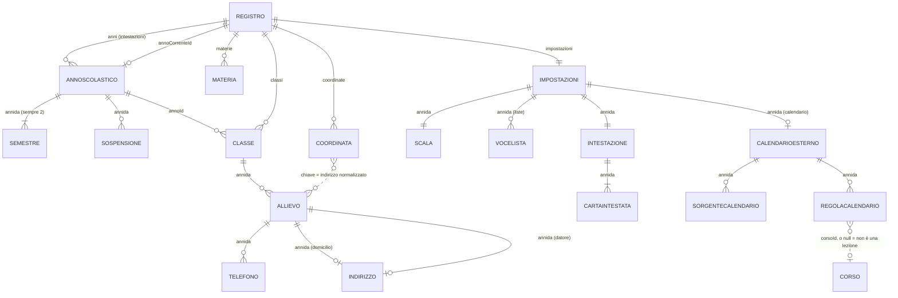
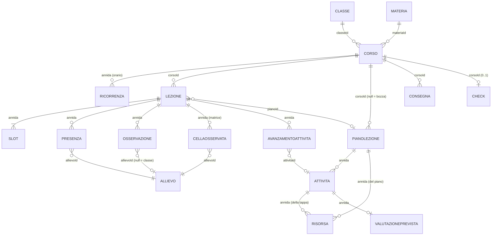
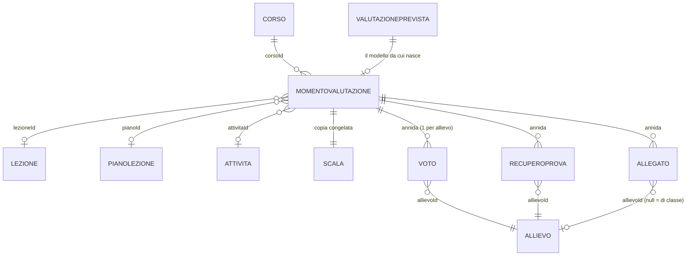
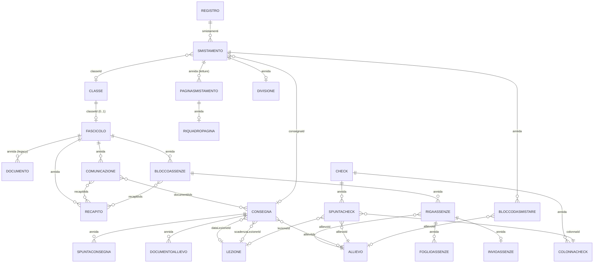

# Modello dati

La forma dei dati di un documento `.regi` e le regole che li tengono in piedi.
Il perché delle scelte: [DECISIONI](DECISIONI.md). Come si scrive su disco:
[ARCHITETTURA](ARCHITETTURA.md) § 7. Come si cambia la forma: la skill
`.claude/skills/formato/SKILL.md`.

Sorgenti:

- [`src/domain/models.ts`](../src/domain/models.ts) — le forme
- [`src/domain/validation.ts`](../src/domain/validation.ts) — `valida*`
- [`src/domain/normalization.ts`](../src/domain/normalization.ts) — `normalizza*`
- [`src/domain/integrity.ts`](../src/domain/integrity.ts) — `riferimentiRotti`
- [`src/domain/factories.ts`](../src/domain/factories.ts) — `crea*` e predefiniti
- [`src/domain/persistence.ts`](../src/domain/persistence.ts) — collezione → testo
- [`src/domain/lexicon.ts`](../src/domain/lexicon.ts) — il vocabolario

## 1. Convenzioni di modello

### 1.1 Tempo: tre alias `string`, mai `Date`

| Alias | Forma | Uso |
|---|---|---|
| `Iso` | `'AAAA-MM-GG'` | data di calendario, senza ora né fuso |
| `Ora` | `'HH:MM'` 24 h | ora del giorno, confrontabile come stringa |
| `Istante` | ISO 8601 completo | solo per ordinare e mostrare (`creatoIl`, `aggiornatoIl`…) |

- Mai serializzare una data di lezione come `Date`/epoch: un altro fuso cambia
  il giorno.
- L'aritmetica sta in [`dates.ts`](../src/domain/dates.ts), con `Date` solo
  interno e in UTC.
- Solo `oggi()`, `adesso()`, `istanteAdesso()` leggono l'orologio; il resto del
  dominio riceve «oggi» come parametro.

### 1.2 Annida, riferisci, copia, deriva

| Regola | Quando | Esempio |
|---|---|---|
| annidare | non ha vita propria | `Voto` dentro `MomentoValutazione` (nessun id: `allievoId` nella prova) |
| riferire | deve restare aggiornato | `Corso.classeId` → il nome della classe si legge sempre dalla classe |
| copiare | deve restare com'era | `MomentoValutazione.scala`, `AvanzamentoAttivita.titolo` |
| derivare | si ricava da altro, non si scrive | il semestre di una data (`semestreDi`); `AnnoScolastico.inizio`/`fine` |

### 1.3 Pieno in memoria, magro su disco

In memoria `normalizza*` riempie ogni campo con il suo predefinito; su disco
`senzaVuoti` toglie stringhe e array vuoti (§ 8.4).

### 1.4 Nessun vincolo di integrità nel type system

Tutti i riferimenti sono `string` (o `string | null`). La coerenza la tengono
`riferimentiRotti` (diagnosi), `deletions.ts` (cascata), `orphans.ts` e
`repairs.ts` (riconciliazione): nessuno blocca (§ 7).

## 2. Diagramma ER

### 2.1 Anagrafica — anno, classi, persone, indirizzi



### 2.2 Didattica — corsi, orario, lezioni, piani



### 2.3 Valutazione — prove, voti, recuperi, allegati



### 2.4 Documenti — fascicolo, assenze, consegne, check, smistamento



Il **perno è il `Corso`**: `Lezione`, `MomentoValutazione`, `PianoLezione`,
`Consegna` e `Check` si agganciano a `corsoId`; classe e materia si risalgono
(`src/domain/courses.ts`). L'anno lo porta la classe.

## 3. Catalogo delle entità

Nelle tabelle `campo?` = opzionale (`?` nel tipo); `T | null` = `null` ha un
significato. Dopo la normalizzazione ogni campo non opzionale c'è sempre.
«Norm.» = chi valida e normalizza.

### 3.1 `Registro`

La radice: lo stato di un anno, più le intestazioni di tutti gli anni.

| campo | tipo | nota |
|---|---|---|
| `versione` | `number` | `VERSIONE_DATI` di chi l'ha scritto |
| `anni` | `AnnoScolastico[]` | intestazioni, in ordine di inizio |
| `annoCorrenteId` | `string \| null` | l'anno caricato |
| `materie`, `impostazioni` | | dell'anno in uso |
| `classi`, `corsi`, `lezioni`, `piani`, `valutazioni`, `fascicoli`, `consegne`, `check`, `smistamenti`, `coordinate` | array | le collezioni (§ 8.1) |

- `annoCorrenteId` punta a un anno di `anni`, o è `null` (altrimenti
  `anni[0]?.id ?? null`).
- Norm.: `normalizzaRegistro(grezzo)`, unico ingresso, **non lancia mai**;
  `registroVuoto()`; `riferimentiRotti(registro)`.

### 3.2 `AnnoScolastico`

| campo | tipo | nota |
|---|---|---|
| `id`, `etichetta` | `string` | `'2025/2026'` |
| `inizio`, `fine` | `Iso` | **derivati** dai semestri |
| `semestri` | `Semestre[]` | sempre due |
| `sospensioni` | `Sospensione[]` | vacanze e chiusure |
| `settimane?` | `Record<Iso, LetteraSettimana>` | chiave = il lunedì; scritte a mano, mai calcolate |
| `note?` | `string` | |
| `cartella?` | `string` | nome su disco, **non persistito** |

- Semestri contigui (`validaAnno` rifiuta, `allineaSemestri` ripara);
  `inizio`/`fine` riscritti da `annoAllineato()`; sospensioni dentro l'anno.
- Norm.: `validaAnno`, `normalizzaAnno`; `creaAnno`, `creaAnnoCorrente`.

### 3.3 `Semestre`

| campo | tipo | nota |
|---|---|---|
| `id` | `string` | nessuna entità lo cita |
| `numero` | `1 \| 2` | riassegnato per posizione |
| `etichetta` | `string` | `'1° semestre'` |
| `inizio`, `fine` | `Iso` | |

Non esiste un `semestreId` in nessuna entità: il semestre si ricava dalla data.

### 3.4 `Sospensione`

`id`, `etichetta` (`'Sospensione'`), `dal`, `al` (`Iso`). `al < dal` collassa su
`dal`; deve cadere nell'anno; l'orario non genera lezioni nei giorni sospesi.
Le chiusure importate dal calendario ufficiale hanno id `sos-ti-<anno>-<nome>`.

### 3.5 `Materia`

| campo | tipo | nota |
|---|---|---|
| `id`, `nome` | `string` | |
| `sigla?`, `colore?`, `note?` | `string` | |

- Unica per nome normalizzato (minuscole, senza diacritici).
- `materieSimili()` avvisa dei refusi (Levenshtein ≤ 1, ≤ 2 sopra gli 8
  caratteri). `siglaMateria()` ripiega sulle iniziali.
- Norm.: `validaMateria(materia, altre)`, `normalizzaMateria`.

### 3.6 `Ricorrenza`

Una fascia fissa dell'orario.

| campo | tipo | nota |
|---|---|---|
| `id` | `string` | |
| `giorno` | `number` | 1 = lunedì … 7; fuori range → 1 |
| `inizio` | `Ora` | |
| `durataMin` | `number` | multiplo di `Impostazioni.minutiUd` |
| `aula?` | `string` | |
| `dal?`, `al?` | `Iso` | vigenza parziale |

- Due fasce dello stesso corso non hanno stesso `giorno` e `inizio`.
- L'alternanza A/B si fa con ricorrenze distinte e `dal`/`al`; la lettera è
  solo un'etichetta.
- Norm.: `validaRicorrenza(ricorrenza, altre)`, `normalizzaRicorrenza`;
  `creaRicorrenza` (non arrotonda).

### 3.7 `Corso`

Una materia a una classe.

| campo | tipo | nota |
|---|---|---|
| `id`, `classeId`, `materiaId` | `string` | |
| `titolo` | `string` | testo libero, non una chiave |
| `orario` | `Ricorrenza[]` | ordinato per giorno e inizio |
| `note?` | `string` | |
| `colore?` | `string` | `#rrggbb`; assente = media fra classe e materia (`coloreDelCorso`) |
| `creatoIl`, `aggiornatoIl` | `Istante` | |

- **Un corso per coppia (`classeId`, `materiaId`).** L'anno non è scritto qui.
- Norm.: `validaCorso(corso, altri)`, `normalizzaCorso`; `corsoDi()`.

### 3.8 `Classe`

| campo | tipo | nota |
|---|---|---|
| `id`, `annoId`, `nome` | `string` | nome unico nell'anno |
| `sede?`, `note?` | `string` | |
| `colore` | `string` | `#rrggbb`; se no, da `COLORI_CLASSE` a rotazione |
| `allievi` | `Allievo[]` | |
| `archiviata` | `boolean` | alternativa non distruttiva all'eliminazione |
| `docenteDiClasse` | `boolean` | |
| `creataIl`, `aggiornataIl` | `Istante` | |

Il fascicolo sta in una collezione a sé. Norm.: `validaClasse(classe, altre)`,
`normalizzaClasse`; `creaClasse` con `coloreLibero()`.

### 3.9 `Allievo`

| campo | tipo | nota |
|---|---|---|
| `id`, `cognome`, `nome` | `string` | |
| `dataNascita?` | `Iso` | illeggibile → `''` |
| `indirizzo?`, `indirizzoDatore?` | `Indirizzo` | domicilio, sede dell'azienda |
| `email?`, `emailTutore?`, `emailDatore?` | `string` | validate se presenti; al datore vanno le richieste di firma |
| `azienda?` | `string` | |
| `telefoni` | `Telefono[]` | |
| `foto?` | `string` | percorso relativo, mai base64 |
| `attivo` | `boolean` | `false` = ritirato, non cancellato |

Campi vecchi riletti una volta: `telefono`/`telefonoDatore` → `telefoni`,
`geo`/`geoDatore` → `Registro.coordinate`; `note` non si rilegge. Import da
testo: `leggiElencoAllievi()` (`src/domain/importing.ts`).

### 3.10 `Telefono`

| campo | tipo | nota |
|---|---|---|
| `id` | `string` | |
| `contatto` | `'pif' \| 'rappresentante' \| 'datore'` | |
| `etichetta` | `'cellulare' \| 'casa' \| 'lavoro' \| 'centralino' \| 'altro'` | |
| `numero` | `string` | come lo si compone; solo `conPrefissoInternazionale()` (+41) |

- Nessun doppione (`contatto`, `numero`). `separaNumeri()` divide una cella con
  più numeri (pezzi ≥ 6 cifre).
- [`phones.ts`](../src/domain/phones.ts): `etichettaProposta`,
  `etichettaInContraddizione`, `numeroComponibile`.

### 3.11 `Indirizzo`

In [`addresses.ts`](../src/domain/addresses.ts): `presso?`, `via`, `casella?`,
`cap`, `localita`, `paese?`.

- **Round-trip esatto** `scriviIndirizzo(leggiIndirizzo(riga)) === riga`: le
  coordinate si indicizzano sulla riga (ADR-03). Quel che il parser non
  riconosce resta in `via`.
- CAP e località solo in coda; una stringa vecchia passa da `leggiIndirizzo()`.

### 3.12 `Fascicolo`

Del docente di classe; collezione a sé, al più uno per classe.

| campo | tipo | nota |
|---|---|---|
| `id`, `classeId` | `string` | |
| `recapiti` | `Recapito[]` | |
| `documenti` | `Documento[]` | legacy: `documentiDiventatiConsegne` li converte |
| `comunicazioni` | `Comunicazione[]` | |
| `assenze` | `BloccoAssenze[]` | |
| `creatoIl`, `aggiornatoIl` | `Istante` | |

### 3.13 `Recapito`

`id`, `etichetta`, `email`, `predefinito` (**di serie `true`**: entra da solo fra
i destinatari). Norm.: `validaRecapito`, `normalizzaRecapito`.

### 3.14 `Comunicazione`

E-mail alla classe.

| campo | tipo | nota |
|---|---|---|
| `id`, `oggetto`, `corpo` | `string` | |
| `aAllievi`, `aTutori` | `boolean` | di serie `true`, `false` |
| `recapitiIds` | `string[]` | |
| `documentiIds` | `string[]` | allegati: consegne «a me» con un file |
| `stato` | `'bozza' \| 'inviata' \| 'errore'` | |
| `destinatari` | `string[]` | copia degli indirizzi, scritta dopo l'invio |
| `errore?` | `string` | |
| `creataIl`, `inviataIl?` | `Istante` | |

- Destinatari scelti a gruppi, risolti all'invio fra gli allievi attivi
  (`destinatariComunicazione`).
- Sempre in copia nascosta: solo nella busta `RCPT TO`, mai un header `Bcc:`
  ([`communications.ts`](../src/domain/communications.ts)).

### 3.15 `Documento` (legacy)

Non se ne creano più. `id`, `allievoId: string | null`, `titolo`, `categoria`,
`file`, `nome`, `scadenza?`, `note?`, `aggiuntoIl`. Cancellando l'allievo si
scollega.

### 3.16 `BloccoAssenze`

Un periodo: dal foglio stampato alla firma.

| campo | tipo | nota |
|---|---|---|
| `id`, `etichetta` | `string` | di norma il semestre |
| `dal`, `al` | `Iso` | al contrario si scambiano |
| `oggetto`, `corpo` | `string` | con segnaposto, per allievo |
| `aAllievo`, `aTutore` | `boolean` | |
| `recapitiIds` | `string[]` | |
| `righe` | `RigaAssenze[]` | solo per chi ha qualcosa da firmare |
| `note?` | `string` | |
| `creatoIl`, `aggiornatoIl` | `Istante` | |

- `validaBloccoAssenze(blocco, anno?)`: date, oggetto e corpo non vuoti,
  periodo dentro l'anno.
- `oggettoAggiornato`/`corpoAggiornato` aggiornano i testi di serie solo se non
  toccati.
- Logica in [`absences.ts`](../src/domain/absences.ts); `creaBloccoAssenze`
  preseleziona i recapiti predefiniti.

### 3.17 `RigaAssenze`

`allievoId`, `fogli: FoglioAssenze[]`, `invio: InvioAssenze | null`, `note?`.
I fogli senza `file` si scartano. `righeVive()` toglie le righe in fase
`fuori`. Mutata in place da `scriviFoglioAssenze`/`togliFoglioAssenze`.

### 3.18 `FoglioAssenze`

`tipo: 'assenze' | 'ritardi'`, `firmato`, `file`, `nome`, `aggiuntoIl`. Vergine
e firmato sono due file. Un periodo è firmato quando ogni vergine ha il suo
firmato.

### 3.19 `InvioAssenze`

`destinatari`, `inviatoIl`, `errore?`. Si scrive anche se l'invio fallisce.
Destinatario primario: il datore di lavoro; senza un suo indirizzo valido la mail
non parte.

### 3.20 `Lezione`

| campo | tipo | nota |
|---|---|---|
| `id`, `corsoId` | `string` | |
| `data` | `Iso` | dentro l'anno del corso |
| `slot` | `Slot[]` | almeno uno |
| `aula?` | `string` | |
| `stato` | `'pianificata' \| 'svolta' \| 'annullata'` | |
| `pianoId` | `string \| null` | dello stesso corso |
| `avanzamento` | `AvanzamentoAttivita[]` | |
| `presenze` | `Presenza[]` | |
| `osservazioni` | `Osservazione[]` | |
| `matrice?` | `CellaOsservata[]` | scritta solo se non vuota |
| `argomenti?`, `materiali?`, `consuntivo?` | `string` | |
| `creataIl`, `aggiornataIl` | `Istante` | |

- `Presenza.stati` si riallinea alla lunghezza dell'ora (`contaUd`).
- Campi vecchi: `titolo` → `argomenti`; `compiti` → una `Consegna` già
  spuntata.
- `lezioniDaOrario()` (`src/domain/timetable.ts`) genera senza duplicare
  (chiave data + ora d'inizio). `duplicaLezione` tiene orario, piano e aula.

### 3.21 `Slot`

| campo | tipo | nota |
|---|---|---|
| `id` | `string` | |
| `inizio`, `fine` | `Ora` | `inizio < fine` |
| `tipo` | `'lezione' \| 'pausa'` | |
| `etichetta?` | `string` | |
| `ics?` | `true` | la fascia è l'ora di un evento ICS |

- `validaSlot(slot[], minutiUd)` valida l'insieme: almeno uno, nessuna
  sovrapposizione, una lezione dura un multiplo dell'UD, non solo pause.
- Le pause non entrano nell'appello (`unitaDidattiche()` le salta).
- Su una lezione ancorata a un evento ICS le fasce `ics` non si toccano e sono
  le sole confrontate (`slotDelCalendario`); le altre (`slotLiberi`) seguono
  l'evento. Senza nessuna fascia segnata valgono tutte come del calendario
  (`slotSegnati`).

### 3.22 `Presenza`

| campo | tipo | nota |
|---|---|---|
| `allievoId` | `string` | |
| `stati` | `StatoPresenza[]` | **una voce per UD** |
| `minuti?` | `number` | ritardo; `0` ≠ assente |
| `nota?` | `string` | |

- `stati.length === contaUd(lezione)`: allungando, le caselle nuove sono
  `'non-impostato'`; il vecchio `stato` unico si ripete su tutte le UD.
- Le righe nascono dagli allievi attivi (`appelloCompleto()` in
  `src/actions/hours.ts`).
- Lettura: `statoUd`, `statiAllineati`, `statoDellOra`
  ([`calculations.ts`](../src/domain/calculations.ts)).

### 3.23 `Osservazione`

`id`, `allievoId: string | null` (`null` = tutta la classe), `tipo`, `testo`,
`ora?`, `creataIl`. Un `''` sopravvive come `allievoId` (§ 10.2). Cancellando
l'allievo, si cancellano.

### 3.24 `CellaOsservata`

Una casella della matrice del comportamento.

| campo | tipo | nota |
|---|---|---|
| `allievoId` | `string` | |
| `aspetto` | `string` | il valore di una voce di `aspettoOsservato` |
| `segno` | `'positivo' \| 'negativo' \| null` | binario; `null` = solo nota |
| `nota?` | `string` | |

Le celle senza segno né nota non si salvano. La lettura
([`observations.ts`](../src/domain/observations.ts)) esclude le ore annullate.

### 3.25 `AvanzamentoAttivita`

`attivitaId`, `titolo` (copia), `stato` (`'da-fare' | 'svolta' | 'parziale' |
'saltata'`), `nota?`. Eliminando il piano si azzera con `pianoId`.

### 3.26 `PianoLezione`

| campo | tipo | nota |
|---|---|---|
| `id` | `string` | |
| `corsoId` | `string \| null` | `null` = bozza senza casa |
| `obiettivi`, `tag` | `string[]` | voci vuote scartate |
| `prerequisiti?`, `note?` | `string` | `note` assorbe il vecchio `titolo` |
| `attivita` | `Attivita[]` | la scaletta |
| `risorse` | `Risorsa[]` | del piano intero |
| `creatoIl`, `aggiornatoIl` | `Istante` | |

- Nessun titolo proprio: `nomePiano()` dal corso e dalla lezione che lo usa.
- La vecchia «valutazione prevista» del piano va sulla prima tappa `verifica`
  (o su una nuova) con `valutazioneSullaScaletta()`.
- `validaPiano` richiede `corsoId`, titolo e `durataUd > 0` per ogni tappa. I
  piani non si filtrano per anno (ADR-08).
- Norm.: `normalizzaPiano(grezzo, corsoId)` (esportata); `creaPiano`,
  `duplicaPiano`.

### 3.27 `Attivita`

Una tappa della scaletta.

| campo | tipo | nota |
|---|---|---|
| `id`, `titolo` | `string` | |
| `tipo` | `TipoAttivita` | |
| `durataUd` | `number` | UD, minimo `0.01` (ADR-09) |
| `descrizione?`, `materiali?` | `string` | |
| `raggruppamento?` | `Raggruppamento` | scritto sempre (`'plenaria'`) |
| `risorse` | `Risorsa[]` | |
| `parametri?` | `Record<string, string \| number \| boolean>` | chiavi per tipo in [`activities.ts`](../src/domain/activities.ts); le chiavi ignote restano |
| `valutazione?` | `ValutazionePrevista \| null` | la tappa è la prova (ADR-10) |

I piani vecchi in `durataMin` si leggono a 45 minuti per UD
(`UD_DEI_PIANI_IN_MINUTI`), senza arrotondare.

### 3.28 `Risorsa`

| campo | tipo | nota |
|---|---|---|
| `id` | `string` | |
| `tipo` | `'collegamento' \| 'file' \| 'immagine'` | comanda che cosa si tiene |
| `titolo` | `string` | ripiego: `nome` → nome del file → `url` → `'Risorsa'` |
| `url?` | `string` | solo per `collegamento`, solo `http:`/`https:` (`urlValido`) |
| `file?` | `string` | solo per gli altri tipi |
| `nome?`, `note?` | `string` | |
| `aggiuntaIl` | `Istante` | |

Una risorsa senza url né file la segnala `riferimentiRotti`.

### 3.29 `ValutazionePrevista`

`titolo`, `tipo: TipoValutazione`, `peso` (`[0, 10]`, `pesoValido`). Vive solo in
`Attivita.valutazione`.

### 3.30 `MomentoValutazione`

| campo | tipo | nota |
|---|---|---|
| `id`, `corsoId` | `string` | |
| `lezioneId` | `string \| null` | lezione dello stesso corso |
| `pianoId` | `string \| null` | |
| `attivitaId?` | `string \| null` | la tappa che l'ha prodotto |
| `titolo` | `string` | |
| `tipo` | `TipoValutazione` | |
| `data` | `Iso` | dentro un semestre |
| `peso` | `number` | `[0, 10]`; **`0` = non fa media** |
| `scala` | `Scala` | copia congelata |
| `descrizione?` | `string` | |
| `voti` | `Voto[]` | uno per allievo, dentro `momento.scala` |
| `recuperi?` | `RecuperoProva[]` | |
| `allegati` | `Allegato[]` | senza `file` scartati |
| `creatoIl`, `aggiornatoIl` | `Istante` | |

- Triangolo: con `pianoId` e `lezione.pianoId` entrambi pieni, devono coincidere
  (`riferimentiRotti`, non bloccante).
- Voti di non iscritti: segnalati.
- Campi vecchi: `riconsegnataIl` di classe → sui voti; `voto.recupero` →
  `recuperi`.
- Norm.: `validaValutazione`, `normalizzaValutazione(grezzo, corsoId)`
  (esportata). Momenti scollegati: [`orphans.ts`](../src/domain/orphans.ts).

### 3.31 `Voto`

| campo | tipo | nota |
|---|---|---|
| `allievoId` | `string` | |
| `valore` | `number \| null` | `null` = non ancora messo; un testo illeggibile diventa `null`, mai 0 |
| `assente` | `boolean` | |
| `nota?` | `string` | |
| `riconsegnataIl?` | `Iso \| null` | per allievo |

Non entra in media: assente, `null`, o momento con `peso <= 0`.

### 3.32 `RecuperoProva`

| campo | tipo | nota |
|---|---|---|
| `allievoId` | `string` | |
| `previstoIl` | `Iso \| null` | |
| `riconsegnataIl?` | `Iso \| null` | |
| `nota?` | `string` | |
| `dispensato?` | `boolean` | sempre esplicito |
| `aggiornatoIl` | `Istante` | |

- Una riga vuota non si salva.
- Da recuperare = voto vuoto e (assente al momento, o assente all'ora della
  prova via `assenteAllOra`). Un voto messo chiude come `'fatto'`.
- Logica in [`retakes.ts`](../src/domain/retakes.ts).

### 3.33 `Allegato`

`id`, `ruolo` (`RuoloAllegato`), `allievoId: string | null` (`null` = di
classe), `nome`, `file`, `aggiuntoIl`. Cancellando l'allievo si scollega e il file
resta.

### 3.34 `Scala`

`min` (1), `max` (6), `sufficienza` (4), `passo` (0.25) = `SCALA_PREDEFINITA`.
`min < max` (altrimenti `max = min + 1`), `sufficienza` dentro, `passo > 0`.
Due usi: `Impostazioni.scala` (per le prove nuove) e `MomentoValutazione.scala`
(copia). Norm.: `validaScala`, `normalizzaScala`.

### 3.35 `Consegna`

| campo | tipo | nota |
|---|---|---|
| `id`, `corsoId`, `testo` | `string` | |
| `tipo` | `TipoConsegna` | |
| `a` | `'classe' \| 'docente' \| 'allievi'` | |
| `allieviIds` | `string[]` | solo con `a === 'allievi'` |
| `dataLezioneId` | `string \| null` | se c'è, vince sulla data |
| `data` | `Iso` | |
| `scadenzaLezioneId` | `string \| null` | |
| `scadenza` | `Iso \| null` | |
| `note?` | `string` | |
| `documento?` | `CategoriaDocumento` | **presente = richiesta di documento** |
| `verso?` | `'ricevo' \| 'consegno'` | solo con `documento` |
| `modoConsegna?` | `'mano' \| 'email'` | solo con `documento` |
| `firmeRichieste?` | `boolean` | solo con `documento` |
| `mailAllievo?`, `mailTutore?` | `boolean` | di serie `true` |
| `oggettoMail?`, `corpoMail?` | `string` | |
| `documenti?` | `DocumentoAllievo[]` | uno per allievo |
| `fileTutti?`, `nomeTutti?` | `string` | documento uguale per tutti |
| `fileFirme?`, `nomeFirme?` | `string` | foglio firme unico |
| `fatte` | `SpuntaConsegna[]` | |
| `creataIl`, `aggiornataIl` | `Istante` | |

- `validaConsegna`: testo, corso, almeno un allievo con `a === 'allievi'`,
  scadenza non prima della data (se entrambe esplicite), niente
  `a === 'docente'` con `verso === 'consegno'`.
- Una consegna senza destinatari non è completa. Non c'è chiusura globale:
  «spunta tutti» scrive una spunta per nome.
- Le date appese a una lezione si leggono dal dominio (`dataConsegna`,
  `scadenzaConsegna`); eliminando la lezione si copiano prima.
- Logica in [`assignments.ts`](../src/domain/assignments.ts): `documentoPer()`,
  `daConsegnareA`, `senzaDocumento`. Norm.: `normalizzaConsegna` (esportata).

### 3.36 `SpuntaConsegna`

`chi` (`Allievo.id` o `CHI_INSEGNA` = `'docente'`), `fattaIl`, `nota?`, `file?`,
`nome?`, `modo?` (`undefined` = non dichiarato), `destinatari?`. Senza `chi` si
scarta.

### 3.37 `DocumentoAllievo`

`allievoId`, `file`, `nome`, `aggiuntoIl`. Tipo **non esportato** (§ 10.1).
Senza allievo o file si scarta.

### 3.37 bis `Check`

La lista di controllo di un corso, collezione `check` (ADR-33).

| campo | tipo | nota |
|---|---|---|
| `id` | `string` | prefisso `chk` |
| `corsoId` | `string` | uno per corso |
| `colonne` | `ColonnaCheck[]` | |
| `spunte` | `SpuntaCheck[]` | solo le caselle spuntate |
| `creatoIl`, `aggiornatoIl` | `Istante` | |

- Due liste dello stesso corso si fondono in lettura (`fondiCheck`).
- Una spunta per casella (`allievoId` + `colonnaId`), vale la prima.
- Spunte di colonne tolte si scartano (`spunteCheCadono` lo dice prima).
- Logica in [`check.ts`](../src/domain/check.ts). Norm.: `normalizzaCheck`
  (esportata); `creaCheck`.

### 3.37 ter `ColonnaCheck`

`id` (prefisso `clc`, lega le spunte), `titolo` (vuoto → scartata).
`colonneRipulite` dà un id nuovo a quelli mancanti o ripetuti.

### 3.37 quater `SpuntaCheck`

| campo | tipo | nota |
|---|---|---|
| `allievoId`, `colonnaId` | `string` | |
| `lezioneId` | `string \| null` | spuntata in un'ora: vince sulla data |
| `data` | `Iso` | il giorno scelto, o riserva della lezione |
| `fattaIl` | `Istante` | per ordinare |

`dataSpunta` legge il giorno dalla lezione finché c'è.

### 3.38 `Smistamento`

Un PDF scansionato da dividere per allievo.

| campo | tipo | nota |
|---|---|---|
| `id` | `string` | |
| `consegnaId`, `classeId` | `string \| null` | |
| `file`, `nome` | `string` | il PDF in quarantena |
| `pagine` | `number` | |
| `letture` | `PaginaSmistamento[]` | **il dato** |
| `assegnate` | `Array<{…}>` | sotto |
| `blocchi` | `BloccoDaSmistare[]` | quel che resta da decidere; vuoto = fatto |
| `errore?` | `string` | |
| `divisione?` | `Divisione` | |
| `arrivatoIl` | `Istante` | |

`assegnate[i]`: `allievoId` (vuoto solo per il foglio firme), `consegnaId?`,
`firme?: true`, `assenze?: { classeId, bloccoId, tipo, firmato }`, `da`, `a`.

- Un allievo riceve al più un blocco per passata. Soglie e quarantena:
  ADR-26, motivi in § 4.
- Motore: [`sorting.ts`](../src/domain/sorting.ts).

### 3.39 `PaginaSmistamento`

`numero`, `testo`, `lettura` (`'testo' | 'ocr' | 'niente'`, di serie `'niente'`),
`anteprima?`, `riquadroNome?: RiquadroPagina`.

### 3.40 `RiquadroPagina`

`x`, `y`, `larghezza`, `altezza`, frazioni del foglio in `[0, 1]`; larghezza o
altezza ≤ 0 = nessun riquadro.

### 3.41 `BloccoDaSmistare`

| campo | tipo | nota |
|---|---|---|
| `id` | `string` | |
| `da`, `a` | `number` | raddrizzati, interi |
| `allievoId` | `string \| null` | `null` = non riconosciuto |
| `motivo` | `MotivoQuarantena` | |
| `estratto` | `string` | il testo su cui si è deciso |
| `fiducia` | `number` | `[0, 1]` |
| `lettura` | `'testo' \| 'ocr' \| 'niente'` | di serie `'testo'` |
| `anteprima?` | `string` | |

### 3.42 `Divisione`

`{ modo: 'nomi' }` · `{ modo: 'passo', pagine }` · `{ modo: 'mano' }`.
`divisioneDi()` dà il ripiego per gli smistamenti senza campo.

### 3.43 `Coordinata`

Un indirizzo sulla mappa, per indirizzo e non per persona (ADR-03).

| campo | tipo | nota |
|---|---|---|
| `chiave` | `string` | `chiaveIndirizzo(indirizzo)`, ricalcolata sempre |
| `indirizzo` | `string` | com'è scritto |
| `lat`, `lon` | `number` | finiti, `|lat| ≤ 90`, `|lon| ≤ 180`, o la voce non si legge |
| `etichetta?` | `string` | del geocodificatore |
| `approssimato?` | `boolean` | punto del paese, non del portone |
| `trovatoIl` | `Istante` | a parità di chiave vince la più recente |

### 3.44 `Impostazioni`

Del documento, dell'anno in uso (ADR-21). Chiavi del programma: CATALOGO § 5.

| campo | tipo | nota |
|---|---|---|
| `scala` | `Scala` | per le prove nuove |
| `passoFineSemestre` | `number` | `[0, 10]`; `0` = non arrotondare; di serie `0.5` |
| `sogliaAssenza` | `number` | percento `[0, 100]`; `0` = spenta; di serie `20` |
| `minutiUd` | `number` | `LIMITI_UD` (20–120), di serie 45; fermo con l'appello (ADR-36) |
| `oraInizioGiornata`, `oraFineGiornata` | `Ora` | `'07:30'`, `'18:00'` |
| `giorniVisibili` | `number[]` | `1..7`; vuoto → `[1,2,3,4,5]` |
| `durataSlotPredefinita` | `number` | minuti, multiplo di `minutiUd` |
| `durataPausaPredefinita` | `number` | 1–120, di serie 15 |
| `pause?` | `PauseGiornata` | `prima: {inizio, durataMin}`, `seguenti: {dopoUd, durataMin}[]`; assente = nessuna pausa |
| `pdfAutomatici` | `'mai' \| 'chiusura' \| 'sempre'` | valore ignoto → `'sempre'` |
| `liste?` | `Record<string, VoceLista[]>` | solo le liste cambiate |
| `calendario?` | `CalendarioEsterno` | assente finché non si usa |
| `intestazione` | `Intestazione` | ADR-34 |

- Pause: la prima con l'orario, le altre a distanza di UD intere dalla fine
  della precedente. `LIMITI_PAUSE` (`src/domain/breaks.ts`): durata 1–120,
  distanza 1–12 UD, al più 8. `normalizzaPause` raddrizza; `validaPause` (in
  `impostazioni.salva`) rifiuta con il motivo. I conti della giornata: §
  6.1 e [`breaks.ts`](../src/domain/breaks.ts).
- `liste`: `normalizzaListe` scarta voci malformate e doppie; nelle liste chiuse
  si rinomina e riordina, non si inventano valori.
- Norm.: `normalizzaImpostazioni` (esportata); `IMPOSTAZIONI_PREDEFINITE`.

### 3.44bis `Intestazione`

| campo | tipo | nota |
|---|---|---|
| `carte` | `CartaIntestata[]` | almeno una; la prima è la predefinita |
| `docente` | `string` | chi firma (`{{docente}}`) |
| `firma?` | `string` | HTML delle e-mail (≤ 50 000 caratteri); assente = quella di serie |
| `vecchiaCartellaVista?` | `true` | la vecchia `templates/` accanto è già stata letta |

### 3.44ter `CartaIntestata`

| campo | tipo | nota |
|---|---|---|
| `id` | `string` | `car-…`; `car-prima` in un documento nuovo |
| `sede` | `string` | `{{sede}}`; vuota = riga assente |
| `logo?` | `string` | `intestazione/<id>.png\|jpg` dentro il pacchetto (`logoAmmesso`) |
| `altezzaLogo` | `number` | mm, `ALTEZZA_LOGO` `[6, 40]`, di serie 14 |
| `corsi` | `string[]` | i corsi che stampano su questa carta |

- Ogni corso su una carta sola: `completaCarte`
  ([`letterhead.ts`](../src/domain/letterhead.ts)) toglie i corsi inesistenti e
  mette sulla prima quelli senza carta.
- L'ultima carta non si toglie (`togliCarta`).
- Quale carta su quale foglio: `comuni()` in
  [`reportData.ts`](../src/domain/reportData.ts) (`cartaDelCorso`,
  `cartaDeiCorsi`).

### 3.45 `VoceLista`

`valore` (si salva), `testo` (si legge), `colore?` (`#rrggbb`, solo nelle liste
che lo dichiarano, oggi `tipoAttivita`; si legge con `coloreDiVoce`, ripiego
`COLORE_DI_RIPIEGO`).

- Chiavi: `tipoAttivita`, `tipoValutazione`, `raggruppamento`, `supporto`,
  `correzione`, `composizioneGruppi`, `temaDocenza`, `aspettoOsservato`,
  `tipoSettimana` (aperta, `A`/`B`).
- Liste aperte = testo libero; chiuse = il valore guida conti e campi.
- `vociConValore` mostra un valore salvato ma tolto come «… (tolta
  dall'elenco)». `definizioneLista` lancia su chiave ignota.
- In [`lists.ts`](../src/domain/lists.ts).

### 3.46 `CalendarioEsterno`

`calendari: SorgenteCalendario[]`, `regole: RegolaCalendario[]` (comuni a tutti).
Il confronto propone, non sincronizza: nessuna lezione si cancella.
`normalizzaCalendario` torna `undefined` se vuoto; legge anche il formato con un
calendario solo (`{ sorgente, regole }`). Confronto: `confrontaCalendario`
([`calendar.ts`](../src/domain/calendar.ts)).

### 3.46 bis `SorgenteCalendario`

| campo | tipo | nota |
|---|---|---|
| `id` | `string` | `ics-…` |
| `nome` | `string` | ripiego `nomeDaOrigine` (nome del file o solo il sito) |
| `origine` | `string` | `https://`, `webcal://` o percorso di un `.ics`; senza, si butta |
| `copiatoIl?` | `string` | ultima copia |

Si legge dalla copia `calendari/<id>.ics` nel documento
([`src/data/calendar.ts`](../src/data/calendar.ts)); la copia si rifà solo con
`calendario.aggiorna`. L'origine (spesso con un gettone) non si scrive nei
messaggi.

### 3.47 `RegolaCalendario`

`id` (`rgc-…`), `testo` (parole in qualsiasi ordine, varianti `|`, prefisso `*`,
regex `/…/`; vedi [`calendarRules.ts`](../src/domain/calendarRules.ts)),
`corsoId: string | null` (`null` = non è una lezione). Vince la regola più
lunga.

## 4. Tipi enumerati

Union di stringhe; `unaVoce(valore, ammesse, predefinito)` non lancia mai.

| Tipo | Valori | Ripiego in lettura |
|---|---|---|
| `StatoPresenza` | `non-impostato`, `presente`, `assente`, `ritardo`, `esonerato` (vecchi: `giustificato` → `assente`, `uscita-anticipata` → `ritardo`) | **`non-impostato`**, mai `presente` |
| `StatoLezione` | `pianificata`, `svolta`, `annullata` | `pianificata` |
| `StatoAttivita` | `da-fare`, `svolta`, `parziale`, `saltata` | `da-fare` |
| `StatoComunicazione` | `bozza`, `inviata`, `errore` | `bozza` |
| `TipoAttivita` | `docenza-di-classe`, `introduzione`, `spiegazione`, `esercizio`, `laboratorio`, `discussione`, `verifica`, `gruppo`, `ripasso`, `compito`, `altro` | `spiegazione` |
| `Raggruppamento` | `plenaria`, `individuale`, `coppie`, `gruppi` | `plenaria` |
| `TipoValutazione` | `scritto`, `orale`, `pratico`, `progetto`, `compito`, `osservazione` | `scritto` |
| `TipoOsservazione` | `nota`, `merito`, `disciplina`, `compiti`, `materiale`, `colloquio` | `nota` |
| `SegnoOsservato` | `positivo`, `negativo` | `null` |
| `TipoConsegna` | `compito`, `studio`, `materiale`, `consegna`, `preparazione`, `amministrativo`, `altro` | `compito` |
| `DestinatarioConsegna` (non esportato) | `classe`, `docente`, `allievi` | `classe` |
| `ModoConsegna` (non esportato) | `mano`, `email` | `mano` con `documento`; `undefined` sulla spunta |
| `VersoDocumento` | `ricevo`, `consegno` | `ricevo` con `documento` |
| `CategoriaDocumento` | `certificato`, `autorizzazione`, `giustificazione`, `modulo`, `altro` | `altro` |
| `RuoloAllegato` | `verifica`, `soluzione`, `prova`, `recupero`, `recupero-soluzione` | `verifica` |
| `TipoRisorsa` | `collegamento`, `file`, `immagine` | `collegamento` |
| `TipoRapporto` | `assenze`, `ritardi` | `assenze` |
| `ContattoTelefonico` | `pif`, `rappresentante`, `datore` | imposto da chi chiama |
| `EtichettaTelefono` | `cellulare`, `casa`, `lavoro`, `centralino`, `altro` | `etichettaProposta()` (07x → cellulare) |
| `MotivoQuarantena` | `a-mano`, `senza-nome`, `senza-testo`, `ambiguo`, `gia-consegnato`, `fuori-elenco`, `senza-consegna`, `da-confermare` | `senza-nome` |
| `LetteraSettimana` | `A`, `B` | la voce si butta |
| `QuandoRifarePdf` | `mai`, `chiusura`, `sempre` | `sempre` |
| `Collezione` | le undici di § 8.1 | — (dichiarazione, non dato) |
| `GenereRapporto` (`src/domain/locations.ts`) | `lezione`, `piano`, `valutazioni`, `presenze`, `fascicolo`, `allievo`, `momento`, `foto-classe` | — |

I valori degli enum sono dati su disco: non si traducono (il lessico li traduce
solo in uscita).

## 5. Stati derivati, mai persistiti

Funzioni pure che ricevono `oggi`/`ora`. Si espongono in lettura, mai si
accettano in scrittura (una consegna si chiude scrivendo le spunte).

| Tipo | Dove | Valori | Da che cosa |
|---|---|---|---|
| `StatoConsegna` | [`assignments.ts`](../src/domain/assignments.ts) | `aperta`, `scade`, `arretrata`, `completa` | `statoConsegna(…, giorno)`: spunte e scadenza |
| `StatoRecupero` | [`retakes.ts`](../src/domain/retakes.ts) | `da-fissare`, `fissato`, `oggi`, `scaduto`, `fatto`, `dispensato` | voto, riga di recupero, `assenteAllOra` |
| `StatoRiconsegna` | [`returns.ts`](../src/domain/returns.ts) | `da-correggere`, `da-riconsegnare`, `riconsegnata` | i `Voto` |
| `FaseAssenze` | [`absences.ts`](../src/domain/absences.ts) | `fuori`, `da-spedire`, `in-attesa`, `firmato` | `faseRiga(riga)` |
| `FaseOra` | [`dashboard.ts`](../src/domain/dashboard.ts) | `annullata`, `in-corso`, `da-chiudere`, `svolta`, `da-preparare`, `futura` | `faseDellOra(…, oggi, ora)` |
| `MotivoOrfano` | [`orphans.ts`](../src/domain/orphans.ts) | `senza-piano`, `senza-tappa`, `piano-sparito`, `tappa-sparita`, `tappa-non-valuta` | `motivoOrfano()`: il primo che spiega |

Perché non si scrivono: dipendono da oggi, o sono funzioni dei dati veri (due
fonti divergerebbero su OneDrive), o sono conseguenze e non decisioni
(`RecuperoProva.dispensato` si scrive; lo stato `'dispensato'` no).

## 6. Le regole di calcolo

In [`calculations.ts`](../src/domain/calculations.ts) e
[`courseMatrix.ts`](../src/domain/courseMatrix.ts), puri.

### 6.1 Unità didattiche e `minutiUd`

- `minutiUd` viene dal documento ed è un argomento obbligatorio di ogni conto
  (ADR-36; `LIMITI_UD` in [`dates.ts`](../src/domain/dates.ts)).
- `unitaDidattiche(lezione, minutiUd)` spezza i soli slot `lezione` in UD
  (l'ultima può essere più corta), `dopoUnaPausa` sulla prima UD dopo una
  pausa. `contaUd` è la lunghezza dell'appello.
- Una scrittura d'appello deve avere `stati.length === contaUd(lezione)` o
  riallineare come `normalizzaPresenza`.
- Giornata (`Giornata = { minutiUd, pause }`, [`breaks.ts`](../src/domain/breaks.ts)):
  `pauseDellaGiornata`; `inizioSullaGriglia`/`fineSullaGriglia` (partenze
  all'indietro dalla prima pausa e in avanti da ogni fine); `slotNellaGiornata`
  (le UD si fermano alla pausa e riprendono dopo); `slotSullePause`,
  `slotStiratiSullePause`, `slotFuoriDallePause` (ore spostate, stirate o che
  invadono una pausa); `slotSuAltraUd` (cambio di `minutiUd`, stesse UD);
  `scansioneDellaGiornata`.

### 6.2 `contaComeAssenza`

`stato === 'assente'`, e basta (ADR-11). Il ritardo non è assenza (le UD perse
prima dell'arrivo sono già `assente`); l'esonero non penalizza. I minuti di
ritardo si contano a parte.

### 6.3 `statoDellOra`

```
nessuna UD decisa  →  'non-impostato'
qualche 'assente'  →  'assente'
qualche 'ritardo'  →  'ritardo'
TUTTE 'esonerato'  →  'esonerato'
altrimenti         →  'presente'
```

Le UD `non-impostato` si filtrano prima.

### 6.4 Media pesata e peso 0

- `mediaAllievo(momenti, allievoId)` → `{ media, pesoTotale, conteggio }`;
  esclude assenti, valori non numerici, `peso <= 0`. `media = null` senza voti.
  Arrotondata al centesimo dove si calcola.
- `mediaMomento(momento)`: media non pesata della classe.
- `TotaliClasse.media` in `matriceCorso`: media delle medie individuali (chi
  non ha voti è escluso).

### 6.5 Due arrotondamenti distinti

| Funzione | Passo | Quando |
|---|---|---|
| `arrotondaVoto(valore, scala)` | `scala.passo` | scrivendo una prova |
| `notaFineSemestre(media, scala, passoFineSemestre)` | `Impostazioni.passoFineSemestre` | la nota di pagella; `<= 0` = media non arrotondata |

Entrambe dentro `[scala.min, scala.max]`.

### 6.6 I tre denominatori di `courseMatrix.ts`

| Grandezza | Che cos'è | Denominatore di |
|---|---|---|
| `ud` | UD delle lezioni a calendario | niente (conteggio di colonne) |
| `udConAppello` | UD con appello compilato per quell'allievo | `presenza` (quanto è affidabile il dato) |
| `udPreviste` | UD che l'orario prevede nel periodo (`udPrevisteDaOrario()`, meno le occorrenze di ore annullate, ADR-30) | `assenza` e `presenzaPreviste` (la cifra ufficiale) |

- Senza orario (`previste <= 0`) si ripiega su `ud`. `quotaAssenza()` resta in
  `[0, 1]`.
- Un conteggio solo per schermo, PDF, CSV (`csvPresenze`) e segnalazioni;
  `matriceDelCorsoNelPeriodo` per il periodo.
- **Una percentuale si espone sempre con il suo denominatore.**

### 6.7 Soglia di segnalazione e `confermata`

[`alerts.ts`](../src/domain/alerts.ts):

```ts
export function oltreSoglia (soglia: number, quota: number | null): boolean {
  return soglia > 0 && quota !== null && quota * 100 > soglia
}
```

- `soglia <= 0` = spenta; confronto stretto.
- Nasce da `riga.assenza` (su `udPreviste`); `confermata` = appello su tutte
  le UD delle ore svolte nel periodo (ADR-30).
- `scarto` in punti percentuali. Per semestre, non sull'anno (`todo.ts`);
  `urgenti` conta solo le confermate.

## 7. Integrità referenziale

### 7.1 Riferimenti e chi li controlla

| Riferimento → bersaglio | `riferimentiRotti` | `deletions.ts` | `repairs.ts` |
|---|---|---|---|
| `Classe.annoId` → anno | ✅ | cascata da `anno` | — |
| `Corso.classeId` → classe | ✅ | cascata da `classe` | — |
| `Corso.materiaId` → materia | ✅ + un corso per coppia | cascata da `materia` | ricrea la materia con lo stesso id |
| `PianoLezione.corsoId` → corso | ✅ | → `null` | → `null` |
| `Lezione.corsoId` → corso | ✅ + data nell'anno | cascata da `corso` | solo avviso |
| `Lezione.pianoId` → piano | ✅ + stesso corso | → `null`, `avanzamento = []` | → `null` |
| `MomentoValutazione.corsoId` → corso | ✅ + data in un semestre + voti di iscritti | cascata da `corso` | scollega se discorda |
| `MomentoValutazione.lezioneId` → lezione | ✅ + stesso corso + triangolo | → `null` | scollega, voti intatti |
| `MomentoValutazione.pianoId` → piano | ✅ | → `null` | scollega |
| `MomentoValutazione.attivitaId` → tappa | `orphans.ts` | — | — |
| `Voto.allievoId`, `RecuperoProva.allievoId` → allievo | ✅ (voti) | cancellati | — |
| `Allegato.allievoId` → allievo | — | → `null`, file resta | — |
| `Fascicolo.classeId` → classe | ✅ | cascata da `classe` | — |
| `Consegna.corsoId` → corso | ✅ | cascata da `corso` | — |
| `Consegna.dataLezioneId` / `scadenzaLezioneId` → lezione | ✅ | data copiata, poi → `null` | azzera tenendo la data |
| `Consegna.allieviIds` / `SpuntaConsegna.chi` → allievo | ✅ | tolti | — |
| `Check.corsoId` → corso | ✅ | cascata da `corso` | — |
| `SpuntaCheck.lezioneId` → lezione | ✅ | data copiata, poi → `null` | azzera tenendo la data |
| `SpuntaCheck.allievoId` → allievo | ✅ | cancellata | — |
| `SpuntaCheck.colonnaId` → colonna | — | — | scartata in lettura |
| `RigaAssenze.allievoId` → allievo | — | riga tolta | — |
| `Smistamento.consegnaId` / `classeId` | — | cascata | — |
| `Comunicazione.recapitiIds`, `documentiIds`, `BloccoAssenze.recapitiIds`, `BloccoDaSmistare.allievoId`, `Coordinata.chiave` | — | — | — |

- **`riferimentiRotti`** (`src/domain/integrity.ts`): diagnosi in frasi, non
  blocca.
- **`deletions.ts`**: `eliminazione(registro, bersaglio)` pura (`perdite`,
  `staccati`, `file`, `collezioni`, `invece`) + `applica` (ADR-24).
- **`orphans.ts`**: diagnosi dei momenti scollegati dalla tappa; decide una
  persona.
- **`repairs.ts`**: `riparazioni(registro)`, proposte idempotenti che non
  perdono dati: etichette telefono; materie sparite ricreate; piani staccati da
  lezioni sparite; collegamenti rotti dei momenti; piani senza corso; consegne
  appese a lezioni sparite; spunte del check appese a lezioni sparite; titoli di
  corso nell'ordine vecchio «Materia — Classe» (solo se identici allo schema
  automatico).

### 7.2 L'ordine della cascata

```
anno → classi → corsi → lezioni / valutazioni → consegne / check → smistamenti
```

`piano` e `allievo` stanno fuori da `chiusura()`, gestiti a parte.
`FileDaTogliere`: `documenti` (portati da persone, persi per sempre),
`stampati` (rigenerabili), `risorse`/`allegati` (cartelle vecchie).

### 7.3 La cascata per i nove bersagli

`Bersaglio` è una union di nove varianti.

| Bersaglio | Si cancella | Si scollega / sopravvive | Alternativa |
|---|---|---|---|
| `anno` | la cartella intera, con classi, corsi, lezioni, valutazioni, consegne, check, smistamenti, fascicoli | `annoCorrenteId` al primo rimasto; piani con `corsoId = null`. Se non è l'anno aperto non se ne contano i contenuti | cestino di sistema |
| `materia` | la materia e i suoi corsi, in cascata | piani dei corsi caduti | unirla a un'altra |
| `classe` | classe, allievi, corsi in cascata, fascicolo, schede stampate | piani dei corsi caduti | archiviarla |
| `corso` | corso, lezioni, valutazioni, consegne, check, smistamenti, PDF | i piani (`corsoId = null`) | — |
| `allievo` (classeId, id) | presenze, osservazioni, celle, voti, recuperi, righe d'assenza, documenti e file delle spunte, spunte del check, schede stampate | allegati e documenti del fascicolo → `allievoId = null` (file restano); consegne restano senza il suo nome | togliere «Frequenta» (`attivo = false`) |
| `lezione` | sé stessa, appello, osservazioni, verbale | consegne e spunte: data **copiata prima** di azzerare il rimando; momenti → `lezioneId = null` | — |
| `piano` | il piano, i file delle sue risorse (per percorso, non per cartella), il PDF | lezioni → `pianoId = null` e `avanzamento = []`; momenti → `pianoId = null` | — |
| `valutazione` | sé stessa, voti, recuperi, allegati, PDF | — | — |
| `consegna` | sé stessa, i documenti raccolti (`documenti`, file delle spunte, `fileTutti`, `fileFirme`), gli smistamenti agganciati | lezione e corso restano | spuntarla per tutti |

## 8. Persistenza

### 8.1 Le undici collezioni

`Collezione` in `models.ts`; nome → file in `NOMI` di
[`src/data/paths.ts`](../src/data/paths.ts).

| Collezione | File | Contenuto |
|---|---|---|
| `registro` | `registro.json` | `{ versione, anno, materie, impostazioni }` |
| `classi` | `classi.json` | `Classe[]` (allievi, telefoni, indirizzi) |
| `corsi` | `corsi.json` | `Corso[]` (ricorrenze) |
| `lezioni` | `lezioni.json` | `Lezione[]` |
| `piani` | **`piani-lezione.json`** | `PianoLezione[]` |
| `valutazioni` | `valutazioni.json` | `MomentoValutazione[]` |
| `fascicoli` | `fascicoli.json` | `Fascicolo[]` |
| `consegne` | `consegne.json` | `Consegna[]` |
| `check` | `check.json` | `Check[]`; assente → `[]` |
| `smistamenti` | `smistamenti.json` | `Smistamento[]` |
| `coordinate` | `coordinate.json` | `Coordinata[]`; si riscrive solo con «Trova gli indirizzi» |

Chi modifica dichiara le collezioni toccate e si riscrivono solo quelle
(anche `eliminazione()` le restituisce). Il contenitore (manifesto, `.storico/`,
`archivio/`, `esportazioni/`, `quarantena/`, `composizioni/`): ARCHITETTURA § 7.

### 8.2 `VERSIONE_DATI = 1`

La versione dello schema JSON (`registro.json.versione`).

La prima forma pubblica comprende già l'intero modello descritto in questo
documento. Non esistono versioni precedenti del formato `.regi`.

- **Ogni campo nuovo su disco alza `VERSIONE_DATI`**: un registro più vecchio
  scarterebbe il campo e la sua prima scrittura lo cancellerebbe; un documento
  più recente si rifiuta. `tests/domain/migrationVersion.test.mjs` confronta
  l'impronta dei campi (`AGGIORNA_IMPRONTA=1 npm test` dopo aver alzato).
- Passi del formato (ADR-37): `PASSI_DEL_FORMATO` in
  [`upgrades.ts`](../src/domain/upgrades.ts), copia in `versioni-precedenti/`,
  riscrittura intera, avviso. `leggiAltroAnno` passa dagli stessi passi in
  memoria. A partire da `v1.regi`, i campioni stanno in
  `tests/samples/formato/` (`npm run sample`, mai riscritti); prove
  `tests/domain/upgrades.test.mjs` e
  `tests/data/formatUpgrade.test.mjs`. Procedimento: skill `formato`.
- Sotto, `normalizzaRegistro()` ripara ogni forma a ogni caricamento;
  `Archivio.collezioniMigrate()` riscrive quel che è cambiato.
- Migrazioni una tantum dentro la normalizzazione: `allievo.geo`/`geoDatore` →
  `coordinate`; `allievo.telefono`/`telefonoDatore` → `telefoni`;
  `lezione.titolo` → `argomenti`; `lezione.compiti` → `Consegna`;
  `consegna.chiusa` → spunte; `momento.riconsegnataIl` → `Voto.riconsegnataIl`;
  `voto.recupero` → `recuperi`; `piano.titolo` → `note`; `piano.valutazione` →
  tappa `verifica`; `fascicolo.documenti` → `Consegna`; `attivita.durataMin` →
  `durataUd`; `presenza.stato` → `stati`; testi di serie della lettera assenze.

### 8.3 `VERSIONE_PACCHETTO = 1`

Il contenitore ZIP, in [`src/data/package.ts`](../src/data/package.ts),
indipendente da `VERSIONE_DATI`. `ESTENSIONE = '.regi'`,
`FORMATO = 'registro-docenti/anno'` (non segue il marchio, ADR-40),
`MANIFESTO = 'manifesto.json'`. Un pacchetto più recente si rifiuta; dati più
vecchi si portano avanti.

### 8.4 `senzaVuoti` (`persistence.ts`)

```ts
function senzaVuoti (this: unknown, _chiave: string, valore: unknown): unknown {
  if (Array.isArray(this)) return valore              // dentro un array non si tocca niente
  if (valore === '') return undefined                 // stringa vuota
  if (Array.isArray(valore) && valore.length === 0) return undefined  // array vuoto
  return valore                                        // false, 0, null restano
}
```

- Si tolgono solo `''` e `[]`, che la normalizzazione ricostruisce. `false`, `0`
  e `null` restano (`attivo: false`, `minuti: 0`, voto `null`).
- Mai dentro un array (diventerebbe `null`).
- **Invariante**: `testoCollezione ∘ normalizzaRegistro ≡ identità`, provata da
  `tests/domain/persistence.test.mjs` sul registro intero.
- Una collezione che è un array vuoto si scrive `[]`. Gli oggetti vuoti restano
  (`"liste": {}`).
- JSON indentato, con a capo finale.

## 9. Il lessico

[`lexicon.ts`](../src/domain/lexicon.ts): i termini italiani e la loro
grammatica (ADR-01). Le altre lingue: `lessico()` in
`src/domain/lexicon.testi.ts` (ADR-38). Riesportato come namespace da
[`index.ts`](../src/domain/index.ts).

```ts
interface Termine {
  readonly singolare: string
  readonly plurale: string       // scritto, non calcolato
  readonly genere: 'm' | 'f'
  readonly breve?: string
}
```

| Funzione | Che cosa fa |
|---|---|
| `Maiuscola`, `Uno`, `Molti`, `corto` | maiuscola, singolare, plurale, forma breve |
| `quanti(numero, termine)` | «1 lezione», «3 lezioni»; zero va al plurale |
| `con(termine, { plurale?, preposizione? })` e `il`, `i`, `del`, `dei`, `al`, `ai` | articolo e preposizione articolata (tabella `PREPOSIZIONI` 5 × 7, apostrofo tipografico) |
| `un(termine)` | un, uno, una, un’ |
| `accorda(termine, aggettivo, plurale)` | participi in -o e in -e; il resto invariato |
| `frase(termine, participio, { nega?, coda?, plurale? })` | «Persona in formazione non trovata.» |

- L'articolo guarda l'inizio della parola (s + consonante, z, x, y, gn, pn, ps,
  i semivocale → lo).
- Gruppi: `PERSONE` (`pif` «persona in formazione», breve «PiF»;
  `rappresentante` = rappresentante legale, non tutore; `azienda` formatrice),
  `SCUOLA`, `LEZIONE` (`fascia` = «fascia oraria», mai «slot»), `VALUTAZIONE`,
  `CARTE` (`email` = «e-mail»). Scorciatoie `PIF`, `UD`, `FASCIA`.
- Tabelle degli enum: `STATI_PRESENZA` (sigle ASCII `-`, `P`, `X`, `R`, `E`),
  `TIPI_ATTIVITA`, `RAGGRUPPAMENTI`, `TIPI_VALUTAZIONE`, `TIPI_OSSERVAZIONE`,
  `STATI_LEZIONE`, `TIPI_CONSEGNA`, `CATEGORIE_DOCUMENTO`, `RUOLI_ALLEGATO`,
  `CONTATTI_TELEFONICI`, `ETICHETTE_TELEFONO`, `DOCUMENTO_SCHEDE`,
  `DOCUMENTO_SCHEDE_PRIMA`.
- **Il lessico non tocca**: gli identificatori e i valori degli enum (dati su
  disco); i segnaposto dei modelli (`{allievo}`, `{{titolo}}`…, chiavi di
  `compilaModello()` in [`text.ts`](../src/domain/text.ts): un segnaposto ignoto
  resta visibile); i nomi delle cartelle ([`locations.ts`](../src/domain/locations.ts)).
  L'unica parola del lessico in un nome di file è `DOCUMENTO_SCHEDE`, e i nomi
  vecchi restano in `DOCUMENTO_SCHEDE_PRIMA`.

## 10. Note per chi costruisce l'API

### 10.1 Tipi non esportati

| Tipo | Dove affiora |
|---|---|
| `ModoConsegna` | `Consegna.modoConsegna`, `SpuntaConsegna.modo` |
| `DestinatarioConsegna` | `Consegna.a` |
| `DocumentoAllievo` | `Consegna.documenti` |

Normalizzatori esportati da `normalization.ts`: `normalizzaRegistro`,
`normalizzaPiano`, `normalizzaValutazione`, `normalizzaImpostazioni`,
`normalizzaPause`, `normalizzaIntestazione`, `normalizzaCalendario`,
`normalizzaConsegna`, `normalizzaCheck`. Gli altri si raggiungono da
`normalizzaRegistro`.

### 10.2 `null`, vuoto e stringa vuota

La normalizzazione dei riferimenti non è uniforme:

- **`''` → `null`**: `Documento.allievoId`, `Allegato.allievoId`,
  `BloccoDaSmistare.allievoId`, `Smistamento.consegnaId`,
  `Smistamento.classeId`, `MomentoValutazione.pianoId`,
  `MomentoValutazione.attivitaId`, `PianoLezione.corsoId`,
  `SpuntaCheck.lezioneId`.
- **`''` resta**: `Osservazione.allievoId`, `Lezione.pianoId`,
  `MomentoValutazione.lezioneId`, `Consegna.dataLezioneId`,
  `Consegna.scadenzaLezioneId`.

I siti d'uso controllano la verità (`if (!lezione.pianoId)`), ma un'API che fa
join deve trattare `''` come `null`, o convertirlo in ingresso.

### 10.3 Le invarianti da imporre lato server

1. Un corso per coppia (`classeId`, `materiaId`).
2. Semestri contigui; `inizio`/`fine` dell'anno ricalcolati (`annoAllineato`).
3. Cascata di eliminazione in un atto solo.
4. Triangolo momento–lezione–piano.
5. `peso ∈ [0, 10]`, voto dentro `momento.scala`, `passo > 0`.
6. Nessun allievo estraneo in voti, consegne, presenze.
7. Enum con ripiego, mai eccezioni; `StatoPresenza` ignoto → `'non-impostato'`.
8. Percentuali con il loro denominatore (§ 6.6).
9. `stati.length === contaUd(lezione)`.
10. Mutazioni solo in `scriviFoglioAssenze`/`togliFoglioAssenze` e nelle
    `applica` di `deletions.ts`/`repairs.ts`; il resto è puro.
11. Percorsi derivati da `locations.ts`, mai liberi.
12. Nessuna autorizzazione nel dominio: un livello multiutente va sopra.
