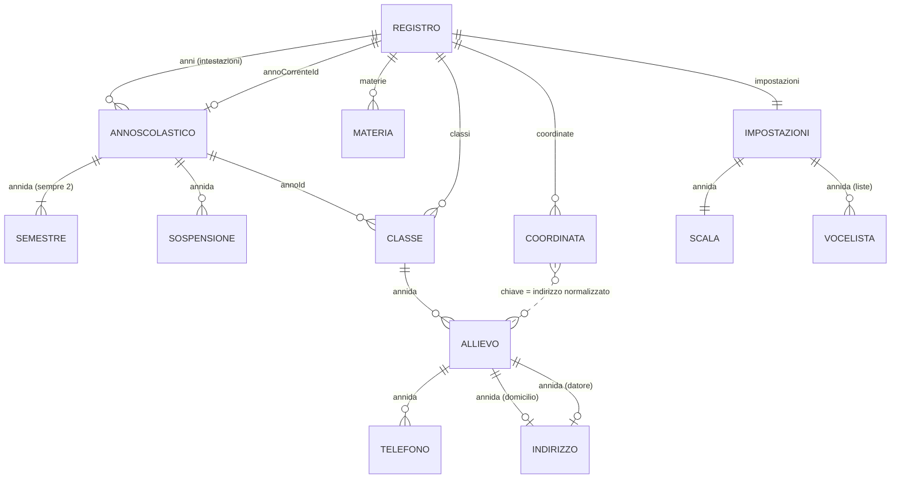
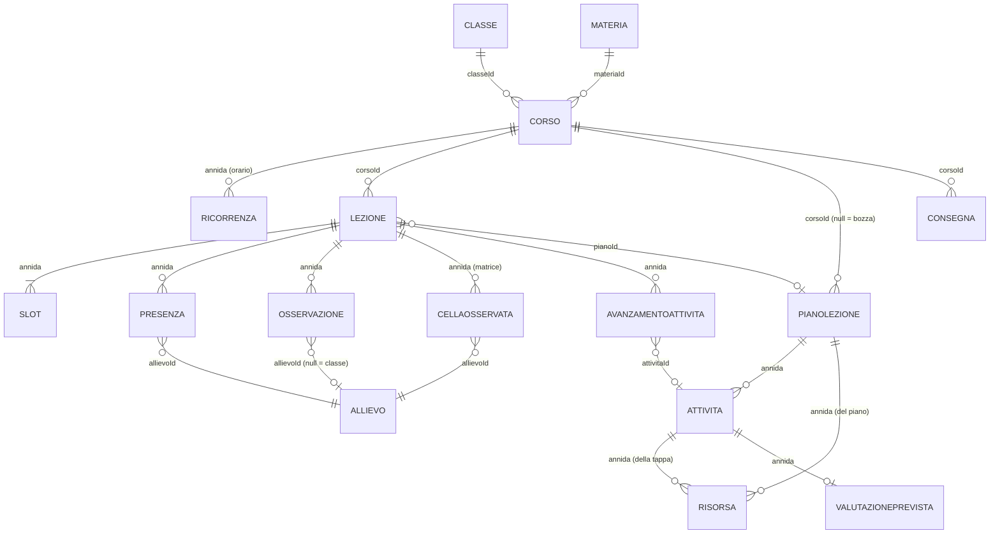
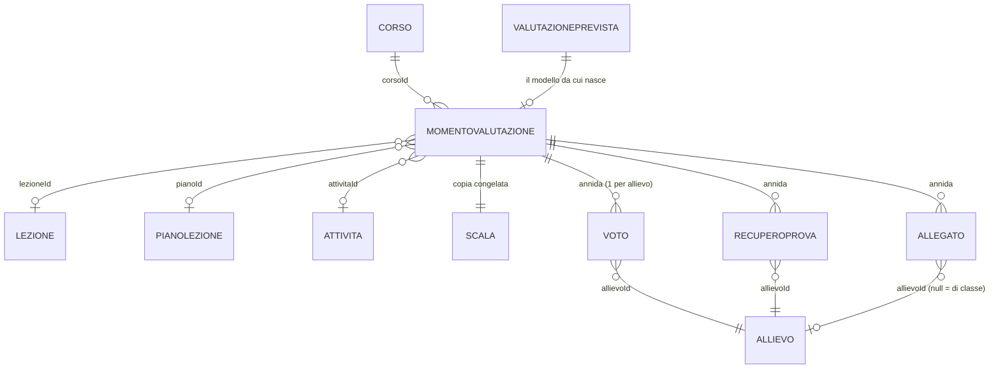
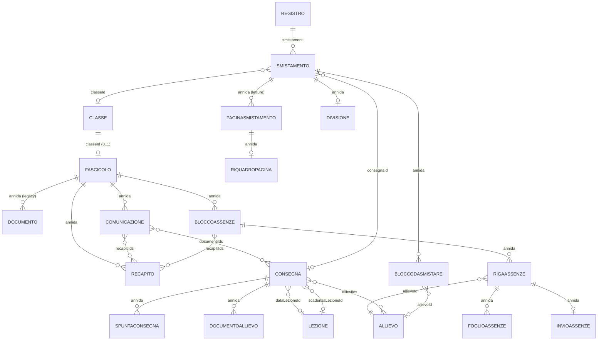
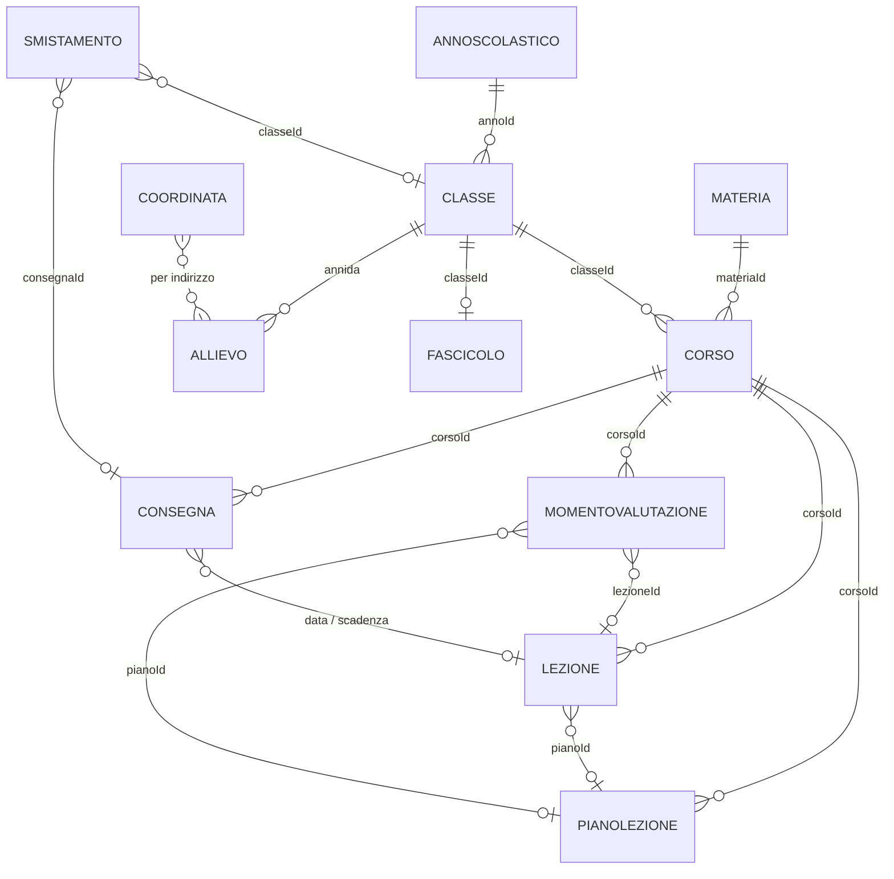

# Modello dati — riferimento completo

Riferimento campo per campo del modello di dominio del **Registro docenti**.
È il documento su cui si baserà un livello API tipizzato: ogni campo qui riportato
è stato verificato sul sorgente, non sulla documentazione.

Sorgenti di verità:

- [`../src/dominio/modelli.ts`](../src/dominio/modelli.ts) — le forme (1615 righe)
- [`../src/dominio/validazione.ts`](../src/dominio/validazione.ts) — validazione e normalizzazione (2456 righe)
- [`../src/dominio/fabbriche.ts`](../src/dominio/fabbriche.ts) — valori predefiniti (575 righe)
- [`../src/dominio/indirizzi.ts`](../src/dominio/indirizzi.ts) — `Indirizzo`, riesportato da `modelli.ts`
- [`../src/dominio/persistenza.ts`](../src/dominio/persistenza.ts) — come una collezione diventa testo
- [`../src/dominio/lessico.ts`](../src/dominio/lessico.ts) — il vocabolario e il motore grammaticale

## Indice

1. [Convenzioni di modello](#1-convenzioni-di-modello)
2. [Diagramma ER](#2-diagramma-er)
3. [Catalogo delle entità](#3-catalogo-delle-entità)
4. [Tipi enumerati](#4-tipi-enumerati)
5. [Stati derivati, mai persistiti](#5-stati-derivati-mai-persistiti)
6. [Le regole di calcolo che l'API deve rispettare](#6-le-regole-di-calcolo-che-lapi-deve-rispettare)
7. [Integrità referenziale](#7-integrità-referenziale)
8. [Persistenza](#8-persistenza)
9. [Il lessico](#9-il-lessico)
10. [Note per chi costruisce l'API](#10-note-per-chi-costruisce-lapi)

---

## 1. Convenzioni di modello

### 1.1 I tre alias di tempo, e perché mai `Date`

Dichiarati in testa a [`modelli.ts`](../src/dominio/modelli.ts) (righe 17–22), sono
tutti e tre `string`:

| Alias | Forma | A che serve |
|---|---|---|
| `Iso` | `'AAAA-MM-GG'` | Data di calendario. Nessun'ora, nessun fuso. |
| `Ora` | `'HH:MM'` su 24 ore | Ora del giorno. Le due cifre esistono perché si confronti come stringa. |
| `Istante` | ISO 8601 completo | Solo per ordinare e mostrare: `creatoIl`, `aggiornatoIl`, `aggiuntoIl`. |

Il motivo dichiarato nel sorgente è uno solo, e vale per l'API quanto per il file:

> «Il registro ragiona per giorni di calendario, non per istanti: `Date` con l'ora
> dentro sposta le lezioni di un giorno appena si cambia fuso, e non serve a niente qui.»

Conseguenze operative per un livello API:

- Un endpoint **non deve mai** serializzare una data di lezione come `Date`/epoch:
  il round-trip attraverso un fuso diverso cambierebbe il giorno.
- `Ora` è confrontabile con `<`/`>` **come stringa**: `'08:20' < '10:05'` è vero. È
  su questa proprietà che `unitaDidattiche`, `slotOrdinati` e `oraDaTenere` si reggono.
- L'aritmetica di calendario sta tutta in [`date.ts`](../src/dominio/date.ts), che usa
  `Date` **solo internamente e sempre in UTC**, come contatore di giorni.
- `oggi()`, `adesso()`, `istanteAdesso()` sono le **uniche** funzioni di dominio che
  leggono l'orologio. Tutto il resto del dominio riceve "oggi" come parametro esplicito.
  Un'API deve fare lo stesso: passare il giorno, non lasciarlo dedurre.

### 1.2 La regola di legame: annida / riferisci / copia / deriva

Sempre in testa a `modelli.ts` (righe 11–15), e applicata ovunque nel file:

> «annidare se non ha vita propria e muore col contenitore (uno slot, un voto);
> riferire se deve restare aggiornato (il nome della classe);
> copiare se deve restare com'era (la scala con cui è stato dato un voto);
> derivare se si ricava da altro — e allora non si scrive (il semestre).»

Un esempio reale per ciascuno dei quattro casi:

**Annidare — `Voto` dentro `MomentoValutazione`.**
`MomentoValutazione.voti: Voto[]`. Un voto non ha id proprio, si identifica per
`allievoId` dentro la prova, e non esiste se la prova non esiste. Cancellare il momento
cancella i voti senza cascata: `eliminazioni.ts` per il bersaglio `valutazione` non
scollega niente altrove, perché non c'è niente da scollegare.

**Riferire — `Corso.classeId` → `Classe.id`.**
Il corso non copia il nome della classe: lo pesca da `classeDelCorso()` ogni volta.
Rinominare «I MEC A» in «1 MEC A» cambia il titolo mostrato in tutte le viste senza
riscrivere una riga di corso. Il campo `Corso.titolo` esiste come testo libero editabile,
ma `vassoio.ts` compone deliberatamente `«Classe — Materia»` dalla catena e **non** da
`corso.titolo`, proprio perché il titolo può essere stato battuto a mano.

**Copiare — `MomentoValutazione.scala: Scala`.**
La scala è una **copia congelata** al momento della creazione della prova, non un
riferimento a `Impostazioni.scala`. Cambiare la scala del registro a febbraio non
riscrive i voti dati a novembre: `validaValutazione` controlla ogni voto contro
`momento.scala`, mai contro la scala corrente. Stessa logica in
`AvanzamentoAttivita.titolo`, che è una copia del titolo dell'attività al momento in cui
la spunta è stata messa — «non un rimando», dice il commento.

**Derivare — il semestre di una data.**
Nessuna entità porta un `semestreId`. Il semestre di una lezione o di una prova si trova
con `semestreDi(anno, data)` guardando dentro quali estremi cade. La migrazione v1→v2
ha **buttato** il campo `semestre` che stava sulle valutazioni: «lo dice già la data»
(commento in `normalizzaRegistro`). Stesso principio per `AnnoScolastico.inizio`/`fine`,
che sono derivate dai semestri e riscritte a ogni lettura da `annoAllineato()`.

### 1.3 Pieno in memoria, magro su disco

Due regole opposte che si compensano, ed è la coppia più importante per chi scrive un'API:

- **In memoria** ogni campo c'è sempre: `normalizza*` tappa ogni buco con il suo
  predefinito, così il resto del programma non deve chiedersi a ogni riga se un campo
  esiste. Una `nota` che a volte è `undefined` e a volte `''` sarebbe un `if` in ogni
  punto che la legge.
- **Su disco** i campi vuoti non si scrivono: `senzaVuoti` in
  [`persistenza.ts`](../src/dominio/persistenza.ts) toglie stringhe vuote e array vuoti.

Vedi [§8.4](#84-la-regola-di-persistenzats-senzavuoti) per l'invariante esatta.

### 1.4 Nessun vincolo di integrità nel type system

Tutti i riferimenti sono `string` (o `string | null`). TypeScript non li distingue da
qualunque altra stringa: **non esiste una sola foreign key** in questo modello. La
coerenza è tenuta da tre file distinti — `validazione.ts` (`riferimentiRotti`),
`eliminazioni.ts` (cascata) e `orfani.ts`/`riparazioni.ts` (riconciliazione) — e nessuno
dei tre blocca: segnalano e vanno avanti. Vedi [§7](#7-integrità-referenziale).

---

## 2. Diagramma ER

L'insieme completo è troppo fitto per un blocco solo: seguono quattro diagrammi d'area
più uno d'insieme.

### 2.1 Area anagrafica — anno, classi, persone, indirizzi



### 2.2 Area didattica — corsi, orario, lezioni, piani



### 2.3 Area valutazione — prove, voti, recuperi, allegati



### 2.4 Area documentale — fascicolo, assenze, consegne, smistamento



### 2.5 D'insieme — solo le entità con vita propria



Il **perno è il `Corso`**: classe e materia non compaiono su `Lezione`,
`MomentoValutazione`, `PianoLezione` o `Consegna` — tutto si aggancia a `corsoId`, e la
catena si risale con `corsi.ts`. L'anno non è scritto sul corso: lo porta la classe.

---

## 3. Catalogo delle entità

Legenda della colonna **obbl.**: `sì` = il tipo lo dichiara non opzionale (dopo la
normalizzazione c'è sempre); `no` = dichiarato con `?`; `null` = dichiarato
`T | null`, dove `null` ha un significato semantico preciso.

---

### 3.1 `Registro`

La radice. È lo stato **di un anno**, più l'elenco delle intestazioni di tutti gli anni.
`modelli.ts` righe 1565–1583.

| campo | tipo | obbl. | significato |
|---|---|---|---|
| `versione` | `number` | sì | `VERSIONE_DATI` con cui il file è stato scritto |
| `anni` | `AnnoScolastico[]` | sì | Intestazioni di **tutti** gli anni trovati, in ordine di inizio |
| `annoCorrenteId` | `string \| null` | null | Quale anno ha le collezioni caricate; `null` = nessuno |
| `materie` | `Materia[]` | sì | Le materie **dell'anno in uso** |
| `classi` | `Classe[]` | sì | |
| `corsi` | `Corso[]` | sì | |
| `lezioni` | `Lezione[]` | sì | |
| `piani` | `PianoLezione[]` | sì | |
| `valutazioni` | `MomentoValutazione[]` | sì | |
| `fascicoli` | `Fascicolo[]` | sì | |
| `consegne` | `Consegna[]` | sì | |
| `smistamenti` | `Smistamento[]` | sì | |
| `coordinate` | `Coordinata[]` | sì | Uno per **indirizzo**, non per persona |
| `impostazioni` | `Impostazioni` | sì | Anch'esse dell'anno in uso |

**Invarianti.** `annoCorrenteId` punta sempre a un anno presente in `anni`, oppure è
`null`: `normalizzaRegistro` lo riscrive con `anni[0]?.id ?? null` se non combacia.
`materie` e `impostazioni` appartengono all'anno in uso — «un anno chiuso deve restare
leggibile con le regole con cui è stato scritto».

**Chi valida/normalizza.** `normalizzaRegistro(grezzo)` — unico punto d'ingresso,
**non lancia mai**: al peggio restituisce un registro vuoto. `registroVuoto()` in
`fabbriche.ts` produce la forma iniziale. `riferimentiRotti(registro)` diagnostica.

---

### 3.2 `AnnoScolastico`

`modelli.ts` righe 68–106.

| campo | tipo | obbl. | significato |
|---|---|---|---|
| `id` | `string` | sì | |
| `etichetta` | `string` | sì | Come lo si chiama parlando: `'2025/2026'` |
| `inizio` | `Iso` | sì | **Derivato** dai semestri |
| `fine` | `Iso` | sì | **Derivato** dai semestri |
| `semestri` | `Semestre[]` | sì | Sempre due; la normalizzazione tronca a 2 (`.slice(0, 2)`) |
| `sospensioni` | `Sospensione[]` | sì | Vacanze e chiusure, valgono per tutte le classi |
| `settimane` | `Record<Iso, LetteraSettimana>` | no | Chiave = il **lunedì** che apre la settimana |
| `note` | `string` | no | |
| `cartella` | `string` | no | Nome della cartella su disco; **non persistito** |

**Invarianti.**
- I semestri devono essere **contigui**: il successivo comincia il giorno dopo la fine
  del precedente. `validaAnno` lo rifiuta, `allineaSemestri` lo ripara.
- `inizio`/`fine` devono coincidere con l'intervallo dei semestri: `validaAnno` segnala
  «Le date dell'anno non sono quelle dei suoi semestri», `annoAllineato` le riscrive.
- Le sospensioni devono cadere dentro l'anno (`validaAnno`).
- `settimane` non si calcola mai da una regola: si scrive a mano, lunedì per lunedì.
  Motivo dichiarato: «basta una settimana di vacanza in mezzo, o un recupero, e da lì
  in poi ogni settimana sarebbe sbagliata senza che niente lo dica».
- La chiave è una data e non un numero ISO di settimana: «il numero cambia significato a
  cavallo dell'anno solare».
- `cartella` non si scrive nel file: «è la cartella stessa a dirlo, e riscriverlo dentro
  vorrebbe dire poterlo contraddire spostando la cartella». Lo riempie `Archivio` in lettura.

**Chi valida/normalizza.** `validaAnno(anno)`; `normalizzaAnno` (privata, chiamata da
`normalizzaRegistro`) che passa il risultato per `annoAllineato()` di
[`anni.ts`](../src/dominio/anni.ts) e sanifica `settimane` con `ordinaSettimane`.
Fabbriche: `creaAnno(...)`, `creaAnnoCorrente()`.

---

### 3.3 `Semestre`

`modelli.ts` righe 31–37.

| campo | tipo | obbl. | significato |
|---|---|---|---|
| `id` | `string` | sì | |
| `numero` | `1 \| 2` | sì | Riassegnato per posizione in normalizzazione |
| `etichetta` | `string` | sì | Predefinita: `'1° semestre'`, `'2° semestre'` |
| `inizio` | `Iso` | sì | |
| `fine` | `Iso` | sì | |

**Invarianti.** «Nessuno lo cita per id — il semestre di una data si trova guardando
dentro quali estremi cade»: **non esiste un `semestreId` in nessuna entità**.
`numero` è riscritto da `normalizzaSemestri` in base all'indice (`indice === 0 ? 1 : 2`),
quindi è ridondante rispetto all'ordine. `numeroSemestre()` di `date.ts` legge però la
cifra dall'**etichetta** scritta dal docente, non dal campo `numero`, salvo che
l'etichetta non cominci per cifra.

**Chi valida/normalizza.** Dentro `validaAnno` (contiguità, `inizio < fine`) e
`normalizzaSemestri`. `semestriFra()` e `allineaSemestri()` in `anni.ts`.

---

### 3.4 `Sospensione`

`modelli.ts` righe 47–52.

| campo | tipo | obbl. | significato |
|---|---|---|---|
| `id` | `string` | sì | |
| `etichetta` | `string` | sì | Predefinita `'Sospensione'` |
| `dal` | `Iso` | sì | |
| `al` | `Iso` | sì | |

**Invarianti.** `al >= dal`: «una sospensione al contrario è un refuso: dura un giorno
invece di sparire» (`normalizzaSospensione` collassa `al` su `dal`). Deve cadere dentro
l'anno (`validaAnno`). Serve a due cose, e la seconda è quella per cui esiste: la
generazione dell'orario **salta** i giorni sospesi (`sospeso()` in `orario.ts`).

**Chi valida/normalizza.** `validaSospensione` (privata, usata da `validaAnno`),
`normalizzaSospensione`. Fabbrica: `creaSospensione(etichetta, dal, al)`.

---

### 3.5 `Materia`

`modelli.ts` righe 115–122.

| campo | tipo | obbl. | significato |
|---|---|---|---|
| `id` | `string` | sì | |
| `nome` | `string` | sì | Predefinito `'Materia'` |
| `sigla` | `string` | no | Per gli elenchi stretti: MAT, ITA, DIC |
| `colore` | `string` | no | |
| `note` | `string` | no | |

**Invarianti.** Unicità per **nome normalizzato** (`nomeNormalizzato` = minuscole, senza
diacritici, spazi compattati): `validaMateria` rifiuta `'Ed. fisica'` se esiste
`'ed.  fisica'`. È un'entità con id e non una parola scritta sulla classe proprio per
questo: «"matematica" e "Matematica" scritte in due momenti diversi non devono diventare
due materie diverse».

**Chi valida/normalizza.** `validaMateria(materia, altre)`, `normalizzaMateria`.
`materieSimili(nome, materie)` produce un **avviso non bloccante** (distanza di
Levenshtein ≤ 1, o ≤ 2 se entrambi i nomi sono lunghi ≥ 8) per intercettare i refusi.
`siglaMateria()` in `corsi.ts` ripiega su iniziali o prime 3 lettere se `sigla` manca.

---

### 3.6 `Ricorrenza`

Una fascia fissa dell'orario: lo «stampo» da cui nascono le lezioni.
`modelli.ts` righe 147–156.

| campo | tipo | obbl. | significato |
|---|---|---|---|
| `id` | `string` | sì | |
| `giorno` | `number` | sì | 1 = lunedì … 7 = domenica |
| `inizio` | `Ora` | sì | Predefinito `'08:00'` |
| `durataMin` | `number` | sì | Minuti; normalizzato a multiplo di `MINUTI_UD` |
| `aula` | `string` | no | |
| `dal` | `Iso` | no | Vigenza parziale: orari che cambiano a metà anno |
| `al` | `Iso` | no | |

**Invarianti.**
- `giorno` in `1..7`; fuori range → `1` in normalizzazione.
- `durataMin` deve essere un **multiplo intero di `MINUTI_UD` (45)**: `validaRicorrenza`
  lo rifiuta, `normalizzaRicorrenza` lo forza con `minutiInUd()`.
- Due fasce dello stesso corso non possono avere lo stesso `giorno` **e** lo stesso
  `inizio`: «genererebbero due volte la stessa lezione, e la seconda verrebbe scartata
  in silenzio».
- `dal <= al` quando entrambi presenti.
- **La lettera A/B non è un campo della ricorrenza.** L'alternanza quindicinale si
  ottiene con `Ricorrenza` distinte con `dal`/`al` opportuni: `letteraSettimana` è solo
  un'etichetta mostrata, non un filtro di generazione (`orario.ts`).

**Chi valida/normalizza.** `validaRicorrenza(ricorrenza, altre)`, `normalizzaRicorrenza`.
L'array `Corso.orario` è ordinato per `giorno`, poi `inizio`. Fabbrica:
`creaRicorrenza(giorno, inizio, durataMin)`.

---

### 3.7 `Corso`

Il perno del registro: questa materia, a questa classe. `modelli.ts` righe 158–170.

| campo | tipo | obbl. | significato |
|---|---|---|---|
| `id` | `string` | sì | |
| `classeId` | `string` | sì | → `Classe.id` |
| `materiaId` | `string` | sì | → `Materia.id` |
| `titolo` | `string` | sì | Testo libero: `'Calcolo professionale — DIC4a'`; predefinito `'Corso'` |
| `orario` | `Ricorrenza[]` | sì | Lo stampo settimanale |
| `note` | `string` | no | Il programma d'insegnamento, per ora testo libero |
| `creatoIl` | `Istante` | sì | |
| `aggiornatoIl` | `Istante` | sì | |

**Invarianti.**
- **Un solo corso per coppia (`classeId`, `materiaId`)**: è la sua identità.
  `validaCorso` lo rifiuta, `riferimentiRotti` lo segnala («Due corsi per la stessa
  materia nella stessa classe»).
- **L'anno non è scritto qui**: lo porta la classe. «Scriverlo di nuovo qui sarebbe solo
  un modo di poterlo scrivere sbagliato.»
- `titolo` è testo libero: non è affidabile come chiave. Le viste che devono essere
  coerenti (`vassoio.ts`) ricompongono `«Classe — Materia»` dalla catena.

**Chi valida/normalizza.** `validaCorso(corso, altri)`, `normalizzaCorso`.
`corsoDi(registro, classeId, materiaId)` in `corsi.ts` è il lookup per coppia.
Fabbrica: `creaCorso(classeId, materiaId, titolo)`.

---

### 3.8 `Classe`

`modelli.ts` righe 319–338.

| campo | tipo | obbl. | significato |
|---|---|---|---|
| `id` | `string` | sì | |
| `annoId` | `string` | sì | → `AnnoScolastico.id` |
| `nome` | `string` | sì | `'I MEC A'`; predefinito `'Classe senza nome'` |
| `sede` | `string` | no | |
| `colore` | `string` | sì | Esadecimale `#rrggbb` |
| `note` | `string` | no | |
| `allievi` | `Allievo[]` | sì | Annidati |
| `archiviata` | `boolean` | sì | Predefinito `false` |
| `docenteDiClasse` | `boolean` | sì | «Mestiere in più sulla stessa classe»; predefinito `false` |
| `creataIl` | `Istante` | sì | |
| `aggiornataIl` | `Istante` | sì | |

**Invarianti.**
- Nome unico **dentro lo stesso anno**, confronto case-insensitive (`validaClasse`).
- `colore` deve corrispondere a `/^#[0-9a-fA-F]{6}$/`; se non lo è, la normalizzazione
  ne assegna uno da `COLORI_CLASSE` a rotazione sull'indice della classe, «così due
  classi rimaste senza non escono tutte e due dello stesso blu».
- `archiviata` è l'alternativa non distruttiva alla cancellazione (vedi
  [§7.3](#73-la-cascata-di-eliminazione-per-i-nove-bersagli)).
- Il **fascicolo sta fuori** dalla classe, in una collezione propria: cresce di continuo
  (comunicazioni, assenze) mentre l'anagrafica si tocca poche volte.

**Chi valida/normalizza.** `validaClasse(classe, altre)`, `normalizzaClasse(grezzo, indice)`.
Fabbrica: `creaClasse(annoId, nome, coloriUsati)` con `coloreLibero()`.

---

### 3.9 `Allievo`

`modelli.ts` righe 217–308.

| campo | tipo | obbl. | significato |
|---|---|---|---|
| `id` | `string` | sì | |
| `cognome` | `string` | sì | |
| `nome` | `string` | sì | |
| `dataNascita` | `Iso` | no | Solo se è una data vera, altrimenti `''` |
| `indirizzo` | `Indirizzo` | no | Domicilio |
| `email` | `string` | no | |
| `emailTutore` | `string` | no | Del **rappresentante legale** |
| `azienda` | `string` | no | |
| `indirizzoDatore` | `Indirizzo` | no | Sede dell'azienda formatrice |
| `emailDatore` | `string` | no | È l'indirizzo a cui partono le richieste di firma |
| `telefoni` | `Telefono[]` | sì | Ordine = ordine di composizione |
| `foto` | `string` | no | **Percorso** relativo, mai base64 nel JSON |
| `attivo` | `boolean` | sì | Predefinito `true` |

**Invarianti.**
- `attivo: false` è un ritiro, **non** una cancellazione: «le lezioni passate lo citano
  ancora». È l'alternativa non distruttiva proposta da `eliminazioni.ts`.
- `dataNascita` illeggibile diventa `''`, non resta com'è: «un `'23.05.2010'` arrivato da
  un incolla resterebbe scritto nell'anagrafica e uscirebbe come un trattino su ogni foglio».
- Le tre e-mail sono validate solo **se presenti** (`validaAllievo`).
- `foto` è un percorso relativo alla cartella dell'archivio, non i byte.
- **Campi rimossi che non si rileggono più**: `note` (era un campo libero che non leggeva
  nessuno), `telefono`/`telefonoDatore` (migrati in `telefoni`), `geo`/`geoDatore`
  (migrati in `Registro.coordinate` da `coordinateDellAnno`, una volta sola). Restano
  scritti nei file vecchi e smettono di comparire al primo salvataggio.

**Chi valida/normalizza.** `validaAllievo(allievo)`, `normalizzaAllievo` (privata).
I telefoni passano per `normalizzaTelefoni(dati)`, che legge anche i due campi vecchi
senza duplicare. Fabbrica: `creaAllievo(cognome, nome)`.
Importazione da testo incollato: `leggiElencoAllievi()` in `importazione.ts`.

---

### 3.10 `Telefono`

`modelli.ts` righe 209–215.

| campo | tipo | obbl. | significato |
|---|---|---|---|
| `id` | `string` | sì | |
| `contatto` | `ContattoTelefonico` | sì | `'pif' \| 'rappresentante' \| 'datore'` |
| `etichetta` | `EtichettaTelefono` | sì | `'cellulare' \| 'casa' \| 'lavoro' \| 'centralino' \| 'altro'` |
| `numero` | `string` | sì | Scritto come lo si compone |

**Invarianti.**
- «Il registro non lo riformatta e non lo valida»: `numero` resta come battuto. La sola
  cosa che la normalizzazione fa è `conPrefissoInternazionale()`, che porta a `+41`
  **preservando la spaziatura originale**.
- Nessun doppione per la stessa coppia (`contatto`, `numero`).
- `separaNumeri()` spezza una cella con due numeri incollati, ma solo se ogni pezzo ha
  ≥ 6 cifre (altrimenti è un interno tipo `091.../01`). Solo il primo pezzo tiene l'id e
  l'etichetta scritta a mano: gli altri prendono un'etichetta proposta, perché
  «un'etichetta copiata dal primo direbbe che il fisso di casa è un cellulare».
- Tre contatti e non di più: «un quarto è una parola da inventare a cui non corrisponde
  nessun documento».

**Chi valida/normalizza.** `normalizzaTelefoni(dati)` dentro `normalizzaAllievo`.
[`telefoni.ts`](../src/dominio/telefoni.ts): `etichettaProposta`,
`etichettaInContraddizione` (segnala etichette sbagliate solo per numeri `+41`),
`numeroComponibile`. `riparazioni.ts` riassegna le etichette contraddittorie.
Fabbrica: `creaTelefono(...)`.

---

### 3.11 `Indirizzo`

Definito in [`indirizzi.ts`](../src/dominio/indirizzi.ts) e **riesportato** da
`modelli.ts` (riga 194).

| campo | tipo | obbl. | significato |
|---|---|---|---|
| `presso` | `string` | no | «c/o» |
| `via` | `string` | sì | |
| `casella` | `string` | no | Casella postale |
| `cap` | `string` | sì | |
| `localita` | `string` | sì | |
| `paese` | `string` | no | |

**Invarianti.**
- **Round-trip esatto**: `scriviIndirizzo(leggiIndirizzo(riga)) === riga` deve reggere,
  perché le coordinate geocodificate sono indicizzate sulla **riga testuale**. Per
  questo il parsing è deliberatamente prudente: quel che non riconosce lo lascia intero
  dentro `via` invece di scartarlo.
- CAP + località si riconoscono **solo in coda** (regex ancorata sull'ultimo pezzo
  separato da virgola); la casella postale ovunque; la via per esclusione
  (`sembraToponimo`: comincia con una parola-toponimo it/fr/de, o contiene una cifra).
- La normalizzazione accetta **anche una stringa**: un `Indirizzo` scritto come riga
  singola nei file vecchi passa per `leggiIndirizzo()` una volta sola.

**Chi valida/normalizza.** `normalizzaIndirizzo(grezzo)` in `validazione.ts`;
`leggiIndirizzo`/`scriviIndirizzo`/`chiaveIndirizzo` in `indirizzi.ts`.

---

### 3.12 `Fascicolo`

Il fascicolo del docente di classe. Collezione separata. `modelli.ts` righe 422–433.

| campo | tipo | obbl. | significato |
|---|---|---|---|
| `id` | `string` | sì | |
| `classeId` | `string` | sì | → `Classe.id` |
| `recapiti` | `Recapito[]` | sì | Annidati |
| `documenti` | `Documento[]` | sì | **Solo residuo legacy**, in conversione verso `Consegna` |
| `comunicazioni` | `Comunicazione[]` | sì | Annidate |
| `assenze` | `BloccoAssenze[]` | sì | Annidati |
| `creatoIl` | `Istante` | sì | |
| `aggiornatoIl` | `Istante` | sì | |

**Invarianti.**
- **Al più un fascicolo per classe.** Nasce solo se si è docente di classe di quella classe.
- `documenti` si svuota progressivamente: `documentiDiventatiConsegne(fascicoli, corsi)`
  li converte in `Consegna` e azzera `fascicolo.documenti = []` durante
  `normalizzaRegistro`.
- «Le tre raccolte dentro sono sue, non della classe» (commento a `normalizzaFascicolo`).
- I fascicoli che stavano dentro la classe nei file v1 vengono recuperati da
  `normalizzaRegistro` solo se contengono qualcosa (recapiti + documenti + comunicazioni > 0).

**Chi valida/normalizza.** `normalizzaFascicolo` (privata).
Fabbrica: `creaFascicolo(classeId)`. Lookup: `fascicoloDellaClasse()` in `corsi.ts`.

---

### 3.13 `Recapito`

`modelli.ts` righe 343–349.

| campo | tipo | obbl. | significato |
|---|---|---|---|
| `id` | `string` | sì | |
| `etichetta` | `string` | sì | Predefinita `'Recapito'` |
| `email` | `string` | sì | Trimmata in normalizzazione |
| `predefinito` | `boolean` | sì | **Predefinito `true`** |

**Invarianti.** `predefinito` significa «entra da solo fra i destinatari»:
`creaBloccoAssenze` pre-seleziona i recapiti con `predefinito === true`.
Attenzione per l'API: il valore di ripiego in normalizzazione è `true`, non `false`.

**Chi valida/normalizza.** `validaRecapito(recapito)` (etichetta non vuota + e-mail
valida), `normalizzaRecapito`. Fabbrica: `creaRecapito(etichetta, email, predefinito = true)`.

---

### 3.14 `Comunicazione`

E-mail alla classe. `modelli.ts` righe 392–411.

| campo | tipo | obbl. | significato |
|---|---|---|---|
| `id` | `string` | sì | |
| `oggetto` | `string` | sì | Predefinito `'Senza oggetto'` |
| `corpo` | `string` | sì | |
| `aAllievi` | `boolean` | sì | Predefinito `true` |
| `aTutori` | `boolean` | sì | Predefinito `false` |
| `recapitiIds` | `string[]` | sì | → `Recapito.id` |
| `documentiIds` | `string[]` | sì | Allegati: id di consegne «a me» con un file |
| `stato` | `StatoComunicazione` | sì | `'bozza' \| 'inviata' \| 'errore'`; predefinito `'bozza'` |
| `destinatari` | `string[]` | sì | **Copia** degli indirizzi reali, scritta solo dopo l'invio |
| `errore` | `string` | no | |
| `creataIl` | `Istante` | sì | |
| `inviataIl` | `Istante` | no | |

**Invarianti.**
- I destinatari si scelgono a **gruppi** (`aAllievi`/`aTutori`/`recapitiIds`): gli
  indirizzi veri si ricavano al momento dell'invio (`destinatariComunicazione`), solo
  fra gli allievi **attivi**.
- `destinatari` è una **copia congelata** post-invio: dice a chi è andata davvero.
- `validaComunicazione` richiede oggetto, corpo, e almeno un gruppo di destinatari.
- **Sempre in copia nascosta.** `comunicazioni.ts` mette gli indirizzi in Bcc/`ccn`,
  mai in `To`: «una comunicazione alla classe non è una rubrica». `componiPerInvio`
  non scrive nemmeno l'header `Bcc:` — i nascosti vanno solo nella busta `RCPT TO`.

**Chi valida/normalizza.** `validaComunicazione(comunicazione)`, `normalizzaComunicazione`.
Composizione in [`comunicazioni.ts`](../src/dominio/comunicazioni.ts).
Fabbrica: `creaComunicazione(fascicolo)`.

---

### 3.15 `Documento` (legacy)

**Non se ne creano più.** Esiste solo per non perdere quel che c'è nei fascicoli:
`documentiDiventatiConsegne` li converte in `Consegna`. `modelli.ts` righe 371–382.

| campo | tipo | obbl. | significato |
|---|---|---|---|
| `id` | `string` | sì | |
| `allievoId` | `string \| null` | null | `null` = documento di classe, o intestatario cancellato |
| `titolo` | `string` | sì | Predefinito `'Documento'` |
| `categoria` | `CategoriaDocumento` | sì | Predefinito `'altro'` |
| `file` | `string` | sì | Percorso relativo |
| `nome` | `string` | sì | Ripiego: `nomeDelFile(file)` |
| `scadenza` | `Iso` | no | Solo se è una data valida, altrimenti `undefined` |
| `note` | `string` | no | |
| `aggiuntoIl` | `Istante` | sì | |

**Invarianti.** `allievoId` collassa a `null` anche quando è la stringa vuota
(`typeof … === 'string' && dati.allievoId ? … : null`). Cancellando un allievo il
documento **resta e si scollega** (`allievoId = null`), non si cancella.

**Chi valida/normalizza.** `normalizzaDocumento` (privata). Nessun validatore dedicato:
non si creano più da interfaccia.

---

### 3.16 `BloccoAssenze`

Il periodo: dal foglio stampato alla firma che torna. `modelli.ts` righe 512–530.

| campo | tipo | obbl. | significato |
|---|---|---|---|
| `id` | `string` | sì | |
| `etichetta` | `string` | sì | Predefinita `'Periodo'`; di norma il nome del semestre |
| `dal` | `Iso` | sì | |
| `al` | `Iso` | sì | |
| `oggetto` | `string` | sì | Testo con segnaposto, compilato per allievo |
| `corpo` | `string` | sì | Idem |
| `aAllievo` | `boolean` | sì | Predefinito `false` |
| `aTutore` | `boolean` | sì | Predefinito `false` |
| `recapitiIds` | `string[]` | sì | → `Recapito.id` |
| `righe` | `RigaAssenze[]` | sì | Solo per chi ha qualcosa da far firmare |
| `note` | `string` | no | |
| `creatoIl` | `Istante` | sì | |
| `aggiornatoIl` | `Istante` | sì | |

**Invarianti.**
- `dal <= al`: un periodo al contrario **si raddrizza** invece di far rifiutare il file
  (le due date si scambiano in normalizzazione).
- `validaBloccoAssenze(blocco, anno?)` richiede date valide, `dal <= al`, oggetto e corpo
  non vuoti, e — se l'anno è noto — che il periodo **stia dentro l'anno**. Motivo: «un
  periodo che sborda è quasi sempre un anno sbagliato nella data — 2025 per 2026».
- Oggetto e corpo si controllano qui e non al momento dell'invio: «una bozza senza testo
  si salva volentieri, ma venticinque mail vuote partite in blocco non si richiamano indietro».
- Le righe senza `allievoId` si buttano.
- **Aggiornamento automatico dei testi di serie**: `oggettoAggiornato`/`corpoAggiornato`
  riscrivono la vecchia formula `'Assenze e ritardi — {allievo}'` in `'{tipi} — {allievo}'`
  e due frasi del corpo, **solo se il testo è rimasto identico a quello di serie**. Un
  testo riscritto dal docente non si tocca.

**Chi valida/normalizza.** `validaBloccoAssenze`, `normalizzaBloccoAssenze`.
Fabbrica: `creaBloccoAssenze(dal, al, fascicolo?, etichetta?)`, che pre-seleziona i
recapiti predefiniti e mette `CORPO_ASSENZE`.
Logica in [`assenze.ts`](../src/dominio/assenze.ts).

---

### 3.17 `RigaAssenze`

`modelli.ts` righe 488–494.

| campo | tipo | obbl. | significato |
|---|---|---|---|
| `allievoId` | `string` | sì | → `Allievo.id` |
| `fogli` | `FoglioAssenze[]` | sì | |
| `invio` | `InvioAssenze \| null` | null | `null` = non ancora spedito |
| `note` | `string` | no | |

**Invarianti.** «Esiste solo per chi ha qualcosa da far firmare»: niente righe vuote.
I fogli **senza `file`** si scartano: «è la riga che qualcuno ha cominciato a scrivere a
mano nel JSON e non ha finito, e tenerla vorrebbe dire una casella verde che non apre niente».
`righeVive(blocco)` filtra via le righe con `faseRiga === 'fuori'`.

**Chi valida/normalizza.** `normalizzaRigaAssenze`. Mutata in place — unica eccezione
del dominio insieme a `eliminazioni`/`riparazioni` — da `scriviFoglioAssenze` e
`togliFoglioAssenze` in `assenze.ts`.

---

### 3.18 `FoglioAssenze`

`modelli.ts` righe 458–466.

| campo | tipo | obbl. | significato |
|---|---|---|---|
| `tipo` | `TipoRapporto` | sì | `'assenze' \| 'ritardi'`; predefinito `'assenze'` |
| `firmato` | `boolean` | sì | Predefinito `false` |
| `file` | `string` | sì | Percorso relativo |
| `nome` | `string` | sì | Ripiego: `nomeDelFile(file)` |
| `aggiuntoIl` | `Istante` | sì | |

**Invarianti.** Vergine e firmato sono **due file distinti** da tenere entrambi, non uno
stato che cambia sullo stesso file. Un periodo è `'firmato'` solo se **ogni** foglio
vergine ha il suo corrispettivo firmato: «chiedere due fogli e riceverne uno solo non è
una pratica chiusa».
`TipoRapporto` sono due stampe distinte, non due colonne dello stesso foglio.

**Chi valida/normalizza.** `normalizzaFoglioAssenze`. `TIPI_RAPPORTO` è **esportato** da
`validazione.ts` («I due fogli di un periodo, nell'ordine in cui si guardano»).

---

### 3.19 `InvioAssenze`

`modelli.ts` righe 473–479.

| campo | tipo | obbl. | significato |
|---|---|---|---|
| `destinatari` | `string[]` | sì | Indirizzi reali |
| `inviatoIl` | `Istante` | sì | |
| `errore` | `string` | no | |

**Invarianti.** **Si scrive anche se l'invio è fallito**: un invio senza traccia si
ritenta alla cieca. `normalizzaInvioAssenze` ritorna `null` solo per `null`/`undefined`:
qualunque altra cosa produce una struttura, con `inviatoIl` riempito da `istanteAdesso()`.
Destinatario primario è il **datore di lavoro** — non una copia per conoscenza: è lui
che deve firmare. Se l'azienda non ha un indirizzo valido la mail **non parte**:
mandarla al solo allievo «chiuderebbe la pratica senza averla aperta».

**Chi valida/normalizza.** `normalizzaInvioAssenze`; logica di invio in `assenze.ts`.

---

### 3.20 `Lezione`

`modelli.ts` righe 673–706.

| campo | tipo | obbl. | significato |
|---|---|---|---|
| `id` | `string` | sì | |
| `corsoId` | `string` | sì | → `Corso.id` |
| `data` | `Iso` | sì | Predefinita `oggi()` |
| `slot` | `Slot[]` | sì | Almeno uno (la normalizzazione ne crea uno se manca) |
| `aula` | `string` | no | |
| `stato` | `StatoLezione` | sì | Predefinito `'pianificata'` |
| `pianoId` | `string \| null` | null | → `PianoLezione.id` |
| `avanzamento` | `AvanzamentoAttivita[]` | sì | Le spunte sulla scaletta |
| `presenze` | `Presenza[]` | sì | Una per allievo che ha una riga d'appello |
| `osservazioni` | `Osservazione[]` | sì | |
| `matrice` | `CellaOsservata[]` | no | **Si scrive solo se c'è qualcosa** |
| `argomenti` | `string` | no | Ripiego dal vecchio campo `titolo` |
| `materiali` | `string` | no | |
| `consuntivo` | `string` | no | |
| `creataIl` | `Istante` | sì | |
| `aggiornataIl` | `Istante` | sì | |

**Invarianti.**
- `validaLezione` richiede data valida, `corsoId` e slot validi (delega a `validaSlot`).
- Gli `stati` di ogni `Presenza` si **riallineano alla lunghezza dell'ora**: un'ora
  allungata da 2 a 4 UD trova due caselle vuote non impostate; un'ora accorciata lascia
  cadere quel che avanza. Il conteggio lo fa `contaUd()` sugli slot già normalizzati.
- `matrice` è opzionale **per compatibilità** con i registri scritti prima che esistesse,
  e si scrive solo quando ci sono celle: «le ore senza niente segnato non si portano
  dietro un elenco vuoto». Storicamente era un bug: la matrice non veniva riletta e
  «le caselle segnate duravano quanto la finestra».
- `argomenti` assorbe il vecchio campo `titolo` (`testo(dati.argomenti) || testo(dati.titolo)`).
- Il vecchio campo `compiti` è diventato una `Consegna` (`compitiDiventatiConsegne`),
  **già spuntata per tutti**: aprirle tutte «vorrebbe dire ritrovarsi a gennaio con
  quattrocento compiti arretrati».
- Una lezione la cui data cade fuori dall'anno del suo corso è segnalata da `riferimentiRotti`.
- Se `pianoId` è valorizzato, il piano deve essere **dello stesso corso** (`riferimentiRotti`).

**Chi valida/normalizza.** `validaLezione(lezione)`, `normalizzaLezione(grezzo, corsoId)`
(privata). Generazione dall'orario: `lezioniDaOrario()` in `orario.ts` — non distruttiva,
rilanciabile senza duplicare (confronto su chiave data + ora d'inizio).
Fabbriche: `creaLezione(...)`, `duplicaLezione(lezione, data)` che azzera stato, presenze,
osservazioni, matrice e consuntivo ma mantiene orario, piano e aula.

---

### 3.21 `Slot`

Una fascia dell'ora. `modelli.ts` righe 540–546.

| campo | tipo | obbl. | significato |
|---|---|---|---|
| `id` | `string` | sì | |
| `inizio` | `Ora` | sì | Predefinita `'08:00'` |
| `fine` | `Ora` | sì | Predefinita `'08:45'` |
| `tipo` | `'lezione' \| 'pausa'` | sì | Predefinito `'lezione'` |
| `etichetta` | `string` | no | |

**Invarianti** (`validaSlot(slot: Slot[])`, che valida l'**insieme**, non il singolo):
- Almeno uno slot per lezione.
- `inizio < fine` per ciascuno.
- Uno slot di tipo `lezione` dura un **multiplo esatto di `MINUTI_UD` (45)**. «Le pause
  durano i minuti che durano; un'ora di lezione no: è fatta di unità didattiche, e una
  mezza UD non esiste in nessun conteggio.»
- Nessuna sovrapposizione fra slot (`slotInConflitto`).
- **Una lezione fatta di sole pause non è una lezione.**
- Una pausa è uno slot come gli altri: stesso corso, stesso piano, stesse presenze. Ma
  `unitaDidattiche()` **salta le pause**: durante la pausa non si fa appello.

**Chi valida/normalizza.** `validaSlot(slot[])`, `normalizzaSlot`.
Fabbrica: `creaSlot(inizio, durataMin, tipo = 'lezione')`.

---

### 3.22 `Presenza`

`modelli.ts` righe 585–591.

| campo | tipo | obbl. | significato |
|---|---|---|---|
| `allievoId` | `string` | sì | → `Allievo.id` |
| `stati` | `StatoPresenza[]` | sì | **Una voce per Unità Didattica**, non una per l'ora |
| `minuti` | `number` | no | Minuti di ritardo; `undefined` ≠ `0` |
| `nota` | `string` | no | |

**Invarianti.**
- `stati.length === contaUd(lezione)`: la normalizzazione allinea sempre, con
  `Math.max(quante, 1)`.
- **Due modi diversi di allungare**, e la differenza è voluta: se il file ha `stati`
  (array), le caselle mancanti diventano `'non-impostato'` — sono UD aggiunte dopo, e
  nessuno ci ha fatto l'appello; se il file ha un solo `stato` (forma vecchia, per l'ora
  intera), quello si **ripete su tutte** le UD, «perché parlava dell'ora e non di una
  sua parte».
- `minuti: 0` è un ritardo di zero minuti che qualcuno ha battuto, ed è diverso da
  assente: `senzaVuoti` non lo toglie, e la normalizzazione lo distingue esplicitamente
  (`dati.minuti === undefined ? undefined : numero(dati.minuti, 0)`).
- Le presenze esistono solo per chi ha una riga; `appelloDi()` in `agendaLezione.ts`
  costruisce le righe dagli **allievi attivi della classe**, non da `lezione.presenze`,
  «per non perdere un iscritto arrivato a metà anno».

**Chi valida/normalizza.** `normalizzaPresenza(grezzo, quante)`.
Fabbrica: `creaPresenza(...)`. Lettura: `statoUd`, `statiAllineati`, `statoDellOra` in
[`calcoli.ts`](../src/dominio/calcoli.ts).

---

### 3.23 `Osservazione`

`modelli.ts` righe 602–609.

| campo | tipo | obbl. | significato |
|---|---|---|---|
| `id` | `string` | sì | |
| `allievoId` | `string \| null` | null | `null` = osservazione su **tutta la classe** |
| `tipo` | `TipoOsservazione` | sì | Predefinito `'nota'` |
| `testo` | `string` | sì | |
| `ora` | `Ora` | no | Solo se è un'ora valida, altrimenti `undefined` |
| `creataIl` | `Istante` | sì | |

**Invarianti.** `allievoId: null` è semanticamente «tutta la classe», non «intestatario
perso».
⚠️ **Attenzione per l'API**: qui la normalizzazione è
`typeof dati.allievoId === 'string' ? dati.allievoId : null` — **senza** il controllo di
verità che c'è su `Documento`/`Allegato`. Una stringa vuota **sopravvive** come
`allievoId: ''`, che non è né un allievo né `null`. Vedi [§10.2](#102-null-vuoto-e-stringa-vuota).

**Chi valida/normalizza.** `normalizzaOsservazione`.
Fabbrica: `creaOsservazione(...)`. Cancellando un allievo, le sue osservazioni
**si cancellano** (non si scollegano).

---

### 3.24 `CellaOsservata`

Una casella della matrice del comportamento. `modelli.ts` righe 633–647.

| campo | tipo | obbl. | significato |
|---|---|---|---|
| `allievoId` | `string` | sì | → `Allievo.id` |
| `aspetto` | `string` | sì | Valore di una voce della lista configurabile `aspettoOsservato` |
| `segno` | `SegnoOsservato \| null` | null | `null` = solo annotazione, senza giudizio |
| `nota` | `string` | no | Presente solo se non vuota |

**Invarianti.**
- **Le celle vuote non si salvano mai.** `normalizzaCellaOsservata` ritorna `null` se
  manca `allievoId`, manca `aspetto`, oppure **non c'è né segno né nota**. È la stessa
  regola con cui l'interfaccia la toglie invece di lasciarla lì a occupare una riga.
- `matriceLetta()` ritorna `{}` (niente campo `matrice`) quando non resta nessuna cella.
- `segno` è **binario e mai una scala 1–5**: una scala «costringerebbe a decidere sotto
  pressione». In stampa `NOMI_SEGNO` traduce `positivo`/`negativo` in «Molto bene» /
  «Da migliorare» — stessa parola su schermo e su carta.
- `aspetto` è il **valore** salvato di una `VoceLista`, non il testo mostrato: rinominare
  la voce non riscrive le celle.
- La lettura aggregata (`osservate.ts`) **esclude le ore annullate**.

**Chi valida/normalizza.** `normalizzaCellaOsservata` (ritorna `CellaOsservata | null`),
`matriceLetta`. Lettura: [`osservate.ts`](../src/dominio/osservate.ts).

---

### 3.25 `AvanzamentoAttivita`

`modelli.ts` righe 658–664.

| campo | tipo | obbl. | significato |
|---|---|---|---|
| `attivitaId` | `string` | sì | → `Attivita.id` dentro il piano |
| `titolo` | `string` | sì | **Copia** del titolo al momento, non un rimando |
| `stato` | `StatoAttivita` | sì | Predefinito `'da-fare'` |
| `nota` | `string` | no | |

**Invarianti.** `titolo` è una copia: se l'attività viene rinominata o cancellata nel
piano, la spunta resta leggibile. Quando il **piano** viene eliminato, però,
`avanzamento` si azzera insieme a `pianoId`: «le spunte erano di quelle attività: senza
il piano non dicono più niente, e lasciarle vorrebbe dire mostrare un consuntivo di nulla».

**Chi valida/normalizza.** `normalizzaAvanzamento`.

---

### 3.26 `PianoLezione`

`modelli.ts` righe 848–860.

| campo | tipo | obbl. | significato |
|---|---|---|---|
| `id` | `string` | sì | |
| `corsoId` | `string \| null` | null | `null` = bozza ancora senza casa |
| `obiettivi` | `string[]` | sì | Le voci vuote si scartano |
| `prerequisiti` | `string` | no | |
| `attivita` | `Attivita[]` | sì | La scaletta |
| `risorse` | `Risorsa[]` | sì | **Dell'intero piano**, distinte da quelle di una tappa |
| `note` | `string` | no | Assorbe il vecchio campo `titolo` |
| `tag` | `string[]` | sì | Le voci vuote si scartano |
| `creatoIl` | `Istante` | sì | |
| `aggiornatoIl` | `Istante` | sì | |

**Invarianti.**
- **Non ha un titolo proprio**: si compone con `nomePiano()` da corso + numero/data della
  lezione che lo usa. Il vecchio `titolo` finisce in cima alle `note`, salvo che fosse un
  riempitivo (`'piano senza titolo'`, `'senza titolo'`, `'nuovo piano'`), che si butta.
- **Non ha più una «valutazione prevista» a livello di piano.** Era in disaccordo con la
  scaletta: «il piano prometteva una verifica e la scaletta ne aveva due, o nessuna».
  `valutazioneSullaScaletta()` la sposta sulla prima tappa di tipo `verifica`; se non ce
  n'è nessuna, **aggiunge** una tappa `verifica` in fondo, «perché una prova che si
  faceva davvero non deve sparire dal piano».
- `validaPiano` **richiede** `corsoId`: un piano senza corso «finiva in un elenco dove non
  lo cercava nessuno». I piani con `corsoId: null` esistono solo perché il corso è stato
  eliminato sotto, e il pannello li mostra apposta in fondo da riagganciare.
- Ogni attività deve avere titolo e `durataUd > 0` (`validaPiano`).
- I piani **non si filtrano per anno**: un piano vecchio resta duplicabile (`pianiDelCorso`).

**Chi valida/normalizza.** `validaPiano(piano)`, **`normalizzaPiano(grezzo, corsoId)`
— esportata**. Fabbriche: `creaPiano(corsoId = null)`, `duplicaPiano(piano)`.

---

### 3.27 `Attivita`

Una tappa della scaletta. `modelli.ts` righe 770–814.

| campo | tipo | obbl. | significato |
|---|---|---|---|
| `id` | `string` | sì | |
| `titolo` | `string` | sì | Predefinito `'Attività'` |
| `tipo` | `TipoAttivita` | sì | Predefinito `'spiegazione'` |
| `durataUd` | `number` | sì | **Unità didattiche**, mai minuti; minimo `0.01` |
| `descrizione` | `string` | no | |
| `materiali` | `string` | no | |
| `raggruppamento` | `Raggruppamento` | no | Normalizzato a `'plenaria'` se assente |
| `risorse` | `Risorsa[]` | sì | Della singola tappa |
| `parametri` | `Record<string, string \| number \| boolean>` | no | Chiavi ammesse dipendono dal tipo |
| `valutazione` | `ValutazionePrevista \| null` | no | «La tappa **è** la prova, non il piano intero» |

**Invarianti.**
- `durataUd` è in **UD e non in minuti** perché «l'unità dipende dalla scuola e
  dall'orario»: un'attività da venti minuti resta mezza unità anche dove le UD sono da
  cinquanta. I piani vecchi scritti in `durataMin` si convertono dividendo per `MINUTI_UD`,
  **senza arrotondare al quarto**: «un'attività da venti minuti riletta come mezza unità
  tornerebbe a schermo da ventitré».
- `parametri` si tiene **così com'è**: una chiave che il registro non prevede più non si
  butta, ma i valori che non sono `string`/`number`/`boolean` sì, «perché non saprebbero
  come mostrarsi» (`parametriPuliti`). L'elenco delle chiavi pertinenti per ogni tipo sta
  in [`attivita.ts`](../src/dominio/attivita.ts); le chiavi non più previste restano nei
  dati e smettono di essere mostrate.
- ⚠️ `raggruppamento` è dichiarato opzionale ma `normalizzaAttivita` **lo scrive sempre**
  (`unaVoce(…, 'plenaria')`): dopo un giro di lettura c'è sempre.

**Chi valida/normalizza.** Dentro `validaPiano`; `normalizzaAttivita` (privata),
`parametriPuliti`. Fabbrica: `creaAttivita(titolo, durataUd)`.

---

### 3.28 `Risorsa`

`modelli.ts` righe 750–763.

| campo | tipo | obbl. | significato |
|---|---|---|---|
| `id` | `string` | sì | |
| `tipo` | `TipoRisorsa` | sì | `'collegamento' \| 'file' \| 'immagine'`; predefinito `'collegamento'` |
| `titolo` | `string` | sì | Ripiego a catena: `nome` → `nomeDelFile(file)` → `url` → `'Risorsa'` |
| `url` | `string` | no | **Solo** se `tipo === 'collegamento'` **e** l'URL è valido |
| `file` | `string` | no | **Solo** se `tipo !== 'collegamento'` |
| `nome` | `string` | no | |
| `note` | `string` | no | |
| `aggiuntaIl` | `Istante` | sì | |

**Invarianti.**
- **Il tipo comanda su che cosa si tiene.** Un collegamento con URL non valido diventa
  «una riga senza link invece di un link rotto»; un file senza percorso resta «annunciato
  ma non ancora arrivato».
- `urlValido` accetta **solo `http:` e `https:`**: «da un documento non deve partire
  niente che non sia una pagina — `javascript:` e `file:` restano fuori».
- Una risorsa **senza né url né file** è segnalata da `riferimentiRotti`: «è una riga che
  non porta da nessuna parte».

**Chi valida/normalizza.** `validaRisorsa(risorsa)`, `urlValido(valore)`,
`normalizzaRisorsa`. Fabbrica: `creaRisorsa(tipo, titolo)`.

---

### 3.29 `ValutazionePrevista`

Il modello da cui nasce il momento vero. `modelli.ts` righe 873–877.

| campo | tipo | obbl. | significato |
|---|---|---|---|
| `titolo` | `string` | sì | Predefinito `'Verifica'` |
| `tipo` | `TipoValutazione` | sì | Predefinito `'scritto'` |
| `peso` | `number` | sì | Portato in `[0, 10]` da `pesoValido` |

**Invarianti.** Vive **solo dentro `Attivita.valutazione`**. `null`/`undefined` significa
che quella tappa non è una prova. Non è un `MomentoValutazione`: è il modello da cui il
momento nasce quando la lezione si svolge.

**Chi valida/normalizza.** `normalizzaValutazionePrevista` (ritorna `null` per
`null`/`undefined`), `pesoValido`, `valutazioneSullaScaletta`.

---

### 3.30 `MomentoValutazione`

`modelli.ts` righe 996–1052.

| campo | tipo | obbl. | significato |
|---|---|---|---|
| `id` | `string` | sì | |
| `corsoId` | `string` | sì | → `Corso.id` |
| `lezioneId` | `string \| null` | null | Se la prova combacia con un'ora |
| `pianoId` | `string \| null` | null | |
| `attivitaId` | `string \| null` | no | La **tappa** del piano che l'ha prodotto |
| `titolo` | `string` | sì | Predefinito `'Momento di valutazione'` |
| `tipo` | `TipoValutazione` | sì | Predefinito `'scritto'` |
| `data` | `Iso` | sì | Predefinita `oggi()` |
| `peso` | `number` | sì | `[0, 10]`; `1` di norma; **`0` = non fa media** |
| `scala` | `Scala` | sì | **Copia congelata** al momento |
| `descrizione` | `string` | no | |
| `voti` | `Voto[]` | sì | Uno per allievo |
| `recuperi` | `RecuperoProva[]` | no | Tabella supplementare |
| `allegati` | `Allegato[]` | sì | Quelli senza `file` si scartano |
| `creatoIl` | `Istante` | sì | |
| `aggiornatoIl` | `Istante` | sì | |

**Invarianti.**
- `validaValutazione` richiede titolo, data valida, `corsoId`; `peso` finito in `[0, 10]`;
  la scala valida; **ogni voto dentro `momento.scala`** (non la scala corrente del registro).
- `peso: 0` è ammesso ed è deliberato: «la prova si fa, si corregge e non conta in media».
  Prima il minimo era `0.1` e «per dire che una prova non contava bisognava non metterci
  i voti». Sopra `10` si rifiuta perché «ribalterebbe una media intera senza dirlo».
- La `scala` non è un riferimento: cambiare `Impostazioni.scala` **non riscrive** i voti dati.
- **Il triangolo momento–lezione–piano**: se `momento.pianoId` e `lezione.pianoId` (della
  lezione citata) sono entrambi popolati, devono coincidere. Controllato da
  `riferimentiRotti`, non bloccante.
- `lezioneId` deve puntare a una lezione **dello stesso corso** (`riferimentiRotti`).
- La data deve cadere dentro un semestre dell'anno (`riferimentiRotti`).
- Voti di allievi non iscritti alla classe: segnalati, non bloccati.
- **Migrazioni una tantum**: la vecchia `riconsegnataIl` di classe scende su ogni voto
  che non ne ha una propria (`conRiconsegnaDelMomento`); i recuperi che stavano dentro il
  voto (`voto.recupero`) risalgono in `recuperi` (`recuperiDellaProva`). Entrambe valgono
  una volta sola: dal salvataggio successivo i campi vecchi non ci sono più.

**Chi valida/normalizza.** `validaValutazione(momento)`, **`normalizzaValutazione(grezzo,
corsoId)` — esportata**. Fabbrica: `creaValutazione(...)`.
Diagnosi dei momenti scollegati: [`orfani.ts`](../src/dominio/orfani.ts).

---

### 3.31 `Voto`

`modelli.ts` righe 879–898.

| campo | tipo | obbl. | significato |
|---|---|---|---|
| `allievoId` | `string` | sì | → `Allievo.id` |
| `valore` | `number \| null` | null | `null` = **non ancora messo**, ≠ `0` |
| `assente` | `boolean` | sì | Predefinito `false` |
| `nota` | `string` | no | |
| `riconsegnataIl` | `Iso \| null` | no | **Per allievo**, non per la classe |

**Invarianti.**
- `valore: null` non è zero. Un valore non numerico — `'4,5'` scritto a mano con la
  virgola — diventa `null` in normalizzazione, **mai uno zero silenzioso**: «è un voto
  che non si legge, e resta vuoto invece di crollare la media».
- `riconsegnataIl` è **per allievo**: è la sola riconsegna che il registro conosce. La
  data unica di classe è stata tolta perché «diceva "la classe l'ha riavuta" anche di chi
  quel giorno mancava, ed erano proprio quei due o tre fogli a restare nella cartella fino
  a giugno». Una data illeggibile vale `null` = «non riconsegnata», «che è la verità che
  si conosce».
- `assente: true` con `valore` valorizzato è possibile: il voto c'è comunque, ma
  `mediaAllievo` e `mediaMomento` scartano gli assenti.
- Non entra in media: assente, `valore === null`, o momento con `peso <= 0`.

**Chi valida/normalizza.** Dentro `validaValutazione` (fuori scala → errore);
`normalizzaVoto`, `conRiconsegnaDelMomento`.

---

### 3.32 `RecuperoProva`

Tabella **supplementare**, non un secondo momento di valutazione.
`modelli.ts` righe 916–943.

| campo | tipo | obbl. | significato |
|---|---|---|---|
| `allievoId` | `string` | sì | → `Allievo.id` |
| `previstoIl` | `Iso \| null` | null | `null` finché non è fissato |
| `riconsegnataIl` | `Iso \| null` | no | |
| `nota` | `string` | no | |
| `dispensato` | `boolean` | no | Decisione **esplicita**, mai dedotta |
| `aggiornatoIl` | `Istante` | sì | |

**Invarianti.**
- **Una riga che non dice niente non si salva**: `normalizzaRecupero` ritorna `null` se
  mancano `previstoIl`, `nota`, `dispensato` e `riconsegnataIl` tutti insieme — «tenerla
  vorrebbe dire un recupero "da fissare" che compare due volte».
- Senza `allievoId` la riga si scarta.
- **I recuperi si deducono, non si dichiarano da zero**: un allievo è da recuperare se la
  sua casella voto è vuota **e** (è segnato assente al momento **oppure** l'appello
  dell'ora in cui si è svolta la prova lo dice assente, via `assenteAllOra` →
  `statoDellOra`). Un voto messo chiude il recupero come `'fatto'` anche senza riga esplicita.
- **La dispensa è sempre esplicita**: «non si rinuncia mai da soli».

**Chi valida/normalizza.** `normalizzaRecupero` (ritorna `RecuperoProva | null`),
`recuperiDellaProva`. Logica in [`recuperi.ts`](../src/dominio/recuperi.ts).
⚠️ Vedi [§10.3](#103-lacune-note): `eliminazioni.ts` non filtra `recuperi` quando si
cancella un allievo.

---

### 3.33 `Allegato`

`modelli.ts` righe 979–989.

| campo | tipo | obbl. | significato |
|---|---|---|---|
| `id` | `string` | sì | |
| `ruolo` | `RuoloAllegato` | sì | Predefinito `'verifica'` |
| `allievoId` | `string \| null` | null | `null` = allegato di classe (il testo, la soluzione) |
| `nome` | `string` | sì | Ripiego: `nomeDelFile(file)` → `'allegato.pdf'` |
| `file` | `string` | sì | Percorso relativo |
| `aggiuntoIl` | `Istante` | sì | |

**Invarianti.** Gli allegati **senza `file`** si scartano in
`normalizzaValutazione` (`.filter((a) => a.file !== '')`).
Cancellando un allievo, l'allegato con il suo `allievoId` **si scollega** (`allievoId = null`)
e **il file resta**: «la prova corretta resta, buttarla non era la domanda». È l'unico
punto dell'intera cascata dell'allievo in cui si scollega un file invece di cancellarlo.

**Chi valida/normalizza.** `normalizzaAllegato`.

---

### 3.34 `Scala`

`modelli.ts` righe 946–952.

| campo | tipo | obbl. | significato |
|---|---|---|---|
| `min` | `number` | sì | Predefinito `1` |
| `max` | `number` | sì | Predefinito `6` |
| `sufficienza` | `number` | sì | Predefinita `4` |
| `passo` | `number` | sì | Predefinito `0.25` (quarti) |

**Invarianti.**
- `min < max`: `normalizzaScala` forza `max = min + 1` se non lo è.
- `sufficienza` clampata dentro `[min, max]`.
- `passo > 0`: se no, torna a `SCALA_PREDEFINITA.passo`.
- `validaScala` applica le stesse regole del modulo: «quel che un modulo rifiuterebbe, un
  file scritto a mano non lo deve far passare dalla porta di servizio».
- Vive in due posti con due semantiche diverse: `Impostazioni.scala` (quella corrente, per
  le prove nuove) e `MomentoValutazione.scala` (una **copia congelata** per prova).

**Chi valida/normalizza.** `validaScala(scala)`, `normalizzaScala`.
`SCALA_PREDEFINITA = { min: 1, max: 6, sufficienza: 4, passo: 0.25 }` (scala ticinese).

---

### 3.35 `Consegna`

`modelli.ts` righe 1141–1236.

| campo | tipo | obbl. | significato |
|---|---|---|---|
| `id` | `string` | sì | |
| `corsoId` | `string` | sì | → `Corso.id` |
| `testo` | `string` | sì | Che cosa fare |
| `tipo` | `TipoConsegna` | sì | Predefinito `'compito'` |
| `a` | `DestinatarioConsegna` | sì | `'classe' \| 'docente' \| 'allievi'`; predefinito `'classe'` |
| `allieviIds` | `string[]` | sì | **Solo** con `a === 'allievi'`, altrimenti `[]` |
| `dataLezioneId` | `string \| null` | null | Se nata in un'ora, il rimando **vince** sulla data |
| `data` | `Iso` | sì | Predefinita `oggi()` |
| `scadenzaLezioneId` | `string \| null` | null | |
| `scadenza` | `Iso \| null` | null | |
| `note` | `string` | no | |
| `documento` | `CategoriaDocumento` | no | **Presente ⇒ è una richiesta di documento** |
| `verso` | `VersoDocumento` | no | Esiste solo se `documento` esiste; predefinito `'ricevo'` |
| `modoConsegna` | `ModoConsegna` | no | Esiste solo se `documento` esiste; predefinito `'mano'` |
| `mailAllievo` | `boolean` | no | Normalizzato a `true` se assente |
| `mailTutore` | `boolean` | no | Normalizzato a `true` se assente |
| `oggettoMail` | `string` | no | |
| `corpoMail` | `string` | no | |
| `documenti` | `DocumentoAllievo[]` | no | Uno per allievo |
| `fileTutti` | `string` | no | Documento uguale per tutti (circolare) |
| `nomeTutti` | `string` | no | |
| `firmeRichieste` | `boolean` | no | Esiste solo se `documento` esiste; predefinito `false` |
| `fileFirme` | `string` | no | Foglio firme **unico** per tutta la classe |
| `nomeFirme` | `string` | no | |
| `fatte` | `SpuntaConsegna[]` | sì | Quelle senza `chi` si scartano |
| `creataIl` | `Istante` | sì | |
| `aggiornataIl` | `Istante` | sì | |

**Invarianti.**
- `documento` è **il flag** che distingue una consegna normale (si spunta e basta) da una
  richiesta di documento. `verso`, `modoConsegna` e `firmeRichieste` sono `undefined`
  quando `documento` è `undefined`, e valorizzati con i loro predefiniti quando c'è.
- `allieviIds` si azzera se `a !== 'allievi'`: «tenerli su una consegna di classe vorrebbe
  dire un elenco che non si vede da nessuna parte e che al primo ritocco dice il falso».
- `validaConsegna` richiede `testo` e `corsoId`; con `a === 'allievi'` almeno un allievo;
  la scadenza valida; la scadenza non prima della data (solo quando **entrambe** sono
  date esplicite, non rimandi a lezione); e rifiuta `a === 'docente'` con
  `verso === 'consegno'` — «un documento che consegno io non può avere me come destinatario».
- **Una consegna senza destinatari non è completa.** Caso comune a settembre: la classe
  esiste, gli allievi non sono ancora iscritti. Altrimenti «sparirebbe fra le fatte un
  minuto dopo averla scritta».
- **Non esiste una chiusura globale**: è finita quando l'ha fatta ognuno dei destinatari.
  «Spunta tutti» scrive N spunte, una per nome. Il vecchio campo `chiusa` è stato
  convertito in spunte da `conSpunteDiChiusura` — una volta sola.
- **Migrazione delle spunte con file**: i file che stavano dentro `SpuntaConsegna` si
  spostano in `documenti`; la spunta perde `file`/`nome`. Se un documento per quella
  persona c'era già, il file della spunta **resta scritto lì**: «un percorso buttato è un
  file che nessuno ritrova più».
- La consegna sopravvive alla lezione: cancellando la lezione, la **data viene copiata
  prima** di azzerare il rimando.

**Chi valida/normalizza.** `validaConsegna(consegna)`, **`normalizzaConsegna(grezzo)` —
esportata**. Fabbrica: `creaConsegna(...)` con `CORPO_CONSEGNA`.
Logica in [`consegne.ts`](../src/dominio/consegne.ts): `documentoPer()` (prima il file
specifico dell'allievo, poi `fileTutti`), `daConsegnareA`, `senzaDocumento`.

---

### 3.36 `SpuntaConsegna`

`modelli.ts` righe 1118–1139.

| campo | tipo | obbl. | significato |
|---|---|---|---|
| `chi` | `string` | sì | `Allievo.id` **oppure** `CHI_INSEGNA` (`'docente'`) |
| `fattaIl` | `Istante` | sì | |
| `nota` | `string` | no | |
| `file` | `string` | no | Il documento con cui si è spuntata |
| `nome` | `string` | no | Presente solo se c'è `file` |
| `modo` | `ModoConsegna` | no | `undefined` se non dichiarato |
| `destinatari` | `string[]` | no | |

**Invarianti.** `CHI_INSEGNA = 'docente'` è la costante esportata con cui il docente
compare fra chi deve spuntare — attenzione: **nessun allievo può avere quell'id**.
Le spunte senza `chi` si scartano. `modo` distingue `undefined` («non si sa») da un
valore esplicito: la normalizzazione lo lascia `undefined` se manca, invece di ripiegare
su `'mano'`.
`riferimentiRotti` segnala gli `chi` che non sono né `CHI_INSEGNA` né un iscritto.

**Chi valida/normalizza.** `normalizzaSpunta` (privata).

---

### 3.37 `DocumentoAllievo`

Un documento raccolto per una consegna. `modelli.ts` righe 1090–1096.

| campo | tipo | obbl. | significato |
|---|---|---|---|
| `allievoId` | `string` | sì | → `Allievo.id` |
| `file` | `string` | sì | Percorso relativo |
| `nome` | `string` | sì | Ripiego: `nomeDelFile(file)` |
| `aggiuntoIl` | `Istante` | sì | |

**Invarianti.** ⚠️ **Il tipo non è esportato** da `modelli.ts`: è
`interface DocumentoAllievo` senza `export` (riga 1090). Compare nella firma pubblica
solo attraverso `Consegna.documenti`. Un livello API che voglia nominarlo deve
ridichiararlo o esportarlo.
Le voci senza `allievoId` o senza `file` si scartano. La normalizzazione legge anche il
vecchio nome di campo `daConsegnare`.

**Chi valida/normalizza.** Inline dentro `normalizzaConsegna`.

---

### 3.38 `Smistamento`

Un PDF scansionato da dividere per allievo. `modelli.ts` righe 1356–1411.

| campo | tipo | obbl. | significato |
|---|---|---|---|
| `id` | `string` | sì | |
| `consegnaId` | `string \| null` | null | → `Consegna.id` |
| `classeId` | `string \| null` | null | → `Classe.id` |
| `file` | `string` | sì | Il PDF in quarantena |
| `nome` | `string` | sì | Ripiego: `nomeDelFile(file)` |
| `pagine` | `number` | sì | ≥ 0 |
| `letture` | `PaginaSmistamento[]` | sì | **Il dato**: i blocchi si ricavano da qui |
| `assegnate` | `Array<{…}>` | sì | Vedi sotto |
| `blocchi` | `BloccoDaSmistare[]` | sì | Quel che resta da decidere; vuoto = fatto |
| `errore` | `string` | no | |
| `divisione` | `Divisione` | no | ⚠️ **non riletta in normalizzazione** — vedi §10.3 |
| `arrivatoIl` | `Istante` | sì | |

Struttura di `assegnate[i]` (anonima, righe 1383–1400):

| campo | tipo | obbl. | significato |
|---|---|---|---|
| `allievoId` | `string` | sì | Vuoto solo per il foglio firme |
| `consegnaId` | `string` | no | |
| `firme` | `true` | no | Il foglio firme **non è di nessuno** |
| `assenze` | `{ classeId, bloccoId, tipo: TipoRapporto, firmato }` | no | Le pagine cadono su un periodo di assenze |
| `da` | `number` | sì | Pagina d'inizio, ≥ 1 |
| `a` | `number` | sì | Pagina di fine, ≥ `da` |

**Invarianti.**
- `letture` è **il dato** e si ordina per `numero`; i `blocchi` sono derivati e si
  ricalcolano.
- `assegnate` scarta le voci senza `allievoId` **e** senza `firme`.
- `assenze` richiede sia `classeId` sia `bloccoId`: senza, l'assegnazione vale come
  archiviata in una consegna.
- Un intervallo rovesciato si raddrizza (`a = max(da, a)`).
- **Un allievo riceve al massimo un blocco per passata** (invariante di `smistamento.ts`).
- Quarantena obbligatoria se: manca la consegna, nessun riconoscimento, ambiguo
  (stacco < 0.2 fra i primi due candidati), fiducia sotto `FIDUCIA_SUFFICIENTE = 0.7`,
  allievo non fra i destinatari attesi, o allievo che ha già consegnato
  (protezione anti-sovrascrittura).

**Chi valida/normalizza.** `normalizzaSmistamento` (privata), `destinazioneAssenze`.
Fabbrica: `creaSmistamento(file, nome, pagine, consegnaId, classeId, divisione)`.
Motore: [`smistamento.ts`](../src/dominio/smistamento.ts).

---

### 3.39 `PaginaSmistamento`

`modelli.ts` righe 1289–1316.

| campo | tipo | obbl. | significato |
|---|---|---|---|
| `numero` | `number` | sì | ≥ 1 |
| `testo` | `string` | sì | Testo estratto |
| `lettura` | `'testo' \| 'ocr' \| 'niente'` | sì | Predefinita `'niente'` |
| `anteprima` | `string` | no | Percorso relativo |
| `riquadroNome` | `RiquadroPagina` | no | Dove è stato letto il nome |

**Invarianti.** `lettura` predefinita è `'niente'` qui, mentre in `BloccoDaSmistare` è
`'testo'` — la differenza è voluta: una pagina di cui non si sa niente non si dichiara
letta.

**Chi valida/normalizza.** Inline dentro `normalizzaSmistamento`, con `riquadroPagina()`.

---

### 3.40 `RiquadroPagina`

`modelli.ts` righe 1319–1324.

| campo | tipo | obbl. | significato |
|---|---|---|---|
| `x` | `number` | sì | Frazione del foglio, `0,0` = alto-sinistra |
| `y` | `number` | sì | |
| `larghezza` | `number` | sì | |
| `altezza` | `number` | sì | |

**Invarianti.** Tutti i valori clampati in `[0, 1]`; `larghezza` clampata anche a `1 - x`
e `altezza` a `1 - y`. Se `larghezza <= 0` o `altezza <= 0` il riquadro **non esiste**
(`undefined`): «un riquadro che comincia a metà e largo il doppio della pagina
disegnerebbe un rettangolo che esce dall'immagine».

**Chi valida/normalizza.** `riquadroPagina(grezzo)` (privata).

---

### 3.41 `BloccoDaSmistare`

`modelli.ts` righe 1259–1279.

| campo | tipo | obbl. | significato |
|---|---|---|---|
| `id` | `string` | sì | |
| `da` | `number` | sì | ≥ 1 |
| `a` | `number` | sì | ≥ `da` |
| `allievoId` | `string \| null` | null | `null` = non riconosciuto |
| `motivo` | `MotivoQuarantena` | sì | Predefinito `'senza-nome'` |
| `estratto` | `string` | sì | Il testo su cui si è deciso |
| `fiducia` | `number` | sì | Clampata in `[0, 1]`; predefinita `0` |
| `lettura` | `'testo' \| 'ocr' \| 'niente'` | sì | Predefinita `'testo'` |
| `anteprima` | `string` | no | |

**Invarianti.** Intervallo raddrizzato e arrotondato agli interi. `allievoId` collassa a
`null` anche per la stringa vuota.
⚠️ `'a-mano'` è un `MotivoQuarantena` valido nel tipo ed è **prodotto** da
`smistamento.ts`, ma **non compare** nell'elenco `MOTIVI_QUARANTENA` di `validazione.ts`:
alla rilettura diventa `'senza-nome'`. Vedi [§10.3](#103-lacune-note).

**Chi valida/normalizza.** `normalizzaBlocco` (privata).

---

### 3.42 `Divisione`

Union discriminata. `modelli.ts` righe 1350–1354.

| variante | campi | significato |
|---|---|---|
| `{ modo: 'nomi' }` | — | Divide riconoscendo i nomi nelle pagine |
| `{ modo: 'passo', pagine: number }` | `pagine: number` | N pagine a testa |
| `{ modo: 'mano' }` | — | Divisione decisa dal docente |

**Invarianti.** `divisioneDi(smistamento)` fornisce il ripiego per gli smistamenti
scritti prima che il campo esistesse.
⚠️ Il campo `Smistamento.divisione` **non viene riletto** da `normalizzaSmistamento`:
di fatto non sopravvive a un ciclo di lettura. Vedi [§10.3](#103-lacune-note).

**Chi valida/normalizza.** Nessun normalizzatore: `divisioneDi()` in `smistamento.ts`.

---

### 3.43 `Coordinata`

Un indirizzo collocato sulla mappa. Perno **sull'indirizzo, non sulla persona**.
`modelli.ts` righe 1532–1563.

| campo | tipo | obbl. | significato |
|---|---|---|---|
| `chiave` | `string` | sì | Indirizzo ridotto (`chiaveIndirizzo`): **è l'id della voce** |
| `indirizzo` | `string` | sì | Come lo ha scritto il docente: è quel che si rilegge |
| `lat` | `number` | sì | |
| `lon` | `number` | sì | |
| `etichetta` | `string` | no | Come l'ha interpretato il geocodificatore |
| `approssimato` | `boolean` | no | Punto del paese, **non del portone** |
| `trovatoIl` | `Istante` | sì | |

**Invarianti.**
- `chiave` si **ricalcola sempre** dall'indirizzo, mai si legge dal file: «una chiave
  scritta a mano che non corrisponde produrrebbe una voce che nessuno ritrova più».
- Una coordinata senza `indirizzo`, con `lat`/`lon` non finiti, o con `|lat| > 90` /
  `|lon| > 180` **non si legge affatto** (`normalizzaCoordinata` ritorna `null`): vale
  come «non l'abbiamo ancora cercato».
- A parità di chiave **vince la risposta più recente** (`trovatoIl` maggiore).
- L'elenco è ordinato per `chiave` con collazione italiana.
- Perché una raccolta a sé e non un campo dell'allievo: «un indirizzo non appartiene a
  una persona. Due fratelli hanno la stessa casa, sei persone in formazione hanno la
  stessa azienda». Con la chiave sull'indirizzo, la domanda al geocodificatore si fa una
  volta sola, e da lì nascono i collegamenti — chi abita dove abita un altro.
- `approssimato` esiste perché «la differenza va detta, o il segnaposto verrebbe preso
  per un portone e qualcuno ci andrebbe in macchina».

**Chi valida/normalizza.** `normalizzaCoordinata` (ritorna `Coordinata | null`),
`coordinateDellAnno(dati, classiGrezze)` che raccoglie anche i vecchi `allievo.geo` e
`allievo.geoDatore`, una volta sola. `chiaveIndirizzo()` in `indirizzi.ts`.

---

### 3.44 `Impostazioni`

`modelli.ts` righe 1415–1480.

| campo | tipo | obbl. | significato |
|---|---|---|---|
| `scala` | `Scala` | sì | La scala corrente, per le prove nuove |
| `passoFineSemestre` | `number` | sì | `[0, 10]`; **`0` = non arrotondare**; predefinito `0.5` |
| `sogliaAssenza` | `number` | sì | Percento, `[0, 100]`; **`0` = spenta**; predefinita `20` |
| `oraInizioGiornata` | `Ora` | sì | Predefinita `'07:30'` |
| `oraFineGiornata` | `Ora` | sì | Predefinita `'18:00'` |
| `giorniVisibili` | `number[]` | sì | Valori in `1..7`; predefiniti `[1,2,3,4,5]` |
| `durataSlotPredefinita` | `number` | sì | Minuti, forzata a multiplo di UD; predefinita `MINUTI_UD` |
| `durataPausaPredefinita` | `number` | sì | Minuti, ≥ 1; predefinita `15` |
| `pdfAutomatici` | `QuandoRifarePdf` | sì | Predefinito `'sempre'` |
| `liste` | `Record<string, VoceLista[]>` | no | **Solo le liste cambiate** rispetto a quelle di fabbrica |

**Invarianti.**
- `passoFineSemestre` clampato in `[0, 10]`: «sopra il massimo della scala sarebbe un
  passo che schiaccia ogni nota su un valore solo».
- `sogliaAssenza` clampata in `[0, 100]`: «una soglia al 200% non segnala nessuno, una
  negativa li segnala tutti».
- `durataPausaPredefinita` ha minimo **1 minuto, non 5**: «il dominio non deve rifiutare
  quel che il modulo lascia scrivere».
- `pdfAutomatici` con un valore irriconoscibile torna al **predefinito**, non a `'mai'`:
  «un refuso non deve lasciare la cartella ferma senza dirlo a nessuno».
- `giorniVisibili` vuoto ricade sui predefiniti.
- `liste` contiene solo le liste **modificate**; `normalizzaListe` scarta le voci
  malformate, deduplica per valore, e per le **liste chiuse** scarta i valori che non
  sono fra i predefiniti (si può rinominare e riordinare, non inventare un valore nuovo).
- Le impostazioni **appartengono all'anno in uso**: «la scala dei voti e la griglia
  oraria cambiano fra un anno e l'altro».

**Chi valida/normalizza.** **`normalizzaImpostazioni(grezzo)` — esportata**;
`normalizzaListe` in [`liste.ts`](../src/dominio/liste.ts).
Predefiniti: `IMPOSTAZIONI_PREDEFINITE` in `fabbriche.ts`.

---

### 3.45 `VoceLista`

`modelli.ts` righe 1493–1496.

| campo | tipo | obbl. | significato |
|---|---|---|---|
| `valore` | `string` | sì | **Ciò che si salva** |
| `testo` | `string` | sì | **Ciò che si legge** |

**Invarianti.**
- Le otto chiavi di lista sono: `tipoAttivita`, `tipoValutazione`, `raggruppamento`,
  `supporto`, `correzione`, `composizioneGruppi`, `temaDocenza`, `aspettoOsservato`.
- **Liste aperte vs chiuse.** Aperte = testo libero, nessun significato per il programma.
  Chiuse = il `valore` guida campi, colori e conteggi altrove: si può rinominare e
  riordinare, mai inventare un valore nuovo.
- `vociConValore` garantisce che un valore **selezionato ma non più in lista** compaia
  comunque, con etichetta `"… (tolta dall'elenco)"`: così il dato salvato non cambia al
  primo render.
- `definizioneLista(chiave)` **lancia** `Error` su chiave sconosciuta — è l'unico punto
  del dominio con un'eccezione.

**Chi valida/normalizza.** `normalizzaListe`, `vociDiLista`, `vociConValore`,
`listaCambiata`, `testoDiVoce` in [`liste.ts`](../src/dominio/liste.ts).

---

## 4. Tipi enumerati

Tutte union di stringhe. La colonna **fallback in lettura** è il valore che
`normalizza*` produce per un valore non riconosciuto: nessuna di queste letture lancia mai.

| Tipo | Dove | Valori | Valori rimossi ancora letti | Fallback in lettura |
|---|---|---|---|---|
| `StatoPresenza` | `modelli.ts:566` | `non-impostato`, `presente`, `assente`, `ritardo`, `esonerato` | `giustificato` → `assente`; `uscita-anticipata` → `ritardo` (`STATI_VECCHI`) | **`non-impostato`**, mai `presente` |
| `StatoLezione` | `modelli.ts:666` | `pianificata`, `svolta`, `annullata` | — | `pianificata` |
| `StatoAttivita` | `modelli.ts:649` | `da-fare`, `svolta`, `parziale`, `saltata` | — | `da-fare` |
| `StatoComunicazione` | `modelli.ts:384` | `bozza`, `inviata`, `errore` | — | `bozza` |
| `TipoAttivita` | `modelli.ts:710` | `docenza-di-classe`, `introduzione`, `spiegazione`, `esercizio`, `laboratorio`, `discussione`, `verifica`, `gruppo`, `ripasso`, `compito`, `altro` | — | `spiegazione` |
| `Raggruppamento` | `modelli.ts:735` | `plenaria`, `individuale`, `coppie`, `gruppi` | — | `plenaria` |
| `TipoValutazione` | `modelli.ts:864` | `scritto`, `orale`, `pratico`, `progetto`, `compito`, `osservazione` | — | `scritto` |
| `TipoOsservazione` | `modelli.ts:593` | `nota`, `merito`, `disciplina`, `compiti`, `materiale`, `colloquio` | — | `nota` |
| `SegnoOsservato` | `modelli.ts:620` | `positivo`, `negativo` | — | **`null`** (= solo annotazione) |
| `TipoConsegna` | `modelli.ts:1098` | `compito`, `studio`, `materiale`, `consegna`, `preparazione`, `amministrativo`, `altro` | — | `compito` |
| `DestinatarioConsegna` | `modelli.ts:1108` ⚠️ non esportato | `classe`, `docente`, `allievi` | — | `classe` |
| `ModoConsegna` | `modelli.ts:1074` ⚠️ non esportato | `mano`, `email` | — | `mano` se `documento` c'è; `undefined` sulla spunta se il campo manca |
| `VersoDocumento` | `modelli.ts:1071` | `ricevo`, `consegno` | — | `ricevo` (solo se `documento` è definito, altrimenti `undefined`) |
| `CategoriaDocumento` | `modelli.ts:351` | `certificato`, `autorizzazione`, `giustificazione`, `modulo`, `altro` | — | `altro` |
| `RuoloAllegato` | `modelli.ts:966` | `verifica`, `soluzione`, `prova`, `recupero`, `recupero-soluzione` | — | `verifica` |
| `TipoRisorsa` | `modelli.ts:737` | `collegamento`, `file`, `immagine` | — | `collegamento` |
| `TipoRapporto` | `modelli.ts:444` | `assenze`, `ritardi` | — | `assenze` |
| `ContattoTelefonico` | `modelli.ts:196` | `pif`, `rappresentante`, `datore` | campi `telefono` → `pif`; `telefonoDatore` → `datore` | nessun `unaVoce`: il contatto è imposto da chi chiama |
| `EtichettaTelefono` | `modelli.ts:206` | `cellulare`, `casa`, `lavoro`, `centralino`, `altro` | — | `etichettaProposta()` (euristica CH: prefisso `07x` → `cellulare`) |
| `MotivoQuarantena` | `modelli.ts:1243` | `a-mano`, `senza-nome`, `senza-testo`, `ambiguo`, `gia-consegnato`, `fuori-elenco`, `senza-consegna`, `da-confermare` | — | `senza-nome`. ⚠️ **`a-mano` non è nell'elenco di normalizzazione**: alla rilettura diventa `senza-nome` |
| `LetteraSettimana` | `modelli.ts:62` | `A`, `B` | — | la voce si **butta** (`ordinaSettimane`), non si ripiega |
| `QuandoRifarePdf` | `modelli.ts:1483` | `mai`, `chiusura`, `sempre` | — | `IMPOSTAZIONI_PREDEFINITE.pdfAutomatici` = `sempre` |
| `Collezione` | `modelli.ts:1605` | `registro`, `classi`, `corsi`, `lezioni`, `piani`, `valutazioni`, `fascicoli`, `consegne`, `smistamenti`, `coordinate` | — | nessuno: non è un dato salvato, è la dichiarazione di che file toccare |
| `GenereRapporto` | `collocazioni.ts:192` | `lezione`, `piano`, `valutazioni`, `presenze`, `fascicolo`, `allievo`, `momento`, `foto-classe` | — | nessuno: arriva dall'azione `rapporto.genera`, non dal file |
| — `Slot.tipo` | `modelli.ts:544` | `lezione`, `pausa` | — | `lezione` |
| — `lettura` (smistamento) | `modelli.ts:1272`, `1294` | `testo`, `ocr`, `niente` | — | `testo` nel blocco, **`niente`** nella pagina |

**La regola generale**, e vale per l'API quanto per il file: *enum chiusi, ma con un
fallback esplicito in lettura*. `unaVoce(valore, ammesse, predefinito)` non lancia mai.
Il caso emblematico è `StatoPresenza`: qualunque stringa sconosciuta diventa
`'non-impostato'` e **mai** `'presente'`, perché «di una casella scritta male non si sa
niente, e dire che l'allievo c'era sarebbe inventarselo».

---

## 5. Stati derivati, mai persistiti

Nessuno di questi appare in `modelli.ts` né in un file JSON. Si ricalcolano a ogni
lettura, da funzioni pure che ricevono `oggi`/`ora` come parametri.

| Tipo | Dove | Valori | Chi lo calcola, e da che cosa |
|---|---|---|---|
| `StatoConsegna` | [`consegne.ts:326`](../src/dominio/consegne.ts) | `aperta`, `scade`, `arretrata`, `completa` | `statoConsegna(registro, consegna, classe, giorno)`. `completa` se `avanzamentoConsegna` dice che tutti i destinatari hanno spuntato; senza scadenza è `aperta`; scadenza = oggi → `scade`; scadenza < oggi → `arretrata` |
| `StatoRecupero` | [`recuperi.ts:52`](../src/dominio/recuperi.ts) | `da-fissare`, `fissato`, `oggi`, `scaduto`, `fatto`, `dispensato` | `statoDelRecupero(registro, momento, allievoId, giorno)`. Dal voto (se c'è → `fatto`), dalla riga `RecuperoProva`, e da `assenteAllOra` che guarda `statoDellOra` sulla lezione collegata |
| `StatoRiconsegna` | [`riconsegne.ts:34`](../src/dominio/riconsegne.ts) | `da-correggere`, `da-riconsegnare`, `riconsegnata` | Dai `Voto`: se mancano voti → `da-correggere`; se ci sono tutti ma non tutti i `riconsegnataIl` → `da-riconsegnare`; `riconsegnata` solo quando l'ultimo foglio individuale è tornato |
| `FaseAssenze` | [`assenze.ts:90`](../src/dominio/assenze.ts) | `fuori`, `da-spedire`, `in-attesa`, `firmato` | `faseRiga(riga)`. Da `FoglioAssenze` (vergini vs firmati) e da `InvioAssenze`. Ordine di fase rigido: senza foglio vergine non c'è niente da mandare |
| `FaseOra` | [`cruscotto.ts:140`](../src/dominio/cruscotto.ts) | `annullata`, `in-corso`, `da-chiudere`, `svolta`, `da-preparare`, `futura` | `faseDellOra(registro, lezione, oggi, ora)`. Distinta **sia** da `lezione.stato` dichiarato **sia** da `statoDellOra` per-allievo |
| `MotivoOrfano` | [`orfani.ts:25`](../src/dominio/orfani.ts) ⚠️ non esportato | `senza-piano`, `senza-tappa`, `piano-sparito`, `tappa-sparita`, `tappa-non-valuta` | `motivoOrfano(registro, momento)`. Verifica in ordine e ritorna il **primo** motivo che spiega la rottura — «un piano sparito spiega già tutto» |
| `StatoAgenda` | [`agenda.ts:79`](../src/dominio/agenda.ts) ⚠️ non esportato | `ok`, `senza-registro`, `prima-dell-anno`, `dopo-l-anno` | Dalla settimana richiesta confrontata con `intervalloAnno`. Distingue **perché** una settimana è vuota |

### 5.1 Perché non stanno nel file

Tre ragioni, tutte esplicite nel codice:

1. **Sarebbero già sbagliati domani mattina.** `StatoConsegna`, `StatoRecupero` e
   `FaseOra` dipendono da `oggi`: una consegna «aperta» scritta ieri sarebbe «arretrata»
   stamattina senza che nessuno abbia toccato niente. Un campo persistito andrebbe
   riscritto a ogni apertura del registro — cioè ricalcolato comunque, con in più il
   rischio che qualcuno legga la copia vecchia.

2. **Sono già interamente determinati dai dati veri.** `StatoRiconsegna` è una funzione
   dei `Voto`; `FaseAssenze` una funzione dei `FoglioAssenze`; `MotivoOrfano` una
   funzione dei riferimenti. Scriverli sarebbe **denormalizzazione**: due fonti per lo
   stesso fatto, e nessuna regola per dire quale vince quando divergono. Il registro sta
   in una cartella sincronizzata dove «OneDrive sincronizza, non fonde»: una divergenza
   non si risolverebbe.

3. **Non sono decisioni di nessuno.** La distinzione che il modello tiene è fra *fatto*
   e *conseguenza*. La dispensa da un recupero (`RecuperoProva.dispensato`) **è** una
   decisione, e infatti si scrive. Lo stato `'dispensato'` è la sua conseguenza, e non si
   scrive. Stessa cosa per `StatoAgenda`: non è uno stato del registro, è la risposta a
   «perché questa settimana è vuota».

Conseguenza per l'API: questi stati vanno esposti come **campi calcolati in risposta**
(read-only), mai accettati in scrittura. Un `PATCH` che provasse a impostare
`statoConsegna: 'completa'` andrebbe rifiutato: il modo di chiudere una consegna è
scrivere N `SpuntaConsegna`.

---

## 6. Le regole di calcolo che l'API deve rispettare

Tutto in [`calcoli.ts`](../src/dominio/calcoli.ts) e
[`matriceCorso.ts`](../src/dominio/matriceCorso.ts) — puro, nessun I/O.

### 6.1 Unità didattiche e `MINUTI_UD`

`MINUTI_UD = 45` ([`date.ts:199`](../src/dominio/date.ts)).

`unitaDidattiche(lezione)` spezza **solo gli slot di tipo `lezione`** (mai le pause) in
fette da 45 minuti, con l'ultima più corta se il totale non è multiplo esatto: «meglio
una colonna corta che un'ora che sparisce dall'appello». Marca `dopoUnaPausa: true` sulla
prima UD di ogni slot dopo il primo.

`contaUd(lezione)` è la lunghezza che l'appello deve avere. `Presenza.stati[i]` è per
**UD**, non per l'ora intera: è la premessa di tutto il resto.

Un'API che accetta un appello **deve** validare `stati.length === contaUd(lezione)`, o
riallineare come fa `normalizzaPresenza`.

### 6.2 `contaComeAssenza`

```ts
export function contaComeAssenza (stato: StatoPresenza): boolean {
  return stato === 'assente'
}
```

**Solo `assente`.** Una funzione unica per i tre conti che la usano — quadro dell'allievo,
riepilogo dell'ora, matrice del corso — e quindi anche per tutto quel che ne discende:
percentuali di fine semestre, rapporti stampati, soglia di segnalazione.

- **Il ritardo non è mezz'ora persa.** Chi entra alla terza UD di un blocco di quattro ha
  le prime due segnate `assente` — quelle sono le ore perse, e si contano da sé — e la
  terza, quella in cui è arrivato, è un'ora in cui c'era. Contarla anche come assenza
  vorrebbe dire toglierla due volte.
- **L'esonero non penalizza mai**: c'è un'autorizzazione dietro, e abbassare la frequenza
  «vorrebbe dire penalizzarlo per un permesso che gli è stato dato».
- I minuti di ritardo restano in `Presenza.minuti` e si contano **a parte**, per ora e
  non per UD.

«Scritta tre volte, era tre occasioni di cambiarne una sola.» Un'API non deve
reimplementarla.

### 6.3 `statoDellOra`

Riassume un'ora in uno stato solo, per chi ha spazio per uno solo. Vince il caso peggiore
che non sia una scusa:

```
nessuna UD decisa  →  'non-impostato'
qualche 'assente'  →  'assente'
qualche 'ritardo'  →  'ritardo'
TUTTE 'esonerato'  →  'esonerato'
altrimenti         →  'presente'
```

Nota la differenza: `assente` e `ritardo` bastano **uno**; `esonerato` richiede **tutte**.
«Le caselle mute non fanno numero né in un senso né nell'altro»: le UD `non-impostato`
sono filtrate via prima del confronto.

### 6.4 Media pesata e il peso 0

`mediaAllievo(momenti, allievoId)` → `{ media, pesoTotale, conteggio }`.

Esclude, momento per momento: voto assente, `valore` non numerico, e **`peso <= 0`**.

```ts
const p = momento.peso
if (!(p > 0)) continue   // peso 0 = «non fa media»
```

> «Prima lo zero veniva letto come uno — una guardia contro i dati storti — e una prova
> dichiarata senza peso finiva per contare come tutte le altre.»

`media` è `null` quando il peso totale è zero: **una media di zero voti non è zero**.
Arrotondamento al **centesimo** (`arrotondaCentesimo`), e si arrotonda dove si calcola,
non dove si stampa: «un 3.995 si leggeva "4" e veniva colorato come un'insufficienza,
perché il confronto con la sufficienza guardava il numero lungo».

`mediaMomento(momento)` è invece la media **non pesata** dei voti effettivi della classe.
`TotaliClasse.media` in `matriceCorso` è la **media delle medie individuali** (ogni
allievo peso 1, non pesata sul numero di voti; chi non ha voti è escluso, non conta 0).

### 6.5 `notaFineSemestre` e i due arrotondamenti distinti

Sono due regole diverse e **non vanno unificate**:

| Funzione | Passo | Quando |
|---|---|---|
| `arrotondaVoto(valore, scala)` | `scala.passo` (di norma `0.25`, quarti) | Mentre si corregge: la grana con cui si scrive una prova |
| `notaFineSemestre(media, scala, passoFineSemestre)` | `Impostazioni.passoFineSemestre` (di norma `0.5`, mezzi) | La regola con cui una media diventa la nota che va sulla pagella |

Entrambe clampano dentro `[scala.min, scala.max]`.
`notaFineSemestre` ritorna `null` per una media `null` o non finita, e con
`passoFineSemestre <= 0` **restituisce la media non arrotondata**: «c'è chi la nota la
scrive a mano guardando il numero esatto».

### 6.6 I tre denominatori di `matriceCorso.ts`

Il punto più delicato dell'intero modello. Tre grandezze che l'API **non deve mai
confondere né fondere in un numero solo**:

| Grandezza | Che cos'è | È il denominatore di |
|---|---|---|
| **`ud`** | UD «a calendario»: quelle che risultano dalle lezioni passate in input | **Niente.** È un conteggio di colonne, non un denominatore |
| **`udConAppello`** | Fra le UD a calendario, quelle con un appello effettivamente compilato per quell'allievo (stato ≠ `non-impostato`) | **`presenza`** |
| **`udPreviste`** | Le UD che **l'orario del corso prevede** nel periodo, da `udPrevisteDaOrario()` in `orario.ts` — non le lezioni a calendario | **`assenza`** e **`presenzaPreviste`** |

Perché la differenza conta:

- **`udConAppello`** protegge dagli appelli dimenticati: «un'ora mai appellata non entra
  né a numeratore né a denominatore, altrimenti un appello dimenticato farebbe crollare
  la percentuale di tutta la classe». `presenza` dice **quanto quel dato è affidabile**.
- **`udPreviste`** protegge dal calendario incompleto: «a metà ottobre, se solo metà
  semestre è stata generata, un denominatore sulle sole ore esistenti direbbe
  (falsamente) che tutti hanno seguito tutto». `assenza` dice **quanto si è perso di quel
  che era in programma**, ed è la cifra ufficiale, quella dei rapporti da controfirmare.
- Se il parametro `previste` è omesso o `<= 0` (corso senza orario fisso), la funzione
  **ripiega su `ud`** — «l'unico monte ore che in quel caso si conosce».
- `quotaAssenza()` clampa sempre in `[0, 1]`, «per non stampare percentuali sopra il 100%
  quando si fanno più ore del previsto» (recuperi, supplenze).

Il conteggio è **uno solo**: la matrice a schermo, il rapporto stampato, il CSV
(`csvPresenze`) e le segnalazioni leggono tutti la stessa riga. Il commento in `calcoli.ts`
racconta perché: c'era una `statisticheAllievo` che rifaceva i conti «con un denominatore
diverso, e il foglio di calcolo delle presenze diceva una percentuale che il PDF della
stessa classe non confermava».

> **Regola per l'API.** Un endpoint che espone una percentuale di assenza **deve sempre
> accompagnarla con il denominatore usato**. Sono due numeri semanticamente diversi, e
> non vanno fusi in un campo `percentualeAssenza`.

### 6.7 Soglia di segnalazione e `confermata`

[`segnalazioni.ts`](../src/dominio/segnalazioni.ts):

```ts
export function oltreSoglia (soglia: number, quota: number | null): boolean {
  return soglia > 0 && quota !== null && quota * 100 > soglia
}
```

- `soglia <= 0` = **spenta**: `segnalazioni()` ritorna `[]` subito.
- Il confronto è **stretto** (`>`), non `>=`.
- La segnalazione **nasce** da `riga.assenza` (denominatore `udPreviste`).
- `confermata` è vera solo se **anche** la seconda percentuale supera la soglia:
  `oltreSoglia(soglia, 1 - riga.presenza)`. Se `presenza` è `null`, `confermata` è falsa.
- `scarto` = `Math.round(assenza * 100) - soglia`, in punti percentuali.
- Le segnalazioni si calcolano **per semestre**, non sull'intero anno: «altrimenti a
  novembre nessuno risulterebbe oltre soglia» (`todo.ts`).
- In `todo.ts`, `urgenti` conta **solo** le segnalazioni `confermata`.

---

## 7. Integrità referenziale

Nessuna foreign key nel type system. Tre meccanismi distinti, nessuno bloccante.

### 7.1 Tabella riferimento → bersaglio → chi lo controlla

| Riferimento | Bersaglio | `riferimentiRotti` | `eliminazioni.ts` | `riparazioni.ts` |
|---|---|---|---|---|
| `Classe.annoId` | `AnnoScolastico.id` | ✅ «punta a un anno inesistente» | cascata da `anno` | — |
| `Corso.classeId` | `Classe.id` | ✅ | cascata da `classe` | — |
| `Corso.materiaId` | `Materia.id` | ✅ + unicità coppia | cascata da `materia` | ✅ ricrea la materia sparita **con lo stesso id**, nome dedotto dal titolo del corso |
| `PianoLezione.corsoId` | `Corso.id` | ✅ «il corso collegato non esiste più» | → `null` (il piano sopravvive) | ✅ → `null` (torna fra le bozze) |
| `Lezione.corsoId` | `Corso.id` | ✅ + data dentro l'anno | cascata da `corso` | ⚠️ solo avviso: «a quale corso appartiene una lezione orfana» è una scelta arbitraria |
| `Lezione.pianoId` | `PianoLezione.id` | ✅ + **stesso corso** | → `null` **e** `avanzamento = []` | ✅ → `null` se il piano è sparito |
| `AvanzamentoAttivita.attivitaId` | `Attivita.id` (dentro il piano) | — | azzerato con il piano | — |
| `MomentoValutazione.corsoId` | `Corso.id` | ✅ + data in un semestre + voti di iscritti | cascata da `corso` | ✅ scollega se il corso della lezione discorda |
| `MomentoValutazione.lezioneId` | `Lezione.id` | ✅ + stesso corso + triangolo con `pianoId` | → `null` (il momento resta) | ✅ scollega, **i voti non si toccano mai** |
| `MomentoValutazione.pianoId` | `PianoLezione.id` | ✅ | → `null` | ✅ scollega |
| `MomentoValutazione.attivitaId` | `Attivita.id` | — (diagnosticato da `orfani.ts`) | — | — |
| `Voto.allievoId` | `Allievo.id` | ✅ «voti di persone non iscritte» | **cancellato** | — |
| `RecuperoProva.allievoId` | `Allievo.id` | — | ⚠️ **non toccato** (vedi §10.3) | — |
| `Allegato.allievoId` | `Allievo.id` | — | **scollegato** (`null`), il file resta | — |
| `Fascicolo.classeId` | `Classe.id` | ✅ | cascata da `classe` | — |
| `Consegna.corsoId` | `Corso.id` | ✅ | cascata da `corso` | — |
| `Consegna.dataLezioneId` / `scadenzaLezioneId` | `Lezione.id` | ✅ | **data congelata**, poi → `null` | ✅ azzera mantenendo la data già copiata |
| `Consegna.allieviIds` / `SpuntaConsegna.chi` | `Allievo.id` (o `CHI_INSEGNA`) | ✅ | rimossi dagli elenchi | — |
| `Comunicazione.recapitiIds` | `Recapito.id` | — | — | — |
| `Comunicazione.documentiIds` | `Consegna.id` | — | — | — |
| `BloccoAssenze.recapitiIds` | `Recapito.id` | — | — | — |
| `RigaAssenze.allievoId` | `Allievo.id` | — | **riga rimossa intera** | — |
| `Smistamento.consegnaId` | `Consegna.id` | — | cascata da `consegna` | — |
| `Smistamento.classeId` | `Classe.id` | — | cascata da `classe` | — |
| `BloccoDaSmistare.allievoId` | `Allievo.id` | — | — | — |
| `Coordinata.chiave` | `Allievo.indirizzo` (via stringa) | — | — | — |

**Chi fa che cosa.**

- **`riferimentiRotti(registro): string[]`** — solo diagnosi, in italiano, per
  l'interfaccia. «Non è un errore bloccante — l'interfaccia lo segnala e va avanti.»
  Copre anche due regole che nessun tipo sa esprimere: **un corso per coppia** e
  **il triangolo momento–lezione–piano**.
- **`eliminazioni.ts`** — `eliminazione(registro, bersaglio)` è **pura**: calcola e
  descrive l'effetto (`perdite`, `staccati`, `file`, `collezioni`, `invece`) e
  restituisce una closure `applica(registro): void` che muta in place **solo se
  invocata**. Separa «cosa succederebbe» (UI di conferma) da «farlo succedere», con un
  solo calcolo condiviso.
- **`orfani.ts`** — diagnosi, mai correzione automatica, dei momenti scollegati dalla
  tappa che li ha prodotti. «La decisione se scollegare o buttare resta a un umano.»
- **`riparazioni.ts`** — `riparazioni(registro): Riparazione[]`, **sette** proposte, una
  per una, applicabili dopo conferma, mai in silenzio. Ogni `applica` è **idempotente**:
  ricontrolla la condizione al momento, non si fida dello snapshot. Principio guida: si
  propone solo ciò che **non perde dati**.

Le sette riparazioni: (1) etichette telefono contraddittorie → riassegnate;
(2) materie sparite ma ancora referenziate → ricreate con lo stesso id;
(3) piani staccati da lezioni sparite → `pianoId = null`;
(4) collegamenti rotti dei momenti → scollegati, **i voti non si toccano mai**;
(5) piani senza corso → `corsoId = null`;
(6) consegne appese a lezioni sparite → riferimenti azzerati, data testuale mantenuta;
(7) titoli corso nell'ordine vecchio «Materia — Classe» → riscritti **solo se
esattamente uguali** allo schema automatico vecchio (un titolo battuto a mano non si tocca).

### 7.2 L'ordine della cascata

`chiusura(registro, bersaglio)` risale **una sola volta dall'alto in basso**:

```
anno → classi → corsi → lezioni / valutazioni → consegne → smistamenti
```

«è l'unico verso in cui le dipendenze corrono». Gli smistamenti sono **sempre ultimi**,
il livello più dipendente.

**`piano` non entra mai in `chiusura()`**: è gestito a parte. E così `allievo`, che non è
un ramo della catena ma «le righe che parlano di lui sparse in lezioni e valutazioni».

`FileDaTogliere` distingue quattro mucchi, e la distinzione è semantica:
`documenti` = file portati da persone, **persi per sempre**; `stampati` = PDF
rigenerabili dal registro stesso, segnalati comunque prima di cancellarli;
`risorse`/`allegati` = le vecchie cartelle piatte, finché esistono.

### 7.3 La cascata di eliminazione per i nove bersagli

`Bersaglio` è una union discriminata di nove varianti (`eliminazioni.ts:32`).

---

#### 1. `{ genere: 'anno', id }`

| | |
|---|---|
| **Si cancella** | La **cartella per intero**, con la sua documentazione: classi → corsi → lezioni, valutazioni, consegne, smistamenti; i fascicoli delle classi |
| **Si scollega** | `annoCorrenteId` passa al primo anno rimasto, o `null` |
| **Sopravvive** | I piani dei corsi caduti (`corsoId = null`) |
| **Alternativa** | «Va nel cestino del sistema: si può ancora ripescare da lì.» |

Se l'anno **non è quello aperto**, le sue classi e le sue ore non sono caricate: la
conferma dice «quel che contiene: non è l'anno aperto, e non si può contarlo da qui» —
«meglio non elencarle che elencarne zero».

---

#### 2. `{ genere: 'materia', id }`

| | |
|---|---|
| **Si cancella** | La materia, e tutti i corsi con quel `materiaId` → cascata standard |
| **Si scollega** | I piani dei corsi caduti |
| **Sopravvive** | Tutto ciò che non passava per quei corsi |
| **Alternativa** | «Unirla a un'altra materia le rimette insieme senza perdere niente.» (suggerita, non implementata) |

---

#### 3. `{ genere: 'classe', id }`

| | |
|---|---|
| **Si cancella** | La classe con i suoi allievi; i corsi → lezioni, valutazioni, consegne, smistamenti; **il fascicolo** (recapiti, documenti, comunicazioni, periodi di assenze con i loro fogli); le schede stampate di ogni allievo |
| **Si scollega** | I piani dei corsi caduti |
| **Sopravvive** | — |
| **Alternativa** | **«Archiviarla la toglie dagli elenchi e conserva tutto lo storico.»** (`Classe.archiviata = true`) |

---

#### 4. `{ genere: 'corso', id }`

| | |
|---|---|
| **Si cancella** | Il corso; le sue lezioni, valutazioni, consegne, smistamenti; i PDF generati (`presenze`, `valutazioni`, schede allievo di quella materia) |
| **Si scollega** | **I piani sopravvivono come orfani**: `piano.corsoId = null`, «restano, senza corso» |
| **Sopravvive** | I piani, «il lavoro di preparazione, e valgono ancora per l'anno prossimo» |
| **Alternativa** | Nessuna proposta (`invece = null`) |

---

#### 5. `{ genere: 'allievo', classeId, id }` — ramo indipendente

| | |
|---|---|
| **Si cancella** | Le sue `Presenza` e `Osservazione` in ogni lezione dei corsi della classe; le sue `CellaOsservata` nella matrice; i suoi `Voto` in ogni valutazione; le sue `RigaAssenze` nei periodi (intere, anche se hanno solo una mail spedita); i suoi `DocumentoAllievo` e i file delle sue `SpuntaConsegna`; i fogli di assenze a suo nome; le sue schede stampate in **tutte** le materie |
| **Si scollega** | Gli `Allegato` con quel `allievoId` → `allievoId = null`, **il file resta**: «la prova corretta resta, buttarla non era la domanda». I `Documento` del fascicolo a suo nome → `allievoId = null`. Le `Consegna` che lo citavano restano, senza il suo nome fra i destinatari |
| **Sopravvive** | Le lezioni, le prove, le consegne e il fascicolo: non era la domanda |
| **Alternativa** | **«Per un ritiro basta togliere la spunta "Frequenta": esce dagli appelli e quel che ha fatto finora resta leggibile.»** (`Allievo.attivo = false`) |

⚠️ `MomentoValutazione.recuperi` **non viene filtrato**: vedi [§10.3](#103-lacune-note).

---

#### 6. `{ genere: 'lezione', id }`

| | |
|---|---|
| **Si cancella** | Solo sé stessa, con appello, osservazioni e consuntivo; il verbale già stampato |
| **Si scollega** | Le `Consegna` agganciate via `dataLezioneId`/`scadenzaLezioneId`: la data viene **congelata** in `consegna.data`/`consegna.scadenza` **prima** di azzerare il riferimento. I `MomentoValutazione` con quel `lezioneId` → `null`, restano |
| **Sopravvive** | Le consegne (restano da fare), i momenti di valutazione, il piano |
| **Alternativa** | Nessuna proposta |

**L'ordine è cruciale**: se il riferimento si azzerasse prima di copiare la data,
«"per la prossima volta" diventerebbe "per mai"».

---

#### 7. `{ genere: 'piano', id }` — gestito interamente a parte

| | |
|---|---|
| **Si cancella** | Il piano; **i file di tutte le sue risorse e delle risorse delle sue tappe**, uno per uno; il PDF del piano già stampato |
| **Si scollega** | Ogni lezione che lo usava: `pianoId = null` **e `avanzamento = []`** — «le spunte erano di quelle attività: senza il piano non dicono più niente». I `MomentoValutazione` con quel `pianoId` → `null` |
| **Sopravvive** | Le lezioni, i momenti di valutazione con i loro voti |
| **Alternativa** | Nessuna proposta |

I file si citano **per percorso e non per cartella**: «nell'archivio la cartella di un
piano sta accanto a quelle degli altri documenti dello stesso corso, e cancellarla
intera si porterebbe via anche quelli».

---

#### 8. `{ genere: 'valutazione', id }`

| | |
|---|---|
| **Si cancella** | Solo sé stessa, con i voti, i recuperi e i file di tutti gli allegati; il PDF del momento già stampato |
| **Si scollega** | Niente |
| **Sopravvive** | La lezione, il piano, l'allievo |
| **Alternativa** | Nessuna proposta |

---

#### 9. `{ genere: 'consegna', id }`

| | |
|---|---|
| **Si cancella** | Sé stessa; **tutti i documenti raccolti** (`documenti`, i file rimasti nelle spunte, `fileTutti`, `fileFirme`); gli `Smistamento` agganciati a quella consegna, con il loro PDF e le anteprime |
| **Si scollega** | Niente |
| **Sopravvive** | La lezione a cui era legata, il corso |
| **Alternativa** | **«Spuntarla per tutti la toglie dalle cose da fare e conserva quel che è stato raccolto.»** |

> «Le pagine non decise si perdono — è il prezzo di togliere la richiesta a cui
> appartenevano.»

---

## 8. Persistenza

### 8.1 Le dieci collezioni

`Collezione` (`modelli.ts:1605`) enumera i dieci file JSON; la mappa nome → file sta in
`NOMI` di [`../src/dati/percorsi.ts`](../src/dati/percorsi.ts).

| Collezione | File | Che cosa contiene |
|---|---|---|
| `registro` | `registro.json` | `{ versione, anno: AnnoScolastico \| null, materie: Materia[], impostazioni: Impostazioni }` |
| `classi` | `classi.json` | `Classe[]` — con `Allievo`, `Telefono`, `Indirizzo` annidati |
| `corsi` | `corsi.json` | `Corso[]` — con `Ricorrenza` annidate |
| `lezioni` | `lezioni.json` | `Lezione[]` — con `Slot`, `Presenza`, `Osservazione`, `CellaOsservata`, `AvanzamentoAttivita` |
| `piani` | **`piani-lezione.json`** | `PianoLezione[]` — con `Attivita`, `Risorsa`, `ValutazionePrevista` |
| `valutazioni` | `valutazioni.json` | `MomentoValutazione[]` — con `Voto`, `RecuperoProva`, `Allegato`, `Scala` (copia) |
| `fascicoli` | `fascicoli.json` | `Fascicolo[]` — con `Recapito`, `Documento`, `Comunicazione`, `BloccoAssenze` → `RigaAssenze` → `FoglioAssenze`, `InvioAssenze` |
| `consegne` | `consegne.json` | `Consegna[]` — con `SpuntaConsegna`, `DocumentoAllievo` |
| `smistamenti` | `smistamenti.json` | `Smistamento[]` — con `PaginaSmistamento`, `RiquadroPagina`, `BloccoDaSmistare`, `Divisione` |
| `coordinate` | `coordinate.json` | `Coordinata[]` |

Nota: l'unico nome di file che **non** coincide con il nome della collezione è
`piani` → `piani-lezione.json`.

`coordinate.json` è un file a sé «perché la chiave è l'indirizzo e non la persona, e
perché si riscrive solo quando qualcuno preme "Trova gli indirizzi" — non a ogni presenza
segnata».

**Chi modifica dichiara quali collezioni ha toccato, e si riscrivono solo quelle**: «un
voto non deve far riscrivere le classi». È il motivo per cui `eliminazione()` restituisce
`collezioni: Collezione[]` insieme all'effetto.

Tutto questo vive dentro un unico file ZIP `<anno>.registro`, accanto a `manifesto.json`,
`.storico/` (fino a 10 copie per collezione), `archivio/`, `esportazioni/`,
`quarantena/` e `composizioni/`.

### 8.2 `VERSIONE_DATI = 3` e la storia

`modelli.ts:1598`. È la versione dello **schema JSON**, scritta in `registro.json.versione`.

**v1 → v2 — il corso diventa il perno.**
Prima: la materia era scritta sulla classe; anno e classe su ogni lezione; il semestre su
ogni valutazione; il piano portava anno e classe. Dopo: un'entità sola per
l'insegnamento — il `Corso`, classe + materia — e il resto si ricava.
La classe `Migrazione` in `validazione.ts` (riga 1586, **non esportata**) fa da hub
perché «i passaggi si parlano fra loro: le materie ricavate dalle classi servono ai
corsi, i corsi servono alle lezioni, e le lezioni alle valutazioni». Crea materie al volo
dal testo libero scritto sulla classe, ricava un corso per coppia, e fa nascere una
**materia di ripiego** solo se serve. Regola guida dichiarata: **non perdere niente** —
«una lezione che non si sa dove agganciare finisce in un corso di ripiego, che si vede e
si corregge, invece di sparire».
Il `semestre` salvato si **butta**: «lo dice già la data».

**v2 → v3 — l'anno scolastico diventa una cartella.**
I nove JSON, che stavano tutti insieme nella radice con dentro gli anni mescolati, si
spostano in `<anno>/dati/`; documentazione, cassetta e allegati seguono la loro classe
nell'anno a cui appartengono. In radice resta un `registro.json` che dice soltanto quale
anno si sta usando. Lo spostamento lo fa `migraAnni()` in `../src/dati/anni.ts`, una
volta sola, alla prima apertura.

**Non esiste una catena `migraV1 → migraV2 → migraV3`.** C'è un **normalizzatore unico e
idempotente**, `normalizzaRegistro()`, chiamato a ogni caricamento: ripara e riempie
qualunque forma precedente. `Archivio.collezioniMigrate()` rileva se la normalizzazione
ha cambiato qualcosa (confronto testuale del JSON) e forza la riscrittura una volta sola.

Le migrazioni «una tantum» integrate nella normalizzazione, che si consumano al primo
salvataggio: `allievo.geo`/`geoDatore` → `Registro.coordinate`;
`allievo.telefono`/`telefonoDatore` → `Allievo.telefoni`;
`lezione.titolo` → `Lezione.argomenti`; `lezione.compiti` → `Consegna` (già spuntata);
`consegna.chiusa` → N `SpuntaConsegna`; `momento.riconsegnataIl` → `Voto.riconsegnataIl`;
`voto.recupero` → `MomentoValutazione.recuperi`; `piano.titolo` → `PianoLezione.note`;
`piano.valutazione` → tappa di tipo `verifica`;
`fascicolo.documenti` → `Consegna`; `attivita.durataMin` → `Attivita.durataUd`;
`presenza.stato` (uno per ora) → `Presenza.stati` (uno per UD);
i testi di serie della lettera assenze → `{tipi}`/`{rapporti}`.

### 8.3 `VERSIONE_PACCHETTO = 1`

Versione del **formato contenitore ZIP**, privata in
[`../src/dati/pacchetto.ts`](../src/dati/pacchetto.ts) (riga 97). È **indipendente** da
`VERSIONE_DATI`. Costanti correlate: `ESTENSIONE = '.registro'`,
`FORMATO = 'registro-docenti/anno'`, `MANIFESTO = 'manifesto.json'`.

`Pacchetto.apri()` **rifiuta** un documento con `manifesto.versione > VERSIONE_PACCHETTO`:
non si sovrascrive un formato futuro sconosciuto.

Le due versioni rispondono a due domande diverse: *«so leggere questa scatola?»*
(pacchetto, e se no si ferma) e *«so leggere questo contenuto?»* (dati, e se è vecchio lo
si normalizza, se è nuovo lo si degrada senza morire).

### 8.4 La regola di `persistenza.ts` (`senzaVuoti`)

[`persistenza.ts`](../src/dominio/persistenza.ts), 61 righe, una funzione sola:

```ts
function senzaVuoti (this: unknown, _chiave: string, valore: unknown): unknown {
  if (Array.isArray(this)) return valore              // dentro un array non si tocca niente
  if (valore === '') return undefined                 // stringa vuota
  if (Array.isArray(valore) && valore.length === 0) return undefined  // array vuoto
  return valore                                        // false, 0, null restano
}
```

Si tolgono **due sole cose**, e non tutto quel che sembra vuoto:

- **la stringa vuota**, che la normalizzazione ricostruisce con `testo()`;
- **l'array vuoto**, che ricostruisce con `elenco()`.

`false`, `0` e `null` **restano scritti**, e non è prudenza generica:

- `attivo` nasce `true` quando manca — toglierlo da chi si è ritirato **lo rimetterebbe
  in classe**;
- un voto `null` non è un voto assente;
- `minuti: 0` è un ritardo di zero minuti che qualcuno ha battuto.

**Mai dentro un array.** `JSON.stringify` non può accorciare un array: un elemento
scartato non sparisce, diventa `null`. «Una lista di stati d'appello si riempirebbe di
buchi.» Il controllo `Array.isArray(this)` guarda **chi contiene**, non solo il valore.

**L'invariante inversa, ed è la sola che conta:**

> «Quel che si toglie deve essere esattamente quel che la normalizzazione rimette.
> Un campo tolto che torna diverso non è un file più piccolo, è un dato perso.»

Verificata da `prove/dominio/persistenza.test.mjs` **sul registro intero**, non su un
esempio scelto bene.

Le due regole sono deliberatamente opposte e si compensano:

```
in memoria:  normalizzaRegistro  →  ogni campo c'è sempre (niente `if` a ogni lettura)
su disco:    testoCollezione     →  i campi vuoti non si scrivono
             ────────────────────────────────────────────────────
             testoCollezione ∘ normalizzaRegistro ≡ identità
```

Il perché in numeri: «in un registro vero di 113 ore e 62 persone quei campi vuoti sono
un quinto del file delle lezioni, ed è il file che si riscrive a ogni presenza segnata.
Il documento ne tiene dieci copie in `.storico/`: quel che si risparmia qui si risparmia
dieci volte.»

Due dettagli che un'API deve conoscere:

- **Una collezione che è essa stessa un array vuoto non si toglie.** `JSON.stringify`
  risponderebbe `undefined`, «che non è JSON, e il documento si ritroverebbe dentro un
  file illeggibile al posto di `[]`». `testoCollezione` ripiega su
  `JSON.stringify(contenuto)` senza replacer.
- **Gli oggetti vuoti non vengono tolti**: `senzaVuoti` non li tratta. In pratica
  `"liste": {}` finisce scritto su disco. Non è un problema di correttezza (la
  normalizzazione lo ricostruisce identico), ma è bene saperlo.

Il JSON è indentato con l'a capo finale: «questi JSON capita di leggerli a mano dopo aver
aperto l'archivio con un doppio clic, e un file su una riga sola non si legge.
L'indentazione costa il trenta per cento e vale quel che costa.»

---

## 9. Il lessico

[`lessico.ts`](../src/dominio/lessico.ts), 633 righe. È l'unico modulo che
[`indice.ts`](../src/dominio/indice.ts) riesporta **come namespace**
(`export * as lessico from './lessico.js'`) e non con `export *`: le sue funzioni hanno
nomi cortissimi — `il`, `i`, `un`, `del`, `con`, `al`, `ai` — che collidono nel barrel
globale.

### 9.1 Il problema che risolve

Il vocabolario di una scuola non è universale: quella che qui è una «persona in
formazione» altrove è un'allieva, uno studente, un'apprendista. Prima di questo file ogni
termine stava scritto a mano nel punto in cui si vedeva — etichette dei moduli, messaggi
di validazione, intestazioni delle tabelle PDF, guida — e «cambiarne una voleva dire
cercarla in duecento posti e trovarne centonovantotto».

### 9.2 `Termine`

```ts
interface Termine {
  readonly singolare: string
  readonly plurale: string       // scritto, non calcolato
  readonly genere: 'm' | 'f'
  readonly breve?: string        // per dove lo spazio è poco
}
```

Il **plurale è scritto e non calcolato**: l'italiano fa «unità didattiche» da «unità
didattica» e «persone in formazione» da «persona in formazione», «e la regola che indovina
tutte e due non esiste». `breve` manca quando il termine è già corto, e allora vale il
singolare (`corto()`).

**Il genere non è un dettaglio di stile**: articoli e accordi nascono da lì, e «"persona
in formazione" femminile scritta maschile produce "il persona in formazione non trovato"».

### 9.3 Il motore grammaticale italiano

| Funzione | Che cosa fa |
|---|---|
| `Maiuscola(testo)` | Prima lettera grande, il resto com'è |
| `Uno(termine)` / `Molti(termine)` | Singolare / plurale con la maiuscola |
| `corto(termine)` | `breve` se c'è, altrimenti il singolare |
| `quanti(numero, termine)` | `«1 lezione»`, `«3 lezioni»` — **zero va al plurale** |
| `articolo(parola, genere, plurale)` | *privata*: il / lo / l' / i / gli / la / le |
| `attacca(articolo, parola)` | Spazio, o niente dopo l'apostrofo |
| `PREPOSIZIONI` | Tabella **5 × 7** scritta a mano |
| `con(termine, { plurale?, preposizione? })` | La forma generale |
| `il` / `i` / `del` / `dei` / `al` / `ai` | Scorciatoie su `con` |
| `un(termine)` | Indeterminativo: `un`, `uno`, `una`, `un'` |
| `accorda(termine, aggettivo, plurale)` | Accorda un participio maschile-singolare |
| `frase(termine, participio, { nega?, coda?, plurale? })` | La risposta standard, col punto |

**`articolo`** decide guardando **l'inizio della parola effettiva**, non il genere
astratto. Due regex:

```ts
const VUOLE_LO = /^(?:s[^aeiouàèéìòù]|z|x|y|gn|pn|ps|i[aeiou])/i
const VOCALE_INIZIALE = /^[aeiouàèéìòù]/i
```

s + consonante, z, x, y, gn, pn, ps, e la i semivocale («lo iodio»).

**`PREPOSIZIONI`** è una tabella 5 × 7 (`di`, `a`, `da`, `in`, `su` × i sette articoli),
scritta per esteso «perché la regola che le costruisce ha più eccezioni della tabella».
Nota l'apostrofo tipografico: la chiave è `'l’'`, non `"l'"`.

**`quanti` e lo zero al plurale.**

```ts
return `${numero} ${numero === 1 ? termine.singolare : termine.plurale}`
```

Solo `1` prende il singolare. Zero va al plurale «come si dice in italiano: "0 persona in
formazione" non l'ha scritto nessuno». Vale anche per i negativi.

**`accorda`** vale per le due classi regolari — quella in `-o` («trovato, trovata,
trovati, trovate») e quella in `-e` («presente, presenti») — e **lascia invariato tutto il
resto**, che in italiano è invariabile («pari», «blu»): «un accordo indovinato a caso su
una parola irregolare sarebbe un errore stampato».

**`frase`** compone `Maiuscola(parola)` + `'non'` (se `nega`) + participio accordato +
`coda` + `'.'`:

```ts
frase(PIF, 'trovato', { nega: true })   // → «Persona in formazione non trovata.»
```

«È la forma di mezzo messaggio di risposta del registro, e scriverla a mano ogni volta era
il modo in cui "Allievo non trovata" sarebbe prima o poi finito su uno schermo.»

### 9.4 I gruppi di termini

Sei costanti `as const satisfies Record<string, Termine>`, più `TERMINI` che le fonde:

| Gruppo | Chiavi | Scelte lessicali dichiarate |
|---|---|---|
| `PERSONE` | `pif`, `docente`, `docenteClasse`, `rappresentante`, `azienda`, `datore` | `pif` f. «persona in formazione», breve «PiF» (i minuscola); **`rappresentante` = «rappresentante legale», non «tutore»**: «un tutore lo nomina un'autorità, e chiamare così un genitore è sbagliato su un foglio che esce dalla scuola»; `azienda` = «azienda formatrice» |
| `SCUOLA` | `classe`, `corso`, `materia`, `annoScolastico`, `semestre`, `periodo`, `vacanza` | |
| `LEZIONE` | `lezione`, `ora`, `unitaDidattica`, `fascia`, `pausa`, `orario`, `pianoLezione`, `attivita`, `tappa`, `scaletta`, `risorsa` | `unitaDidattica` breve «UD»; **`fascia` = «fascia oraria», non «slot»**: «in un registro italiano una parola inglese in mezzo alle altre si nota. Era scritta in tutti e due i modi, e le due tendine dello stesso modulo si chiamavano una "fascia" e una "slot"» |
| `PRESENZE` | `appello`, `presenza`, `assenza`, `ritardo`, `esonero` | |
| `VALUTAZIONE` | `momento`, `prova`, `voto`, `media`, `nota`, `scala`, `recupero`, `riconsegna`, `osservazione` | `nota` = «nota di fine semestre» |
| `CARTE` | `consegna`, `documento`, `allegato`, `fascicolo`, `rapporto`, `comunicazione`, `email`, `bozza`, `pendenza`, `promemoria`, `smistamento` | **`email` = «e-mail» col trattino, sempre**; `pendenza` «è una parola sola, è quella dell'amministrazione» |

Scorciatoie dirette, «le sole per cui vale la pena»: `PIF`, `UD`, `FASCIA`.

Oltre ai termini, il file ospita le **tabelle dati** che traducono gli enum del modello:
`STATI_PRESENZA` (con le sigle ASCII `-`, `P`, `X`, `R`, `E` — ASCII apposta, perché «un
carattere che il PDF non sa scrivere diventa un punto interrogativo»), `TIPI_ATTIVITA`,
`RAGGRUPPAMENTI`, `TIPI_VALUTAZIONE`, `TIPI_OSSERVAZIONE`, `STATI_LEZIONE`,
`TIPI_CONSEGNA`, `CATEGORIE_DOCUMENTO`, `RUOLI_ALLEGATO`, `CONTATTI_TELEFONICI`,
`ETICHETTE_TELEFONO`, `DOCUMENTO_SCHEDE` e `DOCUMENTO_SCHEDE_PRIMA`.

Tredici file di dominio importano da `lessico.js`. Il pattern osservato: chi **genera
testo verso l'utente** (`validazione.ts`, `eliminazioni.ts`, `assenze.ts`,
`datiRapporti.ts`) importa le funzioni linguistiche più i `Termine` che cita; chi
**gestisce enum** (`liste.ts`, `attivita.ts`, `calcoli.ts`, `telefoni.ts`) importa i
dizionari `Record<Enum, string>` come tabelle di traduzione.

Esempi reali dal codice:

```ts
// validazione.ts
errori.push(`Indirizzo e-mail ${del(PERSONE.rappresentante)} non valido.`)
if (slot.length === 0) errori.push(`La lezione deve avere almeno ${un(FASCIA)}.`)
errori.push(`Scegliere almeno ${un(PIF)}, o darla a tutta la classe.`)
errori.push(`… cita ${quanti(estranei.length, PIF)} non iscritte a ${classe.nome}.`)
```

### 9.5 Le tre cose che il lessico deliberatamente NON tocca

**1. Gli identificatori di codice.**
Le chiavi dei gruppi — `pif`, `classe`, `unitaDidattica` — non sono parole, sono nomi con
cui il codice pesca il termine. Il commento di testa lo dice esplicito:

> «Le chiavi — `pif`, `classe`, `unitaDidattica` — sono i nomi con cui il codice pesca il
> termine e non si vedono da nessuna parte: cambiarle rompe l'applicazione senza cambiare
> una parola sullo schermo.»

Lo stesso vale, a maggior ragione, per i valori degli enum del modello (`'non-impostato'`,
`'docenza-di-classe'`, `'gia-consegnato'`): sono **dati salvati su disco**. Tradurli
significherebbe rendere illeggibile ogni file già scritto. Il lessico traduce gli enum
solo in **uscita**, attraverso i dizionari `Record<Enum, string>` — mai in ingresso.

**2. I segnaposto dei modelli di stampa e di posta.**
`{allievo}`, `{classe}`, `{documento}`, `{periodo}`, `{rapporti}`, `{tipi}`,
`{{titolo}}`, `{{anno}}` sono **chiavi letterali** di `compilaModello()`
([`testo.ts`](../src/dominio/testo.ts)), scritte a mano in
[`assenze.ts`](../src/dominio/assenze.ts) e [`consegne.ts`](../src/dominio/consegne.ts),
e ribattute dal docente dentro i suoi modelli in `templates/`. Se il lessico le
traducesse, ogni modello già scritto — e ogni testo di `BloccoAssenze.corpo` già salvato
dentro un registro — smetterebbe di essere compilato: `compilaModello` lascia **visibili**
i segnaposto sconosciuti invece di farli sparire, quindi il danno si vedrebbe stampato.
Il segnaposto è un contratto fra il registro e un file che il docente possiede, non una
parola dell'interfaccia.

**3. I nomi delle cartelle su disco.**
`ARCHIVIO = 'archivio'`, `ESPORTAZIONI = 'esportazioni'`, `DI_CLASSE = 'classe'`,
`DEGLI_ALLIEVI = 'allievi'` sono costanti letterali in
[`collocazioni.ts`](../src/dominio/collocazioni.ts) — che pure **importa** dal lessico
(`DOCUMENTO_SCHEDE`, `DOCUMENTO_SCHEDE_PRIMA`), quindi la scelta è consapevole e non una
dimenticanza. Un nome di cartella non è un'etichetta: è un percorso scritto dentro ogni
`file`/`foto`/`anteprima` già salvato nelle collezioni. Cambiarlo dal lessico
scollegherebbe in un colpo tutti i documenti esistenti, e nessun `riferimentiRotti` li
ritroverebbe — sono percorsi, non id.

La differenza la mostra proprio `DOCUMENTO_SCHEDE`, l'unica parola del lessico che entra
in un **nome di file**, e il commento che l'accompagna misura esattamente il prezzo:

> «Cambiarla cambia il nome dei file da lì in avanti, e quelli già stampati restano con
> il nome vecchio finché non si rifanno. Il registro li rifà da sé, quindi il disordine
> dura un giro.»

È accettabile solo perché quei file sono **rigenerabili** (stanno in `esportazioni/`), e
`DOCUMENTO_SCHEDE_PRIMA` conserva i nomi storici per riconoscerli comunque. Per
`archivio/`, che è l'unica copia esistente di scansioni e verifiche, lo stesso disordine
sarebbe una perdita.

C'è poi una quarta cosa, dichiarata nel commento di testa ma di natura diversa: **le
frasi lunghe della guida** restano scritte a mano, nel genere in cui sono state scritte.
«Un generatore di prosa italiana corretta non sta in trenta righe, e una guida
sgrammaticata è peggio di una guida da rileggere.» Cambiando un termine grande, la guida
va riletta.

---

## 10. Note per chi costruisce l'API

### 10.1 Tipi non esportati da `modelli.ts`

Compaiono nelle firme pubbliche ma **non si possono importare**. Un livello API tipizzato
deve esportarli o ridichiararli:

| Tipo | Riga | Dove affiora |
|---|---|---|
| `ModoConsegna` | 1074 | `Consegna.modoConsegna`, `SpuntaConsegna.modo` |
| `DestinatarioConsegna` | 1108 | `Consegna.a` |
| `DocumentoAllievo` | 1090 | `Consegna.documenti` |

Fuori da `modelli.ts`, sono nella stessa condizione `MotivoOrfano` (`orfani.ts:25`) e
`StatoAgenda` (`agenda.ts:79`) — di `MotivoOrfano` è esportato solo il dizionario
`MOTIVI_ORFANO`.

Fra i normalizzatori, sono **esportati** solo `normalizzaRegistro`, `normalizzaPiano`,
`normalizzaValutazione`, `normalizzaImpostazioni` e `normalizzaConsegna`. Gli altri
(`normalizzaAnno`, `normalizzaClasse`, `normalizzaAllievo`, `normalizzaLezione`,
`normalizzaSmistamento`, e tutti quelli delle entità annidate) sono privati: si
raggiungono solo passando per `normalizzaRegistro`.

### 10.2 `null`, vuoto, e stringa vuota

Il modello usa `null` per dire «nessun collegamento», ma la normalizzazione **non è
uniforme**. Due famiglie:

**Collassano `''` → `null`** (controllo `typeof … === 'string' && valore ? … : null`):
`Documento.allievoId`, `Allegato.allievoId`, `BloccoDaSmistare.allievoId`,
`Smistamento.consegnaId`, `Smistamento.classeId`, `MomentoValutazione.pianoId`,
`MomentoValutazione.attivitaId`, `PianoLezione.corsoId`.

**Lasciano passare `''`** (solo `typeof … === 'string' ? … : null`):
`Osservazione.allievoId`, `Lezione.pianoId`, `MomentoValutazione.lezioneId`,
`Consegna.dataLezioneId`, `Consegna.scadenzaLezioneId`.

In pratica il caso non si presenta, perché i siti d'uso fanno controlli di verità
(`if (!lezione.pianoId) continue`). Ma un'API che tipizzi `pianoId: string | null` e ci
costruisca sopra una join **deve trattare `''` come `null`**, o normalizzare lei stessa.

Regola pratica consigliata per un livello API: `''` in ingresso su un campo di
riferimento va convertito in `null` prima della scrittura.

### 10.3 Lacune note

Punti in cui il codice reale diverge da quel che il modello lascia intendere. Sono
osservazioni, non correzioni: nessun file del progetto è stato modificato.

1. **`Smistamento.divisione` non sopravvive alla rilettura.** `normalizzaSmistamento`
   (`validazione.ts:2106`) non legge il campo, quindi non lo riscrive nell'oggetto
   normalizzato. `creaSmistamento` lo imposta, e `divisioneDi()` in `smistamento.ts:353`
   fornisce un ripiego «per gli smistamenti scritti prima che esistesse» — ripiego che in
   pratica si applica sempre dopo un ciclo di apertura.

2. **`MotivoQuarantena: 'a-mano'` non è nell'elenco di normalizzazione.**
   `MOTIVI_QUARANTENA` (`validazione.ts:2029`) elenca sette valori su otto: manca
   `'a-mano'`, che `smistamento.ts` (righe 433 e 448) produce davvero. Alla rilettura
   diventa `'senza-nome'`.

3. **La cascata dell'allievo non filtra `MomentoValutazione.recuperi`.** In
   `eliminazioni.ts` il ramo `allievo` cancella `momento.voti`, scollega
   `momento.allegati`, e non nomina mai `momento.recuperi`: le righe con l'`allievoId`
   cancellato restano. La stringa `recuperi` non compare in tutto `eliminazioni.ts`.

4. **`senzaVuoti` non toglie gli oggetti vuoti**: `"liste": {}` viene scritto su disco.
   Innocuo, ma vale la pena saperlo prima di misurare la dimensione dei file.

### 10.4 Le invarianti che un'API deve imporre lato server

Tutte oggi affidate alla sola interfaccia, o segnalate senza bloccare:

1. **Unicità corso per coppia (`classeId`, `materiaId`)** — solo `validaCorso`.
2. **Contiguità dei semestri**, e `AnnoScolastico.inizio`/`fine` **ricalcolati
   server-side** da `annoAllineato`, mai presi dal client.
3. **Integrità referenziale a cascata** come **transazione**: cancellare un `Corso` deve
   propagare a lezioni/valutazioni/consegne/smistamenti e scollegare i piani in un solo
   atto, non con N chiamate separate.
4. **Il triangolo momento–lezione–piano**: se entrambi i lati liberi sono popolati devono
   coincidere.
5. **`peso ∈ [0, 10]`**, **voto dentro `momento.scala`** (non la scala corrente),
   **`passo > 0`**.
6. **Nessun allievo estraneo** in voti, consegne e presenze del corso.
7. **Enum chiusi con fallback esplicito**: mai un'eccezione su un valore sconosciuto,
   sempre lo stesso default di `normalizza*` — in particolare `StatoPresenza` sconosciuto
   → `'non-impostato'`, **mai** `'presente'`.
8. **Percentuali sempre con il loro denominatore** (vedi [§6.6](#66-i-tre-denominatori-di-matricecorsots)).
9. **`stati.length === contaUd(lezione)`** su ogni scrittura di appello.
10. **Scritture concentrate**: gli unici punti di mutazione del dominio sono
    `scriviFoglioAssenze`/`togliFoglioAssenze` in `assenze.ts` e le closure `applica` di
    `eliminazioni.ts`/`riparazioni.ts`. Tutto il resto — validazione, calcolo, proiezione,
    rapporti — è puro e idempotente, e va esposto come query.
11. **Percorsi derivati, mai arbitrari**: un `file` accettato da un endpoint deve rientrare
    nello schema di `collocazioni.ts` (`archivio/<ambito>/<classe>/(classe|allievi/<nome>)/…`
    o l'equivalente in `esportazioni/`), mai un percorso libero.
12. **Nessuna autorizzazione nel dominio**: oggi qualunque funzione con `applica(registro)`
    presuppone pieno accesso in scrittura a tutto il registro. Un livello multiutente va
    costruito **sopra**, non dentro.
